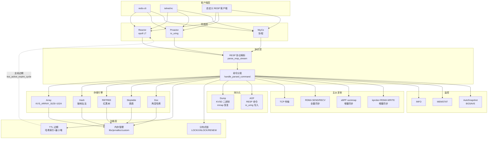
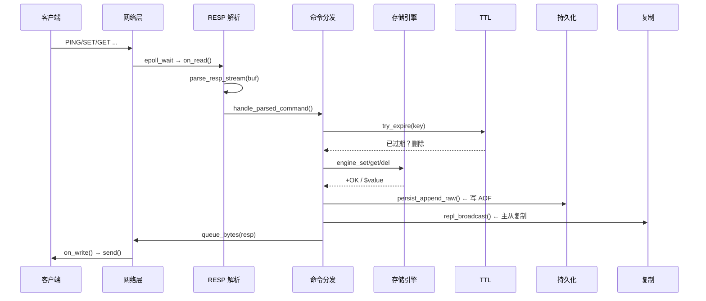
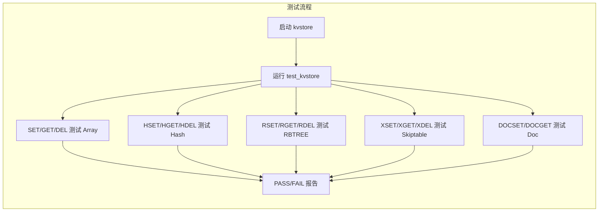
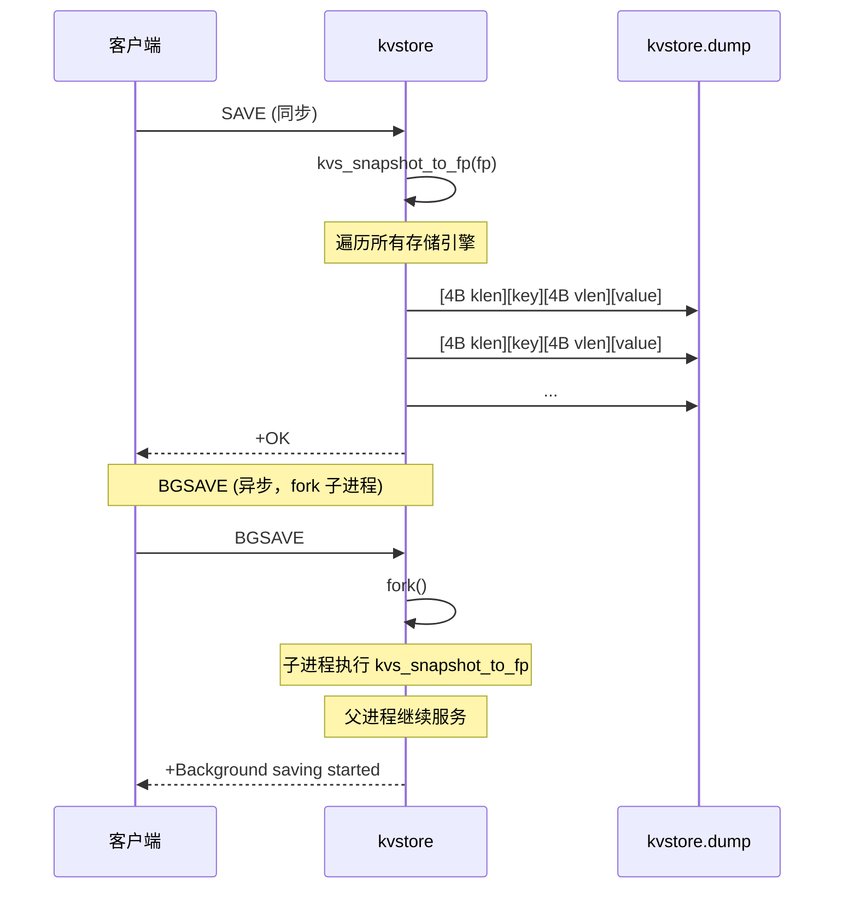
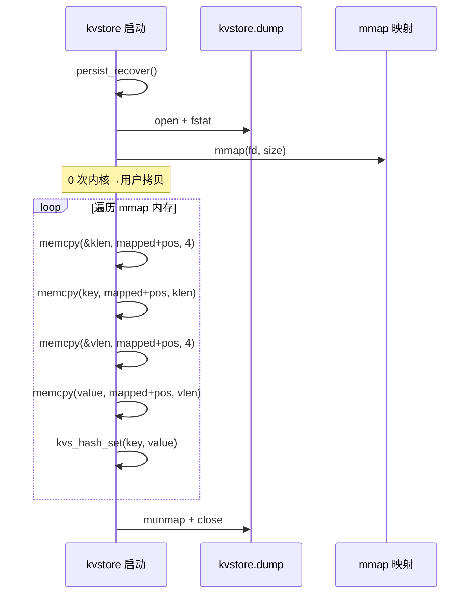
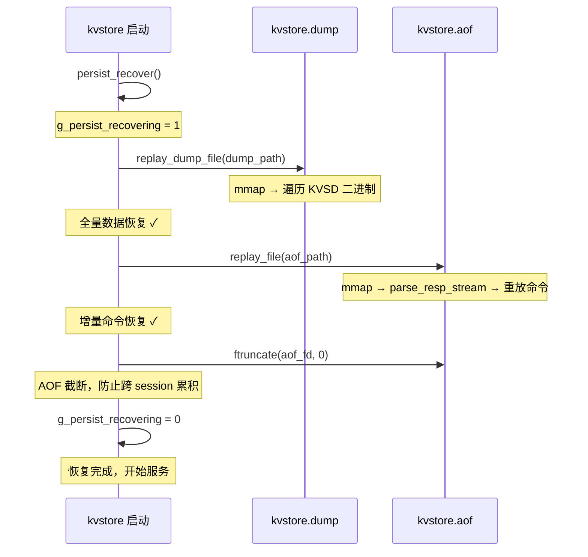
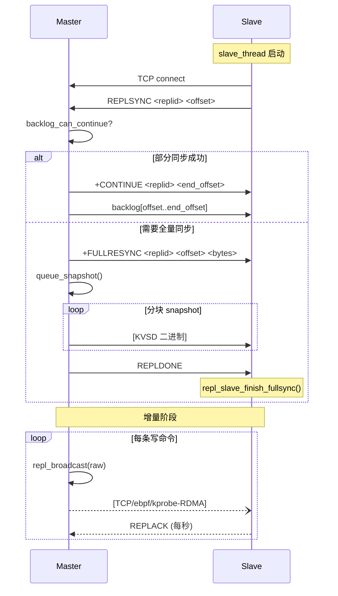
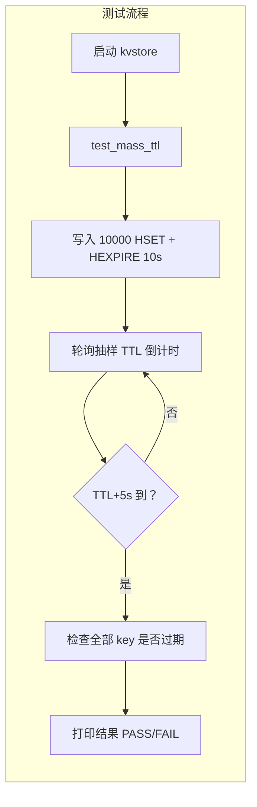

# kvstore — 高性能键值存储系统

<div align="center">

[](LICENSE)
[](https://en.wikipedia.org/wiki/C_(programming_language))
[]()
[]()
[]()
[]()

kvstore 是一个用 **C 语言** 实现的类 Redis 键值存储系统，面向学习和研究。

**多存储引擎 · 多网络模型 · 多内存后端 · 持久化 · 主从复制 · 文档型 Value · TTL · RDMA · eBPF**

</div>

---

## 目录

- [快速开始](#快速开始)
- [项目结构](#项目结构)
- [核心能力](#核心能力)
- [命令参考](#命令参考)
- [配置说明](#配置说明)
- [文档索引](#文档索引)
- [测试体系](#测试体系)
- [测试产物路径](#测试产物路径)
- [性能基准](#性能基准)
- [开发指南](#开发指南)
- [常见问题](#常见问题)
- [许可证](#许可证)

---

## 快速开始

### 环境依赖

```bash
# Ubuntu/Debian
sudo apt install gcc make liburing-dev libjemalloc-dev

# RDMA 支持（可选）
sudo apt install librdmacm-dev libibverbs-dev

# eBPF 支持（可选，需 ENABLE_EBPF=1）
sudo apt install libbpf-dev libelf-dev clang
```

### 编译

```bash
git clone --recurse-submodules <repo-url>
cd kvstore
make clean && make
```

> 编译产物：`./kvstore`（单可执行文件）。编译选项见 Makefile 顶部 `ENABLE_RDMA`、`ENABLE_EBPF` 开关。

### 启动

```bash
./kvstore                           # 自动加载 ./kvstore.conf（如存在）
./kvstore --config kvstore.conf     # 显式指定配置
./kvstore --port 6380 --mem jemalloc  # 命令行覆盖配置
```

### 快速验证

```bash
# 启动服务后，用 nc 测试基本读写
printf '*3\r\n$3\r\nSET\r\n$3\r\nkey\r\n$5\r\nvalue\r\n' | nc 127.0.0.1 5000
printf '*2\r\n$3\r\nGET\r\n$3\r\nkey\r\n' | nc 127.0.0.1 5000
```

或使用 Redis 客户端（如 `redis-cli`）直接连接 5000 端口。

---

## 项目结构

```
kvstore/
├── src/                          # 核心 C 源码
│   ├── main/kvstore.c            #   入口、RESP 协议、命令分发
│   ├── core/                     #   网络模型 (reactor / proactor / ntyco)
│   ├── storage/                  #   存储引擎 (array / hash / rbtree / skiptable / doc)
│   ├── memory/kvs_mem.c          #   内存后端 (libc / jemalloc / custom)
│   ├── expire/kvs_expire.c       #   TTL 过期管理
│   ├── persistence/kvs_persist.c #   持久化 (dump + AOF)
│   ├── replication/              #   主从复制、RDMA、eBPF、哨兵
│   └── utils/hash.c              #   哈希工具
├── include/kvstore/              # 公共头文件
├── NtyCo/                        # 协程库 (git submodule)
├── liburing/                     # io_uring 库
├── tools/                        # 测试 & 辅助脚本
│   ├── bench/                    #   性能基准脚本
│   ├── persist/                  #   持久化验证脚本
│   ├── repl/                     #   复制验证脚本 (TCP/RDMA/eBPF)
│   ├── rdma/                     #   RDMA 探测脚本
│   └── tests/                    #   通用测试辅助脚本
├── tests/                        # 测试代码
│   ├── integration/              #   集成测试脚本
│   ├── unit/                     #   单元测试
│   ├── test.c                    #   测试工具函数
│   └── testcase.c                #   C 测试用例框架
├── testdata/                     # 静态测试数据 (样例 AOF/dump/配置)
├── artifacts/                    # 测试运行时产物 (gitignored)
│   ├── persist/                  #   持久化测试产物
│   ├── repl/                     #   复制测试产物
│   ├── rdma/                     #   RDMA 测试产物
│   ├── bench/                    #   基准测试产物
│   └── legacy/                   #   旧版产物
├── benchmarks/                   # 基准测试数据与图表
│   ├── data/                     #   CSV 测试数据
│   └── plots/                    #   可视化图表
├── assets/diagrams/              # 架构图 / 流程图
├── clients/                      # 多语言客户端示例 (Go/Java/JS/Python/Rust)
├── docs/                         # 文档中心
│   ├── tech-roadmap.md           #   技术路线与实现详解 ← 新手必读
│   ├── rdma-fullsync-implementation.md  # RDMA 全量复制实现
│   ├── plan.md                   #   项目演进规划
│   ├── iteration-summary.md      #   迭代总结
│   └── examples/                 #   API 使用示例
├── kvstore.conf                  # 默认配置文件
├── Makefile                      # 构建入口
├── .github/workflows/ci.yml      # GitHub CI 配置
```

---

## 核心能力

### 存储引擎


| 引擎      | 前缀   | 说明                       |
| --------- | ------ | -------------------------- |
| Array     | 无前缀 | 基础数组存储，适合小数据量 |
| Hash      | `H*`   | 哈希表，适合大量 key 场景  |
| RBTREE    | `R*`   | 红黑树，有序存储           |
| Skiptable | `X*`   | 跳表，适合范围查询         |

> 例：`HSET key value` 使用哈希引擎，`RSET key value` 使用红黑树引擎。

### 内存后端


| 后端       | 特点                                    |
| ---------- | --------------------------------------- |
| `libc`     | 标准 malloc/free，最通用                |
| `jemalloc` | 高性能分配器，减少碎片                  |
| `custom`   | 自研 slab + mmap 分配器，可观测碎片统计 |

### 网络模型


| 模型     | 底层     | 适用场景   |
| -------- | -------- | ---------- |
| Reactor  | epoll    | I/O 密集型 |
| Proactor | io_uring | 高并发异步 |
| NtyCo    | 协程     | 海量连接   |

### 功能矩阵


| 功能                         | 状态      | 说明                                                              |
| ---------------------------- | --------- | ----------------------------------------------------------------- |
| RESP 协议                    | ✅ 完成   | 完整解析与响应                                                    |
| 全量持久化 (dump)            | ✅ 完成   | 二进制`KVSD` 格式，优先 mmap 恢复                                 |
| 增量持久化 (AOF)             | ✅ 完成   | RESP 命令格式，优先 io_uring 写入                                 |
| SAVE / BGSAVE / BGREWRITEAOF | ✅ 完成   | 支持同步/异步持久化                                               |
| 主从复制                     | ✅ 完成   | FULLRESYNC + partial resync + backlog                             |
| RDMA 全量同步                | ✅ 完成   | 全量数据通过 RDMA 传输，与 eBPF 实时同步可同时启用                |
| eBPF 实时同步                | ✅ 完成   | sockmap 转发路径，实时增量命令通过 eBPF 加速                      |
| kprobe+RDMA 增量同步         | ✅ 完成   | kprobe 透明拦截 TCP send → BPF ringbuf → RDMA WRITE → Slave MR |
| TTL / 过期                   | ✅ 完成   | 哈希索引 + 最小堆调度                                             |
| 文档型 value                 | ✅ 完成   | DOCSET/DOCGET 等 7 个命令                                         |
| 分布式锁                     | ✅ 完成   | LOCK/UNLOCK/RENEW/OWNER                                           |
| 哨兵模式                     | ⚠️ 基础 | 框架已有，自动故障转移待完善                                      |
| 自动快照                     | ✅ 完成   | 按时间+变化数规则触发                                             |

---

## 命令参考

### 基本键值


| 命令                   | 说明           |
| ---------------------- | -------------- |
| `SET key value`        | 设置键值       |
| `GET key`              | 获取键值       |
| `DEL key`              | 删除键         |
| `EXIST key`            | 检查键是否存在 |
| `MSET k1 v1 k2 v2 ...` | 批量设置       |
| `MGET k1 k2 ...`       | 批量获取       |
| `MOD key value`        | 修改已有键的值 |

### TTL / 过期


| 命令                 | 说明         |
| -------------------- | ------------ |
| `EXPIRE key seconds` | 设置过期时间 |
| `TTL key`            | 查询剩余 TTL |
| `PERSIST key`        | 移除过期时间 |

### 持久化


| 命令                 | 说明              |
| -------------------- | ----------------- |
| `SAVE`               | 同步保存 dump     |
| `BGSAVE`             | 后台保存 dump     |
| `BGREWRITEAOF`       | 重写 AOF          |
| `APPENDFSYNC policy` | 设置 AOF 同步策略 |

### 文档对象


| 命令                     | 说明         |
| ------------------------ | ------------ |
| `DOCSET key field value` | 设置字段     |
| `DOCGET key field`       | 获取字段     |
| `DOCDEL key field`       | 删除字段     |
| `DOCDROP key`            | 删除整个文档 |
| `DOCEXIST key`           | 文档是否存在 |
| `DOCCOUNT key`           | 字段数量     |
| `DOCGETALL key`          | 获取全部字段 |

### 分布式锁


| 命令                      | 说明       |
| ------------------------- | ---------- |
| `LOCK key owner seconds`  | 获取锁     |
| `UNLOCK key owner`        | 释放锁     |
| `RENEW key owner seconds` | 续期       |
| `OWNER key`               | 查看持有者 |

### 复制与集群


| 命令                | 说明         |
| ------------------- | ------------ |
| `SLAVEOF host port` | 设为从节点   |
| `SLAVEOF NO ONE`    | 提升为主节点 |
| `ROLE`              | 查看复制状态 |

### 监控


| 命令                   | 说明             |
| ---------------------- | ---------------- |
| `INFO`                 | 服务器综合信息   |
| `MEMSTAT`              | 内存统计         |
| `PING`                 | 连接测试         |
| `SNAPRULE sec changes` | 添加自动快照规则 |
| `SNAPRULES`            | 查看快照规则     |
| `SNAPRULECLEAR`        | 清除快照规则     |

---

## 配置说明

配置文件格式为 `key=value`，支持 `#` 注释。默认加载 `./kvstore.conf`。

### 全部配置项


| 配置项                    | 默认值         | 说明                                          |
| ------------------------- | -------------- | --------------------------------------------- |
| `port`                    | `5000`         | 监听端口                                      |
| `role`                    | `master`       | 角色：`master` / `slave`                      |
| `master_host`             | `127.0.0.1`    | 主节点地址                                    |
| `master_port`             | `5000`         | 主节点端口                                    |
| `dump_path`               | `kvstore.dump` | dump 文件路径                                 |
| `aof_path`                | `kvstore.aof`  | AOF 文件路径                                  |
| `mem_backend`             | `libc`         | 内存后端：`libc` / `jemalloc` / `custom`      |
| `net_backend`             | `reactor`      | 网络模型：`reactor` / `proactor` / `ntyco`    |
| `log_mode`                | `info`         | 日志级别：`debug` / `info` / `warn` / `error` |
| `appendfsync`             | `always`       | AOF 同步：`always` / `everysec`               |
| `repl_transport_backend`  | `tcp`          | 复制传输（单模式）：`tcp` / `rdma` / `ebpf`   |
| `repl_fullsync_transport` | `rdma`         | 全量同步传输：`rdma` / `tcp`                  |
| `repl_realtime_transport` | `ebpf`         | 实时增量同步传输：`ebpf` / `tcp`              |
| `autosnap`                | 无             | 自动快照规则，如`60:1000,300:10`              |
| `sentinel`                | `0`            | 启用哨兵模式                                  |
| `sentinel_master_name`    | `mymaster`     | 哨兵监控名称                                  |
| `sentinel_quorum`         | `1`            | 哨兵法定人数                                  |

> 命令行参数优先级高于配置文件。
> **双通道模式**：设置 `repl_fullsync_transport=rdma` + `repl_realtime_transport=ebpf` 可使 RDMA 负责全量同步、eBPF 负责实时增量同步，两者同时工作。

### 命令行参数

```
./kvstore --config <path> --port <n> --role <master|slave>
          --mem <libc|jemalloc|custom> --net <reactor|proactor|ntyco>
          --log-mode <debug|info|warn|error> --dump <path> --aof <path>
          --master-host <ip> --master-port <n> --repl-transport <tcp|rdma>
          --repl-fullsync-transport <rdma|tcp> --repl-realtime-transport <ebpf|tcp>
          --sentinel --sentinel-master-name <name>
```

---

## 文档索引


| 文档                                                                           | 说明                                                                   |
| ------------------------------------------------------------------------------ | ---------------------------------------------------------------------- |
| [`docs/tech-roadmap.md`](docs/tech-roadmap.md)                                 | ⭐**技术路线与实现详解** — 新手必读，覆盖所有模块的架构、流程图、代码 |
| [`docs/rdma-fullsync-implementation.md`](docs/rdma-fullsync-implementation.md) | RDMA 全量复制的代码级实现分析                                          |
| [`docs/plan.md`](docs/plan.md)                                                 | 项目演进规划（各阶段目标）                                             |
| [`docs/iteration-summary.md`](docs/iteration-summary.md)                       | 迭代总结（含 RDMA 稳定性修复记录）                                     |
| [`docs/examples/kvs_skiptable.c`](docs/examples/kvs_skiptable.c)               | Skiptable 引擎 API 使用示例                                            |

---

## 实现原理

### 总体架构



### 命令执行流程



### 存储引擎 — 五种数据结构

kvstore 实现了五种存储引擎，通过**命令前缀**切换。所有引擎共享同一套 TTL 过期系统和复制层。

#### Array 引擎 (`SET` / `GET` / `DEL`)

- **数据结构**：固定大小线性数组（`KVS_ARRAY_SIZE=1024`），每个 slot 包含 `(key, value)` 指针
- **查找**：线性扫描 O(n)，n ≤ 1024
- **限制**：最多 1024 个 key，满了返回 `-ERR operation failed`

```
table = [slot0, slot1, ..., slot1023]
          │       │
     (key,val)  NULL
```

源码: `src/storage/kvs_array.c`

**核心实现**:

```c
int kvs_array_set(kvs_array_t *inst, char *key, char *value) {
    if (find_slot(inst, key) >= 0) return 1;   // 已存在
    for (int i = 0; i < KVS_ARRAY_SIZE; i++) {  // 线性扫描找空位
        if (!inst->table[i].key) {               // 空 slot
            inst->table[i].key = strdup(key);
            inst->table[i].value = strdup(value);
            inst->total++;
            return 0;  // 成功
        }
    }
    return -1;  // 数组满了
}
```

#### Hash 引擎 (`HSET` / `HGET` / `HDEL`)

- **数据结构**：链地址哈希表，`MAX_TABLE_SIZE=1024` 个桶，**FNV-1a 非加密哈希**
- **查找**：O(1) avg，冲突通过链表解决
- **与 Array 的区别**：链地址法无固定容量限制

```
hash(key) → idx
buckets[idx] → node → node → NULL   (链地址法)
```

源码: `src/storage/kvs_hash.c`

**核心实现**:

```c
int kvs_hash_set(kvs_hash_t *hash, char *key, char *value) {
    int idx = _hash(key, hash->max_slots);  // FNV-1a 哈希
    hashnode_t *node = hash->nodes[idx];
    while (node) {  // 遍历冲突链
        if (strcmp(node->key, key) == 0) return 1;  // 已存在
        node = node->next;
    }
    // 头插法插入新节点
    hashnode_t *new = _create_node(key, value);
    new->next = hash->nodes[idx];
    hash->nodes[idx] = new;
    hash->count++;
    return 0;
}
```

#### RBTREE 引擎 (`RSET` / `RGET` / `RDEL`)

- **数据结构**：**红黑树**，节点颜色标记红/黑，插入后通过左旋/右旋/变色保持平衡
- **查找**：O(log n)，中序遍历可得有序序列
- **特点**：通过 5 条红黑树性质保证平衡性

源码: `src/storage/kvs_rbtree.c`

#### Skiptable 引擎 (`XSET` / `XGET` / `XDEL`)

- **数据结构**：**跳表**，多层链表，每层以 50% 概率提升层数（最高 16 层）
- **查找**：O(log n) avg，从最高层开始逐层向下
- **与 RBTREE 的对比**：红黑树通过旋转保持平衡，跳表通过概率层数实现平衡；跳表实现更简单，但红黑树最坏情况有保证

```
head
  │  ┌─────────────────────────────────┐
  ├──┤  L3: 10 ──────────────→ 90      │
  ├──┤  L2: 10 ─────→ 50 ───→ 90      │
  └──┤  L1: 10 → 30 → 50 → 70 → 90    │
     └─────────────────────────────────┘
```

源码: `src/storage/kvs_skiptable.c`

#### Doc 引擎 (`DOCSET` / `DOCGET` / `DOCDEL`)

- **数据结构**：文档型 value，按 `key` 哈希找到文档，文档内部再按 `field` 哈希存储
- **两层哈希**：外层 `key → doc`，内层 `field → value`
- **用途**：一个 key 下存储多个字段，类似 Redis Hash

```
key → doc { fields[0] → (f1,v1) → (f2,v2)
            fields[1] → (f3,v3) → NULL }
```

源码: `src/storage/kvs_doc.c`

#### 命令前缀路由

```
cmd[0] == 'R' → RBTREE 引擎
cmd[0] == 'H' → Hash 引擎
cmd[0] == 'X' → Skiptable 引擎
其他         → Array 引擎
```

`handle_parsed_command()` 根据前缀路由，`strip_prefix()` 去掉前缀后执行统一的操作名（如 `HSET` → HASH 引擎执行 `SET`）。

**RESP 协议解析核心**:

```c
// src/main/kvstore.c — parse_resp_stream
int parse_resp_stream(conn_t *c, unsigned char *buf, size_t *len, int from_replication) {
    size_t pos = 0;
    while (pos < *len) {
        if (buf[pos] == '+') {           // 简单字符串: +OK\r\n
            // 提取行内容，处理 KPROBERDMA / FULLRESYNC / CONTINUE
        } else if (buf[pos] == '*') {    // 数组: *3\r\n$3\r\nSET\r\n...
            int argc = atoi(buf + pos + 1);  // 解析参数个数
            // 逐个解析 bulk string: $len\r\ndata\r\n
            for (int i = 0; i < argc; i++) {
                if (buf[pos] != '$') break;          // 不是 bulk
                long blen = strtol(buf + pos + 1);    // bulk 长度
                argv[i] = malloc(blen + 1);
                memcpy(argv[i], buf + pos, blen);     // 按长度拷贝
                argv[i][blen] = '\0';
            }
            handle_parsed_command(c, argc, argv, ...); // 执行命令
        } else {                         // inline 命令（兼容 redis-cli）
            // 空格分割参数
        }
    }
}
```

#### 测试验证



```bash
# 测试全部五种引擎
./test_kvstore 127.0.0.1 5000

# 或通过 Makefile
make check-kvstore TEST_PORT=5000
```

### 网络模型 — 三种 I/O 模型

三种模型的目的不是为了生产冗余，而是**对比学习**——同一套业务逻辑用三种 I/O 模型实现。


| 模型         | 底层       | 核心思想                                                                          |
| ------------ | ---------- | --------------------------------------------------------------------------------- |
| **Reactor**  | epoll (LT) | 事件驱动，"就绪通知"。`epoll_wait` → 可读/可写回调。单线程事件循环               |
| **Proactor** | io_uring   | "操作完成通知"。提交 SQE 后立即返回，从 CQ 取结果。避免就绪通知→阻塞读的两步开销 |
| **NtyCo**    | 协程       | 同步写法，异步执行。`recv` 被 hook 为 `epoll_ctl` → `yield` → `resume`          |

**核心实现**:

```c
// src/storage/kvs_rbtree.c — 红黑树左旋示例
static void rbtree_left_rotate(kvs_rbtree_t *tree, kvs_rbnode_t *x) {
    kvs_rbnode_t *y = x->right;
    x->right = y->left;                     // y 的左子树变为 x 的右子树
    if (y->left != NULL) y->left->parent = x;
    y->parent = x->parent;                  // y 接管 x 的父节点
    if (x->parent == NULL) tree->root = y;  // x 是根 → y 成为新根
    else if (x == x->parent->left) x->parent->left = y;
    else x->parent->right = y;
    y->left = x;                            // x 成为 y 的左子
    x->parent = y;
}
```

#### Skiptable 引擎 核心实现

```c
// src/storage/kvs_skiptable.c — 跳表插入
static int rand_level(void) {
    int level = 1;
    while ((rand() % 2) && level < KVS_SKIPTABLE_MAX_LEVEL) level++;
    return level;  // 50% 概率提升层数
}

int kvs_skiptable_set(kvs_skiptable_t *inst, char *key, char *value) {
    kvs_sknode_t *update[KVS_SKIPTABLE_MAX_LEVEL];
    kvs_sknode_t *cur = inst->head;
    for (int i = inst->level - 1; i >= 0; i--) {  // 从高层向下
        while (cur->next[i] && strcmp(cur->next[i]->key, key) < 0)
            cur = cur->next[i];
        update[i] = cur;  // 记录每层的前驱
    }
    int level = rand_level();  // 随机层数
    if (level > inst->level) {
        for (int i = inst->level; i < level; i++) update[i] = inst->head;
        inst->level = level;
    }
    kvs_sknode_t *node = create_node(level, key, value);
    for (int i = 0; i < level; i++) {  // 逐层插入
        node->next[i] = update[i]->next[i];
        update[i]->next[i] = node;
    }
    inst->total++;
    return 0;
}
```

#### Reactor（默认）

```
epoll_wait(100ms)
  ├── 可读事件 → on_read() → parse_resp_stream() → handle_parsed_command()
  ├── 可写事件 → on_write() → 发送响应
  └── expire 定时器 (每 100ms) → kvs_active_expire_cycle(adaptive_budget)
                                   → persist_autosnap_cron()
```

- 每个连接有独立的读缓冲区和写缓冲区（`conn_t.in_buf / out_buf`）
- `on_read()` 读出数据到 `in_buf`，`parse_resp_stream()` 解析 RESP 协议
- 写操作通过 `queue_bytes()` 入队到 `out_buf`，`on_write()` 发送

**Reactor 核心循环**:

```c
// src/core/reactor.c
while (1) {
    int n = epoll_wait(g_epfd, events, MAX_EVENTS, 100);  // 等待事件
    
    long long now = kvs_now_ms();
    if (now - g_last_expire >= 100) {                      // 每 100ms
        int budget = expire_cycle_budget();                 // 自适应 budget
        kvs_active_expire_cycle(budget);                   // 主动过期
        persist_autosnap_cron();                           // 自动快照
        g_last_expire = now;
    }
    
    for (int i = 0; i < n; i++) {
        conn_t *c = fdmap[events[i].data.fd];
        if (events[i].events & EPOLLIN)  on_read(c);      // 可读
        if (events[i].events & EPOLLOUT) on_write(c);      // 可写
    }
}
```

#### Proactor (io_uring)

- 提交读 SQE 后立即返回，CQ 完成事件触发处理
- 无需 epoll 就绪通知→阻塞 read 的两步开销
- 同样用于 AOF 持久化写入

源码: `src/core/proactor.c`

#### NtyCo (协程)

- 基于 `NtyCo` 协程库，hook 系统调用
- `recv()` 被 hook 为 `epoll_ctl(ADD)` → `yield` → 事件就绪后 `resume`
- 以同步写法实现异步并发

源码: `src/core/ntyco.c`

#### 测试验证

```bash
# 默认 Reactor（epoll）
./kvstore --port 5000 --net reactor
redis-cli -p 5000 PING

# Proactor（io_uring）
./kvstore --port 5001 --net proactor
redis-cli -p 5001 SET k v

# NtyCo（协程）
./kvstore --port 5002 --net ntyco
redis-cli -p 5002 GET k
```

三种模型对外暴露完全相同的 RESP 协议接口，客户端无需修改。

### 持久化 — dump + AOF

kvstore 的持久化采用 **全量 dump（二进制快照）+ 增量 AOF（命令日志）** 双机制。
恢复时先加载 dump（快），再重放 AOF（补全），兼顾启动速度和数据完整性。

#### 全量 Dump — KVSD 二进制格式

**保存流程**：



**二进制格式**：

```
[4B key_len][key数据][4B value_len][value数据]
[4B key_len][key数据][4B value_len][value数据]
...
```

每个 key-value 对用 4 字节长度前缀 + 数据交替存储，解析时按长度读取，**不以任何字符作为分隔符**，因此 key/value 中可包含空格、换行等任意字符。

**保存实现**：

```c
// src/main/kvstore.c — kvs_snapshot_to_fp (遍历所有引擎)
int kvs_snapshot_to_fp(FILE *fp) {
    // 遍历 Array 引擎
    for (int i = 0; i < KVS_ARRAY_SIZE; i++)
        if (global_array.table[i].key)
            emit_kv(fp, global_array.table[i].key, global_array.table[i].value);
    // 遍历 Hash 引擎（链地址法）
    for (int i = 0; i < global_hash.max_slots; i++)
        for (hashnode_t *n = global_hash.nodes[i]; n; n = n->next)
            emit_kv(fp, n->key, n->value);
    // 遍历 RBTREE（中序遍历，保持有序）
    rbtree_inorder_walk(global_rbtree.root, fp);
    // 遍历 Skiptable（底层链表有序）
    for (kvs_sknode_t *n = global_skiptable.head->next[0]; n; n = n->next[0])
        emit_kv(fp, n->key, n->value);
    // 遍历 Doc 引擎
    for (int i = 0; i < global_doc.size; i++)
        for (kvs_doc_t *d = global_doc.buckets[i]; d; d = d->next)
            for (int b = 0; b < d->bucket_count; b++)
                for (kvs_doc_field_t *f = d->fields[b]; f; f = f->next)
                    emit_doc_kv(fp, d->key, f->name, f->value);
    return 0;
}

// 持久化入口
int persist_save_dump(void) {
    // SAVE: 直接写
    int fd = open(g_cfg.dump_path, O_WRONLY|O_CREAT|O_TRUNC, 0644);
    kvs_dump_to_fd(fd);       // 遍历引擎，写入 KVSD 格式
    persist_fsync_fd(fd);     // fsync 刷盘
    close(fd);
    return 0;
}

int persist_bgsave_start(void) {
    // BGSAVE: fork 子进程
    pid_t pid = fork();
    if (pid == 0) {                // 子进程
        persist_save_dump();       // 写 dump
        _exit(0);
    }
    g_bgsave_pid = pid;            // 父进程记录 PID
    return 0;
}
```

**恢复流程（mmap 零拷贝）**：



```c
static int replay_dump_file(const char *path) {
    int fd = open(path, O_RDONLY);
    struct stat st;
    fstat(fd, &st);

    // 优先 mmap（0 拷贝）
    unsigned char *mapped = mmap(NULL, st.st_size,
        PROT_READ|PROT_WRITE, MAP_PRIVATE, fd, 0);
    if (mapped == MAP_FAILED) {
        // mmap 失败，回退到 fread
        return replay_file_fread(path);
    }

    size_t pos = 0;
    while (pos + 4 <= (size_t)st.st_size) {
        uint32_t klen, vlen;
        memcpy(&klen, mapped + pos, 4);  pos += 4;  // key 长度
        char *key = (char*)mapped + pos;  pos += klen; // key
        memcpy(&vlen, mapped + pos, 4);  pos += 4;  // value 长度
        char *value = (char*)mapped + pos; pos += vlen; // value

        // 直接写入 Hash 引擎
        kvs_hash_set(&global_hash, key, value);
    }
    munmap(mapped, st.st_size);
    close(fd);
}
```

#### 增量 AOF — RESP 命令格式

**写入流程**：


**AOF 文件内容示例**：

```
*3\r\n$3\r\nSET\r\n$3\r\nk1\r\n$2\r\nv1\r\n
*3\r\n$6\r\nEXPIRE\r\n$2\r\nk1\r\n$2\r\n10\r\n
*2\r\n$3\r\nDEL\r\n$2\r\nk1\r\n
```

每条写命令以原始 RESP 协议格式追加，恢复时直接重放。

**写入实现（io_uring 优先）**：

```c
// src/persistence/kvs_persist.c
static struct io_uring g_persist_uring;    // 全局 uring 实例（64 SQE）

int persist_init(void) {
    // 以追加模式打开 AOF 文件
    g_aof_fd = open(g_cfg.aof_path, O_WRONLY|O_CREAT|O_APPEND, 0644);
    g_aof_write_offset = lseek(g_aof_fd, 0, SEEK_END);
    return 0;
}

int persist_append_raw(const unsigned char *buf, size_t len) {
    off_t off = g_aof_write_offset;

    // ① 优先 io_uring 异步写入
    if (persist_write_fd_uring(g_aof_fd, buf, len, &off) != 0)
        // ② 回退同步 pwrite
        persist_write_fd_sync(g_aof_fd, buf, len, &off);

    g_aof_write_offset = off;
    g_aof_dirty = 1;

    // fsync 策略
    if (g_cfg.aof_fsync == KVS_AOF_FSYNC_ALWAYS) {
        if (persist_fsync_fd_uring(g_aof_fd) != 0)
            fsync(g_aof_fd);  // 回退
    }
    return 0;
}

// io_uring 写入核心
static int persist_write_fd_uring(int fd, const unsigned char *buf,
                                  size_t len, off_t *offset) {
    struct io_uring_sqe *sqe = io_uring_get_sqe(&g_persist_uring);
    io_uring_prep_write(sqe, fd, buf, len, offset ? *offset : -1);
    io_uring_submit_and_wait(&g_persist_uring, 1);   // 提交 SQE
    struct io_uring_cqe *cqe;
    io_uring_wait_cqe(&g_persist_uring, &cqe);        // 等 CQE
    int ret = cqe->res;                                // 写入结果
    io_uring_cqe_seen(&g_persist_uring, cqe);
    return ret < 0 ? -1 : 0;
}
```

#### BGREWRITEAOF — AOF 重写

AOF 文件随时间增长，BGREWRITEAOF 通过 fork 子进程将当前内存数据重写为新 AOF：

```
fork 子进程
  ├── 子进程: 遍历引擎 → 写临时 AOF 文件 → 原子 rename 替换
  └── 父进程: 继续服务，新命令通过 g_rewrite_buf 链表缓存
                  → 子进程完成后，父进程将缓存追加到新 AOF
```

```c
int persist_bgrewriteaof_start(void) {
    pid_t pid = fork();
    if (pid == 0) {  // 子进程
        char tmp[512];
        snprintf(tmp, sizeof(tmp), "%s.rewrite.tmp.%ld", g_cfg.aof_path, (long)getpid());
        rewrite_aof_to(tmp);    // 遍历引擎写 RESP 命令
        rename(tmp, g_cfg.aof_path);  // 原子替换
        _exit(0);
    }
    g_bgrewrite_pid = pid;  // 父进程
    return 0;
}
```

#### 恢复完整流程



```c
// src/persistence/kvs_persist.c
int persist_recover(void) {
    g_persist_recovering = 1;   // 标记恢复中，禁止写 slave

    // ① 先恢复 dump（全量二进制快照）
    replay_dump_file(g_cfg.dump_path);

    // ② 再重放 AOF（增量 RESP 命令）
    replay_file(g_cfg.aof_path);  // 内部调用 replay_file_mmap

    // ③ 截断 AOF，防止跨 session 无限累积
    ftruncate(g_aof_fd, 0);
    g_aof_write_offset = 0;

    g_persist_recovering = 0;
    return 0;
}
```

**mmap 失败回退**：当 mmap 不可用时（如文件过大、内核限制），自动回退到 `replay_file_fread()`，逐块 fread 解析。

#### 测试验证


```bash
# 全量持久化测试
./kvstore --port 5170 --role master --appendfsync always
./test_persist_dump_demo --port 5170 --count 100000

# AOF 重写测试
redis-cli -p 5170 BGREWRITEAOF
redis-cli -p 5170 INFO | grep aof_rewrite

# 持久化状态查看
redis-cli -p 5170 INFO | grep -E "(aof|dump|bgsave|dirty)"
```
    T->>T: 等待 kvstore 就绪
    K->>D: mmap 读取 dump 恢复数据
    T->>K: HGET persist:dump:00000
    K-->>T: v0
    T->>T: 验证 N 条全部正确恢复
```

```bash
# 终端 1: 启动 kvstore
./kvstore --port 5170 --role master --appendfsync always

# 终端 2: 运行全量持久化演示
./test_persist_dump_demo --port 5170 --count 100000
# 程序会写入 → SAVE → 提示停 kvstore → 提示重启 → 自动验证

# AOF 重写验证
redis-cli -p 5170 BGREWRITEAOF
```

### 主从复制 — 四种传输路径

kvstore 的复制系统采用类 Redis 的 RESP-based 复制协议，
通过 `repl_transport_ops_t` **策略模式**支持四种传输层切换。

#### 复制握手流程



#### 全量同步（queue_snapshot）

```c
static int queue_snapshot(conn_t *c) {
    unsigned long long base = repl_master_offset();

    // ① 生成临时 dump 文件
    kvs_snapshot_to_fp(tmp_fp);   // 遍历所有引擎，写 KVSD 格式

    // ② 发 FULLRESYNC 头
    snprintf(hdr, "+FULLRESYNC %s %llu %zu\r\n", id, base, total);

    // ③ 分块发 snapshot 数据
    while ((r = fread(buf, 1, buf_size, fp)) > 0)
        repl_send_chunked(c, buf, r);

    // ④ REPLDONE
    resp_build_cmd1(buf, "REPLDONE");
    repl_send_chunked(c, buf, done);

    // ⑤ gap 回放
    c->repl_fullsync_pending = 0;
    if (repl_master_offset() > base)
        repl_backlog_write_range(c, base);
}
```

#### 增量同步（repl_broadcast）

```c
void repl_broadcast(const unsigned char *raw, size_t rawlen) {
    repl_backlog_feed(raw, rawlen);       // → 1MB backlog
    repl_note_broadcast(rawlen);          // → +offset
    for (每个 slave) {
        if (c->repl_fullsync_pending) continue;  // 全量中跳过
        repl_realtime_send(c, raw, rawlen);       // 策略模式发送
    }
}
```

#### 四种传输方式详解

| 传输方式 | 类型 | 数据路径 | 优势 |
|---|---|---|---|
| **TCP** | 传统 | send → 内核 TCP | 通用保底 |
| **RDMA SEND** | 双边 | `ibv_post_send` → CQ | 全量零拷贝 |
| **eBPF sockmap** | 内核转发 | send → `sk_msg` → `bpf_msg_redirect_map` | 内核态转发 |
| **kprobe+RDMA WRITE** | 单边 | kprobe → ringbuf → `ibv_post_send(RDMA_WRITE)` | Slave CPU 零参与 |

**kprobe+RDMA WRITE 数据路径**：

```c
// BPF kprobe: 拦截 tcp_sendmsg
SEC("kprobe/tcp_sendmsg")
int kprobe_tcp_sendmsg(struct pt_regs *ctx) {
    if (pid != filter_pid) return 0;
    struct msghdr *msg = (struct msghdr *)PT_REGS_PARM2(ctx);
    bpf_probe_read_kernel(&iov, 8, msg + 40);  // kernel 5.15
    bpf_probe_read_user(buf, 504, iov->iov_base);
    bpf_ringbuf_output(ringbuf, buf, len, 0);
}

// 用户态: ringbuf → RDMA WRITE
static int kprobe_ringbuf_cb(void *ctx, void *data, size_t size) {
    if (g_slave_mr.rkey == 0) return 0;  // MR 未就绪, 跳过
    wr_submit_data(slot, payload_len + 4);   // RDMA WRITE data
    wr_submit_head(slot);                    // RDMA WRITE head
}

// TCP 保底: send()始终返回 -1 → reactor 走 TCP
// Slave 侧通过 repl_offset 去重
```

#### Slave 实现

```c
static void *slave_thread(void *arg) {
    while (1) {
        fd = tcp_connect(master_host, master_port);
        send(fd, "REPLSYNC %s %llu", replid, offset);

        while (1) {
            r = read(fd, buf, sizeof(buf));
            parse_resp_stream(NULL, buf, &len, 1);  // from_replication=1
            repl_slave_ack_heartbeat();              // 每秒 REPLACK
        }
    }
}

// FULLRESYNC → REPLDONE 处理:
//   +FULLRESYNC → g_slave_loading_fullsync = 1
//   数据命令 → 正常执行，offset 递增
//   REPLDONE → repl_slave_finish_fullsync()
//            → 保存 dump → g_slave_loading_fullsync = 0
```

#### 测试验证

```bash
# TCP 单机快速验证
./kvstore --port 5160 --role master
./kvstore --port 5161 --role slave --master-host 127.0.0.1 --master-port 5160
tests/test_repl_5w5w --master-port 5160 --slave-port 5161 --pre 100 --post 100

# RDMA + kprobe 双机（VM1 master, VM2 slave）
# Master:
sudo ./kvstore --port 5160 --role master \
    --repl-fullsync-transport rdma \
    --repl-realtime-transport kprobe-rdma \
    --rdma-dev siw0 --kprobe-enabled
# Slave:
sudo ./kvstore --port 5161 --role slave \
    --master-host 192.168.233.128 --master-port 5160 \
    --repl-fullsync-transport rdma \
    --repl-realtime-transport kprobe-rdma \
    --rdma-dev siw0 --kprobe-enabled
# 测试:
tests/test_repl_5w5w --master-host 192.168.233.128 --master-port 5160 \
    --slave-host 192.168.233.129 --slave-port 5161 \
    --pre 50000 --post 50000
```

### TTL 过期 — 哈希索引 + 最小堆

kvstore 的 TTL 系统使用**哈希索引 + 最小堆**双结构，结合**主动扫描 + 惰性删除**两种策略。

#### 数据结构

```
kvs_expire_table_t
  ├── buckets[8192]       ← 哈希表（FNV-1a），key→节点映射，O(1) 查找
  ├── heap[]              ← 最小堆，按 expire_at_ms 升序排列
  │   heap[0] = 最快到期的 key
  │   heap[i] ≤ heap[2i+1], heap[2i+2]
  ├── heap_size           ← 堆中元素个数
  ├── count               ← 总节点数 = 有 TTL 的 key 数
  └── size                ← 哈希表桶数（固定 8192）
```

#### 核心操作


| 操作              | 函数                        | 流程                                                                 |
| ----------------- | --------------------------- | -------------------------------------------------------------------- |
| **EXPIRE key 10** | `kvs_expire_set()`          | 计算`expire_at = now + 10000ms` → 插入哈希表 → 入堆 `heap_sift_up` |
| **TTL key**       | `kvs_expire_ttl()`          | 哈希表找到节点 →`(expire_at - now) / 1000`                          |
| **PERSIST key**   | `kvs_expire_del()`          | 哈希表删除 →`heap_remove_at` → `heap_sift_down/sift_up`            |
| **更新 TTL**      | `kvs_expire_set()` 已存在时 | 更新`expire_at_ms` → `heap_update`（同时 sift_up 和 sift_down）     |

#### 过期删除策略

**策略一：主动过期（事件循环）**

```c
// Reactor 每 100ms 调用一次
if (now - g_last_expire >= 100) {
    int budget = expire_cycle_budget();
    kvs_active_expire_cycle(budget);
    g_last_expire = now;
}
```

```c
int kvs_active_expire_cycle(int budget) {
    while (removed < budget && heap_size > 0) {
        node = heap[0];                    // O(1) 取堆顶
        if (node->expire_at_ms > now) break; // 堆顶还没到期 = 全部没到期
        engine_del(node->engine, node->key); // 从存储引擎删除
        expire_free_node(&global_expire, node); // 从哈希表+堆删除
        removed++;
    }
}
```

**自适应 budget**（`src/core/reactor.c`）：

```c
// 根据当前 TTL 节点数动态调整每轮预算
count ≥ 1,000,000 → budget = 4096
count ≥ 300,000   → budget = 2048
count ≥ 100,000   → budget = 1024
count ≥ 30,000    → budget = 512
count ≥ 10,000    → budget = 256
count ≥ 1,000     → budget = 128
else              → budget = 32
```

**策略二：惰性删除（每次命令执行前）**

```c
// 每次 GET/SET/DEL/EXIST 等操作前调用
static int try_expire(int engine, char *key) {
    if (kvs_expire_is_expired(&global_expire, engine, key)) {
        engine_del(engine, key);               // 从引擎删除
        kvs_expire_del(&global_expire, engine, key); // 从 TTL 表删除
        return 1;  // 已过期
    }
    return 0;
}
```

**注意**：当前主动过期和惰性删除都只删除本机数据，**不会将 DEL 广播给 slave**。这是与 Redis 的重要差异——Redis 在 master 过期 key 后会生成 `DEL key` 命令复制到 slave，而本项目 slave 依赖自身的事件循环扫描过期。

#### 完整流程示例

```
SET expire:k:000000 value (无 TTL)
EXPIRE expire:k:000000 10
  → kvs_expire_set(): expire_at = now + 10000ms
  → 插入 buckets[hash("expire:k:000000")] 链表
  → heap_push → heap_sift_up

... 持续写入 10000 个 key ...

// 10 秒后，reactor 事件循环触发：
kvs_active_expire_cycle(budget=256)
  → heap[0] 的 expire_at_ms ≤ now
  → engine_del(HASH, "expire:k:000000")
  → expire_free_node()
  → heap_sift_down(新堆顶)
  → ... 继续处理最多 256 个 ...
```

#### heap 操作示例

```
插入 expire_at=5000:         插入 expire_at=3000:
heap = [1000, 2000, 5000]   heap = [1000, 2000, 5000]
                                   ↑ sift_up
                          heap = [1000, 3000, 5000, 2000]

删除堆顶 1000:
                          heap = [2000, 3000, 5000]
                                   ↑ sift_down
                          heap = [2000, 3000, 5000]  (已有序)
```

#### 测试验证



```bash
# 终端 1: 启动 kvstore
./kvstore --port 5200 --role master

# 终端 2: 运行大量 TTL 测试
./test_mass_ttl --port 5200 --count 10000 --ttl 10

# 终端 3: 手动检查 TTL（可选）
redis-cli -p 5200 HTTL expire:k:000000
redis-cli -p 5200 HGET expire:k:000000
```

### 内存管理 — 三种后端


| 后端         | 实现                         | 适用场景         |
| ------------ | ---------------------------- | ---------------- |
| **libc**     | `malloc()/free()`            | 开发调试         |
| **jemalloc** | `LD_PRELOAD` 加载            | 生产级，碎片少   |
| **custom**   | slab(≤1024B) + mmap(>1024B) | 研究学习，可观测 |

#### Custom slab 设计

```
slab 分配器
  ├── class[0]:  32 字节, page_count, free_list → chunk → chunk
  ├── class[1]:  64 字节, ...
  ├── class[2]: 128 字节
  ├── class[3]: 256 字节
  ├── class[4]: 384 字节
  ├── class[5]: 512 字节
  ├── class[6]: 768 字节
  └── class[7]: 1024 字节
大块 (>1024B): mmap 直接分配
```

每个 class 从 mmap 申请大页（默认 1MB），切分成等大小 chunk，通过 free_list 管理。
`INFO` 命令暴露完整的分配统计：alloc/calloc/realloc/free 次数、各 class 使用量、内部碎片率。

源码: `src/memory/`

#### 测试验证

```bash
# libc 后端
./kvstore --port 5000 --mem libc
redis-cli -p 5000 MEMSTAT

# jemalloc（需 LD_PRELOAD）
LD_PRELOAD=/usr/lib/x86_64-linux-gnu/libjemalloc.so ./kvstore --port 5001 --mem jemalloc
redis-cli -p 5001 MEMSTAT

# custom slab（自研）
./kvstore --port 5002 --mem custom
redis-cli -p 5002 MEMSTAT  # 查看 slab class 分配统计
```

### TTL 过期时间记录 in AOF

写命令（SET/MSET/DEL/EXPIRE 等）会以原始 RESP 格式写入 AOF 文件：

```
*3\r\n$3\r\nSET\r\n$3\r\nkey\r\n$5\r\nvalue\r\n
*3\r\n$6\r\nEXPIRE\r\n$3\r\nkey\r\n$2\r\n10\r\n
```

恢复时重放 AOF，重新执行 EXPIRE 命令重建 TTL 堆。

### 自动化快照 (AutoSnapshot)

配置格式 `sec:changes,sec:changes,...`（如 `60:10,300:100`），支持多条规则：

```c
// 事件循环中检查
if (距离上次快照 ≥ sec && 自上次快照以来的写入次数 ≥ changes)
    persist_bgsave_start();  // fork 子进程执行 BGSAVE
```

- 规则通过 `--autosnap "60:1000,300:10"` 或 `SNAPRULE 60 1000` 命令设置
- `SNAPRULES` 查看当前规则，`SNAPRULECLEAR` 清除所有规则
- 每个规则独立计时

#### 测试验证

```bash
# 配置自动快照规则：60秒内 1000 次写入则触发 BGSAVE
redis-cli -p 5000 SNAPRULE 60 1000
redis-cli -p 5000 SNAPRULES        # 查看规则
redis-cli -p 5000 SNAPRULECLEAR    # 清除所有规则

# 手动触发 SAVE
redis-cli -p 5000 SAVE

# 手动触发 BGSAVE（非阻塞）
redis-cli -p 5000 BGSAVE
redis-cli -p 5000 INFO | grep bgsave  # 查看 BGSAVE 状态
```

### 哨兵模式

- 基础框架实现，支持 `SENTINEL` 系列命令
- 主节点故障检测：心跳超时检测（`sentinel_down_after_ms`）
- 故障转移待完善，当前主要作为框架研究

### 快速验证

```bash
make check        # 运行全部基础测试 (resp + ttl + persist + doc)
```

### C 测试程序 (`tests/`)

`tests/` 目录下包含独立的 C 测试程序，通过 RESP 协议连接 kvstore 进行自动化验证。

这些 C 测试程序**不依赖 hiredis 等第三方库**，直接通过 TCP socket 构造 RESP 协议报文，可在任何 Linux 环境下编译运行。

所有测试程序均支持 `--config <path>` 加载配置文件，免去每次输入冗长命令行的麻烦：

```bash
# 使用默认配置（自动加载 tests/test.conf）
./test_batch

# 或指定配置文件
./test_batch --config my_test.conf

# 命令行参数可覆盖配置文件
./test_batch --port 6380 --count 50000
```

配置文件格式 (`tests/test.conf`):

```ini
# 通用连接
host=127.0.0.1
port=5200

# 主从复制（test_repl_5w5w 用）
master_host=192.168.233.128
master_port=5160
slave_host=192.168.233.129
slave_port=5161

# 测试参数
count=10000
batch=1000
ttl=10
pre=50000
post=50000

# 持久化文件路径
dump_path=kvstore.dump
aof_path=kvstore.aof
```

编译方式：

```bash
# 通过 Makefile
make test_kvstore              # → ./test_kvstore
make test_repl_5w5w            # → tests/test_repl_5w5w
make test_persist_dump_demo    # → ./test_persist_dump_demo
make test_persist_aof_demo     # → ./test_persist_aof_demo
make test_uring_persist        # → ./test_uring_persist
make test_mmap_recover         # → ./test_mmap_recover
make test_repl_basic           # → ./test_repl_basic
make test_mass_ttl             # → ./test_mass_ttl
make test_batch                # → ./test_batch

# 或手动编译
gcc -I./include -o test_kvstore tests/test_kvstore.c
```

---

#### `test_kvstore` — 全功能 C 客户端测试

```
编译: make test_kvstore
运行: ./test_kvstore <host> <port>
```

连接 kvstore 后依次测试 PING、各引擎 SET/GET/DEL、MSET/MGET、TTL/EXPIRE/PERSIST、
LOCK/UNLOCK/RENEW、DOC 命令、PING 批量流水线、SAVE/BGSAVE 持久化、INFO 命令，
最后输出 PASS/FAIL 汇总报告。

```bash
# 终端 1: 启动 kvstore（任意端口）
./kvstore --port 5000

# 终端 2: 运行全功能测试
./test_kvstore 127.0.0.1 5000

# 或通过 Makefile 自动启动 + 测试
make check-kvstore TEST_PORT=5000
```

**验证**: 测试通过后，用 redis-cli 确认数据正确：

```bash
redis-cli -p 5000 PING
+PONG
redis-cli -p 5000 GET a:pre:1
"av:1"
redis-cli -p 5000 HGET h:pre:100
"hv:100"
redis-cli -p 5000 INFO
# 查看 role、mem、dirty 等信息
```

---

#### `test_repl_5w5w` — 5w+5w 主从同步测试

```
编译: make test_repl_5w5w          # → tests/test_repl_5w5w
运行: tests/test_repl_5w5w [选项]
```

测试流程：预存 5w 条数据到 Master → 监控 Slave 全量同步(RDMA) → 再写 5w 条增量 → 监控增量同步(kprobe+RDMA) → 验证 Slave 最终 10w 条数据一致性。

**启动顺序（重要）**: ① Master → ② 本脚本 → ③ Slave（看到"等待 Slave 连接"提示后再启动）

```bash

# ── 方式一: RDMA 全量 + kprobe+RDMA 增量（双虚拟机，需 root）──

# 终端 1 (VM1, 先启动 Master, 需 root 加载 BPF):
rm kvstore_transpoer.log kvstore.aof
sudo ./kvstore --port 5160 --role master \
    --repl-fullsync-transport rdma \
    --repl-realtime-transport kprobe-rdma \
    --rdma-dev siw0 --rdma-recv-slots 64 \
    --kprobe-enabled

# 终端 2 (任意机器, Master 启动后运行):
./test_repl_5w5w --master-host 192.168.233.128 --master-port 5160 \
    --slave-host 192.168.233.129 --slave-port 5161 \
    --pre 50000 --post 50000

# 终端 3 (VM2, 看到"等待 Slave 连接..."后再启动 Slave):
rm -f kvstore.dump kvstore.aof
sudo ./kvstore --port 5161 --role slave \
    --master-host 192.168.233.128 --master-port 5160 \
    --repl-fullsync-transport rdma \
    --repl-realtime-transport kprobe-rdma \
    --rdma-dev siw0 \
    --kprobe-enabled

# ── 方式二: TCP 全量 + TCP 增量（单机，无需 root）──

# 终端 1 (先启动 Master):
./kvstore --port 5160 --role master \
    --repl-fullsync-transport tcp --repl-realtime-transport tcp

# 终端 2 (Master 启动后运行):
./test_repl_5w5w --master-host 127.0.0.1 --master-port 5160 \
    --slave-host 127.0.0.1 --slave-port 5161 \
    --pre 50000 --post 50000

# 终端 3 (看到提示后再启动 Slave):
rm -f kvstore.dump kvstore.aof
./kvstore --port 5161 --role slave \
    --master-host 127.0.0.1 --master-port 5160 \
    --repl-fullsync-transport tcp --repl-realtime-transport tcp
```

选项说明：


| 选项                 | 默认值    | 说明                 |
| -------------------- | --------- | -------------------- |
| `--master-host HOST` | 127.0.0.1 | Master 地址          |
| `--master-port PORT` | 5160      | Master 端口          |
| `--slave-host HOST`  | 127.0.0.1 | Slave 地址           |
| `--slave-port PORT`  | 5161      | Slave 端口           |
| `--pre COUNT`        | 50000     | 全量同步前预存数据量 |
| `--post COUNT`       | 50000     | 全量同步后增量数据量 |
| `--batch SIZE`       | 1000      | 每批写入量           |
| `--poll MS`          | 500       | 轮询间隔毫秒         |

**kprobe+RDMA 验证**: 测试 Phase 5.5 自动通过 `INFO` 命令检查以下字段确认 kprobe+RDMA 路径是否生效：


| INFO 字段               | 预期 | 含义                                    |
| ----------------------- | ---- | --------------------------------------- |
| `kprobe_initialized`    | 1    | BPF 程序已加载并 attach 到`tcp_sendmsg` |
| `kprobe_rdma_connected` | 1    | RDMA QP 已建立连接                      |
| `kprobe_rdma_writes`    | > 0  | RDMA WRITE 成功次数                     |
| `kprobe_rdma_errors`    | 0    | RDMA WRITE 错误次数                     |

如果 `kprobe_rdma_writes > 0` 且 `errors == 0`，说明增量数据确实经过了 **kprobe → ringbuf → RDMA WRITE** 路径，而非仅走 TCP 保底。

**验证**: 测试通过后，确认主从数据一致：

```bash
# 在 Master 上查询
redis-cli -p 5160 HGET pre:k:000000
"v0"
redis-cli -p 5160 HGET post:k:000000
"v50000"

# 在 Slave 上查询（结果应与 Master 完全一致）
redis-cli -p 5161 HGET pre:k:000000
"v0"
redis-cli -p 5161 HGET post:k:000000
"v50000"
```

---

#### `test_persist_dump_demo` — 全量持久化演示

```
编译: make test_persist_dump_demo    # → ./test_persist_dump_demo
运行: ./test_persist_dump_demo [选项]
```

交互式流程：连接 kvstore → 写入 count 条数据 → 提示用户执行 `SAVE` → 提示用户停止并重启 kvstore → 自动验证数据从 dump 文件恢复。

```bash
# 终端 1: 启动 kvstore（必须 --appendfsync always 确保数据可恢复）
./kvstore --port 5170 --role master --appendfsync always \
    --dump kvstore.dump --aof kvstore.aof

# 终端 2: 运行全量持久化演示
./test_persist_dump_demo --port 5170 --count 100000

# 程序会写入数据，然后提示你:
#   >>> Please execute SAVE in kvstore (redis-cli SAVE or nc ...)
# 在终端 1 执行 SAVE 后，程序继续提示:
#   >>> Please stop kvstore (Ctrl+C) and restart it
# 停止并重启 kvstore，程序自动检测重连并验证数据恢复
```

**验证**: SAVE 后、重启前，用 redis-cli 确认数据已持久化：

```bash
redis-cli -p 5170 SAVE
+OK
redis-cli -p 5170 HGET bench:key:1
"value:1"
redis-cli -p 5170 HGET bench:key:50000
"value:50000"
```

选项说明：


| 选项          | 默认值    | 说明         |
| ------------- | --------- | ------------ |
| `--host HOST` | 127.0.0.1 | kvstore 地址 |
| `--port PORT` | 5170      | kvstore 端口 |
| `--count N`   | 50000     | 写入数据量   |
| `--batch N`   | 1000      | 每批写入量   |

---

#### `test_persist_aof_demo` — 增量持久化演示 (AOF)

```
编译: make test_persist_aof_demo     # → ./test_persist_aof_demo
运行: ./test_persist_aof_demo [选项]
```

交互式流程：连接 kvstore → 写入 count 条数据（**不执行 SAVE**）→ 提示用户停止并重启 kvstore → 自动验证数据从 AOF 文件恢复。

> **重要**: kvstore 必须使用 `--appendfsync always`，确保每条写入即时落盘。
> 使用 `--appendfsync everysec` 时，停止前需等最多 1 秒落盘，可能导致数据丢失。

```bash
# 终端 1: 启动 kvstore（必须 --appendfsync always）
./kvstore --port 5170 --role master --appendfsync always \
    --dump kvstore.dump --aof kvstore.aof

# 终端 2: 运行增量持久化演示
./test_persist_aof_demo --port 5170 --count 100000

# 程序写入数据后提示:
#   >>> Please stop kvstore (Ctrl+C) and restart it
# 停止并重启 kvstore，程序自动验证 AOF 恢复（注意: 不执行 SAVE，数据仅靠 AOF）
```

**验证**: AOF 恢复后，确认重启前后的数据一致：

```bash
# 重启前验证
redis-cli -p 5170 HGET bench:key:1
"value:1"
redis-cli -p 5170 HGET bench:key:50000
"value:50000"

# 停止并重启 kvstore 后，再次验证（数据应仍在）
redis-cli -p 5170 HGET bench:key:1
"value:1"
redis-cli -p 5170 HGET bench:key:50000
"value:50000"
redis-cli -p 5170 PING
+PONG
```

选项说明：


| 选项          | 默认值    | 说明         |
| ------------- | --------- | ------------ |
| `--host HOST` | 127.0.0.1 | kvstore 地址 |
| `--port PORT` | 5170      | kvstore 端口 |
| `--count N`   | 50000     | 写入数据量   |
| `--batch N`   | 1000      | 每批写入量   |

---

#### `test_uring_persist` — io_uring 持久化验证

```
编译: make test_uring_persist       # → ./test_uring_persist
运行: ./test_uring_persist [选项]
```

自动管理 kvstore 进程生命周期，测试 io_uring 写入路径的持久化正确性与性能。

流程：自动启动 kvstore → HSET 写入 N 条数据 → SAVE → 停止 kvstore → 重启 → 验证数据恢复 → 输出性能指标。

```bash
# 终端 1: 启动 kvstore（先启动）
./kvstore --port 5180 --role master --appendfsync always

# 终端 2: 运行测试
./test_uring_persist --port 5180 --count 10000

# 程序写入数据后提示:
#   >>> 请停止 kvstore (Ctrl+C) 并重新启动 (相同参数)
# 停止并重启 kvstore，程序自动验证数据恢复
```

**验证**: 测试完成后，用 redis-cli 手动确认：

```bash
redis-cli -p 5180 HGET uring:key:1
"value:1"
redis-cli -p 5180 HGET uring:key:5000
"value:5000"
redis-cli -p 5180 HGET uring:key:10000
"value:10000"
redis-cli -p 5180 INFO | grep mem
# 查看内存后端和统计信息
```

选项说明：


| 选项          | 默认值    | 说明         |
| ------------- | --------- | ------------ |
| `--host HOST` | 127.0.0.1 | kvstore 地址 |
| `--port PORT` | 5180      | kvstore 端口 |
| `--count N`   | 10000     | 写入数据量   |
| `--batch N`   | 1000      | 每批写入量   |

---

#### `test_mass_ttl` — 大量数据到期测试

```
编译: make test_mass_ttl             # → tests/test_mass_ttl
运行: tests/test_mass_ttl [选项]
```

设置 10000 个 key 并设置 10 秒过期时间，轮询抽样检查 TTL 状态，
验证 kvstore 在海量 TTL key 下的过期扫描正确性。

> **注意**: 本测试使用 `HSET`/`HEXPIRE`（HASH 引擎），因为默认 ARRAY 引擎
> (`KVS_ARRAY_SIZE=1024`) 最多只能存 1024 个 key。HASH 引擎使用链地址法，
> 无此限制。

```bash
# 终端 1: 启动 kvstore
./kvstore --port 5200 --role master

# 终端 2: 运行测试
./test_mass_ttl --port 5200 --count 10000 --ttl 10

# 终端 3: 手动检查 TTL（可选）
redis-cli -p 5200 HTTL expire:k:000000
redis-cli -p 5200 HGET expire:k:000000   # 10s 后应返回 nil
```

选项说明：


| 选项          | 默认值    | 说明         |
| ------------- | --------- | ------------ |
| `--host HOST` | 127.0.0.1 | kvstore 地址 |
| `--port PORT` | 5200      | kvstore 端口 |
| `--count N`   | 10000     | 设置 key 数  |
| `--ttl SEC`   | 10        | 过期时间(秒) |
| `--batch N`   | 1000      | 每批写入量   |

---

#### `test_mmap_recover` — mmap 恢复验证

```
编译: make test_mmap_recover        # → ./test_mmap_recover
运行: ./test_mmap_recover [选项]
```

自动管理 kvstore 进程生命周期，验证启动时通过 mmap 恢复 dump 文件的正确性与性能。
支持指定存储引擎（array/hash/rbtree/skiptable）。

流程：自动启动 kvstore → 按指定引擎写入 N 条数据 → SAVE → 停止 → 重启并计时 → 从 INFO 读取恢复统计（mmap 尝试次数/成功次数/回退次数/耗时）→ 验证数据一致性。

```bash
# 终端 1: 启动 kvstore（先启动）
./kvstore --port 5190 --role master --appendfsync always

# 终端 2: 运行测试（hash 引擎, 10000 条）
./test_mmap_recover --port 5190 --engine hash --count 10000

# 程序写入数据后提示:
#   >>> 请停止 kvstore (Ctrl+C) 并重新启动 (相同参数)
# 停止并重启 kvstore，程序自动验证数据恢复并显示 mmap 统计

# 使用其他引擎
./test_mmap_recover --port 5190 --engine rbtree --count 5000
./test_mmap_recover --port 5190 --engine array --count 10000   # 自动限制 1024
```

**验证**: 测试完成后，确认各引擎数据恢复正确：

```bash
# Hash 引擎（--engine hash）
redis-cli -p 5190 HGET mmap:key:10000
"value:10000"
redis-cli -p 5190 HGET mmap:key:1
"value:1"

# RBTREE 引擎（--engine rbtree）
redis-cli -p 5190 RGET mmap:key:5000
"value:5000"

# Skiptable 引擎（--engine skiptable）
redis-cli -p 5190 XGET mmap:key:5000
"value:5000"

# Array 引擎（--engine array，上限 1024）
redis-cli -p 5190 GET mmap:key:1024
"value:1024"
```

选项说明：


| 选项            | 默认值    | 说明                              |
| --------------- | --------- | --------------------------------- |
| `--host HOST`   | 127.0.0.1 | kvstore 地址                      |
| `--port PORT`   | 5190      | kvstore 端口                      |
| `--count N`     | 10000     | 写入数据量（array 引擎上限 1024） |
| `--engine NAME` | hash      | 引擎: array/hash/rbtree/skiptable |
| `--batch N`     | 1000      | 每批写入量                        |

---

#### `test_repl_basic` — 主从复制基本验证

```
编译: make test_repl_basic          # → ./test_repl_basic
运行: ./test_repl_basic [选项]
```

用户手动管理 Master/Slave 进程，程序负责写入、监控、验证。

流程：用户启动 Master → 程序跨引擎（Hash/Array/RBTREE/Skiptable）写入 N 条数据 → 提示用户启动 Slave → 等待全量同步完成 → 再写入增量数据 → 等待增量同步 → 验证各引擎数据一致性。

```bash
# ── 单机三终端模式 ──

# 终端 1: 启动 Master（先启动）
./kvstore --port 6379 --role master \
    --repl-fullsync-transport tcp --repl-realtime-transport tcp

# 终端 2: 运行测试（Master 启动后运行）
./test_repl_basic --master-port 6379 --slave-port 6380 --count 5000

# 程序会写入数据到 Master，然后提示启动 Slave:
#   >>> 请在另一个终端启动 Slave: ...
# 此时在终端 3 启动 Slave:

# 终端 3: 启动 Slave（看到提示后再启动）
# 先清理旧数据文件，避免上次测试残留影响
rm -f kvstore.dump kvstore.aof
./kvstore --port 6380 --role slave \
    --master-host 127.0.0.1 --master-port 6379 \
    --repl-fullsync-transport tcp --repl-realtime-transport tcp


# ── 双机部署（跨机器测试）──

# 终端 1 (VM1, 先启动 Master):
./kvstore --port 6380 --role master \
    --repl-fullsync-transport tcp --repl-realtime-transport tcp

# 终端 2 (本地, Master 启动后运行):
./test_repl_basic --master-host 192.168.233.128 --master-port 6380 \
    --slave-host 192.168.233.129 --slave-port 6381 \
    --count 5000

# 终端 3 (VM2, 看到提示后再启动 Slave):
# 先清理旧数据文件，避免上次测试残留影响
rm -f kvstore.dump kvstore.aof
./kvstore --port 6381 --role slave \
    --master-host 192.168.233.128 --master-port 6380 \
    --repl-fullsync-transport tcp --repl-realtime-transport tcp
```

**验证**: 测试通过后，用 redis-cli 确认主从数据完全一致：

```bash
# 在 Master 上查询
redis-cli -p 6380 HGET h:pre:5000
"hv:5000"
redis-cli -p 6380 HGET h:pre:50
"hv:50"
redis-cli -p 6380 HGET h:post:891
"hv_post:891"
redis-cli -p 6380 HGET h:post:1232
(nil)                       # 只写了 1000 条增量(post)，1232 不存在正常
redis-cli -p 6380 GET a:pre:1
"av:1"
redis-cli -p 6380 RGET r:pre:500
"rv:500"
redis-cli -p 6380 XGET x:pre:999
"xv:999"

# 在 Slave 上查询（结果必须与 Master 完全一致）
redis-cli -p 6381 HGET h:pre:5000
"hv:5000"
redis-cli -p 6381 HGET h:pre:50
"hv:50"
redis-cli -p 6381 HGET h:post:891
"hv_post:891"
redis-cli -p 6381 GET a:pre:1
"av:1"
redis-cli -p 6381 RGET r:pre:500
"rv:500"
redis-cli -p 6381 XGET x:pre:999
"xv:999"

# 检查 Slave 只读（写操作应被拒绝）
redis-cli -p 6381 SET should_fail x
-ERR read only slave
```

两种验证方法：

- **全量同步验证**: 查询 `h:pre:*`（预存 5000 条）— 确认 Slave 有全部预存数据
- **增量同步验证**: 查询 `h:post:*`（全量完成后写入 1000 条）— 确认增量数据也同步到了 Slave
- **跨引擎验证**: 分别用 `GET`/`HGET`/`RGET`/`XGET` 确认 Array/Hash/RBTREE/Skiptable 四个引擎的数据都一致

选项说明：


| 选项                 | 默认值    | 说明            |
| -------------------- | --------- | --------------- |
| `--master-host HOST` | 127.0.0.1 | Master 地址     |
| `--slave-host HOST`  | 127.0.0.1 | Slave 地址      |
| `--master-port PORT` | 6379      | Master 端口     |
| `--slave-port PORT`  | 6380      | Slave 端口      |
| `--count N`          | 5000      | 预存/增量数据量 |
| `--batch N`          | 500       | 每批写入量      |
| `--poll MS`          | 500       | 轮询间隔毫秒    |

---

#### 辅助文件


| 文件           | 说明                                                                                                                                       |
| -------------- | ------------------------------------------------------------------------------------------------------------------------------------------ |
| **testcase.c** | 测试框架工具库，提供`send_msg()` / `recv_msg()` / `testcase()` / `connect_tcpserver()` 等 RESP 协议测试辅助函数，作为其他 C 测试的依赖引用 |
| **test.c**     | （空文件，预留）                                                                                                                           |

### 全部测试目标


| 命令                                 | 数据量        | 说明                                                                                                            | 产物路径                            |
| ------------------------------------ | ------------- | --------------------------------------------------------------------------------------------------------------- | ----------------------------------- |
| `make check-all`                     | 全部          | **一键运行全部测试**（自动探测 RDMA/eBPF 环境，跳过不可用项）                                                   | —                                  |
| `make check-all-quick`               | 小+1w         | 快速全套（跳过 RDMA/eBPF/复制/10w demo）                                                                        | —                                  |
| `make check`                         | 小            | 基础功能全套                                                                                                    | —                                  |
| `make check-resp`                    | —            | RESP 协议测试                                                                                                   | —                                  |
| `make check-ttl`                     | —            | TTL 过期测试                                                                                                    | —                                  |
| `make check-persist`                 | —            | 持久化基本测试                                                                                                  | —                                  |
| `make check-doc`                     | —            | 文档对象测试                                                                                                    | —                                  |
| `make check-kvstore`                 | 小            | C 客户端综合测试（`tests/test_kvstore.c`）                                                                      | —                                  |
| `make check-bulk-1w`                 | **1w**        | 批量 1w 级全套回归（HSET/HGET/TTL/SAVE+恢复/DOC）                                                               | —                                  |
| `make check-10w`                     | **1w~**       | 10w 级大容量功能测试                                                                                            | —                                  |
| `make check-mass-ttl`                | 1w            | 海量 TTL 压测                                                                                                   | —                                  |
| `make check-uring-persist`           | 1w            | io_uring 持久化验证（Python 脚本）                                                                              | `artifacts/persist/uring-bench/`    |
| `make check-uring-persist-c`         | 1w            | io_uring 持久化验证（C 程序，自动管理进程）                                                                     | `artifacts/persist/uring-bench/`    |
| `make check-mmap-recover`            | 1w            | mmap 恢复验证（Python 脚本）                                                                                    | `artifacts/persist/mmap-recover/`   |
| `make check-mmap-recover-c`          | 1w            | mmap 恢复验证（C 程序，支持指定引擎，自动管理进程）                                                             | `artifacts/persist/mmap-recover/`   |
| `make check-repl`                    | 5k            | 主从复制基本验证（shell 脚本）                                                                                  | —                                  |
| `make check-repl-basic`              | 5k            | 主从复制基本验证（C 程序，自动管理 Master/Slave 进程）                                                          | —                                  |
| `make test_repl_5w5w`<br>（仅编译）  | **5w+5w**     | 5w+5w 主从同步 C 测试（`tests/test_repl_5w5w.c`）<br>编译后手动运行：`tests/test_repl_5w5w --master-host H ...` | —                                  |
| `make check-repl-metrics`            | 5w+5k         | 复制指标基线                                                                                                    | `artifacts/repl/metrics/`           |
| `make check-repl-profile`            | 5w+5k         | 复制 profiling                                                                                                  | `artifacts/repl/profile/`           |
| `make check-repl-ebpf`               | 5w+5k         | eBPF 实时同步 profiling                                                                                         | `artifacts/repl/profile/`           |
| `make check-repl-ebpf-env`           | —            | eBPF 环境探测                                                                                                   | —                                  |
| `make check-repl-ebpf-sync`          | 64            | eBPF sockmap 同步验证                                                                                           | `artifacts/repl/ebpf-sync/`         |
| `make check-repl-ebpf-sync-required` | 64            | eBPF 同步验证（要求 eBPF 可用）                                                                                 | `artifacts/repl/ebpf-sync/`         |
| `make check-repl-ebpf-redirect`      | 64            | eBPF ingress 重定向验证                                                                                         | `artifacts/repl/ebpf-sync/`         |
| `make check-repl-rdma-unsupported`   | 小            | RDMA 不可用时的优雅降级测试                                                                                     | —                                  |
| `make check-repl-rdma-smoke`         | 小            | RDMA 冒烟测试                                                                                                   | `artifacts/repl/rdma-smoke/`        |
| `make check-repl-rdma-stress`        | 中            | RDMA 压力测试（重启轮次 + 尾写验证）                                                                            | `artifacts/repl/rdma-stress/`       |
| `make check-repl-rdma-soak`          | 中            | RDMA 长时浸泡（可配小时级）                                                                                     | `artifacts/repl/rdma-stress/`       |
| `make check-repl-rdma-long-soak`     | 中            | RDMA 超长浸泡（默认 1800s）                                                                                     | `artifacts/repl/rdma-stress/`       |
| `make check-repl-rdma-fallback`      | 小            | RDMA 强制降级到 TCP 验证                                                                                        | —                                  |
| `make check-demo-full-dump`          | **10w**       | 全量持久化演示                                                                                                  | `artifacts/persist/full-dump-demo/` |
| `make check-demo-incr-aof`           | **10w**       | 增量持久化演示                                                                                                  | `artifacts/persist/incr-aof-demo/`  |
| `make check-demo-repl-sync`          | **5w+5w=10w** | 主从同步演示（可配 RDMA+eBPF 混合传输）                                                                         | `artifacts/repl/sync-demo/`         |
| `make check-rdma-standalone-probe`   | —            | RDMA 环境探测                                                                                                   | `artifacts/rdma/probe/`             |
| `make check-rdma-pingpong-smoke`     | —            | RDMA pingpong 测试                                                                                              | `artifacts/rdma/pingpong/`          |

> **注意**：若之前使用 `sudo make check-demo-repl-sync` 运行过，`artifacts/repl/sync-demo/` 下的文件属主为 root，再次运行时需先 `sudo rm -rf artifacts/repl/sync-demo` 清理，否则会报 `PermissionError`。

### 辅助测试脚本（非 Makefile 目标）

以下脚本位于 `tools/` 目录下，可直接运行，未绑定 Makefile 目标：


| 脚本                                   | 位置             | 说明                                         |
| -------------------------------------- | ---------------- | -------------------------------------------- |
| `test_master_slave_multi_engine_nc.sh` | `tools/tests/`   | 多引擎主从复制 nc 测试（手动指定 host/port） |
| `test_kv.sh`                           | `tools/tests/`   | kvstore 基本功能测试                         |
| `run_save_bgsave_perf_test.sh`         | `tools/persist/` | SAVE/BGSAVE 性能测试                         |
| `repl_ebpf_session.py`                 | `tools/repl/`    | eBPF 复制会话管理（交互式调试）              |
| `run_repl_rdma_unsupported.py`         | `tools/repl/`    | RDMA 不可用场景模拟测试                      |
| `repl_ebpf_daemon.c`                   | `tools/ebpf/`    | eBPF 独立守护进程（需编译）                  |

示例：

```bash
# 多引擎主从测试
bash tools/tests/test_master_slave_multi_engine_nc.sh 127.0.0.1 5000

# SAVE/BGSAVE 性能测试
bash tools/persist/run_save_bgsave_perf_test.sh
```

### 参数化运行

```bash
# 指定端口
make check TEST_PORT=6380

# 主从复制自定义端口
make check-repl REPL_MASTER_PORT=7000 REPL_SLAVE_PORT=7001

# 10w 级测试自定义数据量
make check-10w CHECK_10W_COUNT=50000

# 海量 TTL 自定义规模
make check-mass-ttl MASS_TTL_KEYS=5000 MASS_TTL_SECONDS=2

# io_uring 持久化自定义参数
make check-uring-persist URING_PERSIST_COUNT=5000 URING_PERSIST_APPEND_FSYNC=everysec

# mmap 恢复指定引擎
make check-mmap-recover MMAP_RECOVER_ENGINE=hash MMAP_RECOVER_COUNT=20000

# 批量 1w 级回归自定义规模
make check-bulk-1w BULK_COUNT=50000

# eBPF 同步测试
make check-repl-ebpf-sync REPL_EBPF_SYNC_COUNT=128

# RDMA 压力测试自定义参数
make check-repl-rdma-stress REPL_RDMA_STRESS_PRELOAD=256 REPL_RDMA_STRESS_TAIL_WRITES=64 REPL_RDMA_STRESS_RESTART_ROUNDS=5

# RDMA 浸泡测试自定义时长
make check-repl-rdma-soak REPL_RDMA_SOAK_SECONDS=300 REPL_RDMA_SOAK_WRITE_INTERVAL_MS=100

# RDMA 长浸泡（30 分钟）
make check-repl-rdma-long-soak

# RDMA 可调参数测试（recv slots / chunk size / QP depth）
make check-repl-rdma-stress REPL_RDMA_TUNABLE_RECV_SLOTS=64 REPL_RDMA_TUNABLE_CHUNK_SIZE=65536 REPL_RDMA_TUNABLE_QP_WR_DEPTH=128

# RDMA 强制降级验证
make check-repl-rdma-fallback REPL_RDMA_FORCE_FALLBACK=1

# 全量同步演示自定义传输方式
make check-demo-repl-sync REPL_SYNC_DEMO_FULLSYNC=rdma REPL_SYNC_DEMO_REALTIME=ebpf

# 一键运行全部测试
make check-all

# 快速全套（跳过 RDMA/eBPF/复制/demo）
make check-all-quick

# 只跑特定目标
python3 tools/tests/run_all_tests.py --only check,check-bulk-1w,check-mass-ttl
```

---

## 测试产物路径

所有测试脚本的输出统一存放在 `artifacts/` 目录下，按测试类型分子目录。


| 测试场景               | 产物目录                            | 典型内容                          |
| ---------------------- | ----------------------------------- | --------------------------------- |
| 全量持久化 10w 演示    | `artifacts/persist/full-dump-demo/` | dump 文件、验证日志               |
| 增量持久化 10w 演示    | `artifacts/persist/incr-aof-demo/`  | AOF 文件、验证日志                |
| io_uring 持久化验证    | `artifacts/persist/uring-bench/`    | 耗时报告、恢复日志                |
| mmap 恢复验证          | `artifacts/persist/mmap-recover/`   | 恢复时间报告                      |
| 复制指标基线           | `artifacts/repl/metrics/`           | INFO 快照、CPU/RSS 摘要           |
| 复制 profiling         | `artifacts/repl/profile/`           | perf 数据、调用栈                 |
| 主从同步 10w 演示      | `artifacts/repl/sync-demo/`         | 同步一致性报告                    |
| eBPF 同步测试          | `artifacts/repl/ebpf-sync/`         | eBPF 日志、验证报告               |
| eBPF 同步测试(ingress) | `artifacts/repl/ebpf-sync/`         | ingress 重定向验证报告            |
| RDMA 冒烟测试          | `artifacts/repl/rdma-smoke/`        | RDMA 全量同步状态报告             |
| RDMA 压力/浸泡测试     | `artifacts/repl/rdma-stress/`       | 状态报告、fullsync 日志、重启日志 |
| RDMA 手动测试          | `artifacts/repl/rdma-manual/`       | 手动 RDMA 测试日志                |
| RDMA 环境探测          | `artifacts/rdma/probe/`             | 环境可用性报告                    |
| RDMA pingpong          | `artifacts/rdma/pingpong/`          | 延迟/吞吐报告                     |
| 基准测试               | `artifacts/bench/`                  | CSV 数据、图表                    |

> 此外，`testdata/` 存放手工编写的静态测试数据（样例 AOF、dump 文件、测试用配置文件），不会被脚本覆盖。

---

## 性能基准

> **测试环境**：Intel Core Ultra 7 155H (4 vCPU) / 7.7GiB RAM / Ubuntu 20.04.6 / Linux 5.15.0-139 / KVM 虚拟机
>
> **测试方法**：`python3 tools/bench/bench_mem_backend.py`，每轮 200 次预热，`HSET` 命令写入

### 基准数据 (HSET, 50k~100k ops)


| 后端     | ops    | value 大小 | 耗时(s) | QPS  | VmRSS(KB) |
| -------- | ------ | ---------- | ------- | ---- | --------- |
| libc     | 50000  | 128B       | 25.66   | 1949 | 16716     |
| jemalloc | 50000  | 128B       | 25.27   | 1978 | 20208     |
| custom   | 50000  | 128B       | 25.90   | 1931 | 26080     |
| libc     | 50000  | 4KB        | 29.07   | 1720 | 211332    |
| jemalloc | 50000  | 4KB        | 28.30   | 1767 | 264920    |
| custom   | 50000  | 4KB        | 29.67   | 1685 | 413856    |
| libc     | 100000 | 128B       | 50.95   | 1963 | 28416     |
| jemalloc | 100000 | 128B       | 50.79   | 1969 | 32524     |
| custom   | 100000 | 128B       | 51.78   | 1931 | 46792     |

> 完整数据：`benchmarks/data/bench_fresh.csv`

### 运行基准测试

```bash
# 一键运行全部组合（需 sudo，脚本自动启动/停止 kvstore）
bash tools/bench/run_all_benchmarks.sh

# 或单独指定参数
sudo python3 tools/bench/bench_mem_backend.py \
  --binary ./kvstore --base-port 6500 \
  --ops 50000 --value-size 128 \
  --backends libc,jemalloc,custom \
  --csv my_bench.csv
```

---

## 开发指南

### 添加新命令

1. 在 `src/main/kvstore.c` 的 `handle_parsed_command()` 中添加处理分支
2. 若需持久化，调用 `persist_note_write()` + `persist_append_raw()`
3. 若需复制广播，调用 `repl_broadcast()`
4. 在 `tests/integration/` 下补充测试脚本

### 添加新存储引擎

1. 在 `include/kvstore/kvstore.h` 定义引擎 ID 和数据结构
2. 在 `src/storage/` 下实现 CRUD 操作
3. 更新 `Makefile` 的 `SRCS` 列表
4. 在 `handle_parsed_command()` 中集成新引擎路由

### 编译选项

```bash
# RDMA 支持（默认开启）
make ENABLE_RDMA=1

# eBPF 支持（默认关闭）
make ENABLE_EBPF=1

# 编译零警告策略
make CFLAGS="-Wall -Wextra -O2"
```

---

## 常见问题

### jemalloc TLS 问题

若重启时出现 `static TLS block` 错误，系统会自动通过 `LD_PRELOAD` 重启进程，无需手动干预。

### 端口冲突

默认端口 5000，修改方式：

```bash
./kvstore --port 6380
# 或修改 kvstore.conf 中 port=6380
```

### 内存观测

```bash
printf '*1\r\n$7\r\nMEMSTAT\r\n' | nc 127.0.0.1 5000
```

关注指标：`current_small_inuse`、`peak_small_inuse`、`internal_fragment_ppm`。

### RDMA / eBPF 环境要求

- RDMA 使用 Soft-RoCE (`rxe0`) 验证，需要 `librdmacm-dev`、`libibverbs-dev`
- eBPF 需要 `libbpf-dev`、`libelf-dev`、`clang`，通常需要 root 权限
- 默认稳定复制路径为 TCP，RDMA/eBPF 为实验性扩展

---

## 许可证

本项目采用 [MIT 许可证](LICENSE)。

## 参考资源

- [Redis 协议规范](https://redis.io/topics/protocol)
- [io_uring 文档](https://unixism.net/loti/)
- [jemalloc 文档](http://jemalloc.net/)
- [NtyCo 协程库](https://github.com/wangbojing/NtyCo)

---

*最后更新：2026 年 5 月 14 日*
