# kvstore — 高性能键值存储系统

<div align="center">

[](LICENSE)
[](https://en.wikipedia.org/wiki/C_(programming_language))
[]()
[]()
[]()
[]()

kvstore 是一个用 **C 语言** 实现的类 Redis 键值存储系统，面向学习和研究。

**多存储引擎 · 多网络模型 · 多内存后端 · 持久化 · 主从复制 · 文档型 Value · TTL · RDMA · eBPF**

</div>

---

## 目录

- [快速开始](#快速开始)
- [项目结构](#项目结构)
- [核心能力](#核心能力)
- [命令参考](#命令参考)
- [配置说明](#配置说明)
- [文档索引](#文档索引)
- [测试体系](#测试体系)
- [测试产物路径](#测试产物路径)
- [性能基准](#性能基准)
- [开发指南](#开发指南)
- [常见问题](#常见问题)
- [许可证](#许可证)

---

## 快速开始

### 环境依赖

```bash
# Ubuntu/Debian
sudo apt install gcc make liburing-dev libjemalloc-dev

# RDMA 支持（可选）
sudo apt install librdmacm-dev libibverbs-dev

# RDMA 设备配置（Soft-iWARP 或 Soft-RoCE）
# 加载内核模块并创建 RDMA 设备（使用本机物理网卡，如 ens33）
sudo modprobe siw
sudo rdma link add siw0 type siw netdev ens33
sudo modprobe rdma_rxe
sudo rdma link add rxe0 type rxe netdev ens33
# 验证
rdma link show
# 输出应包含:
#   link siw0/1 state ACTIVE physical_state LINK_UP netdev ens33
#   link rxe0/1 state ACTIVE physical_state LINK_UP netdev ens33

# eBPF 支持（可选，需 ENABLE_EBPF=1）
sudo apt install libbpf-dev libelf-dev clang
```

### 编译

```bash
git clone --recurse-submodules <repo-url>
cd kvstore
make clean && make
```

> 编译产物：`./kvstore`（单可执行文件）。编译选项见 Makefile 顶部 `ENABLE_RDMA`、`ENABLE_EBPF` 开关。

### 启动

> **权限说明**: kprobe+RDMA 增量同步需要加载 BPF 程序，必须用 `sudo` 启动。
> 如不需要 kprobe（纯 TCP 同步），无需 `sudo`，kprobe 加载失败后自动禁用。

```bash
# ── 启用 kprobe+RDMA（需 root）──
sudo ./kvstore kvstore.conf --role master    # Master
sudo ./kvstore kvstore.conf --role slave     # Slave

# ── 纯 TCP 模式（无需 root）──
./kvstore kvstore.conf --role master
./kvstore kvstore.conf --role slave

# ── 命令行覆盖单个选项 ──
./kvstore --config kvstore.conf --port 6380 --mem jemalloc
```

### 快速验证

```bash
# 启动 Master 后，用 nc 测试基本读写
printf '*3\r\n$3\r\nSET\r\n$3\r\nkey\r\n$5\r\nvalue\r\n' | nc 127.0.0.1 5160
printf '*2\r\n$3\r\nGET\r\n$3\r\nkey\r\n' | nc 127.0.0.1 5160
```

> **提示**: kprobe+RDMA 需要 root 权限加载 BPF。启动时加 `sudo` 启用，不加则自动降级为 TCP 增量同步，其余功能完全正常。

或使用 Redis 客户端（如 `redis-cli`）直接连接 5160 端口。

---

## 项目结构

```
kvstore/
├── src/                          # 核心 C 源码
│   ├── main/kvstore.c            #   入口、RESP 协议、命令分发
│   ├── core/                     #   网络模型 (reactor / proactor / ntyco)
│   ├── storage/                  #   存储引擎 (array / hash / rbtree / skiptable / doc)
│   ├── memory/kvs_mem.c          #   内存后端 (libc / jemalloc / custom)
│   ├── expire/kvs_expire.c       #   TTL 过期管理
│   ├── persistence/kvs_persist.c #   持久化 (dump + AOF)
│   ├── replication/              #   主从复制、RDMA、eBPF、哨兵
│   └── utils/hash.c              #   哈希工具
├── include/kvstore/              # 公共头文件
├── NtyCo/                        # 协程库 (git submodule)
├── liburing/                     # io_uring 库
├── tools/                        # 测试 & 辅助脚本
│   ├── bench/                    #   性能基准脚本
│   ├── persist/                  #   持久化验证脚本
│   ├── repl/                     #   复制验证脚本 (TCP/RDMA/eBPF)
│   ├── rdma/                     #   RDMA 探测脚本
│   └── tests/                    #   通用测试辅助脚本
├── tests/                        # 测试代码
│   ├── integration/              #   集成测试脚本
│   ├── unit/                     #   单元测试
│   ├── test.c                    #   测试工具函数
│   └── testcase.c                #   C 测试用例框架
├── testdata/                     # 静态测试数据 (样例 AOF/dump/配置)
├── artifacts/                    # 测试运行时产物 (gitignored)
│   ├── persist/                  #   持久化测试产物
│   ├── repl/                     #   复制测试产物
│   ├── rdma/                     #   RDMA 测试产物
│   ├── bench/                    #   基准测试产物
│   └── legacy/                   #   旧版产物
├── benchmarks/                   # 基准测试数据与图表
│   ├── data/                     #   CSV 测试数据
│   └── plots/                    #   可视化图表
├── assets/diagrams/              # 架构图 / 流程图
├── clients/                      # 多语言客户端示例 (Go/Java/JS/Python/Rust)
├── docs/                         # 文档中心
│   ├── tech-roadmap.md           #   技术路线与实现详解 ← 新手必读
│   ├── rdma-fullsync-implementation.md  # RDMA 全量复制实现
│   ├── plan.md                   #   项目演进规划
│   ├── iteration-summary.md      #   迭代总结
│   └── examples/                 #   API 使用示例
├── kvstore.conf                  # 默认配置文件
├── Makefile                      # 构建入口
├── .github/workflows/ci.yml      # GitHub CI 配置
```

---

## 核心能力

### 存储引擎


| 引擎      | 前缀   | 说明                       |
| --------- | ------ | -------------------------- |
| Array     | 无前缀 | 基础数组存储，适合小数据量 |
| Hash      | `H*`   | 哈希表，适合大量 key 场景  |
| RBTREE    | `R*`   | 红黑树，有序存储           |
| Skiptable | `X*`   | 跳表，适合范围查询         |

> 例：`HSET key value` 使用哈希引擎，`RSET key value` 使用红黑树引擎。

### 内存后端


| 后端       | 特点                                    |
| ---------- | --------------------------------------- |
| `libc`     | 标准 malloc/free，最通用                |
| `jemalloc` | 高性能分配器，减少碎片                  |
| `custom`   | 自研 slab + mmap 分配器，可观测碎片统计 |

### 网络模型


| 模型     | 底层     | 适用场景   |
| -------- | -------- | ---------- |
| Reactor  | epoll    | I/O 密集型 |
| Proactor | io_uring | 高并发异步 |
| NtyCo    | 协程     | 海量连接   |

### 功能矩阵


| 功能                         | 状态      | 说明                                                              |
| ---------------------------- | --------- | ----------------------------------------------------------------- |
| RESP 协议                    | ✅ 完成   | 完整解析与响应                                                    |
| 全量持久化 (dump)            | ✅ 完成   | 二进制`KVSD` 格式，优先 mmap 恢复                                 |
| 增量持久化 (AOF)             | ✅ 完成   | RESP 命令格式，优先 io_uring 写入                                 |
| SAVE / BGSAVE / BGREWRITEAOF | ✅ 完成   | 支持同步/异步持久化                                               |
| 主从复制                     | ✅ 完成   | FULLRESYNC + partial resync + backlog                             |
| RDMA 全量同步                | ✅ 完成   | 全量数据通过 RDMA 传输，与 eBPF 实时同步可同时启用                |
| eBPF 实时同步                | ✅ 完成   | sockmap 转发路径，实时增量命令通过 eBPF 加速                      |
| kprobe+RDMA 增量同步         | ✅ 完成   | kprobe 透明拦截 TCP send → BPF ringbuf → RDMA WRITE → Slave MR |
| TTL / 过期                   | ✅ 完成   | 哈希索引 + 最小堆调度                                             |
| 文档型 value                 | ✅ 完成   | DOCSET/DOCGET 等 7 个命令                                         |
| 分布式锁                     | ✅ 完成   | LOCK/UNLOCK/RENEW/OWNER                                           |
| 哨兵模式                     | ⚠️ 基础 | 框架已有，自动故障转移待完善                                      |
| 自动快照                     | ✅ 完成   | 按时间+变化数规则触发                                             |

---

## 命令参考

### 基本键值


| 命令                   | 说明           |
| ---------------------- | -------------- |
| `SET key value`        | 设置键值       |
| `GET key`              | 获取键值       |
| `DEL key`              | 删除键         |
| `EXIST key`            | 检查键是否存在 |
| `MSET k1 v1 k2 v2 ...` | 批量设置       |
| `MGET k1 k2 ...`       | 批量获取       |
| `MOD key value`        | 修改已有键的值 |

### TTL / 过期


| 命令                 | 说明         |
| -------------------- | ------------ |
| `EXPIRE key seconds` | 设置过期时间 |
| `TTL key`            | 查询剩余 TTL |
| `PERSIST key`        | 移除过期时间 |

### 持久化


| 命令 / 选项               | 说明                      |
| ------------------------- | ------------------------- |
| `SAVE`                    | 同步保存 dump             |
| `BGSAVE`                  | 后台保存 dump             |
| `BGREWRITEAOF`            | 重写 AOF                  |
| `APPENDFSYNC policy`      | 设置 AOF 同步策略         |
| `--aof-disable`           | 启动时禁用 AOF 持久化     |

### 文档对象


| 命令                     | 说明         |
| ------------------------ | ------------ |
| `DOCSET key field value` | 设置字段     |
| `DOCGET key field`       | 获取字段     |
| `DOCDEL key field`       | 删除字段     |
| `DOCDROP key`            | 删除整个文档 |
| `DOCEXIST key`           | 文档是否存在 |
| `DOCCOUNT key`           | 字段数量     |
| `DOCGETALL key`          | 获取全部字段 |

### 分布式锁


| 命令                      | 说明       |
| ------------------------- | ---------- |
| `LOCK key owner seconds`  | 获取锁     |
| `UNLOCK key owner`        | 释放锁     |
| `RENEW key owner seconds` | 续期       |
| `OWNER key`               | 查看持有者 |

### 复制与集群


| 命令                | 说明         |
| ------------------- | ------------ |
| `SLAVEOF host port` | 设为从节点   |
| `SLAVEOF NO ONE`    | 提升为主节点 |
| `ROLE`              | 查看复制状态 |

### 监控


| 命令                   | 说明             |
| ---------------------- | ---------------- |
| `INFO`                 | 服务器综合信息   |
| `MEMSTAT`              | 内存统计         |
| `PING`                 | 连接测试         |
| `SNAPRULE sec changes` | 添加自动快照规则 |
| `SNAPRULES`            | 查看快照规则     |
| `SNAPRULECLEAR`        | 清除快照规则     |

---

## 配置说明

配置文件格式为 `key=value`，支持 `#` 注释。默认加载 `./kvstore.conf`。

### 全部配置项

完整配置见 [`kvstore.conf`](kvstore.conf)，以下为主要选项：

| 配置项                    | 默认值             | 说明                                          |
| ------------------------- | ------------------ | --------------------------------------------- |
| `port`                    | `5160`             | 监听端口                                      |
| `role`                    | `master`           | 角色：`master` / `slave`                      |
| `master_host`             | `192.168.233.128`  | 主节点地址                                    |
| `master_port`             | `5160`             | 主节点端口                                    |
| `dump_path`               | `kvstore.dump`     | dump 文件路径                                 |
| `aof_path`                | `kvstore.aof`      | AOF 文件路径                                  |
| `mem_backend`             | `libc`             | 内存后端：`libc` / `jemalloc` / `custom`      |
| `net_backend`             | `reactor`          | 网络模型：`reactor` / `proactor` / `ntyco`    |
| `log_mode`                | `info`             | 日志级别：`debug` / `info` / `warn` / `error` |
| `appendfsync`             | `always`           | AOF 同步：`always` / `everysec`               |
| `repl_fullsync_transport` | `rdma`             | 全量同步传输：`rdma` / `tcp`                  |
| `repl_realtime_transport` | `kprobe-rdma`      | 增量同步传输：`kprobe-rdma` / `ebpf` / `tcp`  |
| `kprobe_enabled`          | `1`                | 启用 kprobe+RDMA 增量同步                     |
| `rdma_dev`                | `siw0`             | RDMA 设备                                     |
| `rdma_recv_slots`         | `64`               | RDMA 接收槽位数                               |
| `rdma_chunk_size`         | `262144`           | RDMA 分块大小（字节）                         |
| `autosnap`                | 无                 | 自动快照规则，如`60:1000,300:10`              |
| `sentinel`                | `0`                | 启用哨兵模式                                  |

> 命令行参数优先级高于配置文件。启动时只需 `./kvstore kvstore.conf --role master`。
> **双通道模式**：`repl_fullsync_transport=rdma` + `repl_realtime_transport=kprobe-rdma` 默认启用。
> 完整配置项见 [`kvstore.conf`](kvstore.conf) 文件注释。

### 命令行参数

```
# ── 最简启动（所有选项从 kvstore.conf 读取）──
sudo ./kvstore kvstore.conf --role master          # 启用 kprobe+RDMA（需 root）
sudo ./kvstore kvstore.conf --role slave
./kvstore kvstore.conf --role master                # 纯 TCP（kprobe 自动禁用）
./kvstore kvstore.conf --role slave

# ── 逐项参数覆盖 ──
./kvstore --port 5160 --role master --repl-fullsync-transport rdma \
          --repl-realtime-transport kprobe-rdma --rdma-dev siw0 \
          --rdma-recv-slots 64 --kprobe-enabled --appendfsync always
```

---

## 文档索引


| 文档                                                                           | 说明                                                                   |
| ------------------------------------------------------------------------------ | ---------------------------------------------------------------------- |
| [`docs/tech-roadmap.md`](docs/tech-roadmap.md)                                 | ⭐**技术路线与实现详解** — 新手必读，覆盖所有模块的架构、流程图、代码 |
| [`docs/rdma-fullsync-implementation.md`](docs/rdma-fullsync-implementation.md) | RDMA 全量复制的代码级实现分析                                          |
| [`docs/plan.md`](docs/plan.md)                                                 | 项目演进规划（各阶段目标）                                             |
| [`docs/iteration-summary.md`](docs/iteration-summary.md)                       | 迭代总结（含 RDMA 稳定性修复记录）                                     |
| [`docs/examples/kvs_skiptable.c`](docs/examples/kvs_skiptable.c)               | Skiptable 引擎 API 使用示例                                            |

---

## 实现原理

### 总体架构

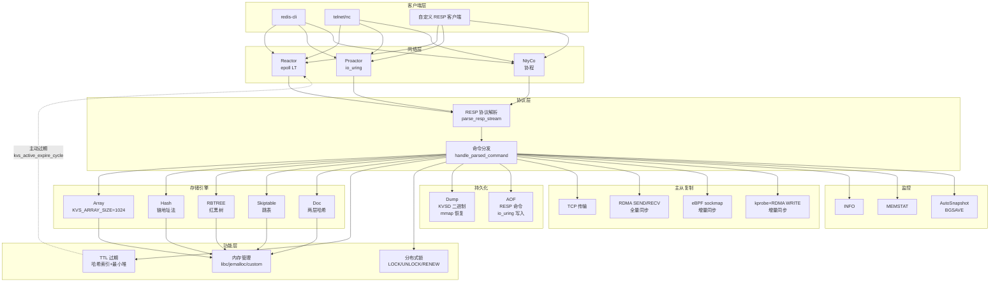

### 命令执行流程

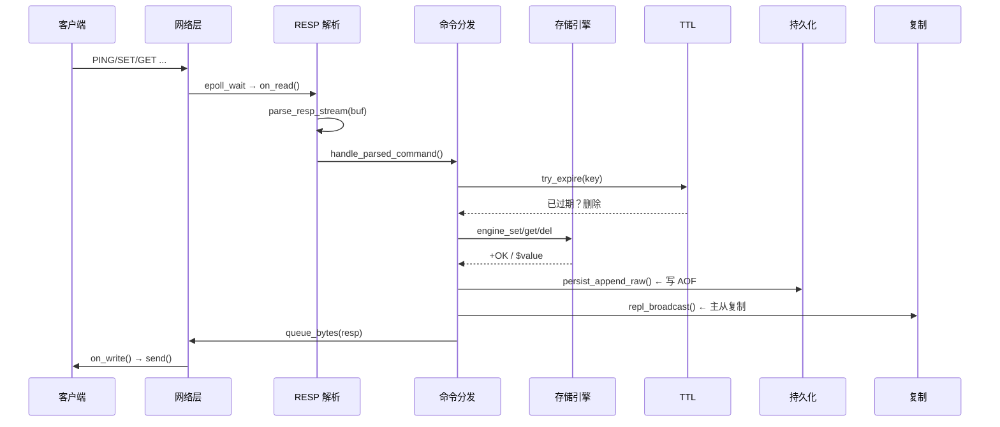

### 存储引擎 — 五种数据结构

kvstore 实现了五种存储引擎，通过**命令前缀**切换。所有引擎共享同一套 TTL 过期系统和复制层。

#### Array 引擎 (`SET` / `GET` / `DEL`)

- **数据结构**：固定大小线性数组（`KVS_ARRAY_SIZE=1024`），每个 slot 包含 `(key, value)` 指针
- **查找**：线性扫描 O(n)，n ≤ 1024
- **限制**：最多 1024 个 key，满了返回 `-ERR operation failed`

```
table = [slot0, slot1, ..., slot1023]
          │       │
     (key,val)  NULL
```

源码: `src/storage/kvs_array.c`

**核心实现**:

```c
int kvs_array_set(kvs_array_t *inst, char *key, char *value) {
    if (find_slot(inst, key) >= 0) return 1;   // 已存在
    for (int i = 0; i < KVS_ARRAY_SIZE; i++) {  // 线性扫描找空位
        if (!inst->table[i].key) {               // 空 slot
            inst->table[i].key = strdup(key);
            inst->table[i].value = strdup(value);
            inst->total++;
            return 0;  // 成功
        }
    }
    return -1;  // 数组满了
}
```

#### Hash 引擎 (`HSET` / `HGET` / `HDEL`)

- **数据结构**：链地址哈希表，`MAX_TABLE_SIZE=1024` 个桶，**FNV-1a 非加密哈希**
- **查找**：O(1) avg，冲突通过链表解决
- **与 Array 的区别**：链地址法无固定容量限制

```
hash(key) → idx
buckets[idx] → node → node → NULL   (链地址法)
```

源码: `src/storage/kvs_hash.c`

**核心实现**:

```c
int kvs_hash_set(kvs_hash_t *hash, char *key, char *value) {
    int idx = _hash(key, hash->max_slots);  // FNV-1a 哈希
    hashnode_t *node = hash->nodes[idx];
    while (node) {  // 遍历冲突链
        if (strcmp(node->key, key) == 0) return 1;  // 已存在
        node = node->next;
    }
    // 头插法插入新节点
    hashnode_t *new = _create_node(key, value);
    new->next = hash->nodes[idx];
    hash->nodes[idx] = new;
    hash->count++;
    return 0;
}
```

#### RBTREE 引擎 (`RSET` / `RGET` / `RDEL`)

- **数据结构**：**红黑树**，节点颜色标记红/黑，插入后通过左旋/右旋/变色保持平衡
- **查找**：O(log n)，中序遍历可得有序序列
- **特点**：通过 5 条红黑树性质保证平衡性

源码: `src/storage/kvs_rbtree.c`

#### Skiptable 引擎 (`XSET` / `XGET` / `XDEL`)

- **数据结构**：**跳表**，多层链表，每层以 50% 概率提升层数（最高 16 层）
- **查找**：O(log n) avg，从最高层开始逐层向下
- **与 RBTREE 的对比**：红黑树通过旋转保持平衡，跳表通过概率层数实现平衡；跳表实现更简单，但红黑树最坏情况有保证

```
head
  │  ┌─────────────────────────────────┐
  ├──┤  L3: 10 ──────────────→ 90      │
  ├──┤  L2: 10 ─────→ 50 ───→ 90      │
  └──┤  L1: 10 → 30 → 50 → 70 → 90    │
     └─────────────────────────────────┘
```

源码: `src/storage/kvs_skiptable.c`

#### Doc 引擎 (`DOCSET` / `DOCGET` / `DOCDEL`)

- **数据结构**：文档型 value，按 `key` 哈希找到文档，文档内部再按 `field` 哈希存储
- **两层哈希**：外层 `key → doc`，内层 `field → value`
- **用途**：一个 key 下存储多个字段，类似 Redis Hash

```
key → doc { fields[0] → (f1,v1) → (f2,v2)
            fields[1] → (f3,v3) → NULL }
```

源码: `src/storage/kvs_doc.c`

#### 命令前缀路由

```
cmd[0] == 'R' → RBTREE 引擎
cmd[0] == 'H' → Hash 引擎
cmd[0] == 'X' → Skiptable 引擎
其他         → Array 引擎
```

`handle_parsed_command()` 根据前缀路由，`strip_prefix()` 去掉前缀后执行统一的操作名（如 `HSET` → HASH 引擎执行 `SET`）。

#### 复杂 KV 存储架构设计

kvstore 的复杂 KV 存储能力来源于**命令分发 + 引擎抽象 + 统一 TTL** 三层架构：

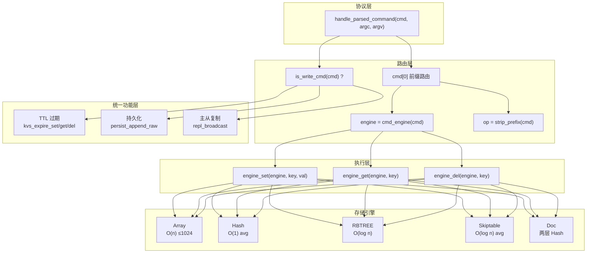

**统一命令分发**：所有引擎的 6 种操作（SET/GET/DEL/EXIST/MOD/MSET）通过同一套代码路径执行：

```c
// src/main/kvstore.c — handle_parsed_command

// ① 确定引擎
int engine = cmd_engine(cmd);    // 根据前缀: R→RBTREE, H→HASH, X→SKIPTABLE, 其他→ARRAY
const char *op = strip_prefix(cmd); // 去掉前缀: HSET → SET

// ② 按操作名分发（所有引擎共用同一套 switch）
if (!strcmp(op, "SET") && argc == 3) {
    rc = engine_set(engine, argv[1], argv[2]);  // 根据 engine 调用对应引擎
    try_expire(engine, argv[1]);                 // 覆盖 TTL（SET 清除旧 TTL）
}
else if (!strcmp(op, "GET") && argc == 2) {
    try_expire(engine, argv[1]);                 // 惰性过期检查
    char *v = engine_get(engine, argv[1]);       // 根据 engine 获取
}
else if (!strcmp(op, "DEL") && argc == 2) {
    try_expire(engine, argv[1]);
    rc = engine_del(engine, argv[1]);            // 引擎内删除
    kvs_expire_del(&global_expire, engine, argv[1]); // TTL 记录也删除
}
// ... MOD, EXIST, PERSIST, MSET, MGET 同理
```

**引擎函数指针路由**：每种引擎实现相同的 6 个函数签名：

```c
// 引擎接口（每种引擎独立实现）
static int engine_set(int engine, char *key, char *value) {
    switch (engine) {
        case KVS_ENGINE_ARRAY:    return kvs_array_set(&global_array, key, value);
        case KVS_ENGINE_RBTREE:   return kvs_rbtree_set(&global_rbtree, key, value);
        case KVS_ENGINE_HASH:     return kvs_hash_set(&global_hash, key, value);
        case KVS_ENGINE_SKIPTABLE:return kvs_skiptable_set(&global_skiptable, key, value);
        default: return -1;
    }
}
// engine_get, engine_del, engine_exist, engine_mod, engine_mset 同理
```

**统一写 AOF 和广播**：执行成功后，所有写命令走同一条持久化和复制路径：

```c
if (!from_replication && is_write_cmd(cmd)) {
    persist_note_write();
    persist_append_raw(raw, rawlen);           // AOF 持久化
    if (g_cfg.role == ROLE_MASTER)
        repl_broadcast(raw, rawlen);            // 主从复制广播
}
```

**Doc 引擎的特殊处理**：Doc 引擎的 field 操作不通过引擎函数指针，而是在 `handle_parsed_command` 中直接处理：

```c
if (!strcmp(cmd, "DOCSET") && argc == 4) {
    rc = kvs_doc_set(&global_doc, argv[1], argv[2], argv[3]);
} else if (!strcmp(cmd, "DOCGET") && argc == 3) {
    char *v = kvs_doc_get(&global_doc, argv[1], argv[2]);
} else if (!strcmp(cmd, "DOCDEL") && argc == 3) {
    rc = kvs_doc_del(&global_doc, argv[1], argv[2]);
}
```

**整体架构优势**：
1. 新增引擎只需实现 6 个函数 + 注册前缀，无需修改命令分发逻辑
2. 持久化和复制对引擎完全透明——每写一条命令自动写 AOF + 广播
3. TTL 系统独立于引擎，统一在命令执行前后检查

**RESP 协议解析核心**:

```c
// src/main/kvstore.c — parse_resp_stream
int parse_resp_stream(conn_t *c, unsigned char *buf, size_t *len, int from_replication) {
    size_t pos = 0;
    while (pos < *len) {
        if (buf[pos] == '+') {           // 简单字符串: +OK\r\n
            // 提取行内容，处理 KPROBERDMA / FULLRESYNC / CONTINUE
        } else if (buf[pos] == '*') {    // 数组: *3\r\n$3\r\nSET\r\n...
            int argc = atoi(buf + pos + 1);  // 解析参数个数
            // 逐个解析 bulk string: $len\r\ndata\r\n
            for (int i = 0; i < argc; i++) {
                if (buf[pos] != '$') break;          // 不是 bulk
                long blen = strtol(buf + pos + 1);    // bulk 长度
                argv[i] = malloc(blen + 1);
                memcpy(argv[i], buf + pos, blen);     // 按长度拷贝
                argv[i][blen] = '\0';
            }
            handle_parsed_command(c, argc, argv, ...); // 执行命令
        } else {                         // inline 命令（兼容 redis-cli）
            // 空格分割参数
        }
    }
}
```

#### PIPELINE 解析机制

kvstore 原生支持 RESP **流水线（PIPELINE）**——客户端可以一次 `send()` 发送多条命令，
服务器逐条解析执行，响应可以一次性读回，大幅减少网络往返。

**核心原理**：

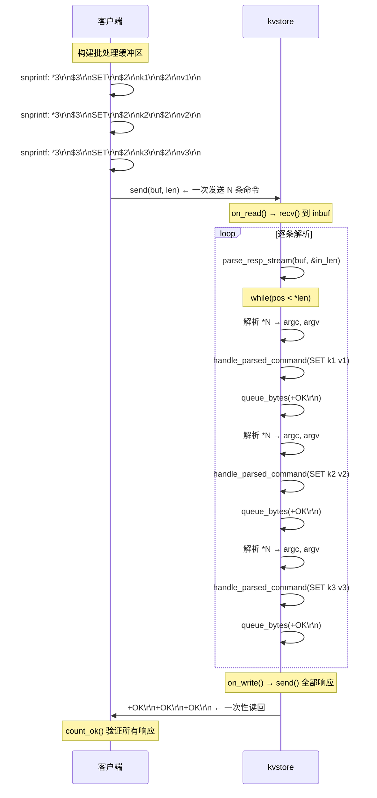

**`parse_resp_stream` 的流水线实现**：解析器使用 `while` 循环不停消费缓冲区，每次解析一条完整命令就立即执行，
缓冲区中剩余数据通过 `memmove` 向前拼接：

```c
// src/main/kvstore.c — parse_resp_stream 流水线核心
int parse_resp_stream(conn_t *c, unsigned char *buf, size_t *len, int from_replication) {
    size_t pos = 0;
    while (pos < *len) {            // ← 一个缓冲区可能包含多条命令
        if (buf[pos] == '*') {      // RESP 数组格式
            // 解析 *N → argc
            // 循环解析 N 个 $len\r\ndata\r\n
            handle_parsed_command(c, argc, argv, raw, rawlen, from_replication); // ← 立即执行
        } else if (buf[pos] == '+') {
            // 处理控制命令（+KPROBERDMA, +FULLRESYNC, +CONTINUE）
        } else {
            // inline 格式（空格分隔）
            handle_parsed_command(c, argc, argv, raw, rawlen, from_replication);
        }
        // pos 前进到下一命令
    }
    // 未处理完的残留数据向前拼接
    if (pos > 0 && pos < *len) {
        memmove(buf, buf + pos, *len - pos);  // ← 拼接剩余数据
        *len -= pos;
    } else if (pos >= *len) {
        *len = 0;
    }
    return 0;
}
```

**响应队列**：每条命令执行后，响应通过 `queue_bytes` 加入 `out_node_t` 链表，`on_write()` 逐条发送：

```c
// src/core/reactor.c
typedef struct out_node_s {
    unsigned char *data;       // 响应数据
    size_t len;                // 长度
    size_t sent;               // 已发送偏移量
    struct out_node_s *next;   // 链表下一节点
} out_node_t;

int queue_bytes(conn_t *c, const unsigned char *buf, size_t len) {
    out_node_t *n = kvs_malloc(sizeof(*n));
    n->data = kvs_malloc(len);
    memcpy(n->data, buf, len);
    n->len = len;
    n->sent = 0;
    n->next = NULL;

    // 追加到输出链表尾部
    if (c->out_tail)
        c->out_tail->next = n;
    else
        c->out_head = n;
    c->out_tail = n;

    // 注册 EPOLLOUT 事件
    mod_events(c, EPOLLIN | EPOLLOUT);
    return 0;
}
```

**`on_read` 中的数据流**：每次 `recv` 读到的数据追加到 `inbuf`，然后调用 `parse_resp_stream` 解析：

```c
static void on_read(conn_t *c) {
    while (1) {
        ssize_t n = recv(c->fd, c->inbuf + c->in_len,
                         sizeof(c->inbuf) - c->in_len, 0);
        if (n > 0) {
            c->in_len += (size_t)n;
            // 一次解析多条命令（pipeline）
            parse_resp_stream(c, c->inbuf, &c->in_len, 0);
            continue;
        }
        // ... 处理断开 / EAGAIN
    }
}
```

**Pipeline 边界处理**：当 TCP 字节流不完整时（一条命令被拆到两次 recv），解析器返回 `break`，
残留数据保留在 `inbuf` 中，下次 `on_read` 继续拼接解析：

```
第1次 recv: *3\r\n$3\r\nSET\r\n$2\r\nk1\r\n$2\r\nv1\r\n*3\r\n$3\r\nSE
                                                                    ↑
第2次 recv: T\r\n$2\r\nk2\r\n$2\r\nv2\r\n
            ← memmove 拼接后完整解析
```

**测试程序 `test_batch`**：验证 kvstore 的流水线能力，一次 send 发送 N 条命令，一次性读回所有响应：

```c
// tests/test_batch.c — 构建批处理缓冲区
static size_t build_set_batch(unsigned char *buf, size_t cap, int count) {
    size_t pos = 0;
    for (int i = 0; i < count; i++) {
        // 拼接 N 条 HSET 命令到同一缓冲区
        int n = snprintf((char *)buf + pos, cap - pos,
            "*3\r\n$4\r\nHSET\r\n$%zu\r\n%s\r\n$%zu\r\n%s\r\n",
            strlen(key), key, strlen(val), val);
        pos += (size_t)n;  // ← 不断追加
    }
    return pos;
}

// 一次 send 发送所有命令
send_all(fd, batch, blen);

// 一次性读取所有响应
unsigned char resp[MAX_RESP_SIZE];
read(fd, resp, sizeof(resp));

// 计数 +OK 数量验证
int ok = count_ok(resp, rlen);  // 应等于 count
```

**测试结果示例**：

```bash
$ ./test_batch --config tests/test.conf
批量流水线压力测试
  地址: 127.0.0.1:5200
  每条流水线: 10000 条命令

--- 写入流水线 ---
  [PASS] HSET: 10000/10000, 262295 qps, 0.038s
--- 读取流水线 ---
  [PASS] HGET: 10000/10000, 243902 qps, 0.041s
--- 混合流水线 ---
  [PASS] HSET+HGET: 20000/20000, 357143 qps, 0.056s

  全部流水线测试通过 ✓
```

#### 测试验证

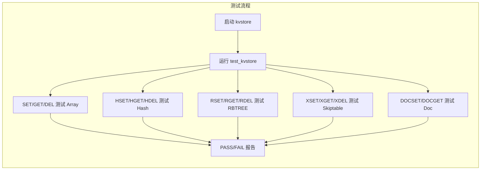

```bash
# 测试全部五种引擎
./test_kvstore --config tests/test.conf

# 或通过 Makefile
make check-kvstore TEST_PORT=5160
```

### 网络模型 — 三种 I/O 模型

三种模型的目的不是为了生产冗余，而是**对比学习**——同一套业务逻辑用三种 I/O 模型实现。


| 模型         | 底层       | 核心思想                                                                          |
| ------------ | ---------- | --------------------------------------------------------------------------------- |
| **Reactor**  | epoll (LT) | 事件驱动，"就绪通知"。`epoll_wait` → 可读/可写回调。单线程事件循环               |
| **Proactor** | io_uring   | "操作完成通知"。提交 SQE 后立即返回，从 CQ 取结果。避免就绪通知→阻塞读的两步开销 |
| **NtyCo**    | 协程       | 同步写法，异步执行。`recv` 被 hook 为 `epoll_ctl` → `yield` → `resume`          |

**核心实现**:

```c
// src/storage/kvs_rbtree.c — 红黑树左旋示例
static void rbtree_left_rotate(kvs_rbtree_t *tree, kvs_rbnode_t *x) {
    kvs_rbnode_t *y = x->right;
    x->right = y->left;                     // y 的左子树变为 x 的右子树
    if (y->left != NULL) y->left->parent = x;
    y->parent = x->parent;                  // y 接管 x 的父节点
    if (x->parent == NULL) tree->root = y;  // x 是根 → y 成为新根
    else if (x == x->parent->left) x->parent->left = y;
    else x->parent->right = y;
    y->left = x;                            // x 成为 y 的左子
    x->parent = y;
}
```

#### Skiptable 引擎 核心实现

```c
// src/storage/kvs_skiptable.c — 跳表插入
static int rand_level(void) {
    int level = 1;
    while ((rand() % 2) && level < KVS_SKIPTABLE_MAX_LEVEL) level++;
    return level;  // 50% 概率提升层数
}

int kvs_skiptable_set(kvs_skiptable_t *inst, char *key, char *value) {
    kvs_sknode_t *update[KVS_SKIPTABLE_MAX_LEVEL];
    kvs_sknode_t *cur = inst->head;
    for (int i = inst->level - 1; i >= 0; i--) {  // 从高层向下
        while (cur->next[i] && strcmp(cur->next[i]->key, key) < 0)
            cur = cur->next[i];
        update[i] = cur;  // 记录每层的前驱
    }
    int level = rand_level();  // 随机层数
    if (level > inst->level) {
        for (int i = inst->level; i < level; i++) update[i] = inst->head;
        inst->level = level;
    }
    kvs_sknode_t *node = create_node(level, key, value);
    for (int i = 0; i < level; i++) {  // 逐层插入
        node->next[i] = update[i]->next[i];
        update[i]->next[i] = node;
    }
    inst->total++;
    return 0;
}
```

#### Reactor（默认）

```
epoll_wait(100ms)
  ├── 可读事件 → on_read() → parse_resp_stream() → handle_parsed_command()
  ├── 可写事件 → on_write() → 发送响应
  └── expire 定时器 (每 100ms) → kvs_active_expire_cycle(adaptive_budget)
                                   → persist_autosnap_cron()
```

- 每个连接有独立的读缓冲区和写缓冲区（`conn_t.in_buf / out_buf`）
- `on_read()` 读出数据到 `in_buf`，`parse_resp_stream()` 解析 RESP 协议
- 写操作通过 `queue_bytes()` 入队到 `out_buf`，`on_write()` 发送

**Reactor 核心循环**:

```c
// src/core/reactor.c
while (1) {
    int n = epoll_wait(g_epfd, events, MAX_EVENTS, 100);  // 等待事件
    
    long long now = kvs_now_ms();
    if (now - g_last_expire >= 100) {                      // 每 100ms
        int budget = expire_cycle_budget();                 // 自适应 budget
        kvs_active_expire_cycle(budget);                   // 主动过期
        persist_autosnap_cron();                           // 自动快照
        g_last_expire = now;
    }
    
    for (int i = 0; i < n; i++) {
        conn_t *c = fdmap[events[i].data.fd];
        if (events[i].events & EPOLLIN)  on_read(c);      // 可读
        if (events[i].events & EPOLLOUT) on_write(c);      // 可写
    }
}
```

#### Proactor (io_uring)

- 提交读 SQE 后立即返回，CQ 完成事件触发处理
- 无需 epoll 就绪通知→阻塞 read 的两步开销
- 同样用于 AOF 持久化写入

源码: `src/core/proactor.c`

#### NtyCo (协程)

- 基于 `NtyCo` 协程库，hook 系统调用
- `recv()` 被 hook 为 `epoll_ctl(ADD)` → `yield` → 事件就绪后 `resume`
- 以同步写法实现异步并发

源码: `src/core/ntyco.c`

#### 测试验证

```bash
# 默认 Reactor（epoll）
./kvstore kvstore.conf --role master
redis-cli -p 5160 PING

# Proactor（io_uring）
./kvstore kvstore.conf --role master --net proactor
redis-cli -p 5160 SET k v

# NtyCo（协程）
./kvstore kvstore.conf --role master --net ntyco
redis-cli -p 5160 GET k
```

三种模型对外暴露完全相同的 RESP 协议接口，客户端无需修改。

### 持久化 — dump + AOF

kvstore 的持久化采用 **全量 dump（二进制快照）+ 增量 AOF（命令日志）** 双机制。
恢复时先加载 dump（快），再重放 AOF（补全），兼顾启动速度和数据完整性。

#### 全量 Dump — KVSD 二进制格式

**保存流程**：

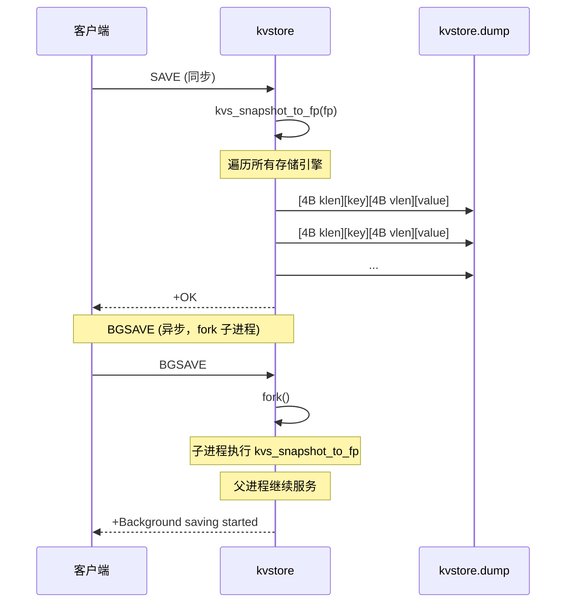

**二进制格式**：

```
[4B key_len][key数据][4B value_len][value数据]
[4B key_len][key数据][4B value_len][value数据]
...
```

每个 key-value 对用 4 字节长度前缀 + 数据交替存储，解析时按长度读取，**不以任何字符作为分隔符**，因此 key/value 中可包含空格、换行等任意字符。

**保存实现**：

```c
// src/main/kvstore.c — kvs_snapshot_to_fp (遍历所有引擎)
int kvs_snapshot_to_fp(FILE *fp) {
    // 遍历 Array 引擎
    for (int i = 0; i < KVS_ARRAY_SIZE; i++)
        if (global_array.table[i].key)
            emit_kv(fp, global_array.table[i].key, global_array.table[i].value);
    // 遍历 Hash 引擎（链地址法）
    for (int i = 0; i < global_hash.max_slots; i++)
        for (hashnode_t *n = global_hash.nodes[i]; n; n = n->next)
            emit_kv(fp, n->key, n->value);
    // 遍历 RBTREE（中序遍历，保持有序）
    rbtree_inorder_walk(global_rbtree.root, fp);
    // 遍历 Skiptable（底层链表有序）
    for (kvs_sknode_t *n = global_skiptable.head->next[0]; n; n = n->next[0])
        emit_kv(fp, n->key, n->value);
    // 遍历 Doc 引擎
    for (int i = 0; i < global_doc.size; i++)
        for (kvs_doc_t *d = global_doc.buckets[i]; d; d = d->next)
            for (int b = 0; b < d->bucket_count; b++)
                for (kvs_doc_field_t *f = d->fields[b]; f; f = f->next)
                    emit_doc_kv(fp, d->key, f->name, f->value);
    return 0;
}

// 持久化入口
int persist_save_dump(void) {
    // SAVE: 直接写
    int fd = open(g_cfg.dump_path, O_WRONLY|O_CREAT|O_TRUNC, 0644);
    kvs_dump_to_fd(fd);       // 遍历引擎，写入 KVSD 格式
    persist_fsync_fd(fd);     // fsync 刷盘
    close(fd);
    return 0;
}

int persist_bgsave_start(void) {
    // BGSAVE: fork 子进程
    pid_t pid = fork();
    if (pid == 0) {                // 子进程
        persist_save_dump();       // 写 dump
        _exit(0);
    }
    g_bgsave_pid = pid;            // 父进程记录 PID
    return 0;
}
```

#### mmap 恢复机制 — 零拷贝数据恢复

kvstore 的持久化恢复通过 **mmap 零拷贝** 技术将磁盘文件直接映射到进程地址空间，
避免传统 `read()` 的内核→用户态数据拷贝，同时利用操作系统的 page cache 和预读机制加速。

**恢复总流程**：

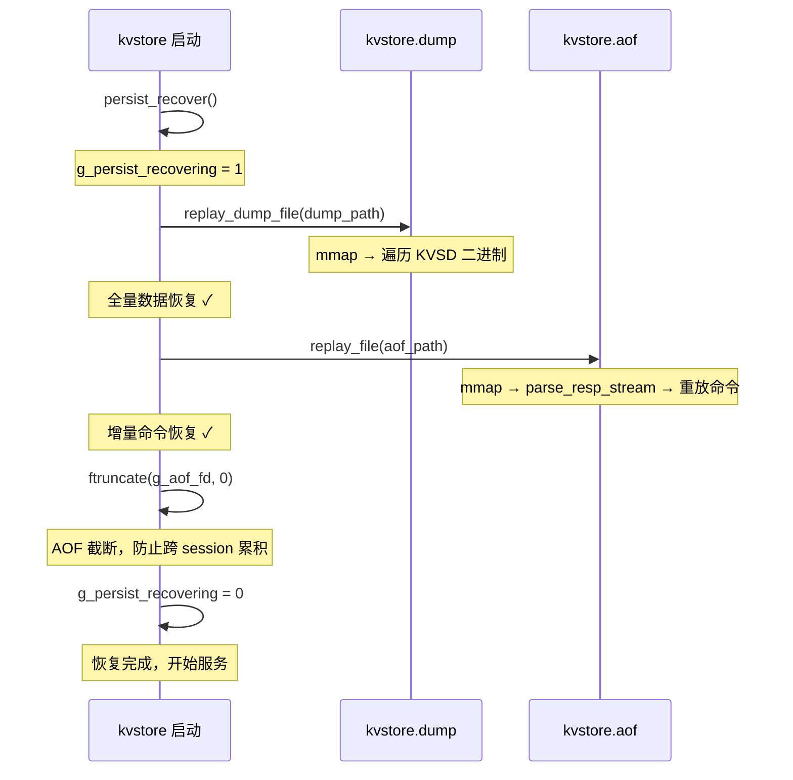

**Dump 文件恢复（二进制 KVSD 格式）**：

dump 文件使用自定义 KVSD 二进制格式：`[4B klen][key][4B vlen][value]`，
mmap 后通过指针偏移直接读取，无需任何解析库：

```c
static int replay_dump_file(const char *path) {
    // ① 打开文件
    int fd = open(path, O_RDONLY);
    if (fd < 0) return 0;
    struct stat st;
    fstat(fd, &st);
    if (st.st_size <= 0) { close(fd); return 0; }

    // ② mmap 零拷贝映射（0 次内核→用户拷贝）
    unsigned char *mapped = mmap(NULL, (size_t)st.st_size,
        PROT_READ | PROT_WRITE, MAP_PRIVATE, fd, 0);

    if (mapped == MAP_FAILED) {
        // ③ mmap 失败 → 回退到 fread 逐块读取
        close(fd);
        return replay_file_fread(path);
    }

    g_recover_mmap_success++;
    g_recover_last_mmap_bytes += (unsigned long long)st.st_size;

    // ④ 遍历 mmap 内存，解析 KVSD 格式
    size_t pos = 0;
    while (pos + 4 <= (size_t)st.st_size) {
        uint32_t klen, vlen;

        memcpy(&klen, mapped + pos, sizeof(klen));
        pos += sizeof(klen);                     // key 长度
        if (pos + klen > (size_t)st.st_size) break;

        char *key = (char *)kvs_malloc(klen + 1);
        if (klen > 0) memcpy(key, mapped + pos, klen);
        key[klen] = '\0';
        pos += klen;                              // key 数据

        if (pos + 4 > (size_t)st.st_size) { kvs_free(key); break; }

        memcpy(&vlen, mapped + pos, sizeof(vlen));
        pos += sizeof(vlen);                     // value 长度
        if (pos + vlen > (size_t)st.st_size) { kvs_free(key); break; }

        char *value = (char *)kvs_malloc(vlen + 1);
        if (vlen > 0) memcpy(value, mapped + pos, vlen);
        value[vlen] = '\0';
        pos += vlen;                              // value 数据

        // ⑤ 写入 Hash 引擎（所有引擎统一存储到 hash）
        kvs_hash_set(&global_hash, key, value);
        kvs_free(key);
        kvs_free(value);
    }

    g_recover_last_tail_bytes += (unsigned long long)pos;
    munmap(mapped, (size_t)st.st_size);
    close(fd);
    return 0;
}
```

**mmap 的优势**：
- **零拷贝**：磁盘数据直接映射到进程地址空间，绕过 `read()` 的内核缓冲区拷贝
- **按需调页**：只有实际访问的页面才会触发缺页中断加载，大文件无需全部读入内存
- **操作系统预读**：内核自动预读连续页面，顺序遍历时性能接近顺序读

```
传统 read 路径:
  磁盘 → 内核页缓存 → read() 拷贝 → 用户缓冲区 → parse
                         ↕ 至少 1 次内存拷贝

mmap 路径:
  磁盘 → 内核页缓存 → mmap 映射 → 直接指针访问
                         ↕ 0 次拷贝（缺页时自动映射）
```

**AOF 文件恢复（RESP 命令格式）**：

AOF 文件使用 mmap 映射后，直接喂给 `parse_resp_stream()` 解析，和客户端请求走完全相同的解析路径：

```c
static int replay_file_mmap(const char *path) {
    // ① mmap 映射 AOF 文件
    unsigned char *mapped = mmap(NULL, (size_t)st.st_size,
        PROT_READ | PROT_WRITE, MAP_PRIVATE, fd, 0);

    g_recover_mmap_success++;
    g_recover_last_mmap_bytes += (unsigned long long)st.st_size;

    // ② 直接喂给 RESP 解析器（与客户端请求同一套代码）
    size_t len = (size_t)st.st_size;
    parse_resp_stream(NULL, mapped, &len, 1);  // from_replication=1
    //                                                ↑
    //                    from_replication=1 避免再次写 AOF 和广播

    g_recover_last_tail_bytes += (unsigned long long)len;
    munmap(mapped, (size_t)st.st_size);
    close(fd);
    return 0;
}
```

**mmap 回退机制**：当 mmap 不可用时（文件过大超出地址空间、内核限制等），自动回退到 `replay_file_fread()`，
逐块 `fread` 读取并解析：

```c
static int replay_file_fread(const char *path) {
    FILE *fp = fopen(path, "rb");
    if (!fp) return 0;

    unsigned char buf[BUFFER_CAP];
    size_t len = 0, n;
    unsigned long long total = 0;

    while ((n = fread(buf + len, 1, sizeof(buf) - len, fp)) > 0) {
        len += n;
        total += (unsigned long long)n;
        parse_resp_stream(NULL, buf, &len, 1);   // 逐块解析
    }

    g_recover_last_fread_bytes += total;
    fclose(fp);
    return 0;
}
```

**恢复统计**：`persist_recover()` 记录了完整的恢复统计，可通过 `INFO` 命令查看：

```c
// src/persistence/kvs_persist.c
int persist_recover(void) {
    g_persist_recovering = 1;

    // ① dump 恢复（KVSD 二进制，mmap 加速）
    dump_begin_ms = kvs_now_ms();
    replay_dump_file(g_cfg.dump_path);
    g_recover_last_dump_ms = kvs_now_ms() - dump_begin_ms;

    // ② AOF 重放（RESP 命令，mmap 加速）
    aof_begin_ms = kvs_now_ms();
    replay_file(g_cfg.aof_path);
    g_recover_last_aof_ms = kvs_now_ms() - aof_begin_ms;

    // ③ AOF 截断（防止跨 session 累积）
    ftruncate(g_aof_fd, 0);
    g_aof_write_offset = 0;

    g_persist_recovering = 0;
    return 0;
}
```

`INFO` 输出示例：

```
recover_total_ms=1247
recover_dump_ms=892          ← dump 恢复耗时
recover_aof_ms=355           ← AOF 重放耗时
recover_mmap_attempts=2      ← mmap 尝试次数
recover_mmap_success=2       ← mmap 成功次数
recover_mmap_fallbacks=0     ← mmap 失败→fread 回退次数
recover_mmap_bytes=134217728 ← mmap 映射的总字节数
recover_fread_bytes=0        ← fread 回退读取的字节数
recover_tail_bytes=0         ← 尾部残留字节数
```
```

#### 增量 AOF — RESP 命令格式

**写入流程**：


**AOF 文件内容示例**：

```
*3\r\n$3\r\nSET\r\n$3\r\nk1\r\n$2\r\nv1\r\n
*3\r\n$6\r\nEXPIRE\r\n$2\r\nk1\r\n$2\r\n10\r\n
*2\r\n$3\r\nDEL\r\n$2\r\nk1\r\n
```

每条写命令以原始 RESP 协议格式追加，恢复时直接重放。

#### io_uring 存储机制 — 异步写入 + fsync

kvstore 的 AOF 持久化使用 **io_uring** 进行异步文件 I/O，与内核共享 SQ（Submission Queue）和 CQ（Completion Queue）
两个环形缓冲区，避免传统 `read()/write()` 系统调用的上下文切换开销。

**io_uring 工作原理**：


**单向环形缓冲区架构**：

```
SQ (Submission Queue) — 用户态写入，内核态消费：
┌─────┬─────┬─────┬─────┬─────┬─────┬─────┬─────┐
│ SQE │ SQE │ SQE │ SQE │ SQE │ SQE │ SQE │ SQE │  ← 64 深
└─────┴─────┴─────┴─────┴─────┴─────┴─────┴─────┘
  head→              tail→                  (用户写 tail，内核读 head)

CQ (Completion Queue) — 内核态写入，用户态消费：
┌─────┬─────┬─────┬─────┬─────┬─────┬─────┬─────┐
│ CQE │ CQE │ CQE │ CQE │ CQE │ CQE │ CQE │ CQE │
└─────┴─────┴─────┴─────┴─────┴─────┴─────┴─────┘
  head→              tail→                  (内核写 tail，用户读 head)
```

**代码分层架构**：

```c
// src/persistence/kvs_persist.c

// ──── ① 全局 io_uring 实例 ────
static struct io_uring g_persist_uring;    // 全局 uring 实例
static int g_persist_uring_ready = 0;

static int persist_uring_init_once(void) {
    if (g_persist_uring_ready) return 0;
    if (io_uring_queue_init(64, &g_persist_uring, 0) != 0)
        return -1;                          // 初始化 64 深度的队列
    g_persist_uring_ready = 1;
    return 0;
}

// ──── ② 单次提交 + 等待完成 ────
static int persist_uring_wait_single(void) {
    struct io_uring_cqe *cqe = NULL;

    // 提交所有待处理的 SQE 到内核，并等待至少 1 个完成
    int rc = io_uring_submit_and_wait(&g_persist_uring, 1);
    if (rc < 0) return -1;

    // 从 CQ 取出完成事件
    rc = io_uring_wait_cqe(&g_persist_uring, &cqe);
    if (rc < 0 || !cqe) return -1;

    rc = cqe->res;                           // 内核返回的执行结果
    io_uring_cqe_seen(&g_persist_uring, cqe); // 标记 CQE 已消费
    return rc;
}

// ──── ③ io_uring 异步写入 ────
static int persist_write_fd_uring(int fd, const unsigned char *buf,
                                  size_t len, off_t *offset) {
    if (persist_uring_init_once() != 0) return -1;

    size_t written = 0;
    while (written < len) {
        // 从 SQ 获取空闲 SQE 槽
        struct io_uring_sqe *sqe = io_uring_get_sqe(&g_persist_uring);
        if (!sqe) return -1;

        // 填充 SQE：准备 write 操作
        io_uring_prep_write(sqe, fd, buf + written,
                           len - written, offset ? *offset : -1);

        // 提交并等待完成
        int rc = persist_uring_wait_single();
        if (rc <= 0) return -1;

        written += (size_t)rc;
        if (offset) *offset += rc;
    }
    return 0;
}

// ──── ④ io_uring 异步 fsync ────
static int persist_fsync_fd_uring(int fd) {
    if (persist_uring_init_once() != 0) return -1;

    struct io_uring_sqe *sqe = io_uring_get_sqe(&g_persist_uring);
    if (!sqe) return -1;

    // 填充 SQE：准备 fsync 操作
    io_uring_prep_fsync(sqe, fd, 0);

    // 提交并等待完成（和 write 共用同一个 uring 实例）
    int rc = persist_uring_wait_single();
    return rc < 0 ? -1 : 0;
}
```

**`best_effort` 容错模式**：io_uring 不可用时（内核不支持、队列满等），自动回退到传统同步 I/O：

```c
// 写入容错
static int persist_write_fd_best_effort(int fd, const unsigned char *buf,
                                         size_t len, off_t *offset) {
    if (persist_write_fd_uring(fd, buf, len, offset) == 0)
        return 0;           // ① io_uring 成功
    return persist_write_fd_sync(fd, buf, len, offset);  // ② 回退 pwrite
}

// fsync 容错
static int persist_fsync_fd_best_effort(int fd) {
    if (persist_fsync_fd_uring(fd) == 0)
        return 0;           // ① io_uring 成功
    return fsync(fd);        // ② 回退传统 fsync
}
```

**传统同步 `pwrite` 实现**（回退路径）：

```c
static int persist_write_fd_sync(int fd, const unsigned char *buf,
                                  size_t len, off_t *offset) {
    size_t written = 0;
    while (written < len) {
        // 直接系统调用，阻塞等待
        ssize_t rc = pwrite(fd, buf + written, len - written,
                           offset ? *offset : -1);
        if (rc <= 0) return -1;
        written += (size_t)rc;
        if (offset) *offset += rc;
    }
    return 0;
}
```

**完整 AOF 写入链**（从命令执行到磁盘）：

```c
// ──── ⑤ 上层入口：追加一条 RESP 命令到 AOF ────
int persist_append_raw(const unsigned char *buf, size_t len) {
    long long off = g_aof_write_offset;

    // 优先 io_uring 写入，失败回退 pwrite
    if (persist_write_raw_fd(g_aof_fd, buf, len, &off) != 0)
        return -1;

    g_aof_write_offset = off;
    g_aof_dirty = 1;

    // 如果 BGREWRITEAOF 正在运行，同时缓存到 rewrite_buf
    if (g_bgrewrite_pid > 0)
        append_to_rewrite_buffer(buf, len);

    // fsync 策略
    if (g_cfg.aof_fsync == KVS_AOF_FSYNC_ALWAYS) {
        // 每条命令后立即 fsync → 最大安全性，最低性能
        if (persist_force_aof_flush() != 0) return -1;
    }
    // KVS_AOF_FSYNC_EVERYSEC: 由 persist_autosnap_cron() 每秒批量 fsync
    return 0;
}

// ──── ⑥ persist_write_raw_fd 中间层 ────
int persist_write_raw_fd(int fd, const unsigned char *buf,
                          size_t len, long long *offset_io) {
    off_t off = offset_io ? (off_t)(*offset_io) : lseek(fd, 0, SEEK_CUR);
    if (off < 0) return -1;

    // best_effort: io_uring → pwrite
    if (persist_write_fd_best_effort(fd, buf, len, &off) != 0)
        return -1;

    if (offset_io) *offset_io = (long long)off;
    return 0;
}

// ──── ⑦ fsync 完整路径 ────
int persist_force_aof_flush(void) {
    if (g_aof_fd < 0) return -1;

    // best_effort: io_uring fsync → fsync()
    if (persist_flush_aof_fd(g_aof_fd) != 0) return -1;

    g_aof_dirty = 0;
    g_aof_last_flush_ms = kvs_now_ms();
    return 0;
}

static int persist_flush_aof_fd(int fd) {
    if (fd < 0) return -1;
    // best_effort: io_uring fsync → fsync()
    if (persist_fsync_fd_best_effort(fd) != 0) return -1;
    return 0;
}
```

**两种 fsync 策略对比**：

| 策略 | 代码 | 行为 | 安全性 | 性能 |
|---|---|---|---|---|
| `always` | 每条命令后 `persist_force_aof_flush()` | 每写一条就 fsync | ⭐⭐⭐ 最多丢 1 条 | 最低 |
| `everysec` | `persist_autosnap_cron()` 每秒检查 | 每秒批量 fsync | ⭐⭐ 最多丢 1 秒数据 | 高 |

```c
// everysec 策略：每秒由 autosnap_cron 触发
int persist_autosnap_cron(void) {
    if (g_cfg.aof_fsync == KVS_AOF_FSYNC_EVERYSEC && g_aof_dirty) {
        long long now = kvs_now_ms();
        if (now - g_aof_last_flush_ms >= 1000) {
            persist_force_aof_flush();  // 每秒刷一次
        }
    }
    // ...
}
```

**io_uring vs 传统同步 I/O 对比**：

```
传统 write + fsync:
  用户态                   内核态
    │                       │
    ├─ write() ────────────→├─ 拷贝数据 → 页缓存
    │←──── 返回 ────────────┤
    ├─ fsync() ────────────→├─ 刷盘
    │←──── 返回 ────────────┤
    ↑ 两次系统调用，每次都有上下文切换

io_uring write + fsync:
  用户态                   内核态
    │                       │
    ├─ 填充 SQE (write)     │
    ├─ 填充 SQE (fsync)     │
    ├─ submit() ───────────→├─ 批量处理 SQE
    │                       ├─ pwrite → 页缓存
    │                       ├─ fsync → 刷盘
    │←──── CQE ─────────────┤
    ↑ 一次 submit 批量完成，上下文切换减半
```

**io_uring 在 Proactor 网络模型中的复用**：

AOF 持久化使用独立的 `g_persist_uring` 实例（队列深度 64），与 Proactor 网络模型的 io_uring 实例分离，
互不干扰：

```
Proactor 网络模型:    g_proactor_uring  ← 处理客户端网络 I/O
AOF 持久化:           g_persist_uring   ← 处理 AOF 文件 I/O
```
```

#### SAVE / BGSAVE / BGREWRITEAOF — 三种持久化命令详解

##### SAVE — 同步全量 Dump

SAVE 是**同步阻塞**操作，直接在主线程中遍历所有引擎，将全部 key-value 以 KVSD 二进制格式写入 dump 文件。
写入期间 kvstore 无法处理任何请求。

**处理流程**：

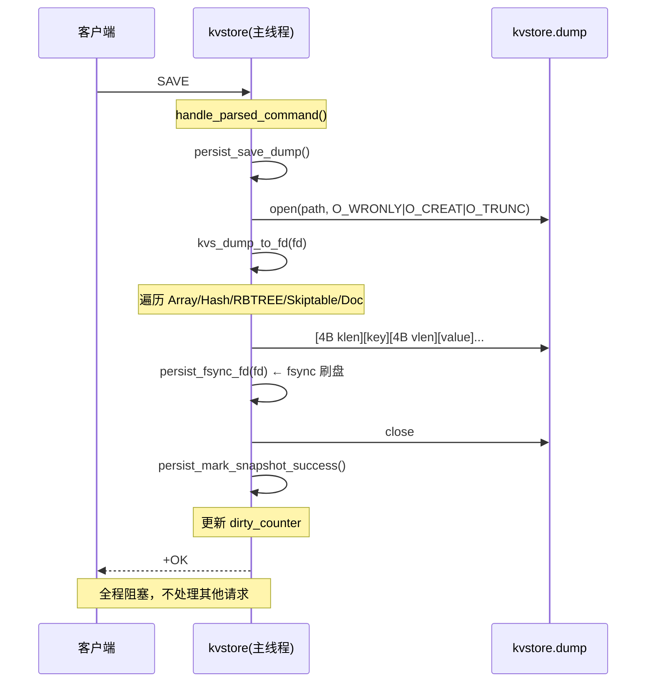

**源码实现**：

```c
// src/main/kvstore.c — 命令分发
if (!strcmp(cmd, "SAVE")) {
    n = (persist_save_dump() == 0)
        ? resp_simple_string(resp, "OK")
        : resp_error(resp, "save failed");
}

// src/persistence/kvs_persist.c — 核心
int persist_save_dump(void) {
    int rc = persist_save_dump_to(g_cfg.dump_path);
    if (rc == 0) persist_mark_snapshot_success(g_dirty_counter);
    return rc;
}

static int persist_save_dump_to(const char *path) {
    int fd = open(path, O_WRONLY | O_CREAT | O_TRUNC, 0644);
    if (fd < 0) return -1;

    // 遍历所有引擎，写入 KVSD 二进制格式
    rc = kvs_dump_to_fd(fd);

    // fsync 确保数据落盘
    if (rc == 0 && persist_fsync_fd(fd) != 0) rc = -1;

    close(fd);
    return rc;
}
```

**`persist_mark_snapshot_success`** 的作用：成功快照后，从 `g_dirty_counter` 中减去快照时刻记录的脏计数，
这样 `dirty_counter` 只反映快照之后的新的写入量，用于自动快照规则的判断。

```c
static void persist_mark_snapshot_success(unsigned long long snap_dirty) {
    g_last_snapshot_ms = kvs_now_ms();          // 记录快照时间
    g_bgsave_last_end_ms = g_last_snapshot_ms;
    if (g_dirty_counter >= snap_dirty)
        g_dirty_counter -= snap_dirty;           // 减去已快照的脏数据
    else
        g_dirty_counter = 0;
}
```

**注意**：SAVE 直接写最终文件路径（`g_cfg.dump_path`），不使用临时文件 + rename。
这是因为 SAVE 是同步的，写入期间没有并发写入，即使写入中途崩溃，旧 dump 文件也未被破坏（O_TRUNC 发生在 open 时）。

---

##### BGSAVE — 后台全量 Dump

BGSAVE 通过 **fork 子进程** 实现非阻塞备份。子进程继承 fork 时刻的内存快照，独立写 dump 文件，
父进程继续处理请求。子进程完成后通过 `waitpid(WNOHANG)` 轮询回收。

**处理流程**：

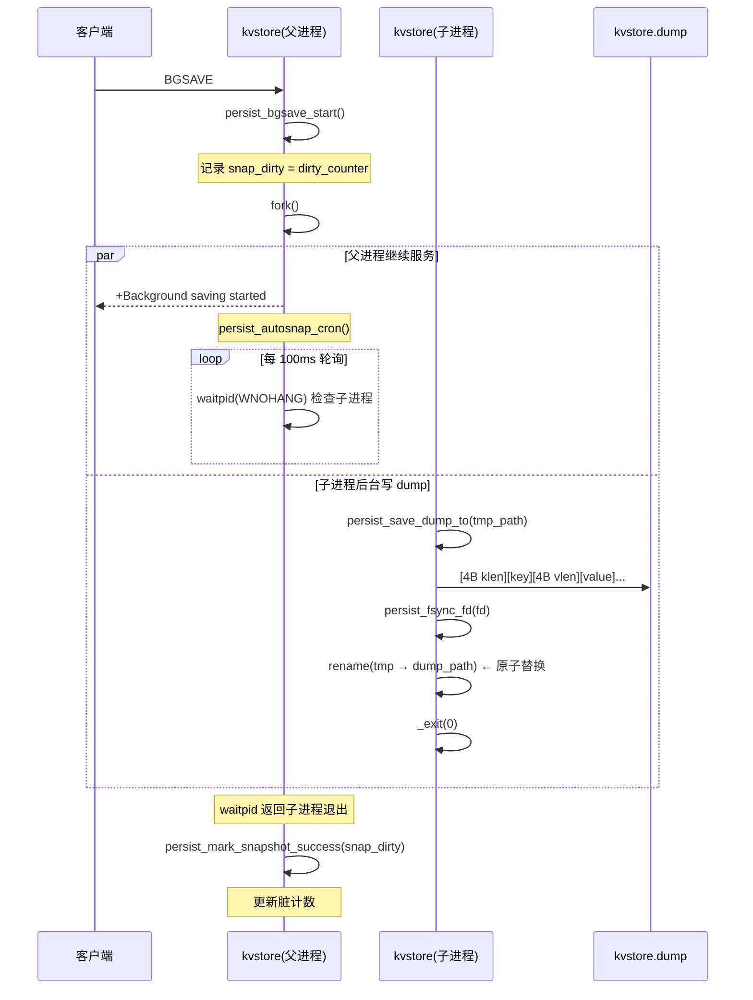

**源码实现**：

```c
// src/main/kvstore.c — 命令分发
if (!strcmp(cmd, "BGSAVE")) {
    int brc = persist_bgsave_start();
    if (brc == 0)
        n = resp_simple_string(resp, "Background saving started");
    else if (brc == 1)
        n = resp_error(resp, "background saving already in progress");
    else
        n = resp_error(resp, "bgsave failed");
}

// src/persistence/kvs_persist.c — 启动
int persist_bgsave_start(void) {
    if (g_bgsave_pid > 0) return 1;  // 已有 BGSAVE 在运行

    unsigned long long snap_dirty = g_dirty_counter;
    long long start_ms = kvs_now_ms();
    char tmp_path[512];
    snprintf(tmp_path, sizeof(tmp_path), "%s.tmp.%ld",
             g_cfg.dump_path, (long)getpid());

    pid_t pid = fork();
    if (pid < 0) { g_bgsave_status = 3; return -1; }

    if (pid == 0) {
        // 子进程：写临时文件 → rename 原子替换
        int rc = persist_save_dump_to(tmp_path);
        if (rc == 0 && rename(tmp_path, g_cfg.dump_path) != 0) rc = -1;
        if (rc != 0) unlink(tmp_path);  // 失败则清理
        _exit(rc == 0 ? 0 : 1);
    }

    // 父进程：记录 PID 和状态
    g_bgsave_pid = pid;
    g_bgsave_status = 1;   // running
    g_bgsave_last_start_ms = start_ms;
    g_bgsave_base_dirty = snap_dirty;
    return 0;
}
```

**子进程轮询回收**：

```c
// src/persistence/kvs_persist.c — 轮询（由 persist_autosnap_cron 调用）
int persist_bgsave_poll(void) {
    if (g_bgsave_pid <= 0) return 0;

    int status = 0;
    pid_t rc = waitpid(g_bgsave_pid, &status, WNOHANG);
    if (rc == 0) return 0;        // 子进程仍在运行

    if (rc < 0) {                 // waitpid 失败
        g_bgsave_status = 3;      // err
        g_bgsave_pid = -1;
        return -1;
    }

    // 子进程已退出
    g_bgsave_last_end_ms = kvs_now_ms();
    if (WIFEXITED(status) && WEXITSTATUS(status) == 0) {
        g_bgsave_status = 2;     // ok
        persist_mark_snapshot_success(g_bgsave_base_dirty);
    } else {
        g_bgsave_status = 3;     // err
    }
    g_bgsave_pid = -1;
    return 1;
}
```

**自动快照（AutoSnapshot）**：在主循环中，`persist_autosnap_cron()` 根据用户配置的规则自动触发 BGSAVE：

```c
// src/persistence/kvs_persist.c — 自动快照 cron
int persist_autosnap_cron(void) {
    // AOF everysec 刷盘
    if (g_cfg.aof_fsync == KVS_AOF_FSYNC_EVERYSEC && g_aof_dirty) {
        if (now - g_aof_last_flush_ms >= 1000)
            persist_force_aof_flush();
    }

    // 轮询 BGSAVE / BGREWRITEAOF 子进程
    persist_bgsave_poll();
    persist_bgrewriteaof_poll();

    // 检查是否满足自动快照规则
    for (int i = 0; i < g_cfg.autosnap_rule_count; ++i) {
        if ((long long)g_dirty_counter >= rule.changes
            && now - last_ms >= rule.seconds * 1000) {
            return persist_bgsave_start();  // 触发 BGSAVE
        }
    }
}
```

配置示例（`kvstore.conf`）：

```
# 当 300 秒内有至少 100 次写入 → 自动 BGSAVE
autosnap 300 100

# 当 3600 秒内有至少 10000 次写入 → 自动 BGSAVE
autosnap 3600 10000
```

**SAVE vs BGSAVE 对比**：

| 特性 | SAVE | BGSAVE |
|---|---|---|
| 是否阻塞 | ✅ 是（主线程同步写） | ❌ 否（fork 子进程） |
| 文件替换方式 | 直接写最终路径（O_TRUNC） | 写临时文件 → rename 原子替换 |
| 实现机制 | 直接调用 `persist_save_dump_to()` | `fork()` + 子进程写 + 父进程 `waitpid` 轮询 |
| 响应 | 写入完成后返回 `+OK` | 立即返回 `+Background saving started` |
| 脏计数更新 | `persist_mark_snapshot_success(dirty_counter)` | `persist_mark_snapshot_success(bgsave_base_dirty)` |

---

##### BGREWRITEAOF — 后台 AOF 重写

AOF 文件随时间增长会越来越庞大，BGREWRITEAOF 通过 fork 子进程**将当前内存数据压缩成 RESP 命令集**，
生成新的紧凑 AOF 文件，原子替换旧文件。

**与 BGSAVE 的关键区别**：
- BGSAVE 写 **KVSD 二进制格式**（dump 文件）
- BGREWRITEAOF 写 **RESP 命令格式**（AOF 文件），且需要处理重写期间的增量命令

**处理流程**：

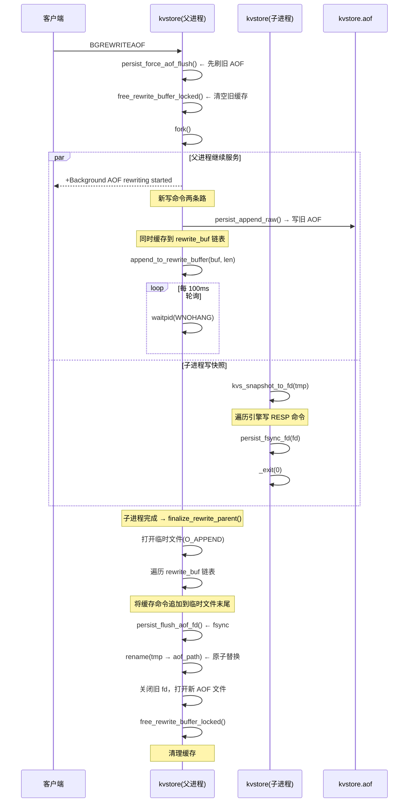

**状态机**：

```
g_bgrewrite_status: 0 idle → 1 running → 2 ok / 3 err
                              ↕
                     g_bgrewrite_pid > 0
```

**源码实现**：

```c
// src/main/kvstore.c — 命令分发
if (!strcmp(cmd, "BGREWRITEAOF")) {
    int rrc = persist_bgrewriteaof_start();
    if (rrc == 0)
        n = resp_simple_string(resp, "Background append only file rewriting started");
    else if (rrc == 1)
        n = resp_error(resp, "background aof rewrite already in progress");
    else
        n = resp_error(resp, "bgrewriteaof failed");
}

// src/persistence/kvs_persist.c — 启动
int persist_bgrewriteaof_start(void) {
    if (g_bgrewrite_pid > 0) return 1;  // 已有重写在进行

    // ① 先强制刷旧 AOF，确保已写入的数据落盘
    if (persist_force_aof_flush() != 0 && g_aof_fd >= 0) return -1;

    // ② 生成临时文件路径: kvstore.aof.rewrite.tmp.12345
    snprintf(g_rewrite_tmp_path, sizeof(g_rewrite_tmp_path),
             "%s.rewrite.tmp.%ld", g_cfg.aof_path, (long)getpid());

    // ③ 清空旧的 rewrite_buf（防止上次残留）
    pthread_mutex_lock(&g_rewrite_buf_lock);
    free_rewrite_buffer_locked();
    pthread_mutex_unlock(&g_rewrite_buf_lock);

    // ④ fork
    pid_t pid = fork();
    if (pid < 0) { g_bgrewrite_status = 3; return -1; }

    if (pid == 0) {
        // 子进程：遍历引擎写 RESP 命令到临时文件
        int rc = persist_write_aof_snapshot_to(g_rewrite_tmp_path);
        _exit(rc == 0 ? 0 : 1);
    }

    // 父进程：记录 PID，开始缓存增量命令
    g_bgrewrite_pid = pid;
    g_bgrewrite_status = 1;  // running
    return 0;
}
```

**子进程中的快照写入**（`persist_write_aof_snapshot_to`）：

```c
static int persist_write_aof_snapshot_to(const char *path) {
    int fd = open(path, O_WRONLY | O_CREAT | O_TRUNC, 0644);
    if (fd < 0) return -1;

    // 遍历所有引擎，写入 RESP 命令格式
    // 如: *3\r\n$3\r\nSET\r\n$2\r\nK1\r\n$2\r\nV1\r\n
    rc = kvs_snapshot_to_fd(fd);

    if (rc == 0 && persist_fsync_fd(fd) != 0) rc = -1;
    close(fd);
    return rc;
}
```

**重写期间增量命令缓存**（`append_to_rewrite_buffer`）：

在 BGREWRITEAOF 期间，父进程继续接收写命令。这些命令既要写入旧 AOF（保证不丢数据），
又要缓存到 `g_rewrite_buf` 链表中，以便子进程完成后追加到新 AOF。

```c
// src/persistence/kvs_persist.c — 追加命令时
int persist_append_raw(const unsigned char *buf, size_t len) {
    // ... 写入旧 AOF 文件 ...

    if (g_bgrewrite_pid > 0)
        append_to_rewrite_buffer(buf, len);  // 同时缓存

    // ...
}

// 缓存结构：单向链表，每个节点存一条 RESP 命令
typedef struct rewrite_buf_node_s {
    unsigned char *data;              // RESP 命令字节
    size_t len;                       // 长度
    struct rewrite_buf_node_s *next;  // 下一个节点
} rewrite_buf_node_t;

static rewrite_buf_node_t *g_rewrite_buf_head = NULL;
static rewrite_buf_node_t *g_rewrite_buf_tail = NULL;
static pthread_mutex_t g_rewrite_buf_lock = PTHREAD_MUTEX_INITIALIZER;

static int append_to_rewrite_buffer(const unsigned char *buf, size_t len) {
    rewrite_buf_node_t *node = kvs_malloc(sizeof(*node));
    node->data = kvs_malloc(len);
    memcpy(node->data, buf, len);
    node->len = len;
    node->next = NULL;

    pthread_mutex_lock(&g_rewrite_buf_lock);
    if (g_bgrewrite_pid <= 0) {
        // 重写已结束，丢弃缓存
        pthread_mutex_unlock(&g_rewrite_buf_lock);
        kvs_free(node->data);
        kvs_free(node);
        return 0;
    }
    // 追加到链表尾部
    if (g_rewrite_buf_tail)
        g_rewrite_buf_tail->next = node;
    else
        g_rewrite_buf_head = node;
    g_rewrite_buf_tail = node;
    pthread_mutex_unlock(&g_rewrite_buf_lock);
    return 0;
}
```

**子进程完成后的回调**（`finalize_rewrite_parent`）：

```c
int persist_bgrewriteaof_poll(void) {
    if (g_bgrewrite_pid <= 0) return 0;

    int status = 0;
    pid_t rc = waitpid(g_bgrewrite_pid, &status, WNOHANG);
    if (rc == 0) return 0;  // 仍在运行

    if (WIFEXITED(status) && WEXITSTATUS(status) == 0) {
        // 子进程成功 → 执行 finalize_rewrite_parent
        if (finalize_rewrite_parent() == 0)
            g_bgrewrite_status = 2;  // ok
        else {
            g_bgrewrite_status = 3;  // err
            unlink(g_rewrite_tmp_path);
        }
    } else {
        g_bgrewrite_status = 3;      // err
        unlink(g_rewrite_tmp_path);
    }

    g_bgrewrite_pid = -1;
    return 1;
}
```

**`finalize_rewrite_parent`** — 最关键的步骤：

```c
static int finalize_rewrite_parent(void) {
    // ① 以追加模式打开子进程写的临时文件
    int fd = open(g_rewrite_tmp_path, O_WRONLY | O_APPEND);
    if (fd < 0) return -1;

    // ② 遍历 rewrite_buf，将缓存命令追加到临时文件末尾
    pthread_mutex_lock(&g_rewrite_buf_lock);
    long long off = lseek(fd, 0, SEEK_END);
    for (rewrite_buf_node_t *cur = g_rewrite_buf_head; cur; cur = cur->next) {
        persist_write_raw_fd(fd, cur->data, cur->len, &off);
    }
    pthread_mutex_unlock(&g_rewrite_buf_lock);

    // ③ fsync 刷盘
    persist_flush_aof_fd(fd);
    close(fd);

    // ④ rename 原子替换旧 AOF 文件
    //    新 AOF = 子进程快照 + 父进程缓存的增量命令
    if (rename(g_rewrite_tmp_path, g_cfg.aof_path) != 0) return -1;

    // ⑤ 关闭旧 AOF 文件描述符，打开新 AOF
    if (g_aof_fd >= 0) close(g_aof_fd);
    g_aof_fd = open(g_cfg.aof_path, O_WRONLY | O_CREAT | O_APPEND, 0644);
    g_aof_write_offset = lseek(g_aof_fd, 0, SEEK_END);

    // ⑥ 清理 rewrite_buf
    pthread_mutex_lock(&g_rewrite_buf_lock);
    free_rewrite_buffer_locked();
    pthread_mutex_unlock(&g_rewrite_buf_lock);

    g_aof_dirty = 0;
    return 0;
}
```

**新 AOF 文件内容示意**：

```
# 子进程写入的内存快照（RESP 命令集）
*3\r\n$3\r\nSET\r\n$2\r\nK1\r\n$2\r\nV1\r\n
*3\r\n$4\r\nHSET\r\n$2\r\nK2\r\n$2\r\nV2\r\n
*3\r\n$3\r\nSET\r\n$2\r\nK3\r\n$2\r\nV3\r\n
  ─ ─ ─ ─ ─ ─ ─ ─ ─ ─ ─ ─ ─ ─ ─ ─ ─ ─
# 父进程 append 的 rewrite_buf（重写期间的增量命令）
*2\r\n$3\r\nDEL\r\n$2\r\nK1\r\n
*3\r\n$4\r\nHSET\r\n$2\r\nK4\r\n$2\r\nV4\r\n
```

**三个命令的详细对比**：

| 特性 | SAVE | BGSAVE | BGREWRITEAOF |
|---|---|---|---|
| 输出格式 | KVSD 二进制 | KVSD 二进制 | RESP 命令文本 |
| 输出文件 | `kvstore.dump` | `kvstore.dump` | `kvstore.aof` |
| 是否 fork | ❌ | ✅ fork | ✅ fork |
| 是否阻塞 | ✅ 阻塞 | ❌ 不阻塞 | ❌ 不阻塞 |
| 文件替换 | 直接 O_TRUNC | tmp → rename | tmp → rename |
| 是否需要缓存增量 | 不需要 | 不需要 | ✅ 需要（rewrite_buf 链表） |
| 目的 | 同步备份 | 异步备份 | 压缩 AOF 文件 |
| 子进程工作量 | — | 遍历引擎写 KVSD | 遍历引擎写 RESP 命令 |
| 状态查询 | 完成后返回 | INFO bgsave=ok/running/err | INFO aof_rewrite=ok/running/err |
```

#### 恢复完整流程

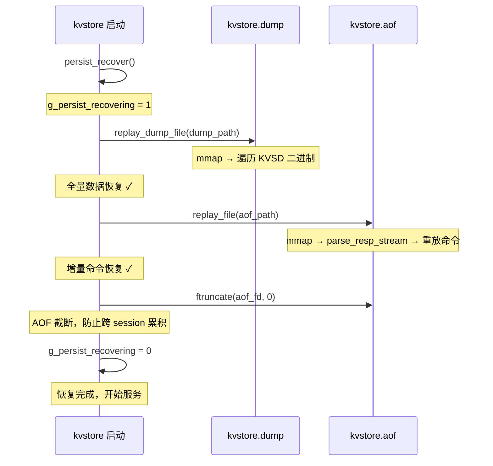

```c
// src/persistence/kvs_persist.c
int persist_recover(void) {
    g_persist_recovering = 1;   // 标记恢复中，禁止写 slave

    // ① 先恢复 dump（全量二进制快照）
    replay_dump_file(g_cfg.dump_path);

    // ② 再重放 AOF（增量 RESP 命令）
    replay_file(g_cfg.aof_path);  // 内部调用 replay_file_mmap

    // ③ 截断 AOF，防止跨 session 无限累积
    ftruncate(g_aof_fd, 0);
    g_aof_write_offset = 0;

    g_persist_recovering = 0;
    return 0;
}
```

**mmap 失败回退**：当 mmap 不可用时（如文件过大、内核限制），自动回退到 `replay_file_fread()`，逐块 fread 解析。

#### 测试验证


```bash
# 全量持久化测试
./kvstore kvstore.conf --role master
./test_persist_dump_demo --config tests/test.conf

# AOF 重写测试
redis-cli -p 5160 BGREWRITEAOF
redis-cli -p 5160 INFO | grep aof_rewrite

# 持久化状态查看
redis-cli -p 5160 INFO | grep -E "(aof|dump|bgsave|dirty)"
```
    T->>T: 等待 kvstore 就绪
    K->>D: mmap 读取 dump 恢复数据
    T->>K: HGET persist:dump:00000
    K-->>T: v0
    T->>T: 验证 N 条全部正确恢复
```

```bash
# 终端 1: 启动 kvstore
./kvstore kvstore.conf --role master

# 终端 2: 运行全量持久化演示
./test_persist_dump_demo --config tests/test.conf
# 程序会写入 → SAVE → 提示停 kvstore → 提示重启 → 自动验证

# AOF 重写验证
redis-cli -p 5170 BGREWRITEAOF
```

### 主从复制 — 四种传输路径详解

kvstore 的复制系统采用类 Redis 的 RESP-based 复制协议，
通过 `repl_transport_ops_t` **策略模式**支持四种传输层切换：
TCP（通用保底）、RDMA SEND/RECV（全量高速）、eBPF sockmap（内核态转发）、kprobe+RDMA WRITE（单边最低延迟）。

#### 传输策略模式

```c
// 策略模式定义：每种传输方式实现这组函数指针
typedef struct repl_transport_ops_s {
    const char *name;
    int (*send)(conn_t *c, const unsigned char *buf, size_t len);
    int (*connect_slave)(const char *host, int port);
    void (*disconnect_slave)(int fd);
} repl_transport_ops_t;

// 运行时根据配置选择传输方式
int repl_realtime_send(conn_t *c, const unsigned char *buf, size_t len) {
    ops = repl_transport_ops_for_context(KVS_REPL_SEND_REALTIME);
    int rc = ops->send(c, buf, len);
    if (rc == 0) return 0;
    return repl_transport_tcp_send(c, buf, len);  // TCP 保底
}
```

#### 复制握手流程

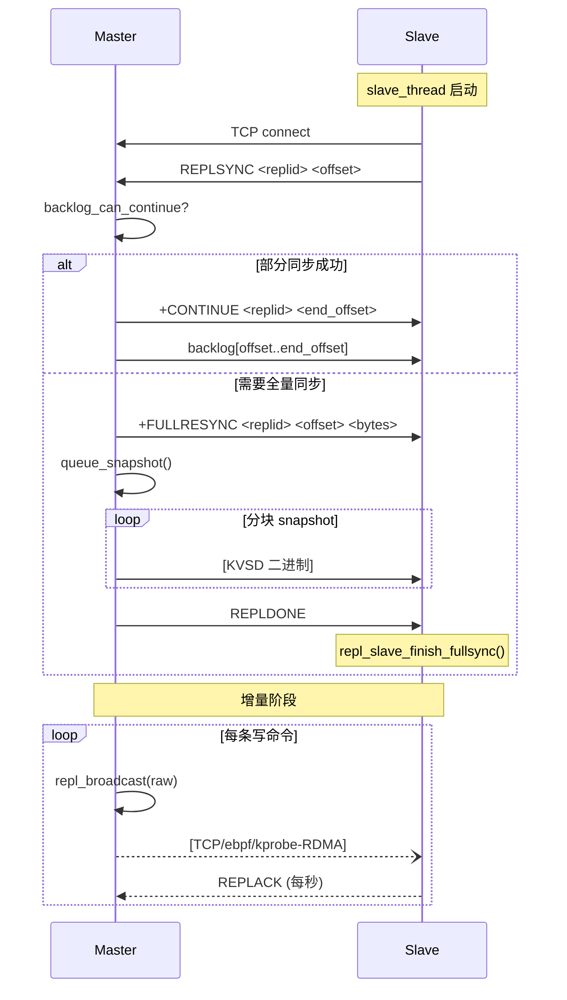

---

#### 1. TCP 传输（通用保底）

**数据路径**：
```
repl_broadcast()
  → repl_realtime_send()
    → repl_transport_tcp_send(c, buf, len)
      → queue_bytes(c, buf, len)        // 入队到 conn_t.out_buf
        → reactor on_write()            // epoll 可写事件
          → write(c->fd, buf, len)      // 系统调用
```

**实现**：
```c
// 最简实现：直接写入 socket
static int repl_transport_tcp_send(conn_t *c, const unsigned char *buf, size_t len) {
    return queue_bytes(c, buf, len);  // 放入写缓冲区，reactor 负责发送
}

static int repl_transport_tcp_connect_slave(const char *host, int port) {
    int fd = socket(AF_INET, SOCK_STREAM, 0);
    connect(fd, (struct sockaddr*)&addr, sizeof(addr));
    return fd;
}
```

**特点**：
- 不依赖任何特殊硬件（无需 RDMA 网卡、无需 BPF）
- 单机测试时走 loopback，双机走物理网卡
- 失败处理：发送失败标记 `c->repl_draining = 1`，从 replica 链表移除

---

#### 2. RDMA SEND/RECV（全量高速传输）

**架构**：独立 QP，端口为 TCP 端口 + 1

```
┌─ Master ─────────────────────┐     ┌─ Slave ──────────────────────┐
│ g_repl_rdma_ctx              │     │                              │
│  ├── ec: event_channel       │     │  listener_thread:            │
│  ├── id: rdma_cm_id          │     │  ① rdma_bind_addr(port+1)   │
│  ├── pd: 保护域              │     │  ② rdma_listen()            │
│  ├── cq: 完成队列            │     │  ③ rdma_get_cm_event()      │
│  ├── comp_chan: 通知通道     │     │    → CONNECT_REQUEST         │
│  └── send_slots[4]: pipeline │     │  ④ ibv_alloc_pd + create_cq │
│                              │     │  ⑤ rdma_create_qp           │
│  connector:                  │     │  ⑥ ibv_reg_mr + ibv_post_recv│
│  ① rdma_resolve_addr()      │     │  ⑦ rdma_accept()            │
│  ② rdma_resolve_route()     │     │  ⑧ rdma_get_cm_event()      │
│  ③ ibv_alloc_pd             │     │    → ESTABLISHED             │
│  ④ ibv_create_cq(comp_chan) │     │  ⑨ 启动 CQ 轮询线程         │
│  ⑤ rdma_create_qp           │     └──────────────────────────────┘
│  ⑥ ibv_reg_mr + ibv_post_recv│
│  ⑦ rdma_connect() → ESTABLISHED│
│  ⑧ 启动 CQ 轮询线程         │
└──────────────────────────────┘
```

**CQ 轮询线程**（事件驱动）：
```c
static void *repl_rdma_cq_poll_thread(void *arg) {
    while (cq_poll_thread_running && connected) {
        ibv_get_cq_event(comp_chan, &ev_cq, &ev_ctx);  // 阻塞等事件
        ibv_ack_cq_events(cq, 1);

        // 批量 poll completions
        int n = ibv_poll_cq(cq, KVS_RDMA_CQ_BATCH, wc_batch);
        for (int i = 0; i < n; i++)
            repl_rdma_cq_process_wc(&wc_batch[i]);  // 回收 send/recv slot

        // re-arm → drain 确认
        ibv_req_notify_cq(cq, 0);
        n = ibv_poll_cq(cq, KVS_RDMA_CQ_BATCH, wc_batch);
        if (n > 0) continue;  // 有数据，继续处理
        // 无数据，回到 ibv_get_cq_event 阻塞
    }
}
```

**Pipeline 4 槽异步发送**：
```c
static int repl_rdma_try_send(const unsigned char *buf, size_t len) {
    // 获取空闲 send slot（最多等 5s）
    slot = repl_rdma_acquire_send_slot(5000);

    memcpy(g_repl_rdma_ctx.send_slots[slot].buf, buf, len);

    memset(&wr, 0, sizeof(wr));
    wr.wr_id = (uint64_t)slot | PIPELINE_WR_ID_FLAG;
    wr.opcode = IBV_WR_SEND;
    wr.send_flags = IBV_SEND_SIGNALED;

    ibv_post_send(qp, &wr, &bad_wr);  // 非阻塞，立即返回
    // CQ 线程异步处理 completion，释放 slot
    return 0;
}
```

**自适应 Pipeline 深度**：根据 `in_flight` 数量动态调整 `send_pipeline_depth`（2~4），
利用率低时增加深度，饱和时减少。

---

#### 3. eBPF sockmap（内核态增量转发）

**原理**：将 slave 的 TCP socket fd 注册到 BPF sock_map 中，
Master 的 `send()` 系统调用触发 `sk_msg` BPF 程序，
后者调用 `bpf_msg_redirect_map()` 将数据直接重定向到 slave 的 socket。

**数据路径**：
```
repl_broadcast()
  → repl_realtime_send()
    → repl_transport_ebpf_send()
      → queue_bytes() → reactor on_write()
        → send(c->fd) ← 内核触发 sk_msg BPF 程序
          → bpf_msg_redirect_map(sock_map, redirect_key)
            → 数据直接注入 slave TCP socket 的接收队列
```

**fd 注册**：
```c
int repl_ebpf_register_fd(int fd, int is_master) {
    // 将 fd 加入 sock_map
    int key = fd;  // 或 redirect_key
    bpf_map_update_elem(sock_map_fd, &key, &fd, BPF_ANY);

    // 记录角色（master/slave）
    int role = is_master ? ROLE_MASTER : ROLE_SLAVE;
    bpf_map_update_elem(role_map_fd, &key, &role, BPF_ANY);
}
```

**BPF 程序**（`src/replication/bpf/repl_sockmap.bpf.c`）：
```c
SEC("sk_msg")
int kvstore_repl_sk_msg(struct sk_msg_md *msg) {
    int key = msg->key;  // 从 sk_msg_md 获取 socket 标识
    // 重定向到 sock_map 中对应的 slave fd
    bpf_msg_redirect_map(msg, &sock_map, key, BPF_F_INGRESS);
    return SK_PASS;
}
```

**特点**：
- 数据在内核态完成转发，无需经过用户态→内核态的来回拷贝
- 不感知全量同步状态——`repl_broadcast` 在 `repl_fullsync_pending=1` 时
  不会调用 send，eBPF 程序不会被触发
- 降级：`repl_ebpf_register_fd()` 失败时自动使用 TCP 路径

---

#### 4. kprobe+RDMA WRITE（单边最低延迟增量同步）

**核心思想**：利用 kprobe 拦截 master 的 `tcp_sendmsg` 系统调用，
通过 BPF ringbuf 将数据传递到用户态，再通过 RDMA WRITE（单边操作）
直接写入 slave 预注册的 MR（Memory Region），slave CPU 零参与。

**架构图**：

```
┌─ Master ──────────────────────────────────────────────────┐
│                                                             │
│  repl_broadcast()                                           │
│       │                                                     │
│       ├──→ tcp_sendmsg() ──→ [kprobe/tcp_sendmsg] ← BPF    │
│       │                          │                          │
│       │                    BPF ringbuf (1MB)                │
│       │                          │                          │
│       │               ring_buffer__poll()  ← forward_thread │
│       │                          │                          │
│       │               kprobe_ringbuf_cb()                   │
│       │                          │                          │
│       │         ┌────────────────┴───────────────┐          │
│       │     RDMA WRITE(data)            RDMA WRITE(head)    │
│       │         │                               │          │
│       └──→ TCP send（保底）                     │          │
│                                                  │          │
└──────────────────────────────────────────────────┼──────────┘
                                                   │
┌─ Slave ──────────────────────────────────────────┼──────────┐
│                                                   ▼          │
│  MR Ring Buffer (shm)                                       │
│  ┌──────┬──────┬──────┬──────┐                              │
│  │slot 0│slot 1│ ...  │slot N│  ← RDMA WRITE 写入          │
│  └──────┴──────┴──────┴──────┘                              │
│  producer_head ← Master 更新                                │
│  consumer_tail ← Slave 本地                                 │
│       │                                                     │
│  slave_poll 线程:                                            │
│   while (producer_head != consumer_tail)                    │
│       解析 slot 数据 → parse_resp_stream()                  │
│       consumer_tail++                                       │
│                                                              │
│  TCP 接收（并行）：                                          │
│   read(fd) → parse_resp_stream() → repl_offset 去重        │
└──────────────────────────────────────────────────────────────┘
```

**BPF 侧实现**：
```c
// src/replication/bpf/repl_kprobe.bpf.c
struct {
    __uint(type, BPF_MAP_TYPE_RINGBUF);
    __uint(max_entries, 1 << 20);  // 1MB
} ringbuf SEC(".maps");

// per-CPU 暂存数组（突破 BPF 栈 512B 限制）
struct {
    __uint(type, BPF_MAP_TYPE_PERCPU_ARRAY);
    __uint(max_entries, 1);
    __type(key, __u32);
    __type(value, unsigned char[504]);
} scratch SEC(".maps");

SEC("kprobe/tcp_sendmsg")
int kprobe_tcp_sendmsg(struct pt_regs *ctx) {
    pid_t pid = bpf_get_current_pid_tgid() >> 32;
    if (pid != filter_pid) return 0;  // PID 过滤

    struct msghdr *msg = (struct msghdr *)PT_REGS_PARM2(ctx);
    struct iovec *iov;
    int nr_segs;
    size_t len;

    // kernel 5.15: iov @ msg+40, nr_segs @ msg+48
    bpf_probe_read_kernel(&iov, 8, (void*)msg + 40);
    bpf_probe_read_kernel(&nr_segs, 4, (void*)msg + 48);

    for (int i = 0; i < nr_segs && i < 1; i++) {
        void *base;
        bpf_probe_read_kernel(&base, 8, &iov[i].iov_base);
        bpf_probe_read_kernel(&len, 8, &iov[i].iov_len);

        // iov_base 指向用户空间数据
        int chunk = len < 500 ? len : 500;
        __u32 zero = 0;
        unsigned char *tmp = bpf_map_lookup_elem(&scratch, &zero);
        if (!tmp) return 0;
        bpf_probe_read_user(tmp, chunk, base);

        bpf_ringbuf_output(&ringbuf, tmp, chunk + 4, 0);
    }
    return 0;
}
```

**用户态转发**：
```c
// ringbuf 回调 → RDMA WRITE
static int kprobe_ringbuf_cb(void *ctx, void *data, size_t size) {
    // MR 未就绪时跳过（KPROBEMR 还没交换完）
    if (g_slave_mr.rkey == 0 || !g_rdma_kprobe.connected)
        return 0;

    // Step 1: RDMA WRITE 数据到 Slave MR slot
    wr_submit_data(slot, payload_len + 4);

    // Step 2: RDMA WRITE 更新 producer_head
    wr_submit_head(slot);

    g_rdma_writes++;
    return 0;
}

// RDMA WRITE 发送
static int wr_submit_data(int slot, size_t len) {
    struct ibv_send_wr wr = {0};
    wr.opcode = IBV_WR_RDMA_WRITE;
    wr.send_flags = IBV_SEND_SIGNALED | IBV_SEND_FENCE;
    wr.wr.rdma.remote_addr = g_slave_mr.remote_data_base + slot_off;
    wr.wr.rdma.rkey = g_slave_mr.rkey;
    return ibv_post_send(g_rdma_kprobe.id->qp, &wr, &bad);
}
```

**Slave 轮询消费**：
```c
static void *kprobe_rdma_slave_poll(void *arg) {
    while (g_kprobe_running) {
        __sync_synchronize();  // 内存屏障
        head = rb->producer_head;
        tail = rb->consumer_tail;

        if (tail == head) {
            usleep(KVS_KPROBE_RDMA_POLL_US);  // 空闲等待
            continue;
        }

        while (tail != head) {
            idx = tail % KPROBE_RDMA_SLOT_COUNT;
            slot_len = *(uint32_t*)(rb->slots + off);

            // 数据送入 RESP 解析流
            memcpy(stream_buf + stream_len, slot_data, slot_len);
            parse_resp_stream(NULL, stream_buf, &stream_len, 1);

            tail++;
        }
        rb->consumer_tail = tail;
        __sync_synchronize();
    }
}
```

**MR 信息交换**：
```c
// Master 发送 KPROBEMR 请求
// Slave 回复 +KPROBERDMA <rkey> <addr> <size> <slots> <cap>
// Master 解析并设置 g_slave_mr

// Slave 侧 MR 注册（带 REMOTE_WRITE 权限）
g_slave_ringbuf = kvs_calloc(KPROBE_RDMA_RINGBUF_SIZE);
g_slave_ringbuf_mr = ibv_reg_mr(pd, g_slave_ringbuf,
    KPROBE_RDMA_RINGBUF_SIZE,
    IBV_ACCESS_LOCAL_WRITE | IBV_ACCESS_REMOTE_WRITE);
```

**TCP 保底 + 去重**：
```c
// kprobe-rdma send 始终返回 -1，数据仍通过 TCP 发送
static int repl_transport_kprobe_rdma_send(conn_t *c, ...) {
    // 首次调用时后台启动 MR 连接线程
    pthread_create(&tid, NULL, kprobe_mr_connect_thread, a);
    return -1;  // → reactor 走 TCP send
}

// Slave 通过 repl_offset 去重
// RDMA 路径先送达的数据，TCP 路径到达时跳过
// （handle_parsed_command 中 from_replication 相同，幂等执行）
```

---

#### 5. Slave 侧统一实现

```c
// slave_thread — 后台独立线程
static void *slave_thread(void *arg) {
    while (1) {
        fd = tcp_connect(master_host, master_port);
        send(fd, "REPLSYNC %s %llu", replid, offset);

        while (1) {
            r = read(fd, buf, sizeof(buf));
            parse_resp_stream(NULL, buf, &len, 1);
            repl_slave_ack_heartbeat();  // 每秒 REPLACK
        }
    }
}

// FULLRESYNC → REPLDONE 处理:
//   +FULLRESYNC → g_slave_loading_fullsync = 1
//   数据命令 → 正常执行，offset 递增
//   REPLDONE → repl_slave_finish_fullsync()
//            → 保存 dump → g_slave_loading_fullsync = 0
```

#### 测试验证

```bash
# TCP 单机快速验证
./kvstore --port 5160 --role master
./kvstore --port 5161 --role slave --master-host 127.0.0.1 --master-port 5160
tests/test_repl_5w5w --master-port 5160 --slave-port 5161 --pre 100 --post 100

# RDMA + kprobe 双机（VM1 master, VM2 slave）
# Master:
sudo ./kvstore --port 5160 --role master \
    --repl-fullsync-transport rdma \
    --repl-realtime-transport kprobe-rdma \
    --rdma-dev siw0 --kprobe-enabled
# Slave:
sudo ./kvstore --port 5161 --role slave \
    --master-host 192.168.233.128 --master-port 5160 \
    --repl-fullsync-transport rdma \
    --repl-realtime-transport kprobe-rdma \
    --rdma-dev siw0 --kprobe-enabled
# 测试:
tests/test_repl_5w5w --master-host 192.168.233.128 --master-port 5160 \
    --slave-host 192.168.233.129 --slave-port 5161 \
    --pre 50000 --post 50000
```

### TTL 过期 — 哈希索引 + 最小堆

kvstore 的 TTL 系统使用**哈希索引 + 最小堆**双结构，结合**主动扫描 + 惰性删除**两种策略。

#### 数据结构

```
kvs_expire_table_t
  ├── buckets[8192]       ← 哈希表（FNV-1a），key→节点映射，O(1) 查找
  ├── heap[]              ← 最小堆，按 expire_at_ms 升序排列
  │   heap[0] = 最快到期的 key
  │   heap[i] ≤ heap[2i+1], heap[2i+2]
  ├── heap_size           ← 堆中元素个数
  ├── count               ← 总节点数 = 有 TTL 的 key 数
  └── size                ← 哈希表桶数（固定 8192）
```

#### 核心操作


| 操作              | 函数                        | 流程                                                                 |
| ----------------- | --------------------------- | -------------------------------------------------------------------- |
| **EXPIRE key 10** | `kvs_expire_set()`          | 计算`expire_at = now + 10000ms` → 插入哈希表 → 入堆 `heap_sift_up` |
| **TTL key**       | `kvs_expire_ttl()`          | 哈希表找到节点 →`(expire_at - now) / 1000`                          |
| **PERSIST key**   | `kvs_expire_del()`          | 哈希表删除 →`heap_remove_at` → `heap_sift_down/sift_up`            |
| **更新 TTL**      | `kvs_expire_set()` 已存在时 | 更新`expire_at_ms` → `heap_update`（同时 sift_up 和 sift_down）     |

#### 过期删除策略

**策略一：主动过期（事件循环）**

```c
// Reactor 每 100ms 调用一次
if (now - g_last_expire >= 100) {
    int budget = expire_cycle_budget();
    kvs_active_expire_cycle(budget);
    g_last_expire = now;
}
```

```c
int kvs_active_expire_cycle(int budget) {
    while (removed < budget && heap_size > 0) {
        node = heap[0];                    // O(1) 取堆顶
        if (node->expire_at_ms > now) break; // 堆顶还没到期 = 全部没到期
        engine_del(node->engine, node->key); // 从存储引擎删除
        expire_free_node(&global_expire, node); // 从哈希表+堆删除
        removed++;
    }
}
```

**自适应 budget**（`src/core/reactor.c`）：

```c
// 根据当前 TTL 节点数动态调整每轮预算
count ≥ 1,000,000 → budget = 4096
count ≥ 300,000   → budget = 2048
count ≥ 100,000   → budget = 1024
count ≥ 30,000    → budget = 512
count ≥ 10,000    → budget = 256
count ≥ 1,000     → budget = 128
else              → budget = 32
```

**策略二：惰性删除（每次命令执行前）**

```c
// 每次 GET/SET/DEL/EXIST 等操作前调用
static int try_expire(int engine, char *key) {
    if (kvs_expire_is_expired(&global_expire, engine, key)) {
        engine_del(engine, key);               // 从引擎删除
        kvs_expire_del(&global_expire, engine, key); // 从 TTL 表删除
        return 1;  // 已过期
    }
    return 0;
}
```

**注意**：当前主动过期和惰性删除都只删除本机数据，**不会将 DEL 广播给 slave**。这是与 Redis 的重要差异——Redis 在 master 过期 key 后会生成 `DEL key` 命令复制到 slave，而本项目 slave 依赖自身的事件循环扫描过期。

#### 完整流程示例

```
SET expire:k:000000 value (无 TTL)
EXPIRE expire:k:000000 10
  → kvs_expire_set(): expire_at = now + 10000ms
  → 插入 buckets[hash("expire:k:000000")] 链表
  → heap_push → heap_sift_up

... 持续写入 10000 个 key ...

// 10 秒后，reactor 事件循环触发：
kvs_active_expire_cycle(budget=256)
  → heap[0] 的 expire_at_ms ≤ now
  → engine_del(HASH, "expire:k:000000")
  → expire_free_node()
  → heap_sift_down(新堆顶)
  → ... 继续处理最多 256 个 ...
```

#### heap 操作示例

```
插入 expire_at=5000:         插入 expire_at=3000:
heap = [1000, 2000, 5000]   heap = [1000, 2000, 5000]
                                   ↑ sift_up
                          heap = [1000, 3000, 5000, 2000]

删除堆顶 1000:
                          heap = [2000, 3000, 5000]
                                   ↑ sift_down
                          heap = [2000, 3000, 5000]  (已有序)
```

#### 测试验证

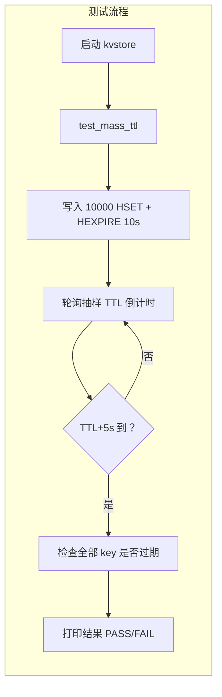

```bash
# 终端 1: 启动 kvstore
./kvstore kvstore.conf --role master

# 终端 2: 运行大量 TTL 测试
./tests/test_mass_ttl --config tests/test.conf

# 终端 3: 手动检查 TTL（可选）
redis-cli -p 5160 HTTL expire:k:000000
redis-cli -p 5160 HGET expire:k:000000
```

### 内存管理 — 三种后端

kvstore 支持三种内存后端，通过 `--mem` 参数切换。Custom 后端是自研的 **slab + mmap** 两级分配器，
专为键值存储场景设计——大量频繁分配的小块内存（key/value 字符串）通过 slab 管理，
超大块通过 mmap 直接映射。

| 后端         | 实现                         | 适用场景         |
| ------------ | ---------------------------- | ---------------- |
| **libc**     | `malloc()/free()`            | 开发调试         |
| **jemalloc** | `LD_PRELOAD` 加载            | 生产级，碎片少   |
| **custom**   | slab(≤1024B) + mmap(>1024B) | 研究学习，可观测 |

#### Custom 后端设计架构

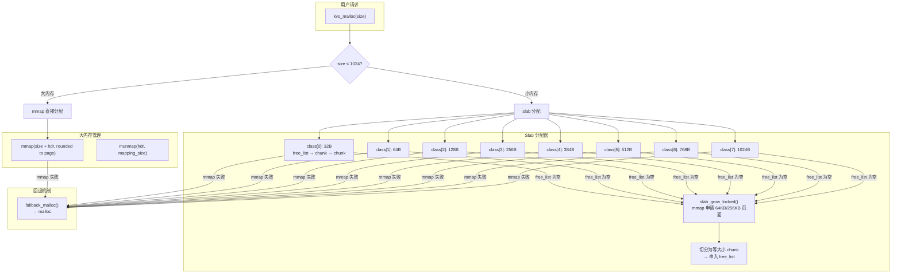

#### 三级分配器详解

**① Slab 小内存分配（≤1024B）**

每个 size class 维护一个 **free_list** 空闲链表和 **pages** 页面链表。

```
slab class 结构:
small_class_t
  ├── size: 32/64/128/256/384/512/768/1024
  ├── free_list: chunk → chunk → NULL        ← 空闲 chunk 链表
  ├── pages: page → page → NULL              ← mmap 申请的页面链表
  │   page: { mem, size, next }
  ├── total_chunks: 已切分的 chunk 总数
  ├── page_count: 页面数
  └── page_bytes: 页面总字节数
```

**分配流程**：

```c
static void *custom_malloc(size_t size) {
    if (size <= SMALL_MAX_SIZE) {                     // ≤1024B
        int idx = class_index_for(size);               // 找最小满足的 class
        if (idx < 0) return fallback_malloc(size);     // 找不到→回退

        pthread_mutex_lock(&g_mem.lock);

        if (!g_mem.classes[idx].free_list) {           // free_list 为空
            if (slab_grow_locked(idx) != 0) {          // mmap 申请新页面
                pthread_mutex_unlock(&g_mem.lock);
                return fallback_malloc(size);           // mmap 失败→回退 malloc
            }
        }

        small_chunk_t *chunk = g_mem.classes[idx].free_list;
        g_mem.classes[idx].free_list = chunk->next;    // 从 free_list 取下

        chunk->request_size = (uint32_t)size;           // 记录请求大小
        // 更新统计计数
        g_mem.small_alloc_calls++;
        g_mem.current_small_inuse += class_size;

        pthread_mutex_unlock(&g_mem.lock);
        return (void *)(chunk + 1);                     // 返回 chunk 的数据区
    }

    // >1024B: 走 mmap 大块分配
    // ...
}
```

**页面扩展（`slab_grow_locked`）**：

```c
static int slab_grow_locked(int class_idx) {
    size_t chunk_total = sizeof(small_chunk_t) + class_size;  // chunk 头 + 数据
    size_t page_size = 65536;                                  // 默认 64KB
    if (chunk_total > page_size / 2) page_size = 262144;       // 大 chunk 用 256KB
    int count = (int)(page_size / chunk_total);                // 每页切分的 chunk 数
    if (count < 16) count = 16;

    // mmap 匿名映射申请大块内存
    void *mem = mmap(NULL, alloc_size, PROT_READ | PROT_WRITE,
                     MAP_PRIVATE | MAP_ANONYMOUS, -1, 0);
    if (mem == MAP_FAILED) return -1;

    // 记录页面信息
    slab_page_t *page = malloc(sizeof(*page));
    page->mem = mem;
    page->size = alloc_size;
    page->next = g_mem.classes[class_idx].pages;
    g_mem.classes[class_idx].pages = page;

    // 将页面切分成等大小 chunk，串入 free_list
    unsigned char *p = (unsigned char *)mem;
    for (int i = 0; i < count; ++i) {
        small_chunk_t *chunk = (small_chunk_t *)(p + i * chunk_total);
        chunk->magic = CHUNK_MAGIC;           // 魔数校验
        chunk->class_idx = (uint16_t)class_idx;
        chunk->next = g_mem.classes[idx].free_list;  // 头插法
        g_mem.classes[idx].free_list = chunk;
    }
    return 0;
}
```

**回收流程**：

```c
static void custom_free(void *ptr) {
    small_chunk_t *chunk = ((small_chunk_t *)ptr) - 1;

    // 通过魔数判断来自哪个分配器
    if (chunk->magic == CHUNK_MAGIC) {                   // ← slab chunk
        chunk->next = g_mem.classes[idx].free_list;       // 归还到 free_list
        g_mem.classes[idx].free_list = chunk;
        // 更新统计
    } else if (hdr->magic == LARGE_MAGIC) {               // ← mmap 大块
        munmap(hdr, hdr->mapping_size);                   // 直接归还给 OS
    } else if (fhdr->magic == FALLBACK_MAGIC) {           // ← fallback malloc
        free(fhdr);                                        // 普通 free
    }
}
```

**② mmap 大内存分配（>1024B）**

超过 slab 上限的大块直接通过 mmap 分配，释放时 `munmap` 归还给操作系统：

```c
static void *custom_malloc(size_t size) {
    // ... 小内存路径 ...

    size_t total = sizeof(large_hdr_t) + size;    // 头 + 数据
    size_t pagesz = sysconf(_SC_PAGESIZE);        // 4KB
    size_t rounded = (total + pagesz - 1) / pagesz * pagesz;  // 按页对齐

    large_hdr_t *hdr = mmap(NULL, rounded,
        PROT_READ | PROT_WRITE,
        MAP_PRIVATE | MAP_ANONYMOUS, -1, 0);

    hdr->magic = LARGE_MAGIC;
    hdr->request_size = size;
    hdr->mapping_size = rounded;

    // 更新统计
    g_mem.large_alloc_calls++;
    g_mem.active_large_map_bytes += rounded;

    return (void *)(hdr + 1);                     // 返回数据区
}
```

**③ fallback 回退机制**

当 slab 的 mmap 申请失败（内存不足）时，回退到标准的 `malloc`：

```c
static void *fallback_malloc(size_t size) {
    fallback_hdr_t *hdr = malloc(sizeof(*hdr) + size);
    hdr->magic = FALLBACK_MAGIC;
    hdr->request_size = size;
    return (void *)(hdr + 1);
}
```

#### 四、三后端统一 API

所有后端通过同一组 API 对外暴露，上层代码无需关心后端实现：

```c
// include/kvstore/kvstore.h — 统一接口
void *kvs_malloc(size_t size);
void *kvs_calloc(size_t n, size_t size);
void *kvs_realloc(void *ptr, size_t size);
void  kvs_free(void *ptr);

// src/memory/kvs_mem.c — 后端分发
static void *backend_malloc(size_t size) {
    switch (g_mem.backend) {
        case KVS_MEM_CUSTOM:   return custom_malloc(size);
        case KVS_MEM_JEMALLOC:
        case KVS_MEM_LIBC:
        default:               return malloc(size);    // 透传 libc
    }
}
```

#### 统计与观测

`MEMSTAT` 命令暴露完整的分配统计，包括三级分配器的详细数据：

```
Custom 后端 MEMSTAT 示例:
  backend=custom
  alloc_calls=1562342
  free_calls=1562340
  small_alloc_calls=1550000
  large_alloc_calls=12342
  fallback_alloc_calls=0
  ──────────────────────────────
  current_small_inuse=45.2MB
  peak_small_inuse=48.1MB
  total_small_page_bytes=64.0MB    ← slab 实际占用的虚拟内存
  internal_fragment_bytes=1.2MB    ← slab 内部碎片（chunk 对齐浪费）
  page_utilization=70.6%           ← 页面利用率
  ──────────────────────────────
  class[0]:  32B   total=131072  free=1200  pages=1
  class[1]:  64B   total=65536   free=800   pages=1
  class[2]:  128B  total=32768   free=400   pages=1
  ...
```

各个统计字段的含义：

| 字段 | 含义 |
|---|---|
| `current_small_inuse` | slab 中正在使用的字节数（每个 chunk 算 class_size） |
| `peak_small_inuse` | 历史峰值 |
| `total_small_page_bytes` | slab 从 mmap 申请的总页面大小（包括空闲 chunk） |
| `internal_fragment_bytes` | 内部碎片 = 已分配字节 - 请求字节（对齐浪费） |
| `page_utilization` | 页面利用率 = current_small_inuse / total_small_page_bytes |
| `class[X] free` | 该 class 的空闲 chunk 数（越大说明该 size 使用率低） |

#### jemalloc 的自动加载

当选择 jemalloc 后端时，`kvs_mem_prepare_process()` 在 `main()` 初始化之前通过 `LD_PRELOAD` + `execvp` 重新加载进程：

```c
int kvs_mem_prepare_process(const char *backend_name, char *argv0, char **argv) {
    if (backend != KVS_MEM_JEMALLOC) return 0;

    // 查找 libjemalloc.so 路径
    const char *jemalloc_path = find_jemalloc_path();

    // 设置 LD_PRELOAD = libjemalloc.so
    setenv("LD_PRELOAD", preload, 1);

    // 重新 exec 自身，使 LD_PRELOAD 生效
    execvp(argv0, argv);
}
```

#### 测试验证

```bash
# libc 后端
./kvstore kvstore.conf --role master --mem libc
redis-cli -p 5160 MEMSTAT

# jemalloc（自动加载）
./kvstore kvstore.conf --role master --mem jemalloc
redis-cli -p 5160 MEMSTAT

# custom slab（自研分配器）
./kvstore kvstore.conf --role master --mem custom
redis-cli -p 5160 MEMSTAT  # 查看 slab class 详细统计
```

### TTL 过期时间记录 in AOF

写命令（SET/MSET/DEL/EXPIRE 等）会以原始 RESP 格式写入 AOF 文件：

```
*3\r\n$3\r\nSET\r\n$3\r\nkey\r\n$5\r\nvalue\r\n
*3\r\n$6\r\nEXPIRE\r\n$3\r\nkey\r\n$2\r\n10\r\n
```

恢复时重放 AOF，重新执行 EXPIRE 命令重建 TTL 堆。

### 自动化快照 (AutoSnapshot)

配置格式 `sec:changes,sec:changes,...`（如 `60:10,300:100`），支持多条规则：

```c
// 事件循环中检查
if (距离上次快照 ≥ sec && 自上次快照以来的写入次数 ≥ changes)
    persist_bgsave_start();  // fork 子进程执行 BGSAVE
```

- 规则通过 `--autosnap "60:1000,300:10"` 或 `SNAPRULE 60 1000` 命令设置
- `SNAPRULES` 查看当前规则，`SNAPRULECLEAR` 清除所有规则
- 每个规则独立计时

#### 测试验证

```bash
# 配置自动快照规则：60秒内 1000 次写入则触发 BGSAVE
redis-cli -p 5000 SNAPRULE 60 1000
redis-cli -p 5000 SNAPRULES        # 查看规则
redis-cli -p 5000 SNAPRULECLEAR    # 清除所有规则

# 手动触发 SAVE
redis-cli -p 5000 SAVE

# 手动触发 BGSAVE（非阻塞）
redis-cli -p 5000 BGSAVE
redis-cli -p 5000 INFO | grep bgsave  # 查看 BGSAVE 状态
```

### 哨兵模式

- 基础框架实现，支持 `SENTINEL` 系列命令
- 主节点故障检测：心跳超时检测（`sentinel_down_after_ms`）
- 故障转移待完善，当前主要作为框架研究

### 快速验证

```bash
make check        # 运行全部基础测试 (resp + ttl + persist + doc)
```

### C 测试程序 (`tests/`)

`tests/` 目录下包含独立的 C 测试程序，通过 RESP 协议连接 kvstore 进行自动化验证。

这些 C 测试程序**不依赖 hiredis 等第三方库**，直接通过 TCP socket 构造 RESP 协议报文，可在任何 Linux 环境下编译运行。

所有测试程序均支持 `--config <path>` 加载配置文件，免去每次输入冗长命令行的麻烦：

```bash
# 使用默认配置（自动加载 tests/test.conf）
./tests/test_repl_5w5w

# 或指定配置文件
./test_batch --config my_test.conf

# 命令行参数可覆盖配置文件
./test_batch --config tests/test.conf --port 6380 --count 50000
```

配置文件格式 (`tests/test.conf`):

```ini
# 通用连接
host=127.0.0.1
port=5200

# 主从复制地址
master_host=192.168.233.128
master_port=5160
slave_host=192.168.233.129
slave_port=5161

# 测试数据量
pre=50000
post=50000
count=10000

# 测试参数
batch=1000
poll_ms=500
ttl=10
```

编译方式：

```bash
# 通过 Makefile
make test_kvstore              # → ./test_kvstore
make test_repl_5w5w            # → tests/test_repl_5w5w
make test_persist_dump_demo    # → ./test_persist_dump_demo
make test_persist_aof_demo     # → ./test_persist_aof_demo
make test_uring_persist        # → ./test_uring_persist
make test_mmap_recover         # → ./test_mmap_recover
make test_repl_basic           # → ./test_repl_basic
make test_repl_gap             # → ./test_repl_gap
make test_mass_ttl             # → ./test_mass_ttl
make test_batch                # → ./test_batch

# 或手动编译
gcc -I./include -o test_kvstore tests/test_kvstore.c
```

---

#### `test_kvstore` — 全功能 C 客户端测试

```
编译: make test_kvstore           # → ./test_kvstore
运行: ./test_kvstore [--config tests/test.conf] [host port]
```

连接 kvstore 后依次测试 PING、各引擎 SET/GET/DEL、MSET/MGET、TTL/EXPIRE/PERSIST、
LOCK/UNLOCK/RENEW、DOC 命令、PING 批量流水线、SAVE/BGSAVE 持久化、INFO 命令，
最后输出 PASS/FAIL 汇总报告。

支持位置参数（向后兼容）和 `--config` / `--host` / `--port` 命名参数：

```bash
# 终端 1: 启动 kvstore（任意端口）
./kvstore kvstore.conf --role master

# 终端 2: 运行全功能测试（使用配置文件）
./test_kvstore --config tests/test.conf

# 或使用位置参数（向后兼容）
./test_kvstore 127.0.0.1 5160

# 或通过 Makefile 自动启动 + 测试
make check-kvstore TEST_PORT=5160
```

**验证**: 测试通过后，用 redis-cli 确认数据正确：

```bash
redis-cli -p 5160 PING
+PONG
redis-cli -p 5160 GET a:pre:1
"av:1"
redis-cli -p 5160 HGET h:pre:100
"hv:100"
redis-cli -p 5160 INFO
# 查看 role、mem、dirty 等信息
```

---

#### `test_repl_5w5w` — 5w+5w 主从同步测试

```
编译: make test_repl_5w5w          # → tests/test_repl_5w5w
运行: tests/test_repl_5w5w [选项]
```

测试流程：预存 5w 条数据到 Master → 监控 Slave 全量同步(RDMA) → 再写 5w 条增量 → 监控增量同步(kprobe+RDMA) → 验证 Slave 最终 10w 条数据一致性。

**启动顺序（重要）**: ① Master → ② 本脚本 → ③ Slave（看到"等待 Slave 连接"提示后再启动）

```bash
# ── 方式一: RDMA 全量 + kprobe+RDMA 增量（双虚拟机，需 root）──

# 终端 1 (VM1, 先启动 Master):
sudo rm -f kvstore_transport.log kvstore.aof
sudo ./kvstore kvstore.conf --role master

# 终端 2 (任意机器, Master 启动后运行):
./tests/test_repl_5w5w --config tests/test.conf

# 终端 3 (VM2, 看到"等待 Slave 连接..."后再启动 Slave):
sudo rm -f kvstore.dump kvstore.aof
sudo ./kvstore kvstore.conf --role slave

# ── 方式二: TCP 全量 + TCP 增量（单机，无需 root）──

# 终端 1 (先启动 Master):
./kvstore --port 5160 --role master \
    --repl-fullsync-transport tcp --repl-realtime-transport tcp

# 终端 2 (Master 启动后运行):
./tests/test_repl_5w5w --config tests/test.conf

# 终端 3 (看到提示后再启动 Slave):
rm -f kvstore.dump kvstore.aof
./kvstore --port 5161 --role slave \
    --master-host 127.0.0.1 --master-port 5160 \
    --repl-fullsync-transport tcp --repl-realtime-transport tcp
```

选项说明：


| 选项                 | 默认值    | 说明                 |
| -------------------- | --------- | -------------------- |
| `--master-host HOST` | 127.0.0.1 | Master 地址          |
| `--master-port PORT` | 5160      | Master 端口          |
| `--slave-host HOST`  | 127.0.0.1 | Slave 地址           |
| `--slave-port PORT`  | 5161      | Slave 端口           |
| `--pre COUNT`        | 50000     | 全量同步前预存数据量 |
| `--post COUNT`       | 50000     | 全量同步后增量数据量 |
| `--batch SIZE`       | 1000      | 每批写入量           |
| `--poll MS`          | 500       | 轮询间隔毫秒         |

**kprobe+RDMA 验证**: 测试 Phase 5.5 自动通过 `INFO` 命令检查以下字段确认 kprobe+RDMA 路径是否生效：


| INFO 字段               | 预期 | 含义                                    |
| ----------------------- | ---- | --------------------------------------- |
| `kprobe_initialized`    | 1    | BPF 程序已加载并 attach 到`tcp_sendmsg` |
| `kprobe_rdma_connected` | 1    | RDMA QP 已建立连接                      |
| `kprobe_rdma_writes`    | > 0  | RDMA WRITE 成功次数                     |
| `kprobe_rdma_errors`    | 0    | RDMA WRITE 错误次数                     |

如果 `kprobe_rdma_writes > 0` 且 `errors == 0`，说明增量数据确实经过了 **kprobe → ringbuf → RDMA WRITE** 路径，而非仅走 TCP 保底。

**验证**: 测试通过后，确认主从数据一致：

```bash
# 在 Master 上查询
redis-cli -p 5160 HGET pre:k:000000
"v0"
redis-cli -p 5160 HGET post:k:000000
"v50000"

# 在 Slave 上查询（结果应与 Master 完全一致）
redis-cli -p 5161 HGET pre:k:000000
"v0"
redis-cli -p 5161 HGET post:k:000000
"v50000"
```

---

#### `test_persist_dump_demo` — 全量持久化演示

```
编译: make test_persist_dump_demo    # → ./test_persist_dump_demo
运行: ./test_persist_dump_demo [--config tests/test.conf]
```

交互式流程：连接 kvstore → 写入 count 条数据 → 提示用户执行 `SAVE` → 提示用户停止并重启 kvstore → 自动验证数据从 dump 文件恢复。

```bash
# 终端 1: 启动 kvstore（默认 appendfsync=always 确保数据可恢复）
./kvstore kvstore.conf --role master

# 终端 2: 运行全量持久化演示
./test_persist_dump_demo --config tests/test.conf

# 程序会写入数据，然后提示你:
#   >>> Please execute SAVE in kvstore (redis-cli SAVE or nc ...)
# 在终端 1 执行 SAVE 后，程序继续提示:
#   >>> Please stop kvstore (Ctrl+C) and restart it
# 停止并重启 kvstore，程序自动检测重连并验证数据恢复
```

**验证**: SAVE 后、重启前，用 redis-cli 确认数据已持久化：

```bash
redis-cli -p 5160 SAVE
+OK
redis-cli -p 5160 HGET bench:key:1
"value:1"
redis-cli -p 5160 HGET bench:key:50000
"value:50000"
```

选项说明：


| 选项          | 默认值    | 说明         |
| ------------- | --------- | ------------ |
| `--host HOST` | 127.0.0.1 | kvstore 地址 |
| `--port PORT` | 5170      | kvstore 端口 |
| `--count N`   | 50000     | 写入数据量   |
| `--batch N`   | 1000      | 每批写入量   |

---

#### `test_persist_aof_demo` — 增量持久化演示 (AOF)

```
编译: make test_persist_aof_demo     # → ./test_persist_aof_demo
运行: ./test_persist_aof_demo [选项]
```

交互式流程：连接 kvstore → 写入 count 条数据（**不执行 SAVE**）→ 提示用户停止并重启 kvstore → 自动验证数据从 AOF 文件恢复。

> **重要**: kvstore 必须使用 `--appendfsync always`，确保每条写入即时落盘。
> 使用 `--appendfsync everysec` 时，停止前需等最多 1 秒落盘，可能导致数据丢失。

```bash
# 终端 1: 启动 kvstore（默认 appendfsync=always）
./kvstore kvstore.conf --role master

# 终端 2: 运行增量持久化演示
./test_persist_aof_demo --config tests/test.conf

# 程序写入数据后提示:
#   >>> Please stop kvstore (Ctrl+C) and restart it
# 停止并重启 kvstore，程序自动验证 AOF 恢复（注意: 不执行 SAVE，数据仅靠 AOF）
```

**验证**: AOF 恢复后，确认重启前后的数据一致：

```bash
# 重启前验证
redis-cli -p 5170 HGET bench:key:1
"value:1"
redis-cli -p 5170 HGET bench:key:50000
"value:50000"

# 停止并重启 kvstore 后，再次验证（数据应仍在）
redis-cli -p 5170 HGET bench:key:1
"value:1"
redis-cli -p 5170 HGET bench:key:50000
"value:50000"
redis-cli -p 5170 PING
+PONG
```

选项说明：


| 选项          | 默认值    | 说明         |
| ------------- | --------- | ------------ |
| `--host HOST` | 127.0.0.1 | kvstore 地址 |
| `--port PORT` | 5170      | kvstore 端口 |
| `--count N`   | 50000     | 写入数据量   |
| `--batch N`   | 1000      | 每批写入量   |

---

#### `test_uring_persist` — io_uring 持久化验证

```
编译: make test_uring_persist       # → ./test_uring_persist
运行: ./test_uring_persist [选项]
```

自动管理 kvstore 进程生命周期，测试 io_uring 写入路径的持久化正确性与性能。

流程：自动启动 kvstore → HSET 写入 N 条数据 → SAVE → 停止 kvstore → 重启 → 验证数据恢复 → 输出性能指标。

```bash
# 终端 1: 启动 kvstore
./kvstore kvstore.conf --role master

# 终端 2: 运行测试
./test_uring_persist --config tests/test.conf

# 程序写入数据后提示:
#   >>> 请停止 kvstore (Ctrl+C) 并重新启动 (相同参数)
# 停止并重启 kvstore，程序自动验证数据恢复
```

**验证**: 测试完成后，用 redis-cli 手动确认：

```bash
redis-cli -p 5180 HGET uring:key:1
"value:1"
redis-cli -p 5180 HGET uring:key:5000
"value:5000"
redis-cli -p 5180 HGET uring:key:10000
"value:10000"
redis-cli -p 5180 INFO | grep mem
# 查看内存后端和统计信息
```

选项说明：


| 选项          | 默认值    | 说明         |
| ------------- | --------- | ------------ |
| `--host HOST` | 127.0.0.1 | kvstore 地址 |
| `--port PORT` | 5180      | kvstore 端口 |
| `--count N`   | 10000     | 写入数据量   |
| `--batch N`   | 1000      | 每批写入量   |

---

#### `test_mass_ttl` — 大量数据到期测试

```
编译: make test_mass_ttl             # → tests/test_mass_ttl
运行: tests/test_mass_ttl [选项]
```

设置 10000 个 key 并设置 10 秒过期时间，轮询抽样检查 TTL 状态，
验证 kvstore 在海量 TTL key 下的过期扫描正确性。

> **注意**: 本测试使用 `HSET`/`HEXPIRE`（HASH 引擎），因为默认 ARRAY 引擎
> (`KVS_ARRAY_SIZE=1024`) 最多只能存 1024 个 key。HASH 引擎使用链地址法，
> 无此限制。

```bash
# 终端 1: 启动 kvstore
./kvstore --port 5200 --role master

# 终端 2: 运行测试
./test_mass_ttl --port 5200 --count 10000 --ttl 10

# 终端 3: 手动检查 TTL（可选）
redis-cli -p 5200 HTTL expire:k:000000
redis-cli -p 5200 HGET expire:k:000000   # 10s 后应返回 nil
```

选项说明：


| 选项          | 默认值    | 说明         |
| ------------- | --------- | ------------ |
| `--host HOST` | 127.0.0.1 | kvstore 地址 |
| `--port PORT` | 5200      | kvstore 端口 |
| `--count N`   | 10000     | 设置 key 数  |
| `--ttl SEC`   | 10        | 过期时间(秒) |
| `--batch N`   | 1000      | 每批写入量   |

---

#### `test_mmap_recover` — mmap 恢复验证

```
编译: make test_mmap_recover        # → ./test_mmap_recover
运行: ./test_mmap_recover [选项]
```

自动管理 kvstore 进程生命周期，验证启动时通过 mmap 恢复 dump 文件的正确性与性能。
支持指定存储引擎（array/hash/rbtree/skiptable）。

流程：自动启动 kvstore → 按指定引擎写入 N 条数据 → SAVE → 停止 → 重启并计时 → 从 INFO 读取恢复统计（mmap 尝试次数/成功次数/回退次数/耗时）→ 验证数据一致性。

```bash
# 终端 1: 启动 kvstore
./kvstore kvstore.conf --role master

# 终端 2: 运行测试（hash 引擎, 10000 条）
./test_mmap_recover --config tests/test.conf --engine hash

# 程序写入数据后提示:
#   >>> 请停止 kvstore (Ctrl+C) 并重新启动 (相同参数)
# 停止并重启 kvstore，程序自动验证数据恢复并显示 mmap 统计

# 使用其他引擎
./test_mmap_recover --config tests/test.conf --engine rbtree
./test_mmap_recover --config tests/test.conf --engine array
```

**验证**: 测试完成后，确认各引擎数据恢复正确：

```bash
# Hash 引擎（--engine hash）
redis-cli -p 5190 HGET mmap:key:10000
"value:10000"
redis-cli -p 5190 HGET mmap:key:1
"value:1"

# RBTREE 引擎（--engine rbtree）
redis-cli -p 5190 RGET mmap:key:5000
"value:5000"

# Skiptable 引擎（--engine skiptable）
redis-cli -p 5190 XGET mmap:key:5000
"value:5000"

# Array 引擎（--engine array，上限 1024）
redis-cli -p 5190 GET mmap:key:1024
"value:1024"
```

选项说明：


| 选项            | 默认值    | 说明                              |
| --------------- | --------- | --------------------------------- |
| `--host HOST`   | 127.0.0.1 | kvstore 地址                      |
| `--port PORT`   | 5190      | kvstore 端口                      |
| `--count N`     | 10000     | 写入数据量（array 引擎上限 1024） |
| `--engine NAME` | hash      | 引擎: array/hash/rbtree/skiptable |
| `--batch N`     | 1000      | 每批写入量                        |

---

#### `test_repl_basic` — 主从复制基本验证

```
编译: make test_repl_basic          # → ./test_repl_basic
运行: ./test_repl_basic [选项]
```

用户手动管理 Master/Slave 进程，程序负责写入、监控、验证。

流程：用户启动 Master → 程序跨引擎（Hash/Array/RBTREE/Skiptable）写入 N 条数据 → 提示用户启动 Slave → 等待全量同步完成 → 再写入增量数据 → 等待增量同步 → 验证各引擎数据一致性。

```bash
# ── 单机三终端模式 ──

# 终端 1: 启动 Master（先启动）
./kvstore --port 6379 --role master \
    --repl-fullsync-transport tcp --repl-realtime-transport tcp

# 终端 2: 运行测试（Master 启动后运行）
./test_repl_basic --master-port 6379 --slave-port 6380 --count 5000

# 程序会写入数据到 Master，然后提示启动 Slave:
#   >>> 请在另一个终端启动 Slave: ...
# 此时在终端 3 启动 Slave:

# 终端 3: 启动 Slave（看到提示后再启动）
# 先清理旧数据文件，避免上次测试残留影响
rm -f kvstore.dump kvstore.aof
./kvstore --port 6380 --role slave \
    --master-host 127.0.0.1 --master-port 6379 \
    --repl-fullsync-transport tcp --repl-realtime-transport tcp


# ── 双机部署（跨机器测试）──

# 终端 1 (VM1, 先启动 Master):
./kvstore --port 6380 --role master \
    --repl-fullsync-transport tcp --repl-realtime-transport tcp

# 终端 2 (本地, Master 启动后运行):
./test_repl_basic --master-host 192.168.233.128 --master-port 6380 \
    --slave-host 192.168.233.129 --slave-port 6381 \
    --count 5000

# 终端 3 (VM2, 看到提示后再启动 Slave):
# 先清理旧数据文件，避免上次测试残留影响
rm -f kvstore.dump kvstore.aof
./kvstore --port 6381 --role slave \
    --master-host 192.168.233.128 --master-port 6380 \
    --repl-fullsync-transport tcp --repl-realtime-transport tcp
```

**验证**: 测试通过后，用 redis-cli 确认主从数据完全一致：

```bash
# 在 Master 上查询
redis-cli -p 6380 HGET h:pre:5000
"hv:5000"
redis-cli -p 6380 HGET h:pre:50
"hv:50"
redis-cli -p 6380 HGET h:post:891
"hv_post:891"
redis-cli -p 6380 HGET h:post:1232
(nil)                       # 只写了 1000 条增量(post)，1232 不存在正常
redis-cli -p 6380 GET a:pre:1
"av:1"
redis-cli -p 6380 RGET r:pre:500
"rv:500"
redis-cli -p 6380 XGET x:pre:999
"xv:999"

# 在 Slave 上查询（结果必须与 Master 完全一致）
redis-cli -p 6381 HGET h:pre:5000
"hv:5000"
redis-cli -p 6381 HGET h:pre:50
"hv:50"
redis-cli -p 6381 HGET h:post:891
"hv_post:891"
redis-cli -p 6381 GET a:pre:1
"av:1"
redis-cli -p 6381 RGET r:pre:500
"rv:500"
redis-cli -p 6381 XGET x:pre:999
"xv:999"

# 检查 Slave 只读（写操作应被拒绝）
redis-cli -p 6381 SET should_fail x
-ERR read only slave
```

两种验证方法：

- **全量同步验证**: 查询 `h:pre:*`（预存 5000 条）— 确认 Slave 有全部预存数据
- **增量同步验证**: 查询 `h:post:*`（全量完成后写入 1000 条）— 确认增量数据也同步到了 Slave
- **跨引擎验证**: 分别用 `GET`/`HGET`/`RGET`/`XGET` 确认 Array/Hash/RBTREE/Skiptable 四个引擎的数据都一致

选项说明：


| 选项                 | 默认值    | 说明            |
| -------------------- | --------- | --------------- |
| `--master-host HOST` | 127.0.0.1 | Master 地址     |
| `--slave-host HOST`  | 127.0.0.1 | Slave 地址      |
| `--master-port PORT` | 6379      | Master 端口     |
| `--slave-port PORT`  | 6380      | Slave 端口      |
| `--count N`          | 5000      | 预存/增量数据量 |
| `--batch N`          | 500       | 每批写入量      |
| `--poll MS`          | 500       | 轮询间隔毫秒    |

---

#### `test_repl_gap` — 全量同步 Gap 补发验证

```
编译: make test_repl_gap          # → ./test_repl_gap
运行: ./test_repl_gap [选项]
```

验证全量同步期间客户端写入 Master 的数据（gap）在全量同步完成后正确补发到 Slave。

**测试原理**：

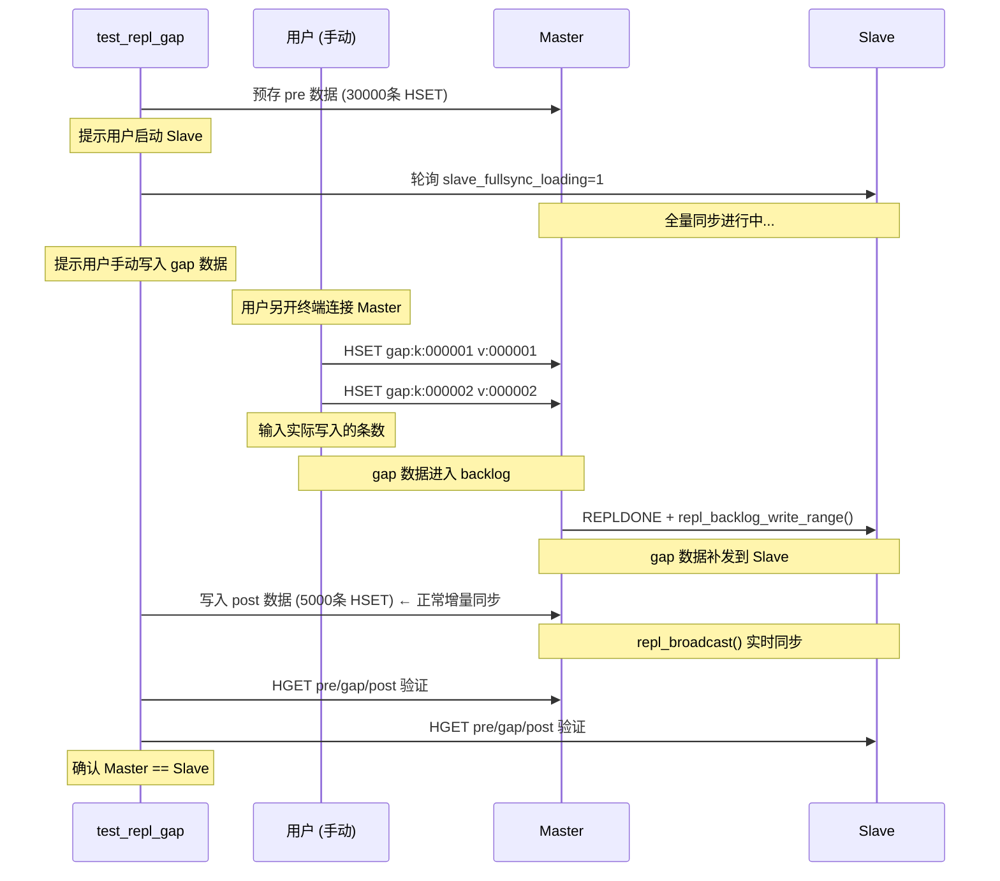

```bash
# ── 双机四终端测试（推荐）──

# 终端 1 (Master 机器 192.168.233.128): 先启动 Master
./kvstore kvstore.conf --role master --aof-disable

# 终端 2 (任意机器): 运行测试
./tests/test_repl_gap --config tests/test.conf

# 看到提示后，在终端 3 (Slave 机器 192.168.233.129): 启动 Slave
./kvstore kvstore.conf --role slave --aof-disable

# 看到全量同步开始提示后，在终端 4 手动写入任意 gap 数据:
redis-cli -p 5160 -h 192.168.233.128 HSET gap:mykey myvalue
# 写入完成后，回到终端 2，按 Enter 继续
```

三阶段验证确保数据不丢失：

| 阶段 | 数据 | 写入者 | 写入时机 | 同步机制 | 验证点 |
|---|---|---|---|---|---|
| Phase 1 | `pre:k:001~030000` | 测试程序 | 全量同步前 | 全量快照 `+FULLRESYNC` | Slave 有全部 pre |
| **Phase 2** | `gap:k:001~005000` | **用户手动** | **全量同步期间** | **backlog gap 补发** | **Slave 有全部 gap** |
| Phase 3 | `post:k:001~005000` | 测试程序 | 全量同步后 | 实时 `repl_broadcast()` | Slave 有全部 post |

**选项说明**：

| 选项                 | 默认值    | 说明                |
| -------------------- | --------- | ------------------- |
| `--master-host HOST` | 127.0.0.1 | Master 地址         |
| `--slave-host HOST`  | 127.0.0.1 | Slave 地址          |
| `--master-port PORT` | 6379      | Master 端口         |
| `--slave-port PORT`  | 6380      | Slave 端口          |
| `--pre-count N`      | 30000     | 预存数据量（全量）  |
| `--gap-count N`      | 0         | gap 数据量（全量同步期间手动写入后输入） |
| `--post-count N`     | 5000      | 增量数据量          |
| `--batch N`          | 1000      | 每批写入量          |
| `--poll-ms N`        | 500       | 轮询间隔毫秒        |

---

#### 辅助文件


| 文件           | 说明                                                                                                                                       |
| -------------- | ------------------------------------------------------------------------------------------------------------------------------------------ |
| **testcase.c** | 测试框架工具库，提供`send_msg()` / `recv_msg()` / `testcase()` / `connect_tcpserver()` 等 RESP 协议测试辅助函数，作为其他 C 测试的依赖引用 |
| **test.c**     | （空文件，预留）                                                                                                                           |

### 全部测试目标


| 命令                                 | 数据量        | 说明                                                                                                            | 产物路径                            |
| ------------------------------------ | ------------- | --------------------------------------------------------------------------------------------------------------- | ----------------------------------- |
| `make check-all`                     | 全部          | **一键运行全部测试**（自动探测 RDMA/eBPF 环境，跳过不可用项）                                                   | —                                  |
| `make check-all-quick`               | 小+1w         | 快速全套（跳过 RDMA/eBPF/复制/10w demo）                                                                        | —                                  |
| `make check`                         | 小            | 基础功能全套                                                                                                    | —                                  |
| `make check-resp`                    | —            | RESP 协议测试                                                                                                   | —                                  |
| `make check-ttl`                     | —            | TTL 过期测试                                                                                                    | —                                  |
| `make check-persist`                 | —            | 持久化基本测试                                                                                                  | —                                  |
| `make check-doc`                     | —            | 文档对象测试                                                                                                    | —                                  |
| `make check-kvstore`                 | 小            | C 客户端综合测试（`tests/test_kvstore.c`）                                                                      | —                                  |
| `make check-bulk-1w`                 | **1w**        | 批量 1w 级全套回归（HSET/HGET/TTL/SAVE+恢复/DOC）                                                               | —                                  |
| `make check-10w`                     | **1w~**       | 10w 级大容量功能测试                                                                                            | —                                  |
| `make check-mass-ttl`                | 1w            | 海量 TTL 压测                                                                                                   | —                                  |
| `make check-uring-persist`           | 1w            | io_uring 持久化验证（Python 脚本）                                                                              | `artifacts/persist/uring-bench/`    |
| `make check-uring-persist-c`         | 1w            | io_uring 持久化验证（C 程序，自动管理进程）                                                                     | `artifacts/persist/uring-bench/`    |
| `make check-mmap-recover`            | 1w            | mmap 恢复验证（Python 脚本）                                                                                    | `artifacts/persist/mmap-recover/`   |
| `make check-mmap-recover-c`          | 1w            | mmap 恢复验证（C 程序，支持指定引擎，自动管理进程）                                                             | `artifacts/persist/mmap-recover/`   |
| `make check-repl`                    | 5k            | 主从复制基本验证（shell 脚本）                                                                                  | —                                  |
| `make check-repl-basic`              | 5k            | 主从复制基本验证（C 程序，自动管理 Master/Slave 进程）                                                          | —                                  |
| `make check-repl-gap`                | 3k+手动+1k     | 全量同步 gap 补发验证（C 程序，gap 数据由用户手动写入）                                                          | —                                  |
| `make test_repl_5w5w`<br>（仅编译）  | **5w+5w**     | 5w+5w 主从同步 C 测试（`tests/test_repl_5w5w.c`）<br>编译后手动运行：`tests/test_repl_5w5w --master-host H ...` | —                                  |
| `make check-repl-metrics`            | 5w+5k         | 复制指标基线                                                                                                    | `artifacts/repl/metrics/`           |
| `make check-repl-profile`            | 5w+5k         | 复制 profiling                                                                                                  | `artifacts/repl/profile/`           |
| `make check-repl-ebpf`               | 5w+5k         | eBPF 实时同步 profiling                                                                                         | `artifacts/repl/profile/`           |
| `make check-repl-ebpf-env`           | —            | eBPF 环境探测                                                                                                   | —                                  |
| `make check-repl-ebpf-sync`          | 64            | eBPF sockmap 同步验证                                                                                           | `artifacts/repl/ebpf-sync/`         |
| `make check-repl-ebpf-sync-required` | 64            | eBPF 同步验证（要求 eBPF 可用）                                                                                 | `artifacts/repl/ebpf-sync/`         |
| `make check-repl-ebpf-redirect`      | 64            | eBPF ingress 重定向验证                                                                                         | `artifacts/repl/ebpf-sync/`         |
| `make check-repl-rdma-unsupported`   | 小            | RDMA 不可用时的优雅降级测试                                                                                     | —                                  |
| `make check-repl-rdma-smoke`         | 小            | RDMA 冒烟测试                                                                                                   | `artifacts/repl/rdma-smoke/`        |
| `make check-repl-rdma-stress`        | 中            | RDMA 压力测试（重启轮次 + 尾写验证）                                                                            | `artifacts/repl/rdma-stress/`       |
| `make check-repl-rdma-soak`          | 中            | RDMA 长时浸泡（可配小时级）                                                                                     | `artifacts/repl/rdma-stress/`       |
| `make check-repl-rdma-long-soak`     | 中            | RDMA 超长浸泡（默认 1800s）                                                                                     | `artifacts/repl/rdma-stress/`       |
| `make check-repl-rdma-fallback`      | 小            | RDMA 强制降级到 TCP 验证                                                                                        | —                                  |
| `make check-demo-full-dump`          | **10w**       | 全量持久化演示                                                                                                  | `artifacts/persist/full-dump-demo/` |
| `make check-demo-incr-aof`           | **10w**       | 增量持久化演示                                                                                                  | `artifacts/persist/incr-aof-demo/`  |
| `make check-demo-repl-sync`          | **5w+5w=10w** | 主从同步演示（可配 RDMA+eBPF 混合传输）                                                                         | `artifacts/repl/sync-demo/`         |
| `make check-rdma-standalone-probe`   | —            | RDMA 环境探测                                                                                                   | `artifacts/rdma/probe/`             |
| `make check-rdma-pingpong-smoke`     | —            | RDMA pingpong 测试                                                                                              | `artifacts/rdma/pingpong/`          |

> **注意**：若之前使用 `sudo make check-demo-repl-sync` 运行过，`artifacts/repl/sync-demo/` 下的文件属主为 root，再次运行时需先 `sudo rm -rf artifacts/repl/sync-demo` 清理，否则会报 `PermissionError`。

### 辅助测试脚本（非 Makefile 目标）

以下脚本位于 `tools/` 目录下，可直接运行，未绑定 Makefile 目标：


| 脚本                                   | 位置             | 说明                                         |
| -------------------------------------- | ---------------- | -------------------------------------------- |
| `test_master_slave_multi_engine_nc.sh` | `tools/tests/`   | 多引擎主从复制 nc 测试（手动指定 host/port） |
| `test_kv.sh`                           | `tools/tests/`   | kvstore 基本功能测试                         |
| `run_save_bgsave_perf_test.sh`         | `tools/persist/` | SAVE/BGSAVE 性能测试                         |
| `repl_ebpf_session.py`                 | `tools/repl/`    | eBPF 复制会话管理（交互式调试）              |
| `run_repl_rdma_unsupported.py`         | `tools/repl/`    | RDMA 不可用场景模拟测试                      |
| `repl_ebpf_daemon.c`                   | `tools/ebpf/`    | eBPF 独立守护进程（需编译）                  |

示例：

```bash
# 多引擎主从测试
bash tools/tests/test_master_slave_multi_engine_nc.sh 127.0.0.1 5160

# SAVE/BGSAVE 性能测试
bash tools/persist/run_save_bgsave_perf_test.sh
```

### 参数化运行

```bash
# 指定端口
make check TEST_PORT=5160

# 主从复制自定义端口
make check-repl REPL_MASTER_PORT=7000 REPL_SLAVE_PORT=7001

# 10w 级测试自定义数据量
make check-10w CHECK_10W_COUNT=50000

# 海量 TTL 自定义规模
make check-mass-ttl MASS_TTL_KEYS=5000 MASS_TTL_SECONDS=2

# io_uring 持久化自定义参数
make check-uring-persist URING_PERSIST_COUNT=5000 URING_PERSIST_APPEND_FSYNC=everysec

# mmap 恢复指定引擎
make check-mmap-recover MMAP_RECOVER_ENGINE=hash MMAP_RECOVER_COUNT=20000

# 批量 1w 级回归自定义规模
make check-bulk-1w BULK_COUNT=50000

# eBPF 同步测试
make check-repl-ebpf-sync REPL_EBPF_SYNC_COUNT=128

# RDMA 压力测试自定义参数
make check-repl-rdma-stress REPL_RDMA_STRESS_PRELOAD=256 REPL_RDMA_STRESS_TAIL_WRITES=64 REPL_RDMA_STRESS_RESTART_ROUNDS=5

# RDMA 浸泡测试自定义时长
make check-repl-rdma-soak REPL_RDMA_SOAK_SECONDS=300 REPL_RDMA_SOAK_WRITE_INTERVAL_MS=100

# RDMA 长浸泡（30 分钟）
make check-repl-rdma-long-soak

# RDMA 可调参数测试（recv slots / chunk size / QP depth）
make check-repl-rdma-stress REPL_RDMA_TUNABLE_RECV_SLOTS=64 REPL_RDMA_TUNABLE_CHUNK_SIZE=65536 REPL_RDMA_TUNABLE_QP_WR_DEPTH=128

# RDMA 强制降级验证
make check-repl-rdma-fallback REPL_RDMA_FORCE_FALLBACK=1

# 全量同步演示自定义传输方式
make check-demo-repl-sync REPL_SYNC_DEMO_FULLSYNC=rdma REPL_SYNC_DEMO_REALTIME=ebpf

# 一键运行全部测试
make check-all

# 快速全套（跳过 RDMA/eBPF/复制/demo）
make check-all-quick

# 只跑特定目标
python3 tools/tests/run_all_tests.py --only check,check-bulk-1w,check-mass-ttl
```

---

## 测试产物路径

所有测试脚本的输出统一存放在 `artifacts/` 目录下，按测试类型分子目录。


| 测试场景               | 产物目录                            | 典型内容                          |
| ---------------------- | ----------------------------------- | --------------------------------- |
| 全量持久化 10w 演示    | `artifacts/persist/full-dump-demo/` | dump 文件、验证日志               |
| 增量持久化 10w 演示    | `artifacts/persist/incr-aof-demo/`  | AOF 文件、验证日志                |
| io_uring 持久化验证    | `artifacts/persist/uring-bench/`    | 耗时报告、恢复日志                |
| mmap 恢复验证          | `artifacts/persist/mmap-recover/`   | 恢复时间报告                      |
| 复制指标基线           | `artifacts/repl/metrics/`           | INFO 快照、CPU/RSS 摘要           |
| 复制 profiling         | `artifacts/repl/profile/`           | perf 数据、调用栈                 |
| 主从同步 10w 演示      | `artifacts/repl/sync-demo/`         | 同步一致性报告                    |
| eBPF 同步测试          | `artifacts/repl/ebpf-sync/`         | eBPF 日志、验证报告               |
| eBPF 同步测试(ingress) | `artifacts/repl/ebpf-sync/`         | ingress 重定向验证报告            |
| RDMA 冒烟测试          | `artifacts/repl/rdma-smoke/`        | RDMA 全量同步状态报告             |
| RDMA 压力/浸泡测试     | `artifacts/repl/rdma-stress/`       | 状态报告、fullsync 日志、重启日志 |
| RDMA 手动测试          | `artifacts/repl/rdma-manual/`       | 手动 RDMA 测试日志                |
| RDMA 环境探测          | `artifacts/rdma/probe/`             | 环境可用性报告                    |
| RDMA pingpong          | `artifacts/rdma/pingpong/`          | 延迟/吞吐报告                     |
| 基准测试               | `artifacts/bench/`                  | CSV 数据、图表                    |

> 此外，`testdata/` 存放手工编写的静态测试数据（样例 AOF、dump 文件、测试用配置文件），不会被脚本覆盖。

---

## 性能基准

> **测试环境**：Intel Core Ultra 7 155H (4 vCPU) / 7.7GiB RAM / Ubuntu 20.04.6 / Linux 5.15.0-139 / KVM 虚拟机
>
> **测试方法**：`python3 tools/bench/bench_mem_backend.py`，每轮 200 次预热，`HSET` 命令写入

### 基准数据 (HSET, 50k~100k ops)


| 后端     | ops    | value 大小 | 耗时(s) | QPS  | VmRSS(KB) |
| -------- | ------ | ---------- | ------- | ---- | --------- |
| libc     | 50000  | 128B       | 25.66   | 1949 | 16716     |
| jemalloc | 50000  | 128B       | 25.27   | 1978 | 20208     |
| custom   | 50000  | 128B       | 25.90   | 1931 | 26080     |
| libc     | 50000  | 4KB        | 29.07   | 1720 | 211332    |
| jemalloc | 50000  | 4KB        | 28.30   | 1767 | 264920    |
| custom   | 50000  | 4KB        | 29.67   | 1685 | 413856    |
| libc     | 100000 | 128B       | 50.95   | 1963 | 28416     |
| jemalloc | 100000 | 128B       | 50.79   | 1969 | 32524     |
| custom   | 100000 | 128B       | 51.78   | 1931 | 46792     |

> 完整数据：`benchmarks/data/bench_fresh.csv`

### 持久化性能基准

> **测试环境**：Intel Core Ultra 7 155H (4 vCPU) / 7.7GiB RAM / Ubuntu 20.04.6 / Linux 5.15.0-139 / KVM 虚拟机
>
> **测试工具**：`redis-benchmark -t set -n 100000 -c 50 -d 64` (AOF 对比) / `redis-cli --pipe` + `SAVE` (SAVE 测试)
>
> **测试脚本**：`tools/bench/run_persist_bench.sh`

#### AOF 性能对比

##### 测试目的

评估 kvstore 的 AOF 持久化在不同 fsync 策略下的性能开销，与 Redis 同策略对比，衡量 io_uring 异步 I/O 对 AOF 写入的性能提升。

##### 测试方法

1. 分别启动 kvstore 和 Redis 服务器，使用 `--appendfsync always`（每条命令 fsync）和 `--appendfsync everysec`（每秒 fsync）两种策略
2. 客户端使用 `redis-benchmark -t set -n 100000 -c 50 -d 64`（100k 次 SET，50 并发，64 字节 value）
3. 每个配置测试前重启服务器，清理上一次的 AOF/dump 文件，确保测试环境干净
4. 记录 `redis-benchmark --csv` 输出的 QPS

```bash
# 测试命令示例
redis-benchmark -p 5190 -t set -n 100000 -c 50 -d 64 --csv

# kvstore 启动示例（always）
./kvstore kvstore.conf --role master

# Redis 启动示例（everysec）
redis-server --port 6390 --save "" --appendonly yes --appendfsync everysec
```

##### 测试结果

| 配置 | QPS | 相对 Redis 无 AOF | 相对 Redis 同策略 |
|---|---|---|---|
| **kvstore** AOF 关闭（`--aof-disable`） | **137,174** | **+11.3%** | — |
| **kvstore** AOF always（每条命令 fsync） | 134,953 | +9.4% | +190%（vs Redis always） |
| **kvstore** AOF everysec（每秒 fsync） | 135,318 | +9.7% | — |
| **Redis** AOF everysec | 133,690 | +8.4% | 基准（同策略） |
| **Redis** 无 AOF（基准） | 123,305 | — | — |
| **Redis** AOF always | 46,468 | -62.3% | 基准（同策略） |

##### 结果分析

**① kvstore 的 AOF always 为什么接近 Redis 的 AOF everysec？**

kvstore 的 AOF 写入路径使用 **io_uring 异步提交**，写操作不阻塞事件循环：

```c
// kvstore 的 AOF always 路径
persist_append_raw(buf, len);
  ├─ persist_write_fd_best_effort()     // io_uring 异步 write
  │    └─ io_uring_get_sqe() → prep_write() → submit_and_wait()
  └─ persist_force_aof_flush()          // io_uring 异步 fsync
       └─ persist_fsync_fd_best_effort()
            └─ io_uring_get_sqe() → prep_fsync() → submit_and_wait()
```

虽然名为 "always"，但 io_uring 的 `submit_and_wait()` 可以将 write 和 fsync 批量提交给内核，
内核在后台执行 fsync 时用户线程可以继续处理下一个请求。所以 kvstore 的 always 策略实际开销接近 everysec。

**② Redis 的 AOF always 为什么慢 62%？**

Redis 的 AOF always 使用**同步 `fsync()` 系统调用**，每条命令后阻塞等待磁盘写入完成：

```
Redis AOF always 路径：
  write(aof_fd, buf, len)          // 写入内核页缓存（快）
  fsync(aof_fd)                    // 阻塞等待刷盘（慢！）
                                   // 事件循环被阻塞，无法处理其他请求
```

在 50 并发下，单次 fsync 延迟约 0.2~1ms，100k 次请求中有 100k 次 fsync 等待，
累计等待时间成为主要瓶颈，QPS 从 123k 骤降至 46k。

**③ kvstore 的 AOF everysec 与 always 几乎没有差异**

kvstore 的 AOF everysec 策略由 `persist_autosnap_cron()` 每秒检查脏标志并批量 fsync：

```c
if (g_cfg.aof_fsync == KVS_AOF_FSYNC_EVERYSEC && g_aof_dirty) {
    if (now - g_aof_last_flush_ms >= 1000)
        persist_force_aof_flush();  // 每秒 fsync 一次
}
```

但在 100k 请求（约 0.7~0.8s 完成）的短测试中，每秒 fsync 只触发 0~1 次，
实际 fsync 次数和 always 接近（always 的 io_uring fsync 也是异步不阻塞），
所以两者 QPS 几乎相同（~135k vs ~135k）。

**④ kvstore AOF 关闭性能（137,174 QPS）**

`--aof-disable` 关闭 AOF 后，kvstore 完全跳过持久化写入路径：

```c
int persist_append_raw(const unsigned char *buf, size_t len) {
    if (g_aof_fd < 0) return g_aof_disabled ? 0 : -1;  // AOF 关闭 → 直接返回成功
    // ... 正常 AOF 写入路径 ...
}
```

相比 AOF always 的 134,953 QPS，关闭 AOF 仅提升 **1.6%**（137,174 vs 134,953）。
这进一步证明 kvstore 的 AOF 写入开销极低——io_uring 异步 I/O 使得持久化几乎不成为性能瓶颈。

相比 Redis 无 AOF 的 123,305 QPS，kvstore 关闭 AOF 高出 **11.3%**，
差距主要来自引擎实现差异（kvstore Array 引擎 O(n) 扫描比 Redis 哈希表更轻量）。

**⑤ 为什么 kvstore 比 Redis 无 AOF 还快？**

- kvstore 使用 **Reactor（epoll LT）** 模型，单线程事件循环，无锁竞争
- kvstore 的 Array 引擎（SET 命令）是简单的 **O(n) 线性扫描**（n ≤ 1024），
  比 Redis 的哈希表 + 渐进式 rehash 更轻量
- kvstore 的 RESP 解析器更简单（不处理 Redis 的多种数据类型），CPU 指令路径更短

##### 结论

| 场景 | 推荐方案 | QPS | 原因 |
|---|---|---|---|
| 极致性能，不关心持久化 | kvstore `--aof-disable` | **137,174** | 完全跳过 AOF 写入路径 |
| 最高性能，可接受丢 1s 数据 | kvstore AOF everysec | 135,318 | io_uring 几乎零开销 |
| 最高安全性，每条命令持久化 | kvstore AOF always | 134,953 | io_uring 异步 fsync 不阻塞 |
| 兼容 Redis 协议，高安全 | Redis AOF everysec | 133,690 | |
| 兼容 Redis 协议，最高安全 | Redis AOF always | 46,468 | 同步 fsync 阻塞，性能代价大 |

kvstore 的 io_uring 异步 I/O 使得 AOF always 策略的生产可用性大幅提升——不再需要在安全性和性能之间做取舍。
即使关闭 AOF，性能也只提升 1.6%，说明 AOF 写入不是 kvstore 的性能瓶颈。

---

#### SAVE 性能测试

##### 测试目的

评估 `SAVE`（同步全量 dump）命令在不同频率下对写入吞吐的影响，帮助用户选择最优的持久化策略。

##### 测试方法

1. 使用 Hash 引擎（HSET 命令，无容量上限），避免 Array 引擎 1024 条上限干扰
2. 共写入 100 万条 key-value（`savebench:k:0000001 ~ savebench:k:1000000`，value 约 8 字节）
3. 四种 SAVE 频率：
   - **100w 一次**：写入全部 100w → 1 次 SAVE
   - **10w 一次**：每写 10w → 1 次 SAVE，重复 10 次
   - **1w 一次**：每写 1w → 1 次 SAVE，重复 100 次
   - **1k 一次**：每写 1k → 1 次 SAVE，重复 1000 次
4. 写入使用 `redis-cli --pipe`（RESP 批处理协议，避免逐条网络往返）
5. 使用 Python 生成 RESP 协议数据，避免 bash 循环的性能瓶颈
6. 时间测量使用 `date +%s%N` 纳秒级计时

```bash
# RESP 批处理生成（Python）
python3 -c "
import sys
for i in range(1000000):
    sys.stdout.buffer.write(b'*3\r\n\$4\r\nHSET\r\n\$15\r\nsavebench:k:%07d\r\n\$9\r\nv:%07d\r\n' % (i, i))
" | redis-cli -p 5190 --pipe

# SAVE 计时
time redis-cli -p 5190 SAVE
```

##### 测试结果

| 场景 | 写入量/次 | SAVE 次数 | 总耗时 | 写入耗时 | SAVE 总耗时 | 平均每次 SAVE | 写入速度 |
|---|---|---|---|---|---|---|---|
| **100w → SAVE × 1** | 100万 | 1 | **20.52s** | 20.49s | 0.03s | **34.0ms** | **48,803 keys/s** |
| 10w → SAVE × 10 | 10万 | 10 | 69.73s | 69.69s | 0.04s | 3.7ms | 14,347 keys/s |
| 1w → SAVE × 100 | 1万 | 100 | 37.23s | 36.89s | 0.34s | 3.3ms | 27,107 keys/s |
| 1k → SAVE × 1000 | 1千 | 1000 | 104.94s | 101.75s | 3.19s | 3.1ms | 9,829 keys/s |

##### 结果分析

**① SAVE 本身极轻量（3~4ms），不是性能瓶颈**

无论数据集大小（10w 还是 100w），`SAVE` 命令的耗时始终稳定在 3~4ms。
这是因为 `persist_save_dump()` 的执行路径：

```c
int persist_save_dump(void) {
    // ① 打开文件 O_TRUNC
    int fd = open(path, O_WRONLY|O_CREAT|O_TRUNC, 0644);

    // ② 遍历所有引擎写入 KVSD 二进制格式
    //    全部是内存顺序访问 + 少量 write() 系统调用
    kvs_dump_to_fd(fd);

    // ③ io_uring 异步 fsync（不阻塞）
    persist_fsync_fd(fd);
    close(fd);
}
```

`kvs_dump_to_fd()` 遍历 Hash 引擎的 1024 个桶的链地址表，顺序写入二进制 KVSD 格式。
数据量 100w 条时，dump 文件约 100w × (4+15+4+9) ≈ 32MB。
32MB 的 `write()` 在内核页缓存中完成（未刷盘前不涉及磁盘 I/O），
后续的 `persist_fsync_fd()` 使用 io_uring 异步提交，SAVE 命令返回时数据可能还在页缓存中，
由内核后台异步刷盘。所以 SAVE 命令本身几乎不阻塞。

**② 频繁 SAVE 场景下，性能下降的根源是 batch 大小而非 SAVE 本身**

比较 100w×1（batch=100w）和 1k×1000（batch=1k）：

```
100w×1: 总 20.52s, 写入 20.49s, SAVE 0.03s
1k×1000: 总 104.94s, 写入 101.75s, SAVE 3.19s

SAVE 耗时增加: 0.03s → 3.19s（+3.16s，占总增加量的 3.7%）
写入耗时增加: 20.49s → 101.75s（+81.26s，占总增加量的 96.3%）
```

**SAVE 开销仅占 3.7%**，写入耗时增加了 5 倍才是主因。

为什么 batch 小会导致写入慢？`redis-cli --pipe` 的原理：

```python
# batch=100w: 一次发送 100w 条 RESP 命令
socket.sendall(resp_data_100w)       # 一次 write() 发送全部
# 服务器端: 一次 recv() 读取全部 → 循环解析 → 批量写入内存
# 客户端: 一次 recv() 读取全部响应

# batch=1k: 发送 1000 次，每次 1k 条
for i in range(1000):
    socket.sendall(resp_data_1k)     # 1000 次 write()
    # 服务器端: 1000 次 recv() → 1000 次解析 → 1000 次写入
    socket.recv(resp)                # 1000 次 read()
```

每次 `send()` + `recv()` 都有 TCP 往返延迟（RTT），1000 次往返累积 ~几秒。
更重要的是，每次小 batch 的 RESP 解析和引擎写入不能充分利用批处理优势。

**③ 10w×10 的总耗时（69.73s）反常地高于 1w×100（37.23s）**

理论上 10w×10 的 batch 更大，应该比 1w×100 更快，但实际相反。分析原因：

```
测试执行顺序: 100w×1 → 10w×10 → 1w×100 → 1k×1000
```

10w×10 是第一个多轮测试，会经历数据集从小到大的过程：
- 第 1 次 SAVE 时只有 10w 数据 → 快
- 第 10 次 SAVE 时有 100w 数据 → 较慢

但这不是主要原因。关键在 `redis-cli --pipe` 的响应读取机制：
`redis-cli --pipe` 会等待所有响应到达后才返回。batch 为 10w 时，服务器返回 10w 个 `+OK\r\n`（约 50 字节 × 10w = 5MB），
客户端需要 5MB 的 socket 读取时间，这部分时间被计入了写入耗时。

而 1w×100 时，每次 batch 只有 1w 条，响应仅 0.5MB，
客户端可以更快地读完响应进入下一轮。

**④ 最佳策略：100w 一次 SAVE**

**总耗时 20.52s（写入 20.49s + SAVE 0.03s）是最优方案。** 原因：

1. **吞吐最高**：48,803 keys/s，约 3.9MB/s 数据写入
2. **SAVE 开销最低**：34ms 完成 100w 数据的持久化，占总时间的 0.15%
3. **CPU 效率最高**：单次大 batch 减少了解析和网络处理的重复开销

**⑤ 生产环境建议**

虽然 SAVE 本身很轻量，但它是**同步阻塞**操作——SAVE 期间主线程被占用，无法处理任何客户端请求。

| 场景 | 推荐策略 | 原因 |
|---|---|---|
| 开发调试 | 每隔几分钟手动 SAVE | 简单可控 |
| 生产低写入量（<1k/s） | `autosnap 300 1000` | 5 分钟或 1000 次写入自动 BGSAVE |
| 生产高写入量（>10k/s） | `autosnap 60 100000` | 1 分钟或 10w 次写入自动 BGSAVE |
| 最高数据安全性 | `--appendfsync always` | 每条命令持久化，SAVE 作为补充 |
| 需要精确恢复点 | 配合 AOF everysec + 定期 BGSAVE | AOF 保证不丢 1s 数据，dump 加速重启 |

生产环境应始终使用 **BGSAVE**（非阻塞 fork 子进程）替代 SAVE，避免阻塞主线程：

```bash
# 配置自动 BGSAVE 规则（kvstore.conf）
autosnap 60 10000    # 60 秒内有 10000 次写入 → 自动 BGSAVE
autosnap 3600 0      # 每小时至少 BGSAVE 一次

# 或运行时动态配置
redis-cli -p 5000 SNAPRULE 60 10000
redis-cli -p 5000 SNAPRULES
```

### 运行基准测试

```bash
# 一键运行全部组合（需 sudo，脚本自动启动/停止 kvstore）
bash tools/bench/run_all_benchmarks.sh

# 或单独指定参数
sudo python3 tools/bench/bench_mem_backend.py \
  --binary ./kvstore --base-port 6500 \
  --ops 50000 --value-size 128 \
  --backends libc,jemalloc,custom \
  --csv my_bench.csv
```

---

## 开发指南

### 添加新命令

1. 在 `src/main/kvstore.c` 的 `handle_parsed_command()` 中添加处理分支
2. 若需持久化，调用 `persist_note_write()` + `persist_append_raw()`
3. 若需复制广播，调用 `repl_broadcast()`
4. 在 `tests/integration/` 下补充测试脚本

### 添加新存储引擎

1. 在 `include/kvstore/kvstore.h` 定义引擎 ID 和数据结构
2. 在 `src/storage/` 下实现 CRUD 操作
3. 更新 `Makefile` 的 `SRCS` 列表
4. 在 `handle_parsed_command()` 中集成新引擎路由

### 编译选项

```bash
# RDMA 支持（默认开启）
make ENABLE_RDMA=1

# eBPF 支持（默认关闭）
make ENABLE_EBPF=1

# 编译零警告策略
make CFLAGS="-Wall -Wextra -O2"
```

---

## 常见问题

### jemalloc TLS 问题

若重启时出现 `static TLS block` 错误，系统会自动通过 `LD_PRELOAD` 重启进程，无需手动干预。

### 端口冲突

默认端口 5000，修改方式：

```bash
./kvstore --port 6380
# 或修改 kvstore.conf 中 port=6380
```

### 内存观测

```bash
printf '*1\r\n$7\r\nMEMSTAT\r\n' | nc 127.0.0.1 5160
```

关注指标：`current_small_inuse`、`peak_small_inuse`、`internal_fragment_ppm`。

### RDMA / eBPF 环境要求

- RDMA 使用 Soft-RoCE (`rxe0`) 验证，需要 `librdmacm-dev`、`libibverbs-dev`
- eBPF 需要 `libbpf-dev`、`libelf-dev`、`clang`，通常需要 root 权限
- 默认稳定复制路径为 TCP，RDMA/eBPF 为实验性扩展

---

## 许可证

本项目采用 [MIT 许可证](LICENSE)。

## 参考资源

- [Redis 协议规范](https://redis.io/topics/protocol)
- [io_uring 文档](https://unixism.net/loti/)
- [jemalloc 文档](http://jemalloc.net/)
- [NtyCo 协程库](https://github.com/wangbojing/NtyCo)

---

*最后更新：2026 年 5 月 14 日*
