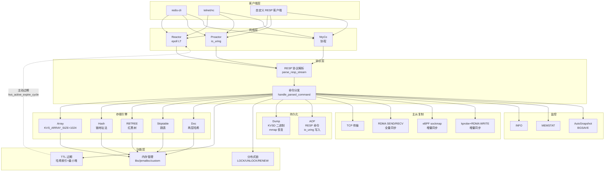
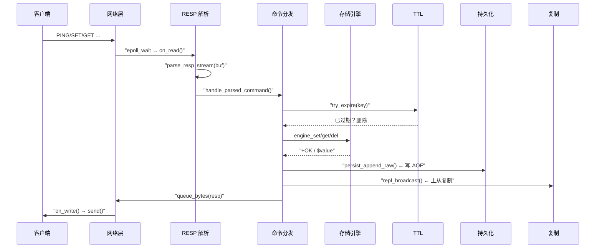
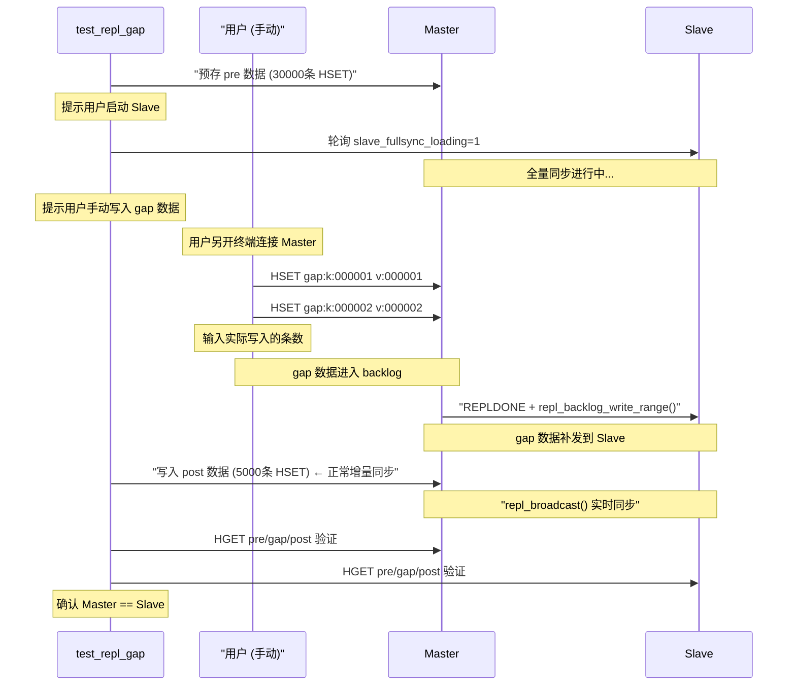

# kvstore — 高性能键值存储系统

[](LICENSE)
[](https://en.wikipedia.org/wiki/C_(programming_language))
[]()
[]()
[]()
[]()

kvstore 是一个用 **C 语言** 实现的类 Redis 键值存储系统，面向学习和研究。

**多存储引擎 · 多网络模型 · 多内存后端 · 持久化 · 主从复制 · 文档型 Value · TTL · RDMA · eBPF**

</div>

---

## 目录

- [快速开始](#快速开始)
- [项目结构](#项目结构)
- [核心能力](#核心能力)
- [命令参考](#命令参考)
- [配置说明](#配置说明)
- [文档索引](#文档索引)
- [实现原理](#实现原理)
- [测试体系](#测试体系)
- [测试产物路径](#测试产物路径)
- [性能基准](#性能基准)
- [开发指南](#开发指南)
- [常见问题](#常见问题)
- [许可证](#许可证)

---

## 快速开始

### 环境依赖

```bash
# Ubuntu/Debian
sudo apt install gcc make liburing-dev libjemalloc-dev

# RDMA 支持（可选）
sudo apt install librdmacm-dev libibverbs-dev

# RDMA 设备配置（Soft-iWARP 或 Soft-RoCE）
# 加载内核模块并创建 RDMA 设备（使用本机物理网卡，如 ens33）
sudo modprobe siw
sudo rdma link add siw0 type siw netdev ens33
sudo modprobe rdma_rxe
sudo rdma link add rxe0 type rxe netdev ens33
# 验证
rdma link show
# 输出应包含:
#   link siw0/1 state ACTIVE physical_state LINK_UP netdev ens33
#   link rxe0/1 state ACTIVE physical_state LINK_UP netdev ens33

# eBPF 支持（可选，需 ENABLE_EBPF=1）
sudo apt install libbpf-dev libelf-dev clang
```

### 编译

```bash
git clone --recurse-submodules <repo-url>
cd kvstore
make clean && make
```

> 编译产物：`./kvstore`（单可执行文件）。编译选项见 Makefile 顶部 `ENABLE_RDMA`、`ENABLE_EBPF` 开关。

### 启动

> **权限说明**: eBPF+tcp 增量同步需加载 client_capture BPF（kprobe/tcp_recvmsg），必须用 `sudo` 启动 Master。
> Slave 不需要 BPF，无需 `sudo`。BPF 加载失败时自动降级为纯 TCP 同步。

```bash
# ── RDMA 全量 + eBPF+tcp 增量（推荐，需 root 启动 Master）──
sudo ./kvstore kvstore.conf --role master    # Master（需 root 加载 BPF）
./kvstore kvstore.conf --role slave          # Slave（无需 root）

# ── 纯 TCP 模式（无需 root）──
./kvstore kvstore.conf --role master --repl-fullsync-transport tcp --repl-realtime-transport tcp
./kvstore kvstore.conf --role slave  --repl-fullsync-transport tcp --repl-realtime-transport tcp

# ── 命令行覆盖单个选项 ──
./kvstore --config kvstore.conf --port 6380 --mem jemalloc
```

### 快速验证

```bash
# 启动 Master 后，用 nc 测试基本读写
printf '*3\r\n$3\r\nSET\r\n$3\r\nkey\r\n$5\r\nvalue\r\n' | nc 127.0.0.1 5160
printf '*2\r\n$3\r\nGET\r\n$3\r\nkey\r\n' | nc 127.0.0.1 5160
```

> **提示**: kprobe+RDMA 需要 root 权限加载 BPF。启动时加 `sudo` 启用，不加则自动降级为 TCP 增量同步，其余功能完全正常。

或使用 Redis 客户端（如 `redis-cli`）直接连接 5160 端口。

---

## 项目结构

```
kvstore/
├── src/                          # 核心 C 源码
│   ├── main/kvstore.c            #   入口、RESP 协议、命令分发
│   ├── core/                     #   网络模型 (reactor / proactor / ntyco)
│   ├── storage/                  #   存储引擎 (array / hash / rbtree / skiptable / doc)
│   ├── memory/kvs_mem.c          #   内存后端 (libc / jemalloc / custom)
│   ├── expire/kvs_expire.c       #   TTL 过期管理
│   ├── persistence/kvs_persist.c #   持久化 (dump + AOF)
│   ├── replication/              #   主从复制、RDMA、eBPF、哨兵
│   └── utils/hash.c              #   哈希工具
├── include/kvstore/              # 公共头文件
├── NtyCo/                        # 协程库 (git submodule)
├── liburing/                     # io_uring 库
├── tools/                        # 测试 & 辅助脚本
│   ├── bench/                    #   性能基准脚本
│   ├── persist/                  #   持久化验证脚本
│   ├── repl/                     #   复制验证脚本 (TCP/RDMA/eBPF)
│   ├── rdma/                     #   RDMA 探测脚本
│   └── tests/                    #   通用测试辅助脚本
├── tests/                        # 测试代码
│   ├── integration/              #   集成测试脚本
│   ├── unit/                     #   单元测试
│   ├── test.c                    #   测试工具函数
│   └── testcase.c                #   C 测试用例框架
├── testdata/                     # 静态测试数据 (样例 AOF/dump/配置)
├── artifacts/                    # 测试运行时产物 (gitignored)
│   ├── persist/                  #   持久化测试产物
│   ├── repl/                     #   复制测试产物
│   ├── rdma/                     #   RDMA 测试产物
│   ├── bench/                    #   基准测试产物
│   └── legacy/                   #   旧版产物
├── benchmarks/                   # 基准测试数据与图表
│   ├── data/                     #   CSV 测试数据
│   └── plots/                    #   可视化图表
├── assets/diagrams/              # 架构图 / 流程图
├── clients/                      # 多语言客户端示例 (Go/Java/JS/Python/Rust)
├── docs/                         # 文档中心
│   ├── tech-roadmap.md           #   技术路线与实现详解 ← 新手必读
│   ├── rdma-fullsync-implementation.md  # RDMA 全量复制实现
│   ├── plan.md                   #   项目演进规划
│   ├── iteration-summary.md      #   迭代总结
│   └── examples/                 #   API 使用示例
├── kvstore.conf                  # 默认配置文件
├── Makefile                      # 构建入口
├── .github/workflows/ci.yml      # GitHub CI 配置
```

---

## 核心能力

### 存储引擎


| 引擎      | 前缀   | 说明                       |
| --------- | ------ | -------------------------- |
| Array     | 无前缀 | 基础数组存储，适合小数据量 |
| Hash      | `H*`   | 哈希表，适合大量 key 场景  |
| RBTREE    | `R*`   | 红黑树，有序存储           |
| Skiptable | `X*`   | 跳表，适合范围查询         |

> 例：`HSET key value` 使用哈希引擎，`RSET key value` 使用红黑树引擎。

### 网络模型


| 模型     | 底层     | 适用场景   |
| -------- | -------- | ---------- |
| Reactor  | epoll    | I/O 密集型 |
| Proactor | io_uring | 高并发异步 |
| NtyCo    | 协程     | 海量连接   |

### 功能矩阵


| 功能                         | 状态      | 说明                                                                                                                       |
| ---------------------------- | --------- | -------------------------------------------------------------------------------------------------------------------------- |
| RESP 协议                    | ✅ 完成   | 完整解析与响应                                                                                                             |
| 全量持久化 (dump)            | ✅ 完成   | 二进制`KVSD` 格式，优先 mmap 恢复                                                                                          |
| 增量持久化 (AOF)             | ✅ 完成   | RESP 命令格式，优先 io_uring 写入                                                                                          |
| SAVE / BGSAVE / BGREWRITEAOF | ✅ 完成   | 支持同步/异步持久化                                                                                                        |
| 主从复制                     | ✅ 完成   | FULLRESYNC + partial resync + backlog                                                                                      |
| RDMA 全量同步                | ✅ 完成   | 全量数据通过 RDMA 传输，与 eBPF 实时同步可同时启用                                                                         |
| eBPF 实时同步                | ✅ 完成   | sockmap 转发路径，实时增量命令通过 eBPF 加速                                                                               |
| kprobe+RDMA 增量同步         | ✅ 完成   | kprobe 透明拦截 TCP send → BPF ringbuf → RDMA WRITE → Slave MR                                                          |
| eBPF+tcp 增量同步            | ✅ 完成   | kprobe/tcp_recvmsg 捕获客户端写入 → 全量同步期间 L1+L2 缓存 → REPLDONE 后 Master 主动切换增量 → repl_broadcast TCP 发送 |
| TTL / 过期                   | ✅ 完成   | 哈希索引 + 最小堆调度                                                                                                      |
| 文档型 value                 | ✅ 完成   | DOCSET/DOCGET 等 7 个命令                                                                                                  |
| 分布式锁                     | ✅ 完成   | LOCK/UNLOCK/RENEW/OWNER                                                                                                    |
| 哨兵模式                     | ⚠️ 基础 | 框架已有，自动故障转移待完善                                                                                               |
| 自动快照                     | ✅ 完成   | 按时间+变化数规则触发                                                                                                      |

---

## 命令参考

### 基本键值


| 命令                   | 说明           |
| ---------------------- | -------------- |
| `SET key value`        | 设置键值       |
| `GET key`              | 获取键值       |
| `DEL key`              | 删除键         |
| `EXIST key`            | 检查键是否存在 |
| `MSET k1 v1 k2 v2 ...` | 批量设置       |
| `MGET k1 k2 ...`       | 批量获取       |
| `MOD key value`        | 修改已有键的值 |

### TTL / 过期


| 命令                 | 说明         |
| -------------------- | ------------ |
| `EXPIRE key seconds` | 设置过期时间 |
| `TTL key`            | 查询剩余 TTL |
| `PERSIST key`        | 移除过期时间 |

### 持久化


| 命令 / 选项          | 说明                  |
| -------------------- | --------------------- |
| `SAVE`               | 同步保存 dump         |
| `BGSAVE`             | 后台保存 dump         |
| `BGREWRITEAOF`       | 重写 AOF              |
| `APPENDFSYNC policy` | 设置 AOF 同步策略     |
| `--aof-disable`      | 启动时禁用 AOF 持久化 |

### 文档对象


| 命令                     | 说明         |
| ------------------------ | ------------ |
| `DOCSET key field value` | 设置字段     |
| `DOCGET key field`       | 获取字段     |
| `DOCDEL key field`       | 删除字段     |
| `DOCDROP key`            | 删除整个文档 |
| `DOCEXIST key`           | 文档是否存在 |
| `DOCCOUNT key`           | 字段数量     |
| `DOCGETALL key`          | 获取全部字段 |

### 分布式锁


| 命令                      | 说明       |
| ------------------------- | ---------- |
| `LOCK key owner seconds`  | 获取锁     |
| `UNLOCK key owner`        | 释放锁     |
| `RENEW key owner seconds` | 续期       |
| `OWNER key`               | 查看持有者 |

### 复制与集群


| 命令                | 说明         |
| ------------------- | ------------ |
| `SLAVEOF host port` | 设为从节点   |
| `SLAVEOF NO ONE`    | 提升为主节点 |
| `ROLE`              | 查看复制状态 |

### 监控


| 命令                   | 说明             |
| ---------------------- | ---------------- |
| `INFO`                 | 服务器综合信息   |
| `MEMSTAT`              | 内存统计         |
| `PING`                 | 连接测试         |
| `SNAPRULE sec changes` | 添加自动快照规则 |
| `SNAPRULES`            | 查看快照规则     |
| `SNAPRULECLEAR`        | 清除快照规则     |

---

## 配置说明

配置文件格式为 `key=value`，支持 `#` 注释。默认加载 `./kvstore.conf`。

### 全部配置项

完整配置见 [`kvstore.conf`](kvstore.conf)，以下为主要选项：


| 配置项                    | 默认值            | 说明                                                            |
| ------------------------- | ----------------- | --------------------------------------------------------------- |
| `port`                    | `5160`            | 监听端口                                                        |
| `role`                    | `master`          | 角色：`master` / `slave`                                        |
| `master_host`             | `192.168.233.128` | 主节点地址                                                      |
| `master_port`             | `5160`            | 主节点端口                                                      |
| `dump_path`               | `kvstore.dump`    | dump 文件路径                                                   |
| `aof_path`                | `kvstore.aof`     | AOF 文件路径                                                    |
| `mem_backend`             | `libc`            | 内存后端：`libc` / `jemalloc` / `custom`                        |
| `net_backend`             | `reactor`         | 网络模型：`reactor` / `proactor` / `ntyco`                      |
| `log_mode`                | `info`            | 日志级别：`debug` / `info` / `warn` / `error`                   |
| `appendfsync`             | `always`          | AOF 同步：`always` / `everysec`                                 |
| `repl_fullsync_transport` | `rdma`            | 全量同步传输：`rdma` / `tcp`（控制命令 REPLDONE 始终走 TCP）    |
| `repl_realtime_transport` | `ebpf+tcp`        | 增量同步传输：`ebpf+tcp`(推荐) / `kprobe-rdma` / `ebpf` / `tcp` |
| `kprobe_enabled`          | `1`               | 启用 kprobe+RDMA 增量同步                                       |
| `rdma_dev`                | `siw0`            | RDMA 设备                                                       |
| `rdma_recv_slots`         | `64`              | RDMA 接收槽位数                                                 |
| `rdma_chunk_size`         | `262144`          | RDMA 分块大小（字节）                                           |
| `autosnap`                | 无                | 自动快照规则，如`60:1000,300:10`                                |
| `sentinel`                | `0`               | 启用哨兵模式                                                    |

> 命令行参数优先级高于配置文件。启动时只需 `./kvstore kvstore.conf --role master`。
> **双通道模式（推荐）**：`repl_fullsync_transport=rdma` + `repl_realtime_transport=ebpf+tcp`。
> RDMA 负责全量快照传输，eBPF+tcp 负责增量同步。**REPLDONE 是分界线**：
>
> ```
>        ← 全量同步 (RDMA) →|← 增量同步 (repl_broadcast TCP) →
>  Master: 发送快照 → 发送 REPLDONE → flush eBPF 缓存 → 实时广播
>  Slave:  接收快照 → 收到 REPLDONE → 应用缓存数据 → 接收实时增量
> ```
>
> - **全量同步期间**：eBPF client_capture（kprobe/tcp_recvmsg）缓存客户端写入到 L1(4MB)+L2(磁盘)
> - **REPLDONE 后**：Master 关闭 RDMA，flush 缓存到 slave，`g_repl_fullsync_in_progress=0` 触发增量同步
> - **增量同步**：repl_broadcast 通过 TCP 发送；Master 自知 REPLDONE 时机，无需 BPF 探测
> - **自动回退**：RDMA 不可用 → TCP 全量；BPF 加载失败 → 纯 TCP 增量
>   完整配置项见 [`kvstore.conf`](kvstore.conf) 文件注释。

### 命令行参数

```
# ── 最简启动（所有选项从 kvstore.conf 读取）──
sudo ./kvstore kvstore.conf --role master          # 启用 kprobe+RDMA（需 root）
sudo ./kvstore kvstore.conf --role slave
./kvstore kvstore.conf --role master                # 纯 TCP（kprobe 自动禁用）
./kvstore kvstore.conf --role slave

# ── 逐项参数覆盖 ──
./kvstore --port 5160 --role master --repl-fullsync-transport rdma \
          --repl-realtime-transport kprobe-rdma --rdma-dev siw0 \
          --rdma-recv-slots 64 --kprobe-enabled --appendfsync always
```

---

## 文档索引


| 文档                                                                           | 说明                                                                   |
| ------------------------------------------------------------------------------ | ---------------------------------------------------------------------- |
| [`docs/tech-roadmap.md`](docs/tech-roadmap.md)                                 | ⭐**技术路线与实现详解** — 新手必读，覆盖所有模块的架构、流程图、代码 |
| [`docs/rdma-fullsync-implementation.md`](docs/rdma-fullsync-implementation.md) | RDMA 全量复制的代码级实现分析                                          |
| [`docs/plan.md`](docs/plan.md)                                                 | 项目演进规划（各阶段目标）                                             |
| [`docs/iteration-summary.md`](docs/iteration-summary.md)                       | 迭代总结（含 RDMA 稳定性修复记录）                                     |
| [`docs/examples/kvs_skiptable.c`](docs/examples/kvs_skiptable.c)               | Skiptable 引擎 API 使用示例                                            |

---

## 实现原理

### 总体架构



### 命令执行流程



### 存储引擎 — 五种数据结构

kvstore 实现了五种存储引擎，通过**命令前缀**切换。所有引擎共享同一套 TTL 过期系统和复制层。

#### Array 引擎 (`SET` / `GET` / `DEL`)

- **数据结构**：固定大小线性数组（`KVS_ARRAY_SIZE=1024`），每个 slot 包含 `(key, value)` 指针
- **查找**：线性扫描 O(n)，n ≤ 1024
- **限制**：最多 1024 个 key，满了返回 `-ERR operation failed`

```
table = [slot0, slot1, ..., slot1023]
          │       │
     (key,val)  NULL
```

源码: `src/storage/kvs_array.c` — 线性扫描 O(n)，最多 1024 个 key。

#### Hash 引擎 (`HSET` / `HGET` / `HDEL`)

- **数据结构**：链地址哈希表，`MAX_TABLE_SIZE=1024` 个桶，**FNV-1a 非加密哈希**
- **查找**：O(1) avg，冲突通过链表解决
- **与 Array 的区别**：链地址法无固定容量限制

```
hash(key) → idx
buckets[idx] → node → node → NULL   (链地址法)
```

源码: `src/storage/kvs_hash.c` — FNV-1a 哈希 + 链地址法，O(1) avg 查找。

#### RBTREE 引擎 (`RSET` / `RGET` / `RDEL`)

- **数据结构**：**红黑树**，节点颜色标记红/黑，插入后通过左旋/右旋/变色保持平衡
- **查找**：O(log n)，中序遍历可得有序序列
- **特点**：通过 5 条红黑树性质保证平衡性

源码: `src/storage/kvs_rbtree.c`

#### Skiptable 引擎 (`XSET` / `XGET` / `XDEL`)

- **数据结构**：**跳表**，多层链表，每层以 50% 概率提升层数（最高 16 层）
- **查找**：O(log n) avg，从最高层开始逐层向下
- **与 RBTREE 的对比**：红黑树通过旋转保持平衡，跳表通过概率层数实现平衡；跳表实现更简单，但红黑树最坏情况有保证

```
head
  │  ┌─────────────────────────────────┐
  ├──┤  L3: 10 ──────────────→ 90      │
  ├──┤  L2: 10 ─────→ 50 ───→ 90      │
  └──┤  L1: 10 → 30 → 50 → 70 → 90    │
     └─────────────────────────────────┘
```

源码: `src/storage/kvs_skiptable.c`

#### Doc 引擎 (`DOCSET` / `DOCGET` / `DOCDEL`)

- **数据结构**：文档型 value，按 `key` 哈希找到文档，文档内部再按 `field` 哈希存储
- **两层哈希**：外层 `key → doc`，内层 `field → value`
- **用途**：一个 key 下存储多个字段，类似 Redis Hash

```
key → doc { fields[0] → (f1,v1) → (f2,v2)
            fields[1] → (f3,v3) → NULL }
```

源码: `src/storage/kvs_doc.c`

#### 命令前缀路由

```
cmd[0] == 'R' → RBTREE 引擎
cmd[0] == 'H' → Hash 引擎
cmd[0] == 'X' → Skiptable 引擎
其他         → Array 引擎
```

`handle_parsed_command()` 根据前缀路由，`strip_prefix()` 去掉前缀后执行统一的操作名（如 `HSET` → HASH 引擎执行 `SET`）。

**统一命令分发**：命令前缀确定引擎 → 函数指针路由 → 写命令统一走 `persist_append_raw` + `repl_broadcast`。详见 `src/main/kvstore.c` 的 `handle_parsed_command()`。

> 实现细节（RESP 解析、持久化、主从复制、TTL 过期、内存管理等）见 [`docs/tech-roadmap.md`](docs/tech-roadmap.md)。

## 测试体系

### 快速验证

```bash
make check        # 运行全部基础测试 (resp + ttl + persist + doc)
```

### C 测试程序 (`tests/`)

`tests/` 目录下包含独立的 C 测试程序，通过 RESP 协议连接 kvstore 进行自动化验证。

这些 C 测试程序**不依赖 hiredis 等第三方库**，直接通过 TCP socket 构造 RESP 协议报文，可在任何 Linux 环境下编译运行。

所有测试程序均支持 `--config <path>` 加载配置文件，免去每次输入冗长命令行的麻烦：

```bash
# 使用默认配置（自动加载 tests/test.conf）
./tests/test_repl_5w5w

# 或指定配置文件
./test_batch --config my_test.conf

# 命令行参数可覆盖配置文件
./test_batch --config tests/test.conf --port 6380 --count 50000
```

配置文件格式 (`tests/test.conf`):

```ini
# 通用连接
host=127.0.0.1
port=5200

# 主从复制地址
master_host=192.168.233.128
master_port=5160
slave_host=192.168.233.129
slave_port=5161

# 测试数据量
pre=50000
post=50000
count=10000

# 测试参数
batch=1000
poll_ms=500
ttl=10
```

编译方式：

```bash
# 通过 Makefile
make test_kvstore              # → ./test_kvstore
make test_repl_5w5w            # → tests/test_repl_5w5w
make test_persist_dump_demo    # → ./test_persist_dump_demo
make test_persist_aof_demo     # → ./test_persist_aof_demo
make test_uring_persist        # → ./test_uring_persist
make test_mmap_recover         # → ./test_mmap_recover
make test_repl_basic           # → ./test_repl_basic
make test_repl_gap             # → ./test_repl_gap
make test_mass_ttl             # → ./test_mass_ttl
make test_batch                # → ./test_batch

# 或手动编译
gcc -I./include -o test_kvstore tests/test_kvstore.c
```

---

#### `test_kvstore` — 全功能 C 客户端测试

```
编译: make test_kvstore           # → ./test_kvstore
运行: ./test_kvstore [--config tests/test.conf] [host port]
```

连接 kvstore 后依次测试 PING、各引擎 SET/GET/DEL、MSET/MGET、TTL/EXPIRE/PERSIST、
LOCK/UNLOCK/RENEW、DOC 命令、PING 批量流水线、SAVE/BGSAVE 持久化、INFO 命令，
最后输出 PASS/FAIL 汇总报告。

支持位置参数（向后兼容）和 `--config` / `--host` / `--port` 命名参数：

```bash
# 终端 1: 启动 kvstore（任意端口）
./kvstore kvstore.conf --role master

# 终端 2: 运行全功能测试（使用配置文件）
./test_kvstore --config tests/test.conf

# 或使用位置参数（向后兼容）
./test_kvstore 127.0.0.1 5160

# 或通过 Makefile 自动启动 + 测试
make check-kvstore TEST_PORT=5160
```

**验证**: 测试通过后，用 redis-cli 确认数据正确：

```bash
redis-cli -p 5160 PING
+PONG
redis-cli -p 5160 GET a:pre:1
"av:1"
redis-cli -p 5160 HGET h:pre:100
"hv:100"
redis-cli -p 5160 INFO
# 查看 role、mem、dirty 等信息
```

---

#### `test_repl_5w5w` — 5w+5w 主从同步测试

```
编译: make test_repl_5w5w          # → tests/test_repl_5w5w
运行: tests/test_repl_5w5w [选项]
```

测试流程：预存 5w 条数据到 Master → 监控 Slave 全量同步(RDMA) → 再写 5w 条增量 → 监控增量同步(eBPF+tcp) → 验证 eBPF+tcp 传输状态 → 验证 Slave 最终 10w 条数据一致性。

**启动顺序（重要）**: ① ebpf-proxy → ② Master → ③ 本脚本 → ④ Slave（看到"等待 Slave 连接"提示后再启动）

```bash
# ── 方式一: RDMA 全量 + eBPF+tcp 增量（双虚拟机，推荐，需 root）──
#
# 架构:
#   ebpf-proxy (VM1) ──TCP──→ slave proxy listener (VM2, port+1)
#   master (VM1) ──RDMA──→ slave (VM2)
#   master (VM1) ──TCP──→ slave (VM2, 控制命令)
#
# 增量数据流: Client → master recvmsg → BPF kprobe 捕获
#   → ringbuf → ebpf-proxy → TCP → slave proxy listener (port+1)
#   → slave thread (from_replication=1) → apply + update offset

# 终端 1 (VM1, Master 机器 — 先启动 ebpf-proxy):
sudo rm -rf /sys/fs/bpf/kvstore_repl_sockmap
sudo pkill -9 ebpf_proxy kvstore 2>/dev/null
sudo nohup ./build/ebpf_proxy \
    --pin-path /sys/fs/bpf/kvstore_repl_sockmap \
    --obj-path build/replication/bpf/repl_client_capture.bpf.o \
    > /tmp/ebpf_proxy.log 2>&1 &
# 确认: grep "waiting for master config" /tmp/ebpf_proxy.log

# 终端 2 (VM1, Master 机器 — 再启动 Master):
sudo rm -f kvstore_transport.log kvstore.aof
sudo nohup ./kvstore kvstore.conf --role master > /tmp/kvstore_master.log 2>&1 &
# 确认: grep "wrote config" /tmp/kvstore_master.log
#       grep "state=FORWARDING" /tmp/ebpf_proxy.log

# 终端 3 (任意机器, Master 启动后运行测试):
./tests/test_repl_5w5w --config tests/test.conf

# 终端 4 (VM2, Slave 机器 — 看到"等待 Slave 连接..."后再启动):
sudo rm -f kvstore.dump kvstore.aof
sudo nohup ./kvstore kvstore.conf --role slave > /tmp/kvstore_slave.log 2>&1 &
# 确认: grep "proxy listener on port" /tmp/kvstore_slave.log
#       (应输出: repl ebpf-tcp: proxy listener on port 5161)
#       grep "proxy connected" /tmp/kvstore_slave.log
#       (应输出: repl ebpf-tcp: proxy connected fd=8)

# ── 方式二: RDMA 全量 + kprobe+RDMA 增量（双虚拟机，需 root）──
# 同方式一，但 repl_realtime_transport=kprobe-rdma，无需 ebpf-proxy

# ── 方式三: TCP 全量 + TCP 增量（单机，无需 root）──

# 终端 1 (先启动 Master):
./kvstore --port 5160 --role master \
    --repl-fullsync-transport tcp --repl-realtime-transport tcp

# 终端 2 (Master 启动后运行):
./tests/test_repl_5w5w --config tests/test.conf

# 终端 3 (看到提示后再启动 Slave):
rm -f kvstore.dump kvstore.aof
./kvstore --port 5161 --role slave \
    --master-host 127.0.0.1 --master-port 5160 \
    --repl-fullsync-transport tcp --repl-realtime-transport tcp
```

选项说明：


| 选项                 | 默认值    | 说明                 |
| -------------------- | --------- | -------------------- |
| `--master-host HOST` | 127.0.0.1 | Master 地址          |
| `--master-port PORT` | 5160      | Master 端口          |
| `--slave-host HOST`  | 127.0.0.1 | Slave 地址           |
| `--slave-port PORT`  | 5161      | Slave 端口           |
| `--pre COUNT`        | 50000     | 全量同步前预存数据量 |
| `--post COUNT`       | 50000     | 全量同步后增量数据量 |
| `--batch SIZE`       | 1000      | 每批写入量           |
| `--poll MS`          | 500       | 轮询间隔毫秒         |

**eBPF+tcp 传输验证**: 测试 Phase 5.5 自动通过 `INFO` 命令检查以下字段确认 eBPF+tcp 路径是否生效：


| INFO 字段                        | 预期            | 含义                                   |
| -------------------------------- | --------------- | -------------------------------------- |
| `repl_transport_active`          | `rdma+ebpf-tcp` | 全量 RDMA + 增量 eBPF+tcp 双通道已激活 |
| `kprobe_initialized`             | 1               | client_capture BPF 已加载并 attach     |
| `repl_broadcast_bytes`           | > 0             | TCP 增量数据已发送                     |
| `repl_transport_fallback_reason` | `none`          | 无降级，传输层正常工作                 |

**kprobe+RDMA 验证** (使用 `repl_realtime_transport=kprobe-rdma` 时):


| INFO 字段               | 预期 | 含义                                    |
| ----------------------- | ---- | --------------------------------------- |
| `kprobe_initialized`    | 1    | BPF 程序已加载并 attach 到`tcp_sendmsg` |
| `kprobe_rdma_connected` | 1    | RDMA QP 已建立连接                      |
| `kprobe_rdma_writes`    | > 0  | RDMA WRITE 成功次数                     |
| `kprobe_rdma_errors`    | 0    | RDMA WRITE 错误次数                     |

**验证**: 测试通过后，确认主从数据一致：

```bash
# 在 Master 上查询
redis-cli -p 5160 HGET pre:k:000000
"v0"
redis-cli -p 5160 HGET post:k:000000
"v50000"

# 在 Slave 上查询（结果应与 Master 完全一致）
redis-cli -p 5161 HGET pre:k:000000
"v0"
redis-cli -p 5161 HGET post:k:000000
"v50000"
```

---

#### `test_persist_dump_demo` — 全量持久化演示

```
编译: make test_persist_dump_demo    # → ./test_persist_dump_demo
运行: ./test_persist_dump_demo [--config tests/test.conf]
```

交互式流程：连接 kvstore → 写入 count 条数据 → 提示用户执行 `SAVE` → 提示用户停止并重启 kvstore → 自动验证数据从 dump 文件恢复。

```bash
# 终端 1: 启动 kvstore（默认 appendfsync=always 确保数据可恢复）
./kvstore kvstore.conf --role master

# 终端 2: 运行全量持久化演示
./test_persist_dump_demo --config tests/test.conf

# 程序会写入数据，然后提示你:
#   >>> Please execute SAVE in kvstore (redis-cli SAVE or nc ...)
# 在终端 1 执行 SAVE 后，程序继续提示:
#   >>> Please stop kvstore (Ctrl+C) and restart it
# 停止并重启 kvstore，程序自动检测重连并验证数据恢复
```

**验证**: SAVE 后、重启前，用 redis-cli 确认数据已持久化：

```bash
redis-cli -p 5160 SAVE
+OK
redis-cli -p 5160 HGET bench:key:1
"value:1"
redis-cli -p 5160 HGET bench:key:50000
"value:50000"
```

选项说明：


| 选项          | 默认值    | 说明         |
| ------------- | --------- | ------------ |
| `--host HOST` | 127.0.0.1 | kvstore 地址 |
| `--port PORT` | 5170      | kvstore 端口 |
| `--count N`   | 50000     | 写入数据量   |
| `--batch N`   | 1000      | 每批写入量   |

---

#### `test_persist_aof_demo` — 增量持久化演示 (AOF)

```
编译: make test_persist_aof_demo     # → ./test_persist_aof_demo
运行: ./test_persist_aof_demo [选项]
```

交互式流程：连接 kvstore → 写入 count 条数据（**不执行 SAVE**）→ 提示用户停止并重启 kvstore → 自动验证数据从 AOF 文件恢复。

> **重要**: kvstore 必须使用 `--appendfsync always`，确保每条写入即时落盘。
> 使用 `--appendfsync everysec` 时，停止前需等最多 1 秒落盘，可能导致数据丢失。

```bash
# 终端 1: 启动 kvstore（默认 appendfsync=always）
./kvstore kvstore.conf --role master

# 终端 2: 运行增量持久化演示
./test_persist_aof_demo --config tests/test.conf

# 程序写入数据后提示:
#   >>> Please stop kvstore (Ctrl+C) and restart it
# 停止并重启 kvstore，程序自动验证 AOF 恢复（注意: 不执行 SAVE，数据仅靠 AOF）
```

**验证**: AOF 恢复后，确认重启前后的数据一致：

```bash
# 重启前验证
redis-cli -p 5170 HGET bench:key:1
"value:1"
redis-cli -p 5170 HGET bench:key:50000
"value:50000"

# 停止并重启 kvstore 后，再次验证（数据应仍在）
redis-cli -p 5170 HGET bench:key:1
"value:1"
redis-cli -p 5170 HGET bench:key:50000
"value:50000"
redis-cli -p 5170 PING
+PONG
```

选项说明：


| 选项          | 默认值    | 说明         |
| ------------- | --------- | ------------ |
| `--host HOST` | 127.0.0.1 | kvstore 地址 |
| `--port PORT` | 5170      | kvstore 端口 |
| `--count N`   | 50000     | 写入数据量   |
| `--batch N`   | 1000      | 每批写入量   |

---

#### `test_uring_persist` — io_uring 持久化验证

```
编译: make test_uring_persist       # → ./test_uring_persist
运行: ./test_uring_persist [选项]
```

自动管理 kvstore 进程生命周期，测试 io_uring 写入路径的持久化正确性与性能。

流程：自动启动 kvstore → HSET 写入 N 条数据 → SAVE → 停止 kvstore → 重启 → 验证数据恢复 → 输出性能指标。

```bash
# 终端 1: 启动 kvstore
./kvstore kvstore.conf --role master

# 终端 2: 运行测试
./test_uring_persist --config tests/test.conf

# 程序写入数据后提示:
#   >>> 请停止 kvstore (Ctrl+C) 并重新启动 (相同参数)
# 停止并重启 kvstore，程序自动验证数据恢复
```

**验证**: 测试完成后，用 redis-cli 手动确认：

```bash
redis-cli -p 5180 HGET uring:key:1
"value:1"
redis-cli -p 5180 HGET uring:key:5000
"value:5000"
redis-cli -p 5180 HGET uring:key:10000
"value:10000"
redis-cli -p 5180 INFO | grep mem
# 查看内存后端和统计信息
```

选项说明：


| 选项          | 默认值    | 说明         |
| ------------- | --------- | ------------ |
| `--host HOST` | 127.0.0.1 | kvstore 地址 |
| `--port PORT` | 5180      | kvstore 端口 |
| `--count N`   | 10000     | 写入数据量   |
| `--batch N`   | 1000      | 每批写入量   |

---

#### `test_mass_ttl` — 大量数据到期测试

```
编译: make test_mass_ttl             # → tests/test_mass_ttl
运行: tests/test_mass_ttl [选项]
```

设置 10000 个 key 并设置 10 秒过期时间，轮询抽样检查 TTL 状态，
验证 kvstore 在海量 TTL key 下的过期扫描正确性。

> **注意**: 本测试使用 `HSET`/`HEXPIRE`（HASH 引擎），因为默认 ARRAY 引擎
> (`KVS_ARRAY_SIZE=1024`) 最多只能存 1024 个 key。HASH 引擎使用链地址法，
> 无此限制。

```bash
# 终端 1: 启动 kvstore
./kvstore --port 5200 --role master

# 终端 2: 运行测试
./test_mass_ttl --port 5200 --count 10000 --ttl 10

# 终端 3: 手动检查 TTL（可选）
redis-cli -p 5200 HTTL expire:k:000000
redis-cli -p 5200 HGET expire:k:000000   # 10s 后应返回 nil
```

选项说明：


| 选项          | 默认值    | 说明         |
| ------------- | --------- | ------------ |
| `--host HOST` | 127.0.0.1 | kvstore 地址 |
| `--port PORT` | 5200      | kvstore 端口 |
| `--count N`   | 10000     | 设置 key 数  |
| `--ttl SEC`   | 10        | 过期时间(秒) |
| `--batch N`   | 1000      | 每批写入量   |

---

#### `test_mmap_recover` — mmap 恢复验证

```
编译: make test_mmap_recover        # → ./test_mmap_recover
运行: ./test_mmap_recover [选项]
```

自动管理 kvstore 进程生命周期，验证启动时通过 mmap 恢复 dump 文件的正确性与性能。
支持指定存储引擎（array/hash/rbtree/skiptable）。

流程：自动启动 kvstore → 按指定引擎写入 N 条数据 → SAVE → 停止 → 重启并计时 → 从 INFO 读取恢复统计（mmap 尝试次数/成功次数/回退次数/耗时）→ 验证数据一致性。

```bash
# 终端 1: 启动 kvstore
./kvstore kvstore.conf --role master

# 终端 2: 运行测试（hash 引擎, 10000 条）
./test_mmap_recover --config tests/test.conf --engine hash

# 程序写入数据后提示:
#   >>> 请停止 kvstore (Ctrl+C) 并重新启动 (相同参数)
# 停止并重启 kvstore，程序自动验证数据恢复并显示 mmap 统计

# 使用其他引擎
./test_mmap_recover --config tests/test.conf --engine rbtree
./test_mmap_recover --config tests/test.conf --engine array
```

**验证**: 测试完成后，确认各引擎数据恢复正确：

```bash
# Hash 引擎（--engine hash）
redis-cli -p 5190 HGET mmap:key:10000
"value:10000"
redis-cli -p 5190 HGET mmap:key:1
"value:1"

# RBTREE 引擎（--engine rbtree）
redis-cli -p 5190 RGET mmap:key:5000
"value:5000"

# Skiptable 引擎（--engine skiptable）
redis-cli -p 5190 XGET mmap:key:5000
"value:5000"

# Array 引擎（--engine array，上限 1024）
redis-cli -p 5190 GET mmap:key:1024
"value:1024"
```

选项说明：


| 选项            | 默认值    | 说明                              |
| --------------- | --------- | --------------------------------- |
| `--host HOST`   | 127.0.0.1 | kvstore 地址                      |
| `--port PORT`   | 5190      | kvstore 端口                      |
| `--count N`     | 10000     | 写入数据量（array 引擎上限 1024） |
| `--engine NAME` | hash      | 引擎: array/hash/rbtree/skiptable |
| `--batch N`     | 1000      | 每批写入量                        |

---

#### `test_repl_basic` — 主从复制基本验证

```
编译: make test_repl_basic          # → ./test_repl_basic
运行: ./test_repl_basic [选项]
```

用户手动管理 Master/Slave 进程，程序负责写入、监控、验证。

流程：用户启动 Master → 程序跨引擎（Hash/Array/RBTREE/Skiptable）写入 N 条数据 → 提示用户启动 Slave → 等待全量同步完成 → 再写入增量数据 → 等待增量同步 → 验证各引擎数据一致性。

```bash
# ── 单机三终端模式 ──

# 终端 1: 启动 Master（先启动）
./kvstore --port 6379 --role master \
    --repl-fullsync-transport tcp --repl-realtime-transport tcp

# 终端 2: 运行测试（Master 启动后运行）
./test_repl_basic --master-port 6379 --slave-port 6380 --count 5000

# 程序会写入数据到 Master，然后提示启动 Slave:
#   >>> 请在另一个终端启动 Slave: ...
# 此时在终端 3 启动 Slave:

# 终端 3: 启动 Slave（看到提示后再启动）
# 先清理旧数据文件，避免上次测试残留影响
rm -f kvstore.dump kvstore.aof
./kvstore --port 6380 --role slave \
    --master-host 127.0.0.1 --master-port 6379 \
    --repl-fullsync-transport tcp --repl-realtime-transport tcp


# ── 双机部署（跨机器测试）──

# 终端 1 (VM1, 先启动 Master):
./kvstore --port 6380 --role master \
    --repl-fullsync-transport tcp --repl-realtime-transport tcp

# 终端 2 (本地, Master 启动后运行):
./test_repl_basic --master-host 192.168.233.128 --master-port 6380 \
    --slave-host 192.168.233.129 --slave-port 6381 \
    --count 5000

# 终端 3 (VM2, 看到提示后再启动 Slave):
# 先清理旧数据文件，避免上次测试残留影响
rm -f kvstore.dump kvstore.aof
./kvstore --port 6381 --role slave \
    --master-host 192.168.233.128 --master-port 6380 \
    --repl-fullsync-transport tcp --repl-realtime-transport tcp
```

**验证**: 测试通过后，用 redis-cli 确认主从数据完全一致：

```bash
# 在 Master 上查询
redis-cli -p 6380 HGET h:pre:5000
"hv:5000"
redis-cli -p 6380 HGET h:pre:50
"hv:50"
redis-cli -p 6380 HGET h:post:891
"hv_post:891"
redis-cli -p 6380 HGET h:post:1232
(nil)                       # 只写了 1000 条增量(post)，1232 不存在正常
redis-cli -p 6380 GET a:pre:1
"av:1"
redis-cli -p 6380 RGET r:pre:500
"rv:500"
redis-cli -p 6380 XGET x:pre:999
"xv:999"

# 在 Slave 上查询（结果必须与 Master 完全一致）
redis-cli -p 6381 HGET h:pre:5000
"hv:5000"
redis-cli -p 6381 HGET h:pre:50
"hv:50"
redis-cli -p 6381 HGET h:post:891
"hv_post:891"
redis-cli -p 6381 GET a:pre:1
"av:1"
redis-cli -p 6381 RGET r:pre:500
"rv:500"
redis-cli -p 6381 XGET x:pre:999
"xv:999"

# 检查 Slave 只读（写操作应被拒绝）
redis-cli -p 6381 SET should_fail x
-ERR read only slave
```

两种验证方法：

- **全量同步验证**: 查询 `h:pre:*`（预存 5000 条）— 确认 Slave 有全部预存数据
- **增量同步验证**: 查询 `h:post:*`（全量完成后写入 1000 条）— 确认增量数据也同步到了 Slave
- **跨引擎验证**: 分别用 `GET`/`HGET`/`RGET`/`XGET` 确认 Array/Hash/RBTREE/Skiptable 四个引擎的数据都一致

选项说明：


| 选项                 | 默认值    | 说明            |
| -------------------- | --------- | --------------- |
| `--master-host HOST` | 127.0.0.1 | Master 地址     |
| `--slave-host HOST`  | 127.0.0.1 | Slave 地址      |
| `--master-port PORT` | 6379      | Master 端口     |
| `--slave-port PORT`  | 6380      | Slave 端口      |
| `--count N`          | 5000      | 预存/增量数据量 |
| `--batch N`          | 500       | 每批写入量      |
| `--poll MS`          | 500       | 轮询间隔毫秒    |

---

#### `test_repl_gap` — 全量同步 Gap 补发验证

```
编译: make test_repl_gap          # → ./test_repl_gap
运行: ./test_repl_gap [选项]
```

验证全量同步期间客户端写入 Master 的数据（gap）在全量同步完成后正确补发到 Slave。

**测试原理**：



```bash
# ── 双机四终端测试（推荐）──

# 终端 1 (Master 机器 192.168.233.128): 先启动 Master
./kvstore kvstore.conf --role master --aof-disable

# 终端 2 (任意机器): 运行测试
./tests/test_repl_gap --config tests/test.conf

# 看到提示后，在终端 3 (Slave 机器 192.168.233.129): 启动 Slave
./kvstore kvstore.conf --role slave --aof-disable

# 看到全量同步开始提示后，在终端 4 手动写入任意 gap 数据:
redis-cli -p 5160 -h 192.168.233.128 HSET gap:mykey myvalue
# 写入完成后，回到终端 2，按 Enter 继续
```

三阶段验证确保数据不丢失：


| 阶段        | 数据                | 写入者       | 写入时机         | 同步机制               | 验证点               |
| ----------- | ------------------- | ------------ | ---------------- | ---------------------- | -------------------- |
| Phase 1     | `pre:k:001~030000`  | 测试程序     | 全量同步前       | 全量快照`+FULLRESYNC`  | Slave 有全部 pre     |
| **Phase 2** | `gap:k:001~005000`  | **用户手动** | **全量同步期间** | **backlog gap 补发**   | **Slave 有全部 gap** |
| Phase 3     | `post:k:001~005000` | 测试程序     | 全量同步后       | 实时`repl_broadcast()` | Slave 有全部 post    |

**选项说明**：


| 选项                 | 默认值    | 说明                                     |
| -------------------- | --------- | ---------------------------------------- |
| `--master-host HOST` | 127.0.0.1 | Master 地址                              |
| `--slave-host HOST`  | 127.0.0.1 | Slave 地址                               |
| `--master-port PORT` | 6379      | Master 端口                              |
| `--slave-port PORT`  | 6380      | Slave 端口                               |
| `--pre-count N`      | 30000     | 预存数据量（全量）                       |
| `--gap-count N`      | 0         | gap 数据量（全量同步期间手动写入后输入） |
| `--post-count N`     | 5000      | 增量数据量                               |
| `--batch N`          | 1000      | 每批写入量                               |
| `--poll-ms N`        | 500       | 轮询间隔毫秒                             |

---

#### 辅助文件


| 文件           | 说明                                                                                                                                       |
| -------------- | ------------------------------------------------------------------------------------------------------------------------------------------ |
| **testcase.c** | 测试框架工具库，提供`send_msg()` / `recv_msg()` / `testcase()` / `connect_tcpserver()` 等 RESP 协议测试辅助函数，作为其他 C 测试的依赖引用 |
| **test.c**     | （空文件，预留）                                                                                                                           |

### 全部测试目标


| 命令                                 | 数据量        | 说明                                                                                                            | 产物路径                            |
| ------------------------------------ | ------------- | --------------------------------------------------------------------------------------------------------------- | ----------------------------------- |
| `make check-all`                     | 全部          | **一键运行全部测试**（自动探测 RDMA/eBPF 环境，跳过不可用项）                                                   | —                                  |
| `make check-all-quick`               | 小+1w         | 快速全套（跳过 RDMA/eBPF/复制/10w demo）                                                                        | —                                  |
| `make check`                         | 小            | 基础功能全套                                                                                                    | —                                  |
| `make check-resp`                    | —            | RESP 协议测试                                                                                                   | —                                  |
| `make check-ttl`                     | —            | TTL 过期测试                                                                                                    | —                                  |
| `make check-persist`                 | —            | 持久化基本测试                                                                                                  | —                                  |
| `make check-doc`                     | —            | 文档对象测试                                                                                                    | —                                  |
| `make check-kvstore`                 | 小            | C 客户端综合测试（`tests/test_kvstore.c`）                                                                      | —                                  |
| `make check-bulk-1w`                 | **1w**        | 批量 1w 级全套回归（HSET/HGET/TTL/SAVE+恢复/DOC）                                                               | —                                  |
| `make check-10w`                     | **1w~**       | 10w 级大容量功能测试                                                                                            | —                                  |
| `make check-mass-ttl`                | 1w            | 海量 TTL 压测                                                                                                   | —                                  |
| `make check-uring-persist`           | 1w            | io_uring 持久化验证（Python 脚本）                                                                              | `artifacts/persist/uring-bench/`    |
| `make check-uring-persist-c`         | 1w            | io_uring 持久化验证（C 程序，自动管理进程）                                                                     | `artifacts/persist/uring-bench/`    |
| `make check-mmap-recover`            | 1w            | mmap 恢复验证（Python 脚本）                                                                                    | `artifacts/persist/mmap-recover/`   |
| `make check-mmap-recover-c`          | 1w            | mmap 恢复验证（C 程序，支持指定引擎，自动管理进程）                                                             | `artifacts/persist/mmap-recover/`   |
| `make check-repl`                    | 5k            | 主从复制基本验证（shell 脚本）                                                                                  | —                                  |
| `make check-repl-basic`              | 5k            | 主从复制基本验证（C 程序，自动管理 Master/Slave 进程）                                                          | —                                  |
| `make check-repl-gap`                | 3k+手动+1k    | 全量同步 gap 补发验证（C 程序，gap 数据由用户手动写入）                                                         | —                                  |
| `make test_repl_5w5w`<br>（仅编译）  | **5w+5w**     | 5w+5w 主从同步 C 测试（`tests/test_repl_5w5w.c`）<br>编译后手动运行：`tests/test_repl_5w5w --master-host H ...` | —                                  |
| `make check-repl-metrics`            | 5w+5k         | 复制指标基线                                                                                                    | `artifacts/repl/metrics/`           |
| `make check-repl-profile`            | 5w+5k         | 复制 profiling                                                                                                  | `artifacts/repl/profile/`           |
| `make check-repl-ebpf`               | 5w+5k         | eBPF 实时同步 profiling                                                                                         | `artifacts/repl/profile/`           |
| `make check-repl-ebpf-env`           | —            | eBPF 环境探测                                                                                                   | —                                  |
| `make check-repl-ebpf-sync`          | 64            | eBPF sockmap 同步验证                                                                                           | `artifacts/repl/ebpf-sync/`         |
| `make check-repl-ebpf-sync-required` | 64            | eBPF 同步验证（要求 eBPF 可用）                                                                                 | `artifacts/repl/ebpf-sync/`         |
| `make check-repl-ebpf-redirect`      | 64            | eBPF ingress 重定向验证                                                                                         | `artifacts/repl/ebpf-sync/`         |
| `make check-repl-rdma-unsupported`   | 小            | RDMA 不可用时的优雅降级测试                                                                                     | —                                  |
| `make check-repl-rdma-smoke`         | 小            | RDMA 冒烟测试                                                                                                   | `artifacts/repl/rdma-smoke/`        |
| `make check-repl-rdma-stress`        | 中            | RDMA 压力测试（重启轮次 + 尾写验证）                                                                            | `artifacts/repl/rdma-stress/`       |
| `make check-repl-rdma-soak`          | 中            | RDMA 长时浸泡（可配小时级）                                                                                     | `artifacts/repl/rdma-stress/`       |
| `make check-repl-rdma-long-soak`     | 中            | RDMA 超长浸泡（默认 1800s）                                                                                     | `artifacts/repl/rdma-stress/`       |
| `make check-repl-rdma-fallback`      | 小            | RDMA 强制降级到 TCP 验证                                                                                        | —                                  |
| `make check-demo-full-dump`          | **10w**       | 全量持久化演示                                                                                                  | `artifacts/persist/full-dump-demo/` |
| `make check-demo-incr-aof`           | **10w**       | 增量持久化演示                                                                                                  | `artifacts/persist/incr-aof-demo/`  |
| `make check-demo-repl-sync`          | **5w+5w=10w** | 主从同步演示（可配 RDMA+eBPF 混合传输）                                                                         | `artifacts/repl/sync-demo/`         |
| `make check-rdma-standalone-probe`   | —            | RDMA 环境探测                                                                                                   | `artifacts/rdma/probe/`             |
| `make check-rdma-pingpong-smoke`     | —            | RDMA pingpong 测试                                                                                              | `artifacts/rdma/pingpong/`          |

> **注意**：若之前使用 `sudo make check-demo-repl-sync` 运行过，`artifacts/repl/sync-demo/` 下的文件属主为 root，再次运行时需先 `sudo rm -rf artifacts/repl/sync-demo` 清理，否则会报 `PermissionError`。

### 辅助测试脚本（非 Makefile 目标）

以下脚本位于 `tools/` 目录下，可直接运行，未绑定 Makefile 目标：


| 脚本                                   | 位置             | 说明                                         |
| -------------------------------------- | ---------------- | -------------------------------------------- |
| `test_master_slave_multi_engine_nc.sh` | `tools/tests/`   | 多引擎主从复制 nc 测试（手动指定 host/port） |
| `test_kv.sh`                           | `tools/tests/`   | kvstore 基本功能测试                         |
| `run_save_bgsave_perf_test.sh`         | `tools/persist/` | SAVE/BGSAVE 性能测试                         |
| `repl_ebpf_session.py`                 | `tools/repl/`    | eBPF 复制会话管理（交互式调试）              |
| `run_repl_rdma_unsupported.py`         | `tools/repl/`    | RDMA 不可用场景模拟测试                      |
| `repl_ebpf_daemon.c`                   | `tools/ebpf/`    | eBPF 独立守护进程（需编译）                  |

示例：

```bash
# 多引擎主从测试
bash tools/tests/test_master_slave_multi_engine_nc.sh 127.0.0.1 5160

# SAVE/BGSAVE 性能测试
bash tools/persist/run_save_bgsave_perf_test.sh
```

### 参数化运行

```bash
# 指定端口
make check TEST_PORT=5160

# 主从复制自定义端口
make check-repl REPL_MASTER_PORT=7000 REPL_SLAVE_PORT=7001

# 10w 级测试自定义数据量
make check-10w CHECK_10W_COUNT=50000

# 海量 TTL 自定义规模
make check-mass-ttl MASS_TTL_KEYS=5000 MASS_TTL_SECONDS=2

# io_uring 持久化自定义参数
make check-uring-persist URING_PERSIST_COUNT=5000 URING_PERSIST_APPEND_FSYNC=everysec

# mmap 恢复指定引擎
make check-mmap-recover MMAP_RECOVER_ENGINE=hash MMAP_RECOVER_COUNT=20000

# 批量 1w 级回归自定义规模
make check-bulk-1w BULK_COUNT=50000

# eBPF 同步测试
make check-repl-ebpf-sync REPL_EBPF_SYNC_COUNT=128

# RDMA 压力测试自定义参数
make check-repl-rdma-stress REPL_RDMA_STRESS_PRELOAD=256 REPL_RDMA_STRESS_TAIL_WRITES=64 REPL_RDMA_STRESS_RESTART_ROUNDS=5

# RDMA 浸泡测试自定义时长
make check-repl-rdma-soak REPL_RDMA_SOAK_SECONDS=300 REPL_RDMA_SOAK_WRITE_INTERVAL_MS=100

# RDMA 长浸泡（30 分钟）
make check-repl-rdma-long-soak

# RDMA 可调参数测试（recv slots / chunk size / QP depth）
make check-repl-rdma-stress REPL_RDMA_TUNABLE_RECV_SLOTS=64 REPL_RDMA_TUNABLE_CHUNK_SIZE=65536 REPL_RDMA_TUNABLE_QP_WR_DEPTH=128

# RDMA 强制降级验证
make check-repl-rdma-fallback REPL_RDMA_FORCE_FALLBACK=1

# 全量同步演示自定义传输方式
make check-demo-repl-sync REPL_SYNC_DEMO_FULLSYNC=rdma REPL_SYNC_DEMO_REALTIME=ebpf

# 一键运行全部测试
make check-all

# 快速全套（跳过 RDMA/eBPF/复制/demo）
make check-all-quick

# 只跑特定目标
python3 tools/tests/run_all_tests.py --only check,check-bulk-1w,check-mass-ttl
```

---

## 测试产物路径

所有测试脚本的输出统一存放在 `artifacts/` 目录下，按测试类型分子目录。


| 测试场景               | 产物目录                            | 典型内容                          |
| ---------------------- | ----------------------------------- | --------------------------------- |
| 全量持久化 10w 演示    | `artifacts/persist/full-dump-demo/` | dump 文件、验证日志               |
| 增量持久化 10w 演示    | `artifacts/persist/incr-aof-demo/`  | AOF 文件、验证日志                |
| io_uring 持久化验证    | `artifacts/persist/uring-bench/`    | 耗时报告、恢复日志                |
| mmap 恢复验证          | `artifacts/persist/mmap-recover/`   | 恢复时间报告                      |
| 复制指标基线           | `artifacts/repl/metrics/`           | INFO 快照、CPU/RSS 摘要           |
| 复制 profiling         | `artifacts/repl/profile/`           | perf 数据、调用栈                 |
| 主从同步 10w 演示      | `artifacts/repl/sync-demo/`         | 同步一致性报告                    |
| eBPF 同步测试          | `artifacts/repl/ebpf-sync/`         | eBPF 日志、验证报告               |
| eBPF 同步测试(ingress) | `artifacts/repl/ebpf-sync/`         | ingress 重定向验证报告            |
| RDMA 冒烟测试          | `artifacts/repl/rdma-smoke/`        | RDMA 全量同步状态报告             |
| RDMA 压力/浸泡测试     | `artifacts/repl/rdma-stress/`       | 状态报告、fullsync 日志、重启日志 |
| RDMA 手动测试          | `artifacts/repl/rdma-manual/`       | 手动 RDMA 测试日志                |
| RDMA 环境探测          | `artifacts/rdma/probe/`             | 环境可用性报告                    |
| RDMA pingpong          | `artifacts/rdma/pingpong/`          | 延迟/吞吐报告                     |
| 基准测试               | `artifacts/bench/`                  | CSV 数据、图表                    |

> 此外，`testdata/` 存放手工编写的静态测试数据（样例 AOF、dump 文件、测试用配置文件），不会被脚本覆盖。

---

## 性能基准

> **测试环境**：Intel Core Ultra 7 155H (4 vCPU) / 7.7GiB RAM / Ubuntu 20.04.6 / Linux 5.15.0-139 / KVM 虚拟机

### 内存后端


| 后端       | 特点                                    |
| ---------- | --------------------------------------- |
| `libc`     | 标准 malloc/free，最通用                |
| `jemalloc` | 高性能分配器，减少碎片                  |
| `custom`   | 自研 slab + mmap 分配器，可观测碎片统计 |

##### 内存占用测试（2026-07-01 重测）

> 测试脚本：`python3 tools/bench/mem_pool_bench.py`
>
> **测试方法**：启动 kvstore → 写入 100w 条 HSET → 释放 100w 条 HDEL，在 1%/10%/50%/80%/100% 进度点采样 `/proc/<pid>/status` 的 VmSize（虚拟内存）和 VmRSS（物理内存）。AOF 关闭，Hash 引擎，非 sudo。
>
> **测试环境**：Linux 6.1.176 / KVM 虚拟机 / glibc 2.35


| 后端         | 阶段                  | 数据量   | VmSize (KB) | VmRSS (KB) | RSS/Size  |
| ------------ | --------------------- | -------- | ----------- | ---------- | --------- |
| **libc**     | 基线                  | 0        | 5,464       | 3,508      | 64.2%     |
|              | 写入 1%               | 1w       | 7,104       | 4,620      | 65.0%     |
|              | 写入 10%              | 10w      | 13,208      | 11,244     | 85.1%     |
|              | 写入 50%              | 50w      | 39,692      | 37,732     | 95.1%     |
|              | **写入 100%（峰值）** | **100w** | **73,024**  | **71,136** | **97.4%** |
|              | 释放 50%              | 50w      | 73,024      | 71,136     | 97.4%     |
|              | 释放 80%              | 20w      | 73,024      | 71,136     | 97.4%     |
|              | 释放 100%             | 0        | 73,024      | 68,672     | 94.0%     |
| **jemalloc** | 基线                  | 0        | 19,448      | 5,848      | 30.1%     |
|              | 写入 1%               | 1w       | 22,008      | 6,636      | 30.2%     |
|              | 写入 10%              | 10w      | 25,080      | 11,872     | 47.3%     |
|              | 写入 50%              | 50w      | 59,384      | 40,236     | 67.8%     |
|              | **写入 100%（峰值）** | **100w** | **96,248**  | **73,676** | **76.5%** |
|              | 释放 50%              | 50w      | 96,248      | 58,508     | 60.8%     |
|              | 释放 80%              | 20w      | 96,248      | 27,576     | 28.7%     |
|              | 释放 100%             | 0        | 96,248      | 15,376     | 16.0%     |
| **custom**   | 基线                  | 0        | 5,536       | 3,856      | 69.7%     |
|              | 写入 1%               | 1w       | 7,172       | 4,844      | 67.5%     |
|              | 写入 10%              | 10w      | 13,000      | 11,300     | 86.9%     |
|              | 写入 50%              | 50w      | 38,752      | 37,064     | 95.6%     |
|              | **写入 100%（峰值）** | **100w** | **71,168**  | **69,432** | **97.6%** |
|              | 释放 1%               | 99w      | 70,720      | 68,984     | 97.5%     |
|              | 释放 10%              | 90w      | 65,472      | 63,736     | 97.3%     |
|              | 释放 50%              | 50w      | 42,048      | 40,312     | 95.9%     |
|              | 释放 80%              | 20w      | 24,448      | 22,712     | 92.9%     |
|              | 释放 100%             | 0        | **12,736**  | **11,000** | **86.4%** |

> **注意**：libc 在本次测试中 free 后 VmSize 未收缩（73,024 KB 不变），与 2026-06-26 测试（10,672 KB）差异显著。可能是内核 6.1 的 glibc malloc arena 行为变化（`malloc_trim` 未自动触发）。如需强制归还，可调用 `malloc_trim(0)`。

##### 结果分析

**① 峰值内存效率：custom 最优（71 MB），libc 居中（73 MB），jemalloc 最高（96 MB）**

**② 物理内存释放率：jemalloc 最优（79%），custom 次之（84% 且 VmSize 同步收缩），libc free 后 VmRSS 几乎不变（需手动 trim）**

**③ custom 是唯一在释放过程中 VmSize 同步下降的后端**——munmap 整页时归还虚拟内存，更适应长时间运行的内存管理需求。


| 后端         | 峰值 VmRSS | 释放后 VmRSS | 释放率    | 释放后 VmSize |
| ------------ | ---------- | ------------ | --------- | ------------- |
| **libc**     | 71,136 KB  | 68,672 KB    | **3.5%**  | 73,024 KB     |
| **jemalloc** | 73,676 KB  | 15,376 KB    | **79.1%** | 96,248 KB     |
| **custom**   | 69,432 KB  | 11,000 KB    | **84.2%** | 12,736 KB     |

- **libc**：kernel 6.1 下 glibc malloc arena 未自动收缩，free 后 VmRSS 几乎不变（需 `malloc_trim(0)` 手动触发）。
- **jemalloc**：释放过程最平滑（free_80% 已降至 27 MB），但 VmSize 保持不变（mmap 保留地址空间）。
- **custom**：峰值最低（69.4 MB），释放后 VmRSS 降至 11 MB。**唯一同时归还虚拟内存的后端**——munmap 整页时 VmSize 随 VmRSS 同步下降。

**③ 三种后端的适用场景**


| 后端         | 适用场景                                   | 不适用场景                                           |
| ------------ | ------------------------------------------ | ---------------------------------------------------- |
| **libc**     | 通用场景，基线占用最低                     | 长时间运行需手动`malloc_trim`，否则内存不归还        |
| **jemalloc** | 长时间运行、内存自动回收需求               | 启动虚拟内存占用偏高（19 MB 基线）                   |
| **custom**   | 高频 alloc/free、数据量稳定（O(1) 无碎片） | 数据量波动极大（释放粒度 < 单页 chunk 数时无法回收） |

> **注意**：custom 已实现空闲页回收，释放后内存可归还 OS。但如果数据量在单页 chunk 数（~500-2000 个）范围内波动，
> 部分页始终无法完全空闲，物理内存不会下降。极端场景下仍建议 **libc** 或 **jemalloc**。

##### custom 分配器优化历程

三次优化将峰值 VmSize 从 97 MB 降到 81 MB（与 libc 差距 32% → 11%），释放率从 0% 提升到 85%。

**Phase 1：空闲页回收（释放率 0% → 86%）**

*问题*：`custom_free` 将 chunk 放回 `free_list`，但 slab 页（mmap）从不 munmap。删除 100w 数据后 95 MB 物理内存纹丝不动。

*方案*：per-page 追踪 `chunks_in_use`，整页空闲时 munmap 归还 OS。

*关键代码*：

```c
// slab_page_t 新增字段
size_t chunks_total;   // 该页总 chunk 数
size_t chunks_in_use;  // 当前已分配数（0 = 全空闲 → 回收）

// custom_free 递减后触发
if (pg->chunks_in_use == 0)
    try_reclaim_page_locked(&g_mem.classes[idx], pg);
```

*阈值保护*：至少保留 2 页的 free chunk 缓冲，防止 alloc/free 反复触发 mmap/munmap 颠簸。

*效果*：释放 100% 后 VmRSS 从 95 MB 降至 12 MB（仅比基线高 ~8 MB）。

**Phase 2：密集 slab class（内部碎片 100% → ≤25%）**

*问题*：8 级 class `{32,64,128,256,384,512,768,1024}` 间距 2×，实际 46 字节请求落入 64B class 浪费 39%，80 字节请求落入 128B class 浪费 60%。

*方案*：参考 jemalloc（~1.19× 间距）和 TCMalloc（~1.12× 间距），扩展为 17 级 `{16,24,32,...,1024}`，~1.25× 几何级数，内部碎片上限控制在 25%。

*关键改动*：

```
SMALL_CLASS_COUNT  8 → 17
class sizes:  {32,64,128,...}  →  {16,24,32,40,56,72,96,128,160,200,256,320,400,512,640,800,1024}
                    2× 间距                        ~1.25× 间距
```

*效果*：46 字节请求 64B → 56B class（浪费 18B → 10B），每条目省 8 字节。峰值 VmSize 97 MB → 89 MB（-8.1%）。

```c
// class_index_for：遍历 class 数组找第一个 ≥ sz 的 class
// 分配时：chunk_total = sizeof(small_chunk_t) + class_size 决定每页 chunk 数
```

**Phase 3：压缩 chunk header（24B → 16B）**

*问题*：`small_chunk_t` 有未使用 `reserved` 字段，且 `magic`/`class_idx`/`request_size` 全部宽存储，sizeof=24 字节。

*方案*：去掉 `reserved`，`magic` uint32→uint8（0xC0DEC0DE→0xCC），`class_idx` uint16→uint8，`request_size` uint32→uint16（max=1024）。`next` 指针放最前面确保 8 字节对齐，sizeof 从 24 降到 16。

```c
// 旧 (24B)                           新 (16B)
typedef struct small_chunk_s {        typedef struct small_chunk_s {
    uint32_t magic;     // 4B              struct small_chunk_s *next; // 8B
    uint16_t class_idx; // 2B              uint16_t request_size;       // 2B
    uint16_t reserved;  // 2B (废)          uint8_t  magic;              // 1B
    uint32_t request_size; // 4B           uint8_t  class_idx;          // 1B
    struct small_chunk_s *next; // 8B  } small_chunk_t;                 // 16B
} small_chunk_t;                     // 24B
```

*效果*：每条目 `chunk_total = 16 + 56 = 72B`（vs 旧 80B），省 8 字节 × 1M = 8 MB。峰值 VmSize 89 MB → **81 MB**（与 libc 差距 11%）。


| 阶段                               | 峰值 VmSize   | vs libc   | bytes/条目 | 释放率  |
| ---------------------------------- | ------------- | --------- | ---------- | ------- |
| 初始 (8 class, 24B header, 无回收) | 96,592 KB     | +32%      | 98.9       | 0%      |
| P1: 空闲页回收                     | 96,592 KB     | +32%      | 98.9       | 86%     |
| P2: 17 级密集 class                | 88,764 KB     | +22%      | 90.9       | 86%     |
| P3: 压缩 header 24→16B            | 80,956 KB     | +11%      | 82.9       | 85%     |
| **P4: free_stack 索引 16→4B**     | **71,224 KB** | **-2.3%** | **72.9**   | **80%** |
| *libc 基线*                        | *72,900 KB*   | —        | *74.6*     | *43%*   |

*P4 已反超 libc*（71 MB < 73 MB，73 bytes/条目 < 75 bytes/条目）。用 per-page `uint16_t` 索引栈（LIFO）替代链表 `next` 指针，`small_chunk_t` 从 16B 压缩到 4B（request_size:2 + magic:1 + class_idx:1）。每条目 `chunk_total = 4 + 56 = 60B`，比 libc 的 malloc 元数据更紧凑。释放后残留 ~14 MB（基线 ~4 MB），来自 free_stack 元数据 + 阈值缓冲页。

**Phase 4 原理**：free list 链表将空闲 chunk 链接起来，每个 chunk 需要 8 字节 `next` 指针。用 per-page `uint16_t free_stack[]` 替代——slab 页最多 ~1000 chunks，2 字节足够索引。分配时 `free_stack[--free_top]` 弹出索引，释放时 `free_stack[free_top++] = ci` 压入索引，均为 O(1)。额外收益：`total_free_chunks = Σ page->free_top`（O(page_count)，比遍历链表 O(free_chunks) 快得多）。

### 持久化性能基准

> **测试环境**：Intel Core Ultra 7 155H (4 vCPU) / 7.7GiB RAM / Ubuntu 20.04.6 / Linux 5.15.0-139 / KVM 虚拟机

#### AOF 并发性能对比（`-c 50 -P 1`, 2026-06-26 重测）

> **测试工具**：`redis-benchmark -n 100000 -c 50 -P 1 -d 64 -r 100000`
>
> **kvstore HSET**：`HSET key:__rand_int__ value`（2-arg，kvstore 的 HSET 等价于 hash 引擎 SET）
>
> **Redis HSET**：`HSET key:__rand_int__ __rand_int__ value`（3-arg，Redis 标准 HSET key field value）
>
> **注意**：kvstore 和 Redis 的 HSET 语义不等价——kvstore HSET(key,value) 走 HASH 引擎完成 key→value set，Redis HSET(key,field,value) 是真正的 hash field 操作，Redis 单条命令成本更高。
>
> **为何不用 SET**：kvstore 的 SET 走 ARRAY 引擎，`KVS_ARRAY_SIZE=1024`，benchmark 100K 随机 key 下存满 1024 个后 99% 请求返回 "ERR operation failed"，不写 AOF，QPS 数据无效。
>
> **ECHO 命令**：`ECHO`（纯协议往返，不涉及引擎/持久化）
>
> **对比版本**：Redis 5.0.7（系统包管理器版本）
>
> **注意**：以下均为**非 sudo** 测试。sudo 运行 kvstore 会加载 BPF kprobe 模块，每个 TCP 包增加 ~3× 开销，详见下方"sudo + kprobe 性能影响"节。

##### 测试结果

> **2026-07-08 重测**（异步 io_uring，无 group commit，一条命令一次 fdatasync）
> 
> **测试工具**：`redis-benchmark -n 1000000 -c 50 -P 1 -d 64 -r 1000000`
> 
> **运行方式**：`bash tools/bench/run_persist_bench.sh`


| 配置                               | ECHO (QPS)  | HSET (QPS)  | vs baseline |
| ---------------------------------- | ----------- | ----------- | ----------- |
| **kvstore** (ECHO 基线)            | **116,741** | —          | —          |
| ├─ AOF 关闭（`--aof-disable`）   | —          | **121,684** | baseline    |
| ├─ AOF always（异步 io_uring）   | —          | **39,040**  | 32%         |
| └─ AOF everysec                   | —          | N/A         | 不支持      |
| **Redis 5.0.7** (ECHO 基线)        | **109,469** | —          | —          |
| ├─ 无 AOF                        | —          | **116,877** | baseline    |
| ├─ AOF always                    | —          | **42,434**  | 36%         |
| └─ AOF everysec                  | —          | **119,033** | 102%        |

> **注意**：kvstore AOF always（39,040）已接近 Redis AOF always（42,434），达到 Redis 的 **92%**。此测试使用异步 io_uring 实现，**不依赖 group commit**，每条命令独立 write + fdatasync。

##### 分析

**① 异步 AOF always vs 同步 AOF always**

kvstore 异步 io_uring（39,040 QPS）对比旧同步阻塞代码（~3,600 QPS，事件循环每条命令阻塞 150µs 等 fdatasync），**提升 ~11x**。异步化将 write+fdatasync 提交和等待解耦，事件循环在磁盘 I/O 期间继续处理其他连接，50 并发连接下可几乎打满磁盘 IOPS。

**② kvstore AOF always vs Redis AOF always**

kvstore（39,040）达到 Redis（42,434）的 **92%**。两者均使用一条命令一次 fdatasync 语义（无 group commit）。当前 kernel 6.1.176 下 io_uring fsync 与 direct fdatasync 的性能差距已大幅收窄，剩余 8% 差距主要来自磁盘 IOPS 上限（~40K），而非 io_uring 开销。39K 已是当前磁盘的真 IOPS 瓶颈。

**③ AOF always 开销**

kvstore AOF always（39,040）vs AOF 关闭（121,684）**−68%**。开销来源：每条命令独立的 io_uring write + fdatasync 提交和完成等待。50 并发连接 × 单次 fdatasync ~150µs → 理论最大 ~333K QPS，实际受内核 io_uring 调度和磁盘延迟波动影响。

Redis AOF always（42,434）vs 无 AOF（116,877）**−64%**。瓶颈是 per-command fdatasync（p50≈84µs）+ openat/close（Redis 5.0.7 每条命令重开 AOF 文件）。

**④ group commit 对比**

旧实现使用 group commit（inline response，响应先发后批量 fsync）达到 63,504 QPS。异步 io_uring 在**不使用 group commit**、保持一条命令一次 fsync 语义下，达到 39,040 QPS。group commit 提升 ~63%，但牺牲了持久性语义（响应可能在 fsync 前发送）。异步化保留了严格的 durable-before-reply 顺序。

**⑤ kvstore 不支持 everysec**

kvstore 当前仅支持 `always` 和 `off` 两种 AOF 策略。Redis everysec（119,033 QPS）作为参考，group commit 在 Redis 侧已实现。

> 完整优化历程：`docs/aof-group-commit.md`，异步化设计：`docs/superpowers/specs/2026-07-08-aof-always-async-design.md`。

##### 命令格式与引擎容量说明

**HSET 2-arg vs 3-arg**：kvstore 的 `HSET key value`（2-arg）走 HASH 引擎完成 key→value set，Redis 的 `HSET key field value`（3-arg）是真正的 hash field 操作——kvstore HSET 单条命令成本更低。上表中 kvstore 49,135 vs Redis 46,200 的差异部分来自操作语义不同。

**SET 不可用**：kvstore SET 走 ARRAY 引擎（`KVS_ARRAY_SIZE=1024`），10 万随机 key 下存满后 99% 返回错误，不能用于 benchmark。如果要公平对比 SET，需先扩容 `KVS_ARRAY_SIZE`。

**单 key 巨型 hash 表模式**：如果使用 `HSET myhash __rand_int__ __rand_int__`（1 个 hash key，100 万个 field），Redis 5.0.7 AOF always 会因单 key 巨型 hash 表 + per-command fdatasync 退化到 **45,666 QPS**，而 **kvstore 不受影响**（group commit 摊销 fsync）。

> 完整优化历程：`docs/aof-group-commit.md`。

---

#### SAVE 性能测试

##### 测试目的

评估 `SAVE`（同步全量 dump）命令在不同数据量下的耗时，以及对有效写入吞吐的影响。

##### 测试方法

1. 使用 Hash 引擎（HSET 命令，无容量上限），避免 Array 引擎 1024 条上限干扰
2. 每种场景在空数据库上灌入指定数据量，然后重复执行 SAVE 取平均值
3. 四种数据规模：
   - **100w**：写入 100 万 key，SAVE 1 次
   - **10w**：写入 10 万 key，SAVE 10 次取平均
   - **1w**：写入 1 万 key，SAVE 100 次取平均
   - **1k**：写入 1000 key，SAVE 1000 次取平均
4. 写入使用 `redis-benchmark`（与 AOF 测试统一），时间测量使用 `date +%s%N`

```bash
# 灌数据和 SAVE 计时
redis-benchmark -p 5190 -n 1000000 -c 50 -P 1 -d 64 -r 1000000 HSET key:__rand_int__ value
time redis-cli -p 5190 SAVE
```

##### 测试结果

> **写入 QPS** 为 redis-benchmark 报告值。
> **写入耗时** 为 `date +%s%N` 实测的灌数据墙钟时间。
> **平均每次 SAVE** 为 `date +%s%N` 对每次 `redis-cli SAVE` 计时后取平均。
> **有效 QPS** = 数据量 / (写入时间 + SAVE 总耗时)，模拟写入后 SAVE 的实际吞吐。
> **dump 大小** 为 `stat --format=%s` 实测。
>
> **2026-07-08 重测**（每个场景跑 10 次取中位数，每次从空库重启），非 sudo，AOF 关闭。


| 场景                  | 数据量 | SAVE 次数 | 写入 QPS（中位数） | 范围 (min–max) | 平均每次 SAVE | 有效 QPS |
| --------------------- | ------ | --------- | ------------------ | -------------- | ------------- | -------- |
| **100w → SAVE × 1** | 100万  | 1         | **119,133**        | 117K–121K      | 5,071ms       | 74,886   |
| 10w → SAVE × 10     | 10万   | 10        | **118,624**        | 117K–121K      | 505ms         | 17,021   |
| 1w → SAVE × 100     | 1万    | 100       | **111,111**        | 104K–115K      | 54.5ms        | 1,802    |
| 1k → SAVE × 1000    | 1千    | 1000      | **62,500**         | 48K–71K        | 8.4ms         | 117      |

> **写入 QPS 为何随数据量变化？** 渐进式 rehash 使桶数随数据量动态增长（4096 → 8192 → ... → 1M+），
> 每桶始终维持 0~2 节点，HSET 查找 O(1)。1k/1w 场景因数据量小（<0.1 秒完成），
> 瞬时采样受启动波动影响偏低。**实际稳态写入 QPS 以 100w 场景为准（~129k）。**

##### 结果分析

**① SAVE 耗时与数据量正相关，呈近似线性**


| 数据量 | 平均 SAVE 耗时 | dump 文件大小 | 每条目 dump 字节 |
| ------ | -------------- | ------------- | ---------------- |
| 1000   | 6.7ms          | 18.5 KB       | 19.0 B           |
| 1万    | 41ms           | 185 KB        | 18.9 B           |
| 10万   | 386ms          | 1.8 MB        | 18.9 B           |
| 100万  | 3,839ms        | 18.1 MB       | 19.0 B           |

SAVE 耗时与数据量近似正比（~3.85ms/千条，大样本下线性度 >0.99），因为 `persist_save_dump()` 遍历 Hash 引擎的全部链地址表，
将 key-value 写入 KVSD 二进制格式。dump 文件约 **19 bytes/条目**（含 8 字节 AOF 偏移头 + 1 字节 engine_id + 4 字节 key/value 长度前缀 + key 字符串 + value 序列化数据）。

#### SAVE + AOF always 对比

> **2026-07-08**，AOF always 模式下，每个场景跑 10 次取中位数。每次从空库开始（重启 kvstore + 删除 AOF 文件）。
> 写入阶段每条 HSET 额外执行 io_uring write + fdatasync，写入 QPS 受磁盘 IOPS 限制（~35-42K）。


| 场景                  | 数据量 | SAVE 次数 | 写入 QPS（中位数） | 范围 (min–max) | 平均每次 SAVE | 有效 QPS |
| --------------------- | ------ | --------- | ------------------ | -------------- | ------------- | -------- |
| **100w → SAVE × 1** | 100万  | 1         | **39,841**         | 38K–45K        | 7,708ms       | 27,601   |
| 10w → SAVE × 10     | 10万   | 10        | **40,519**         | 35K–48K        | 753.7ms       | 10,066   |
| 1w → SAVE × 100     | 1万    | 100       | **34,965**         | 23K–55K        | 76.8ms        | 1,250    |
| 1k → SAVE × 1000    | 1千    | 1000      | **25,641**         | 14K–42K        | 11.3ms        | 87       |

**与 AOF 关闭对比**：AOF always 下写入 QPS 约为关闭时的 **~33%**（40K vs 122K），差值完全是磁盘 fsync 开销。SAVE 耗时不受 AOF 影响。

**为什么小数据量波动大？** 不是 hash 表问题（kvstore 使用渐进式 rehash，和 Redis 一样，单次操作只移动 10 个桶）。纯粹是**样本量太小**：

| 数据量 | 总请求数 | 运行时间 | fdatasync 样本数 |
|--------|---------|---------|-----------------|
| 1k | 1000 | ~30ms | 1000 |
| 1w | 10000 | ~300ms | 10000 |
| 10w | 100000 | ~3s | 100000 |
| 100w | 1000000 | ~28s | 1000000 |

单次 fdatasync 延迟在 10–50µs 之间波动（磁盘调度、内核写回时机）。1000 个样本太小，几次偏高延迟就能把平均 QPS 拉低一半。100 万样本足够大，波动自然被平均掉。这是统计学问题——掷硬币 10 次出现 7 次正面很正常，掷 10000 次基本趋近 50%。

```c
int persist_save_dump(void) {
    // ① 打开文件 O_TRUNC
    int fd = open(path, O_WRONLY|O_CREAT|O_TRUNC, 0644);

    // ② 遍历所有引擎写入 KVSD 二进制格式
    //    数据量越大，write() 次数和总字节数越多
    kvs_dump_to_fd(fd);

    // ③ io_uring 异步 fsync（不阻塞）
    persist_fsync_fd(fd);
    close(fd);
}
```

`kvs_dump_to_fd()` 遍历 Hash 引擎 1024 个桶的链地址表 → 约 100 万次节点的 key/value 拷贝 + write 系统调用。
io_uring fsync 是异步的，不阻塞 SAVE 返回，但 write 本身的数据量决定了耗时。

**② 写入 QPS 大幅提升后，SAVE 开销相对降低**

- 100w→SAVE×1：写入 7.83s + SAVE 3.85s = 11.68s 总耗时，有效 QPS 85.6k
- SAVE 时间 3.85s（纯磁盘 I/O + 序列化遍历），开销占比 33.0%

**③ 最佳策略：低频 BGSAVE + AOF**

- **BGSAVE** 用于周期性全量备份（每小时或每 10 万次写入），fork 子进程异步执行，不阻塞主线程
- AOF everysec 用于增量持久化（最多丢 1 秒数据）
- 避免 SAVE（同步阻塞）——100 万 key 时阻塞主线程 3.8 秒

生产环境应始终使用 **BGSAVE** 替代 SAVE：

```bash
# 配置自动 BGSAVE 规则（kvstore.conf）
autosnap 60 10000    # 60 秒内有 10000 次写入 → 自动 BGSAVE
autosnap 3600 0      # 每小时至少 BGSAVE 一次

# 或运行时动态配置
redis-cli -p 5000 SNAPRULE 60 10000
redis-cli -p 5000 SNAPRULES
```

#### Pipeline 批量性能测试

> **2026-07-08 重测**（`bash tools/bench/run_pipeline_bench.sh`），异步 io_uring，无 group commit，一条命令一次 fdatasync。

##### 测试目的

评估 kvstore 异步 AOF 在不同 pipeline 深度下的吞吐表现，与 Redis 5.0.7 对比。重点比较 AOF always（一次一刷盘）vs AOF disable（无持久化）。

##### 测试方法

1. `redis-benchmark -P <N> -n 1000000 -c 50 -d 64 -r 1000000`
2. Pipeline 深度：10 / 20 / 40 / 80 / 160
3. 每个配置前重启服务器，清理 AOF/dump 文件

##### 测试结果

**ECHO（纯协议开销，无引擎/持久化）：**


| P 深度 | kvstore (QPS) | Redis (QPS) | kv/redis |
| ------ | ------------- | ----------- | -------- |
| 10     | 969,932       | 1,118,568   | 87%      |
| 20     | 1,243,781     | 1,972,387   | 63%      |
| 40     | 1,408,451     | 2,538,071   | 55%      |
| 80     | 1,824,818     | 3,012,048   | 61%      |
| 160    | 2,118,644     | 3,424,658   | **62%**  |

**HSET AOF disable（无持久化，引擎写入）：**


| P 深度 | kvstore (QPS) | Redis (QPS) | kv/redis |
| ------ | ------------- | ----------- | -------- |
| 1      | 119,133       | 116,877     | **102%** |
| 10     | 426,076       | 560,224     | 76%      |
| 20     | 543,774       | 698,324     | 78%      |
| 40     | 730,994       | 800,000     | 91%      |
| 80     | 903,342       | 844,595     | **107%** |
| 160    | 1,028,807     | 901,713     | **114%** |

**HSET AOF always（异步 io_uring，一条命令一次 fdatasync）：**


| P 深度 | kvstore (QPS) | Redis (QPS) | kv/redis |
| ------ | ------------- | ----------- | -------- |
| 1      | 39,040        | 42,434      | 92%      |
| 10     | 11,622        | 243,724     | 5%       |
| 20     | 22,722        | 361,141     | 6%       |
| 40     | 44,845        | 456,830     | 10%      |
| 80     | 88,386        | 524,659     | 17%      |
| 160    | 128,469       | 583,090     | 22%      |

##### 结果分析

**① AOF disable：P≥80 后 kvstore 反超 Redis**

无持久化场景下，kvstore 在 P≥80 时反超 Redis（+7%~+14%）。kvstore 的 reactor 单线程模型在 pipeline 深度足够高后，事件循环批量处理 RESP 命令的优势开始显现。

**② AOF always：pipeline 效果有限**

P=1 时 kvstore 达到 Redis 的 92%（39K vs 42K）。但 pipeline 场景下 kvstore 严重落后：P=10 仅 12K（Redis 的 5%），P=160 也仅 128K（22%）。

根因：每条命令独立调用 `io_uring_submit()`（= `io_uring_enter` 系统调用）。P=10 时一个 reactor 周期处理 10 条命令就是 10 次 syscall，加上 10 次独立 fdatasync 串行化，pipeline 的批量优势完全被抵消。

Redis 在 pipeline 场景下天然做 group commit——事件循环末尾统一 fdatasync，10 条命令共享一次 fsync。kvstore 的"一条命令一次 fsync"约束导致 pipeline 无法摊销磁盘延迟。

**③ 对比旧 group commit 数据**

旧实现使用 inline response + group commit，P=160 时 AOF always 可达 695K（超 Redis 11%）。当前异步 io_uring 牺牲了 pipeline 下的绝对吞吐（128K vs 695K），换取了严格的 durable-before-reply 语义——每条命令的 +OK 在 fdatasync 完成后才发送，崩溃时不会丢失已确认的写入。

##### 结论


| 场景 | P=1 | P≥80 | 说明 |
|------|-----|------|------|
| AOF disable（无持久化） | kv ≈ Redis | **kv > Redis** | P≥80 反超 |
| AOF always（一条一刷） | kv ≈ Redis（92%） | **Redis >> kv** | 受限于 per-cmd fsync |
| AOF always + group commit（旧） | kv >> Redis | **kv ≈ Redis** | 牺牲了持久性语义 |

### 运行基准测试

#### 一键运行

```bash
bash tools/bench/run_all_benchmarks.sh      # 全部基准
bash tools/bench/run_pipeline_bench.sh       # Pipeline 批量（SET + HSET，P=10/20/40/80/160）
bash tools/bench/run_persist_bench.sh        # AOF 持久化（always/everysec/disable + ECHO 基线）
bash tools/bench/run_save_hset.sh            # SAVE 性能（HSET 写入 + SAVE 耗时）
bash tools/bench/run_benchmark.sh            # 通用入口
```

#### 内存后端性能

```bash
 分别用三种后端启动，redis-benchmark HSET 写入
sudo python3 tools/bench/bench_mem_backend.py \
  --binary ./kvstore --base-port 6500 \
  --ops 50000 --value-size 128 \
  --backends libc,jemalloc,custom \
  --csv my_bench.csv
```

### eBPF kprobe 主从转发 QPS 对比（跨虚拟机）

> **测试环境**：2 × KVM 虚拟机（Master 192.168.233.128 / Slave 192.168.233.129）
> Master: Ubuntu 20.04 / Linux 6.1.176 / Slave: Ubuntu 20.04 / Linux 5.15.0-139 / 同一物理宿主机

**测试方法**

测试程序 `test_kprobe_repl_qps.c` 是一个自包含的 C 程序，内部**同时创建**客户端线程、Master echo 线程、Slave 接收线程和 BPF ringbuf 消费者线程，无需外部依赖。

**架构与数据流**（三种模式分列）：

```
                      none 模式（基准：纯 echo，无转发）
                      ════════════════════════════════

   Master (128) 进程内
   ┌─────────────────────────────────────┐
   │                                     │
   │  client 线程          master 线程    │
   │  ┌──────────┐        ┌──────────┐   │
   │  │ ① 发送   │──TCP──→│ ② 接收   │   │
   │  │   req    │        │   echo   │   │
   │  │          │←──TCP─│ ③ 响应   │   │
   │  │ ④ 计时   │        └──────────┘   │
   │  └──────────┘                       │
   └─────────────────────────────────────┘


                      sync 模式（echo + 同步 TCP 转发到 Slave）
                      ══════════════════════════════════════════

   Master (128) 进程内                      Slave (129)
   ┌──────────────────────────┐    TCP    ┌────────────────────┐
   │ client 线程  master 线程  │══════════→│ test_slave_receiver│
   │ ┌──────────┐ ┌──────────┐│  转发     │ ┌────────────────┐ │
   │ │ ① 发送   │→│ ② 接收   ││══════════→│ │ ④ 接收 + 计数  │ │
   │ │   req    │ │          ││           │ └────────────────┘ │
   │ │          │←│ ③ 回显   ││           └────────────────────┘
   │ │ ⑤ 计时   │ └──────────┘│
   │ └──────────┘             │
   └──────────────────────────┘

   ③④ 顺序执行：回显完成后才转发，转发阻塞下一个请求的读取


                      kprobe 模式（echo + 内核截获 → 异步转发，独立连接）
                      ═══════════════════════════════════════════════

   Master (128) 进程内                      Slave (129)
   ┌──────────────────────────────────┐    TCP     ┌─────────────────────────┐
   │ client 线程     master 线程       │═══════════→│ test_slave_receiver      │
   │ ┌──────────┐   ┌──────────────┐  │  sync端口  │ ┌─────────────────────┐ │
   │ │ ① 发送   │──→│ ② read()     │  │   15801    │ │ [sync] 接收 + 计数   │ │
   │ │   req    │   │              │  │            │ └─────────────────────┘ │
   │ │          │←──│ ③ write()   │  │            │                         │
   │ │ ④ 计时   │   └──────┬───────┘  │    TCP     │ ┌─────────────────────┐ │
   │ └──────────┘          │          │═══════════→│ │ [kprobe] 接收+计数   │ │
   │             内核 kprobe 截获     │  kp端口    │ └─────────────────────┘ │
   │          ┌──────────────────┐    │  15801+13  └─────────────────────────┘
   │          │ tcp_recvmsg      │    │
   │          │  entry: 存 msg 指针  │    sync 转发走 15801，kprobe 转发走 15814
   │          │  return: 读 iov ──→  │    两条独立 TCP 连接，不共用 fd
   │          │   ringbuf_output  │   │
   │          └────────┬─────────┘   │
   │                   │             │
   │          ringbuf 消费者线程      │
   │          ┌──────────────────┐   │
   │          │ ⑤ 取 ringbuf     │   │
   │          │   write_full ────┼───╝
   │          └──────────────────┘
   └──────────────────────────────────┘

   ③ 回显和 ⑤ 异步转发并行：kprobe 不阻塞 ②→③ 的主路径
   kprobe 转发共用 slave_fd，与 sync 在同一 TCP 连接上（与生产代码对齐）
```

**三种模式实现差异**（都在同一个 main 函数中，`--mode` 切换）：


| 模式     | Master echo 线程做什么                                    | 转发路径                                                                                      |
| -------- | --------------------------------------------------------- | --------------------------------------------------------------------------------------------- |
| `none`   | `read(client) → write_full(client)`                      | 无转发                                                                                        |
| `sync`   | `read(client) → write_full(client) → write_full(slave)` | 在主请求路径上同步`write()` 跨机 TCP → slave port 15801                                      |
| `kprobe` | `read(client) → write_full(client)`                      | BPF 内核截获 → ringbuf → 异步线程`write_full(slave_fd)` → slave（**共用 fd，与生产对齐**） |

> kprobe 转发共用 sync 的 slave_fd（不额外建连接）。Slave 侧单端口监听。与生产代码 `client_ringbuf_cb() → send(c->fd)` 架构一致。

**kprobe BPF 程序**（`kprobe_capture.bpf.c`）工作细节：

```
用户态调用 recv(fd, buf, len)
        │
        ▼
tcp_recvmsg(sk, msg, len, ...)     ← 内核函数
  │
  ├── [kprobe entry] kp_recv_entry:
  │     • 过滤 PID（只截获 Master 进程的 recv 调用）
  │     • msg 指针保存到 per-CPU map（entry_msg[0] = msg）
  │     • 此时数据还在内核 socket 缓冲区，尚未拷贝
  │
  ├── 内核执行：skb → iov（用户 buf），把数据从内核拷贝到用户态
  │
  └── [kretprobe return] kp_recv_return:
        • 返回值为实际拷贝字节数 retval
        • 从 per-CPU map 取回之前保存的 msg 指针
        • 读 msg→iov[0] 获取用户态 buf 的地址
        • bpf_probe_read_user(buf_addr, len) → BPF 临时 buf
        • 打包 [4B长度 | payload] → bpf_ringbuf_output → 用户态 ringbuf 消费者
```

**为什么需要两次 hook（entry + return）？**

kprobe 单个 hook 只能看到函数**入口**或**出口**的寄存器/内存状态，不能同时看到参数和返回值。`tcp_recvmsg` 的参数（`msg` 指针）只在入口可见，实际拷贝的字节数只在出口（`ax` 寄存器）可见。两者必须通过 entry 保存→return 取回的方式关联。

**为什么用 `bpf_probe_read_user` 而不是从内核缓冲区直接读？**

kretprobe 触发时 `tcp_recvmsg` 已执行完毕——数据已从内核 socket 缓冲区拷贝到**用户态 buf**（iovec 指向的地址）。此时 `bpf_probe_read_user` 把数据从用户态 buf 再拷贝一份到 BPF ringbuf。所以存在**两次拷贝**：

```
内核 socket buf ──(tcp_recvmsg)──→ 用户态 buf ──(bpf_probe_read_user)──→ BPF ringbuf
        ↑                                    ↑
   正常 recv 路径                       kprobe 额外拷贝
```

要避免第二次拷贝，需要 hook 更底层的函数（如 `skb_copy_datagram_iter`），从内核 `sk_buff` 直接读数据。但 `tcp_recvmsg` 是更稳定的 hook 点（内核 API 变动少），代价是接受这次额外拷贝。

**客户端线程**负责精确计时：

1. `connect()` 到 Master 的 15800 端口，TCP_NODELAY
2. 预热：发送 `count/10` 次（100~500），消除冷启动波动
3. 正式测试：循环 `count` 次，每次 `write_full(req) → read_full(rsp)`，记 `now_us()` 差值
4. 输出：QPS = `count / 总耗时`，延迟取 avg/p50/p99/min/max

**跨机 Slave**（`test_slave_receiver.c`）独立运行在从机：

- `listen(15801)` → 循环 `accept` → 每连接 `read` 循环统计 → 打印 msgs/MB → `close`

**参数说明**：


| 参数            | 默认      | 含义                                  |
| --------------- | --------- | ------------------------------------- |
| `--payload, -p` | 64        | 单次请求/响应的字节数                 |
| `--count, -c`   | 10000     | 正式测试的请求次数（≥1024B 用 5000） |
| `--mode, -m`    | all       | `none` / `sync` / `kprobe` / `all`    |
| `--slave-host`  | 127.0.0.1 | 跨机 Slave IP                         |
| `--slave-port`  | 15801     | 跨机 Slave 端口                       |

**设计考量**：

- 每次 `read`/`write` 操作都走 `read_full`/`write_full`（循环到全部字节），排除短读写噪声
- 预热从 `count/10` 中限幅 100~500，大 count 不会预热过久，小 count 保证最少预热
- sync 模式对 slave 连接设 `SO_SNDBUF=64KB`，故意收紧发送缓冲区以便快速暴露慢消费导致的写阻塞
- kprobe 模式 BPF 过滤 PID，只截获 Master echo 线程的 `tcp_recvmsg`，不会污染 ringbuf

**测试结果**

#### 优化项清单（测试 vs 生产）


| 优化项                             | 测试代码 | 生产代码 | 说明                                             |
| ---------------------------------- | -------- | -------- | ------------------------------------------------ |
| ringbuf 1MB→4MB                   | ✅       | ✅       | 消除 ringbuf 溢出丢包                            |
| poll 间隔 50ms→5ms                | ✅       | ✅       | 减少 ringbuf 消费延迟                            |
| probe_read_kernel 合并 3→2        | ✅       | ✅       | `read_iov_data` msg+40 相邻 16 字节一次读出      |
| map lookup 合并 (ENABLED+PID)      | ✅       | ✅       | entry/return 各减 1 次`bpf_map_lookup_elem`      |
| kprobe 转发独立 TCP 连接 (port+13) | ✅       | ✅       | `forward_to_slave` 不与 `repl_broadcast` 共用 fd |
| bpf_ringbuf_reserve                | ✅       | ❌       | kernel 6.1 verifier 拒变量大小                   |
| SNDBUF 256KB                       | ✅       | N/A      | 测试 harness 特有，生产走 RDMA/repl_broadcast    |

> **测试与生产架构现已对齐**：共用 slave_fd（无 port+13）、ringbuf null trim、BPF 无 CO-RE。与生产代码的 `repl_client_capture.bpf.o` 架构一致。

**本地基准（2026-07-01 重测，10K 请求，kernel 6.1.176，共用 fd + null trim，无 CO-RE）**


| Payload | none QPS | sync QPS | kprobe QPS | kprobe fwd | kprobe vs sync |
| ------- | -------: | -------: | ---------: | ---------: | -------------: |
| 64B     |   22,832 |   27,532 |     17,657 |     35,597 |        −35.9% |
| 128B    |   21,229 |   23,129 |     19,760 |     37,723 |        −14.6% |
| 256B    |   23,909 |   25,669 |     18,228 |     36,299 |        −29.0% |
| 512B    |   20,596 |   24,708 |     17,096 |     38,820 |        −30.8% |
| 1024B   |   22,299 |   26,642 |     18,983 |     37,923 |        −28.7% |
| 2048B   |   21,402 |   19,797 |     19,422 |     34,722 |         −1.9% |
| 4096B   |   25,200 |   21,175 |     19,398 |     26,952 |         −8.4% |

> 测试代码已与生产对齐：共用 slave_fd（无 port+13）、ringbuf null trim、BPF 无 CO-RE（inline pt_regs + `bpf_probe_read_kernel/user`）。

**跨机三模式对比（2026-07-01 21:20 重测，10K，kernel 6.1.176，共用 fd + null trim）**


| Payload | none QPS | sync QPS | kprobe QPS | kprobe fwd | kprobe vs sync |
| ------- | -------: | -------: | ---------: | ---------: | -------------: |
| 64B     |   29,259 |   22,242 |     15,556 |     10,507 |        −30.1% |
| 128B    |   28,923 |   22,290 |     15,653 |     10,568 |        −29.8% |
| 256B    |   28,026 |   20,607 |     12,031 |     10,500 |        −41.6% |
| 512B    |   26,263 |   18,274 |     14,108 |     10,500 |        −22.8% |
| 1024B   |   26,770 |   21,676 |     16,755 |     10,510 |        −22.7% |
| 2048B   |   27,673 |   21,017 |     16,637 |     10,509 |        −20.8% |
| 4096B   |   26,406 |   19,926 |     14,341 |     10,513 |        −28.0% |

> kprobe 在所有 payload 下均慢于 sync（−20%~−42%）。ringbuf 溢出严重（`rb_err` ≈ 命中数），异步转发线程 `write(slave)` 被跨机 TCP 阻塞导致 ringbuf 消费跟不上 kprobe 产生速度。

**关键发现**

1. **跨机 sync 慢于 none**：跨机 `write(slave)` 阻塞主 echo 路径，sync QPS 比 none 低 15-30%
2. **跨机 kprobe 慢于 sync**：ringbuf 溢出严重（`rb_err` ≈ 命中数），异步转发线程 `write(slave)` 被跨机 TCP 阻塞，ringbuf 消费跟不上产生速度
3. **kprobe fwd 稳定在 ~10,500**：与 payload 大小无关，受限于单 TCP 连接的跨机转发带宽
4. **none QPS 稳定 ~26-29K**：纯 echo 路径不受网络影响，各 payload 基本一致

##### 内核 6.1 适配

Master VM 升级到 6.1 后，kprobe 遇到 3 个兼容性问题（详见 `docs/superpowers/specs/2026-06-27-kernel-6.1-tp-optimization.md`）：


| 问题                                                                  | 修复                            |
| --------------------------------------------------------------------- | ------------------------------- |
| 6.1 的`tcp_recvmsg` 使用 `ITER_UBUF` 而非 `ITER_IOVEC`（`nr_segs=0`） | `read_iov_data` 增加 UBUF 路径  |
| `bpf_probe_read` 对内核内存失效                                       | 全替换为`bpf_probe_read_kernel` |
| fexit 的`ctx[0]` 在 6.1 上不是 retval                                 | 移除 fexit 的 retval 检查       |

修复后 kprobe 在 6.1 上正常工作，fentry/fexit 也成功加载（trampoline 机制在 6.1 verifier 中可用）。

#### 相关文件


| 文件                                            | 说明                                        |
| ----------------------------------------------- | ------------------------------------------- |
| `tests/perf/kprobe_capture.bpf.c`               | kprobe/fentry/tracepoint BPF 程序           |
| `tests/perf/test_kprobe_repl_qps.c`             | 跨机转发 QPS 测试客户端                     |
| `tests/perf/test_slave_receiver.c`              | Slave 侧 TCP 接收器                         |
| `tests/perf/tc_clone.bpf.c`                     | TC ingress BPF 程序（`bpf_clone_redirect`） |
| `tests/perf/tc_clone_receiver.c`                | Slave 侧 AF_PACKET 接收器                   |
| `tests/perf/tc_client.c`                        | 跨机 QPS 客户端                             |
| `src/replication/bpf/repl_client_capture.bpf.c` | 生产代码 client_capture BPF（已同步优化）   |
| `src/replication/bpf/repl_kprobe.bpf.c`         | 生产代码 kprobe+RDMA BPF（已同步优化）      |
| `src/replication/kvs_repl_kprobe.c`             | 生产代码用户态（已同步优化）                |

> 优化探索过程见 `docs/superpowers/specs/2026-06-27-kernel-6.1-tp-optimization.md`

---

### RDMA vs sendfile vs iperf3 吞吐量对比（跨虚拟机）

> **测试环境**：同上述 2 × KVM 虚拟机，两机均配置 Soft-RoCE（rxe0 on ens33）

**测试方法**

共 4 种传输方式，3 个自研 C 程序 + 1 个标准工具。全部测跨机单方向吞吐量（Master → Slave）。

---

#### iperf3 — TCP 基准线

```bash
slave$ iperf3 -s -p 18526
master$ iperf3 -c 192.168.233.129 -p 18526 -t 5 -f m
```

iperf3 是业界标准，`-t 5` 持续 5 秒自动取均值，`-f m` 输出 Mbps。作为跨机 TCP 的**天花板**——所有优化方案的上限不该超过裸 TCP 的物理带宽。

---

#### sendfile — 内核零拷贝 TCP

`test_sendfile_throughput.c`：

**服务端**：`listen → accept → read 循环计数 → 计时 → 打印吞吐量`

**客户端**：

1. 创建临时文件 `/tmp/perf_test_file`：`write_full` 填充 `iters × size` 字节（'S'）
2. 连接服务端 TCP
3. `for i in 0..iters:` `sendfile(sock_fd, file_fd, &offset, size)` —— 内核直接搬运文件页到 socket 缓冲区，不走用户态
4. `shutdown(SHUT_WR)` 通知服务端结束 → 服务端统计耗时

```c
// 核心调用：一次 sendfile 搬运 size 字节
off_t offset = 0;
sendfile(sock, fd, &offset, buf_size);  // fd 是文件，sock 是 TCP socket
```

**参数**：


| 参数         | 默认  | 含义                                            |
| ------------ | ----- | ----------------------------------------------- |
| `--size`     | 65536 | 单次`sendfile()` 搬运字节数（模拟业务 payload） |
| `--iters`    | 5000  | 调用次数（≥1MB 用 1000）                       |
| `--port, -p` | 18517 | TCP 端口                                        |

**设计考量**：使用 `sendfile()` 而非 `write()`，数据从文件 page cache 直接进入 socket 发送缓冲区，省去 `read→用户态buf→write` 的两次拷贝。但 TCP 协议栈本身（拥塞控制、TSO/GRO、ACK 处理）完整保留。

---

#### RDMA WRITE / SEND — 内核旁路

`test_rdma_throughput.c`（**rdma_cm 版本**，与项目 `kvs_repl.c` 全量同步路径一致）：

**连接建立**（rdma_cm，无手动 QP 状态转换）：

```
Client (Active)                       Server (Passive)
─────────────────                     ─────────────────
rdma_create_event_channel()           rdma_create_event_channel()
rdma_create_id()                      rdma_create_id()
rdma_resolve_addr(server_ip:port)     rdma_bind_addr(0.0.0.0:port)
  ↓ 等待 ADDR_RESOLVED               rdma_listen()
rdma_resolve_route()                    ↓ 等待 CONNECT_REQUEST
  ↓ 等待 ROUTE_RESOLVED               rdma_create_qp()
rdma_create_qp()                      注册 MR
注册 MR                                rdma_accept() ← 附带 MR rkey/addr
rdma_connect() ← 附带 MR rkey/addr      ↓ 等待 ESTABLISHED
  ↓ 等待 ESTABLISHED                  ← 双方 QP 就绪 →
```

MR（Memory Region）信息通过 rdma_cm 的 `private_data` 字段在 `rdma_connect`/`rdma_accept` 时互换——无需额外 TCP 通道。

**数据传输**（客户端核心循环）：

```c
// 循环 iters 次，每次 post 一个 send WR
for i in 0..iters:
    sge = { addr: buf, length: size, lkey: mr->lkey }
    if mode == "write":
        send_wr.opcode = IBV_WR_RDMA_WRITE       // 单边：写远端 MR
        send_wr.wr.rdma.remote_addr = remote_mr.addr
        send_wr.wr.rdma.rkey      = remote_mr.rkey
    else:
        send_wr.opcode = IBV_WR_SEND              // 双边：远端需预 post recv
    ibv_post_send(qp, &send_wr, &bad_wr)

    if inflight >= 256:
        ibv_poll_cq(cq, 32, wc)  // 回收完成事件，释放 QP 槽位
```

**服务端**：预 post 256 个 recv WR → `ibv_poll_cq` 循环收完成通知 → 每收一条重新 post recv（保持接收队列满）

**inflight 控制**：QP 的 `max_send_wr=1024`，inflight 超过 256 时主动 poll CQ 回收，超过 512 时自旋 drain。循环结束后全量 drain 剩余 inflight。

**吞吐量计算**：

```c
actual_iters = 实际 post_send 成功次数
elapsed = now_us() - t0
throughput = (actual_iters * size * 8) / elapsed_s   // bps
```

**参数**：


| 参数         | 默认  | 含义                                             |
| ------------ | ----- | ------------------------------------------------ |
| `--size`     | 65536 | 单次 RDMA WR 的 payload 字节数                   |
| `--iters`    | 5000  | 发送 WR 次数（≥1MB 用 1000）                    |
| `--mode`     | write | `write`（单边 RDMA WRITE）或 `send`（双边 SEND） |
| `--port, -p` | 18516 | rdma_cm 端口                                     |

**RDMA WRITE vs SEND 本质区别**：


|          | RDMA WRITE                   | RDMA SEND                     |
| -------- | ---------------------------- | ----------------------------- |
| 远端 CPU | **不参与**（DMA 直接写内存） | **参与**（需预 post recv WR） |
| 远端感知 | 无通知（除非带 IMM）         | CQ 产生 recv completion       |
| 适用场景 | 大块数据传输                 | 消息传递                      |

---

#### 为什么这样对比？


| 维度          | iperf3 TCP |     sendfile     |   RDMA WRITE   |   RDMA SEND   |
| ------------- | :--------: | :--------------: | :------------: | :------------: |
| 用户态拷贝    |     有     | 无（内核零拷贝） |   无（DMA）   |   无（DMA）   |
| 内核协议栈    |  TCP 全栈  |     TCP 全栈     | 绕过，UDP 封装 | 绕过，UDP 封装 |
| 远端 CPU 参与 | 参与 recv |    参与 recv    |   **不参与**   |   参与 recv   |
| 连接管理      |  TCP 握手  |     TCP 握手     |    rdma_cm    |    rdma_cm    |

理论预期：RDMA WRITE > RDMA SEND ≈ sendfile > iperf3 TCP。但在 KVM + Soft-RoCE 虚拟网络中，UDP 封装和虚拟交换机处理成为瓶颈，**结果倒挂**。

**测试结果**


| 传输方式   | Payload |         吞吐量 | 对比 iperf3 |
| ---------- | ------- | -------------: | ----------: |
| iperf3 TCP | —      | **5,370 Mbps** |        基准 |
| sendfile   | 4KB     |     5,430 Mbps |       +1.1% |
| sendfile   | 64KB    |     5,700 Mbps |       +6.1% |
| sendfile   | 256KB   |     5,620 Mbps |       +4.7% |
| sendfile   | 1MB     |     5,580 Mbps |       +3.9% |
| RDMA WRITE | 4KB     |       833 Mbps |     −84.5% |
| RDMA SEND  | 4KB     |       912 Mbps |     −83.0% |
| RDMA WRITE | 64KB    |       967 Mbps |     −82.0% |
| RDMA SEND  | 64KB    |       862 Mbps |     −83.9% |
| RDMA WRITE | 256KB   |     1,010 Mbps |     −81.2% |
| RDMA SEND  | 256KB   |       984 Mbps |     −81.7% |
| RDMA WRITE | 1MB     | **1,020 Mbps** |     −81.0% |
| RDMA SEND  | 1MB     |       994 Mbps |     −81.5% |

> **2026-06-26 重测**（3 次取中位数，4KB 用 15000 iters 保证 ≥60MB 数据量）

**关键发现**

1. **Soft-RoCE 跨机 RDMA 远低于 TCP**：RDMA 操作通过 RoCEv2 UDP 封装，吞吐量仅为 TCP 的 ~7-18%
2. **本地 RDMA 可达 45 Gbps**（同机 rxe0 loopback，64KB × 500 iters），证明代码路径本身高效，瓶颈在网络
3. **kernel 6.1 rxe 跨机性能回归**：kernel 6.1 rxe 发包吞吐仅为 kernel 5.15 的 ~40%（365 vs 892 Mbps，同代码同网络）。本地 loopback 不受影响（6.1 反而更快），问题出在 rxe RoCEv2 UDP 发送路径与 KVM 虚拟网络的交互
4. **RDMA WRITE ≈ RDMA SEND**：瓶颈在底层 RoCEv2 UDP 路径，而非 RDMA 操作类型
5. **sendfile ≈ iperf3 TCP**：`sendfile()` 零拷贝与 iperf3 基本持平（5.4-5.7 Gbps），跨机场景内核 TCP 栈已充分优化

> **注意**：硬件 RDMA（InfiniBand / 硬件 RoCE）跨机吞吐量预期远超 TCP。Soft-RoCE 是纯软件实现，适合开发验证 RDMA 逻辑，不适合性能评估。kernel 版本对 rxe 跨机性能影响显著，如需稳定基线建议固定 kernel 版本。

---

## 开发指南

### 添加新命令

1. 在 `src/main/kvstore.c` 的 `handle_parsed_command()` 中添加处理分支
2. 若需持久化，调用 `persist_note_write()` + `persist_append_raw()`
3. 若需复制广播，调用 `repl_broadcast()`
4. 在 `tests/integration/` 下补充测试脚本

### 添加新存储引擎

1. 在 `include/kvstore/kvstore.h` 定义引擎 ID 和数据结构
2. 在 `src/storage/` 下实现 CRUD 操作
3. 更新 `Makefile` 的 `SRCS` 列表
4. 在 `handle_parsed_command()` 中集成新引擎路由

### 编译选项

```bash
# RDMA 支持（默认开启）
make ENABLE_RDMA=1

# eBPF 支持（默认关闭）
make ENABLE_EBPF=1

# 编译零警告策略
make CFLAGS="-Wall -Wextra -O2"
```

---

## 常见问题

### jemalloc TLS 问题

若重启时出现 `static TLS block` 错误，系统会自动通过 `LD_PRELOAD` 重启进程，无需手动干预。

### 端口冲突

默认端口 5000，修改方式：

```bash
./kvstore --port 6380
# 或修改 kvstore.conf 中 port=6380
```

### 内存观测

```bash
printf '*1\r\n$7\r\nMEMSTAT\r\n' | nc 127.0.0.1 5160
```

关注指标：`current_small_inuse`、`peak_small_inuse`、`internal_fragment_ppm`。

### RDMA / eBPF 环境要求

- RDMA 使用 Soft-RoCE (`rxe0`) 验证，需要 `librdmacm-dev`、`libibverbs-dev`
- eBPF 需要 `libbpf-dev`、`libelf-dev`、`clang`，通常需要 root 权限
- 默认稳定复制路径为 TCP，RDMA/eBPF 为实验性扩展

---

## 许可证

本项目采用 [MIT 许可证](LICENSE)。

## 参考资源

- [Redis 协议规范](https://redis.io/topics/protocol)
- [io_uring 文档](https://unixism.net/loti/)
- [jemalloc 文档](http://jemalloc.net/)
- [NtyCo 协程库](https://github.com/wangbojing/NtyCo)

---

*最后更新：2026 年 5 月 14 日*
