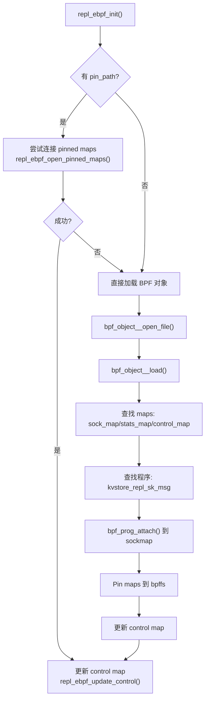
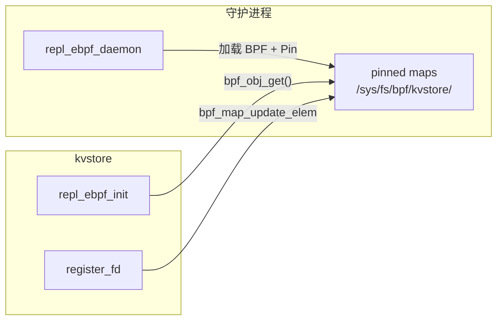
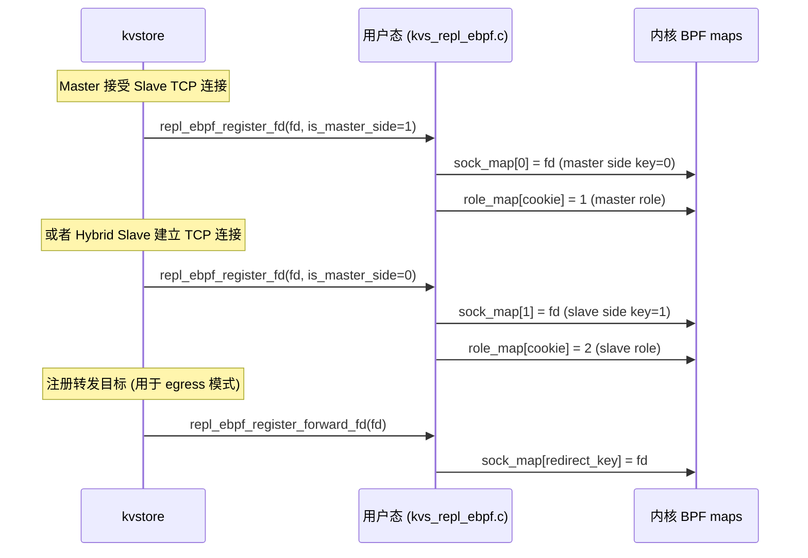
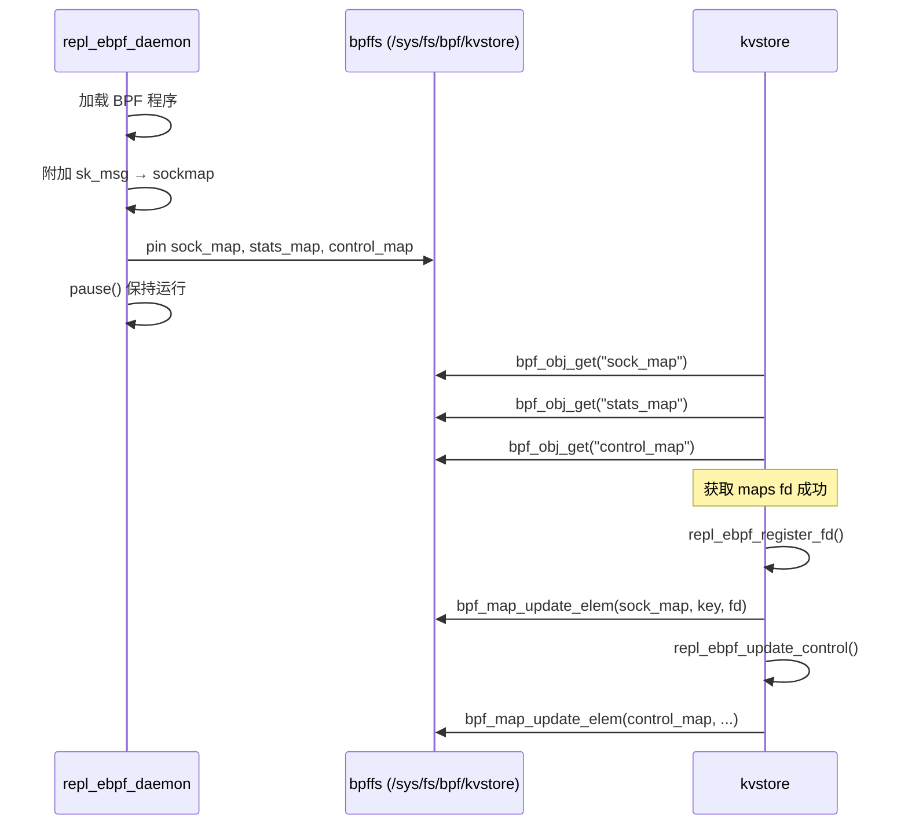
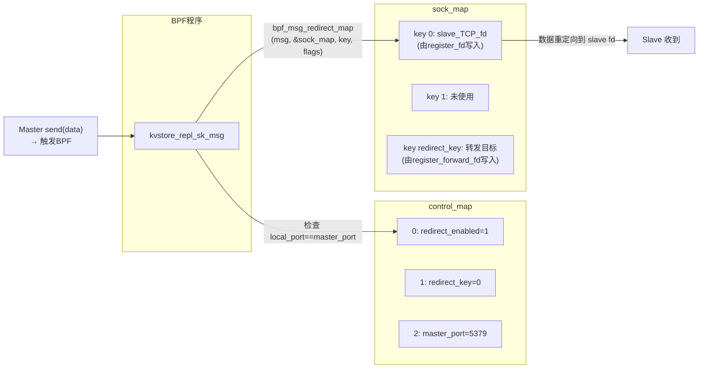
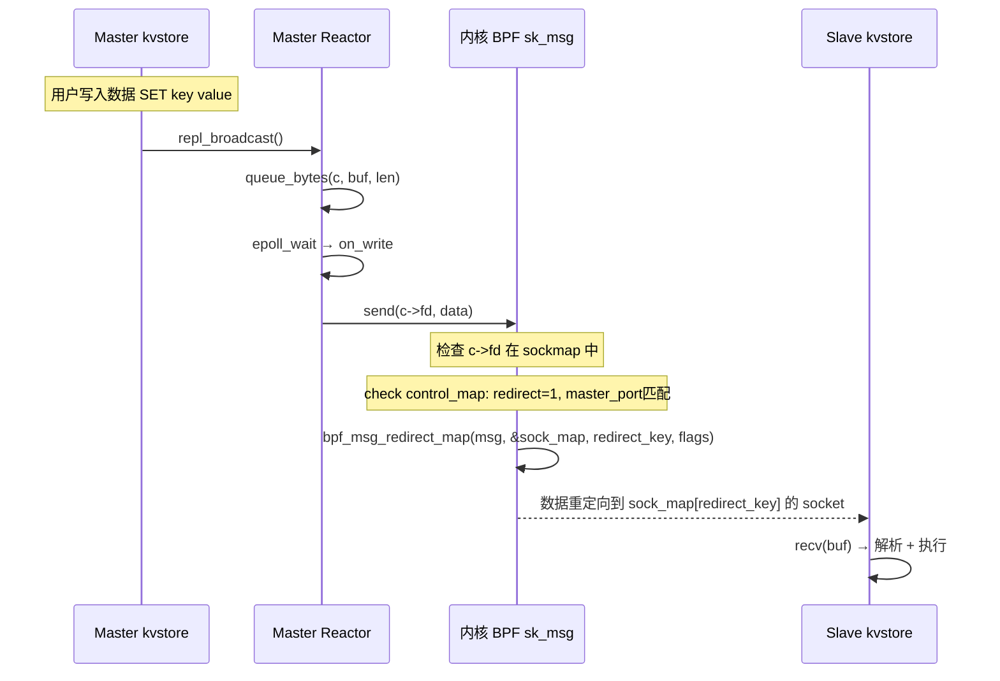

# kvstore eBPF Sockmap 实时同步流程详解

> 本文档从 `main()` 入口开始，逐层追踪 eBPF 实时同步（realtime sync）的完整调用链，涵盖 BPF 程序、用户态控制面、Master/Slave 双端的 sockmap 注册、数据重定向全路径。

---

## 目录

1. [概述：eBPF sockmap 是什么？](#一概述ebpf-sockmap-是什么)
2. [项目结构](#二项目结构)
3. [BPF 程序：repl_sockmap.bpf.c](#三bpf-程序repl_sockmapbpfc)
4. [用户态控制面：kvs_repl_ebpf.c](#四用户态控制面kvs_repl_ebpfc)
5. [独立守护进程：repl_ebpf_daemon](#五独立守护进程repl_ebpf_daemon)
6. [Master 侧：eBPF 实时数据发送](#六master-侧ebpf-实时数据发送)
7. [Slave 侧：eBPF 连接与接收](#七slave-侧ebpf-连接与接收)
8. [完整数据流](#八完整数据流)
9. [关键配置与命令行](#九关键配置与命令行)

---

## 一、概述：eBPF sockmap 是什么？

eBPF sockmap 是 Linux 内核提供的一种**套接字重定向**机制。它允许在 `sendmsg()` 系统调用路径上挂载 BPF 程序，由 BPF 程序决定数据是否重定向到另一个 socket，从而实现**零拷贝转发**。

```
用户态 send(fd, data)
    ↓
内核 TCP 协议栈
    ↓
触发 sk_msg BPF 程序 (因 fd 注册到 sockmap)
    ↓
BPF 执行 bpf_msg_redirect_map()
    ↓
数据直接重定向到 sock_map[redirect_key] 的 socket
    ↓
目标 fd 的内核接收/发送队列
    ↓
远端 slave 收到
```

**关键能力**：数据不经过用户态拷贝，在内核态直接完成转发。

### 两种重定向模式

| 模式 | BPF_F_INGRESS | 数据去向 | 用途 |
|------|:------------:|---------|------|
| **Ingress** | 1 | 目标 socket 的**接收队列** | 本地重定向 (同机) |
| **Egress** | 0 | 目标 socket 的**发送队列** | 跨机器转发 |

---

## 二、项目结构

```
src/replication/bpf/
    repl_sockmap.bpf.c          ← BPF 程序源代码 (编译为 .bpf.o)

src/replication/
    kvs_repl_ebpf.c             ← 用户态 eBPF 控制面 (加载 BPF、管理 maps)

tools/ebpf/
    repl_ebpf_daemon.c          ← 独立 eBPF 守护进程 (独立于 kvstore 主进程)

include/kvstore/
    kvstore.h                     ← eBPF 相关 API 声明

kvstore-ebpf.conf                ← eBPF 守护进程配置文件
```

### 编译方式

```makefile
# BPF 程序编译 (使用 clang 交叉编译为 BPF 字节码)
BPF_CFLAGS=-O2 -g -target bpf -D__TARGET_ARCH_x86 -I/usr/include/x86_64-linux-gnu
build/%.bpf.o: src/%.bpf.c
    clang $(BPF_CFLAGS) -c $< -o $@

# kvstore 主程序 (ENABLE_EBPF=1 时链接 libbpf)
CFLAGS += -DKVS_ENABLE_EBPF=1
LDFLAGS += -lbpf -lelf -lz
```

---

## 三、BPF 程序：repl_sockmap.bpf.c

### 3.1 BPF Maps

BPF 程序定义了 3 个 maps，用于与用户态交换数据：

```c
/* 核心 sockmap：存储 socket fd，key=角色/重定向key，value=fd */
struct {
    __uint(type, BPF_MAP_TYPE_SOCKMAP);
    __uint(max_entries, 4096);
    __type(key, int);
    __type(value, int);
} sock_map SEC(".maps");

/* 统计 map：记录各种事件计数 */
struct {
    __uint(type, BPF_MAP_TYPE_ARRAY);
    __uint(max_entries, 10);   // 见 KVS_EBPF_STAT_* 常量
    __type(key, __u32);
    __type(value, __u64);
} stats_map SEC(".maps");

/* 控制 map：用户态写入配置，BPF 程序读取决策 */
struct {
    __uint(type, BPF_MAP_TYPE_ARRAY);
    __uint(max_entries, 5);    // 见 KVS_EBPF_CTL_* 常量
    __type(key, __u32);
    __type(value, __u32);
} control_map SEC(".maps");
```

### 3.2 control_map 布局

| key | 名称 | 含义 |
|:---:|------|------|
| 0 | REDIRECT_ENABLED | 是否启用重定向 (0/1) |
| 1 | REDIRECT_KEY | sock_map 中的目标 key |
| 2 | MASTER_PORT | Master 的端口号 |
| 3 | LOCAL_PORT | 本机端口号 |
| 4 | REDIRECT_INGRESS | 重定向模式：1=ingress, 0=egress |

### 3.3 stats_map 布局

| key | 名称 | 含义 |
|:---:|------|------|
| 0 | SK_MSG_COUNT | BPF 程序被调用的总次数 |
| 1 | SK_MSG_BYTES | 处理的总字节数 |
| 2 | SK_MSG_PASS | 放行的次数 |
| 3 | SK_MSG_DROP | 丢弃的次数 |
| 4 | REDIRECT_ATTEMPTS | 尝试重定向的次数 |
| 5 | REDIRECT_SUCCESS | 重定向成功的次数 |
| 6 | REDIRECT_FAILURES | 重定向失败的次数 |
| 7-9 | ROLE_UNKNOWN/MASTER/SLAVE | 角色判断统计 |

### 3.4 BPF 主程序逻辑

```c
SEC("sk_msg")
int kvstore_repl_sk_msg(struct sk_msg_md *msg) {
    // 1. 统计数据
    add_stat(SK_MSG_COUNT, 1);
    add_stat(SK_MSG_BYTES, msg->size);

    // 2. 判断当前角色
    role = current_role(msg);   // 通过 local_port vs master_port 判断

    // 3. 如果不是 Master 侧，或重定向未启用 → 放行
    if (!redirect_enabled || role != MASTER_SIDE) {
        return SK_PASS;
    }

    // 4. 执行重定向
    if (ingress_mode) {
        rc = bpf_msg_redirect_map(msg, &sock_map, redirect_key, BPF_F_INGRESS);
    } else {
        rc = bpf_msg_redirect_map(msg, &sock_map, redirect_key, 0);  // egress
    }

    // 5. 统计结果
    if (rc == SK_PASS) {
        add_stat(REDIRECT_SUCCESS, 1);
        return SK_PASS;
    }
    add_stat(REDIRECT_FAILURES, 1);
    return SK_PASS;  // 即使重定向失败，也放行（降级为普通 TCP）
}
```

### 3.5 角色判断：current_role()

```c
static __always_inline __u32 current_role(struct sk_msg_md *msg) {
    __u32 master_port = control_value(CTL_MASTER_PORT);
    if (!master_port) return 0;

    // 如果 local_port == master_port → 这是 Master 端
    if (msg->local_port == master_port)
        return KVS_EBPF_ROLE_MASTER_SIDE;

    // 如果 remote_port 匹配 master_port → 这是 Slave 端
    if (remote_port_matches(msg->remote_port, master_port))
        return KVS_EBPF_ROLE_SLAVE_SIDE;

    return 0;
}
```

通过**端口匹配**判断方向。Master 的端口是 `g_cfg.port`，写入 `control_map[2]`。只有当发送端是 Master 侧时，才执行重定向。

---

## 四、用户态控制面：kvs_repl_ebpf.c

### 4.1 初始化流程



### 4.2 两种加载模式

**模式 1：独立守护进程 (推荐)**



守护进程加载 BPF 程序并 pin maps 到 `bpffs`。kvstore 主进程只需通过 `bpf_obj_get()` 打开 pinned maps，无需 root 权限重新加载 BPF。这样实现了 BPF 加载与主进程的解耦。

**模式 2：主进程直接加载 (传统)**

kvstore 主进程自己调用 `bpf_object__open_file()` → `bpf_object__load()` 加载 BPF 程序。需要 root 权限或 `CAP_BPF`。

### 4.3 FD 注册流程



`sock_map` 的 key 分配：

| key | 用途 |
|:---:|------|
| `0` | Master 侧 socket (接受 slave 连接的 fd) |
| `1` | Slave 侧 socket (连接 master 的 fd) |
| `redirect_key` | 转发目标 fd (Egress 模式跨机器转发) |

### 4.4 关键 API

| 函数 | 作用 |
|------|------|
| `repl_ebpf_init()` | 加载 BPF 程序/pinned maps，初始化 |
| `repl_ebpf_supported()` | 检查是否支持 (始终返回 1) |
| `repl_ebpf_register_fd(fd, is_master_side)` | 将 socket fd 注册到 sockmap |
| `repl_ebpf_register_forward_fd(fd)` | 注册跨机器转发目标 fd |
| `repl_ebpf_unregister_fd(fd)` | 从 sockmap 中移除 fd |
| `repl_ebpf_get_stats(&stats)` | 获取 eBPF 运行统计 |

### 4.5 关键问题：为什么 repl_ebpf_supported() 始终返回 1？

```c
int repl_ebpf_supported(void) {
#if KVS_ENABLE_EBPF
    return 1;
#else
    return 1;   // 注意：即使未定义 KVS_ENABLE_EBPF，也返回 1！
#endif
}
```

这个设计导致：当配置了 `--repl-realtime-transport ebpf` 时，即使没有 BPF 程序加载成功，`g_repl_transport_ebpf_ops.supported` 也是 1，`repl_ebpf_supported()` 也是 1，系统会选择 eBPF 传输。但实际的 `repl_transport_ebpf_send()` 只是调用 `queue_bytes()`，走普通 TCP 路径。所以 eBPF 开启但无 BPF 程序时，数据仍能正常传输（降级为 TCP），只是没有重定向加速。

---

## 五、独立守护进程：repl_ebpf_daemon

### 5.1 设计目的

将 BPF 程序加载从主进程解耦，使得：
1. kvstore 主进程无需 root 权限
2. BPF 程序的生命周期由守护进程管理
3. kvstore 崩溃/重启后 BPF 程序仍持续运行
4. 支持热更新 BPF 程序（重启守护进程即可）

### 5.2 启动流程

```bash
# 1. 挂载 bpffs
mount -t bpf bpf /sys/fs/bpf/
mkdir -p /sys/fs/bpf/kvstore

# 2. 启动守护进程 (后台)
./tools/ebpf/repl_ebpf_daemon \
    --obj build/replication/bpf/repl_sockmap.bpf.o \
    --pin /sys/fs/bpf/kvstore \
    --redirect --redirect-key 0 \
    --daemon

# 3. 启动 kvstore (会自动通过 pinned maps 连接)
./kvstore --config kvstore-master.conf
```

### 5.3 守护进程职责

```
① 打开并加载 BPF 对象文件 (.bpf.o)
② 附加 sk_msg 程序到 sockmap
③ 更新 control map (开启重定向)
④ Pin 3 个 maps 到 /sys/fs/bpf/kvstore/
⑤ 进入 pause() 循环保持运行
⑥ 收到 SIGTERM/SIGINT 时清理退出
```

### 5.4 daemon 与 kvstore 的交互



---

## 六、Master 侧：eBPF 实时数据发送

### 6.1 启动时的 eBPF 初始化

在 `main()` 中：

```c
// src/main/kvstore.c:2015
if (g_cfg.role == ROLE_MASTER &&
    (!strcasecmp(g_cfg.repl_realtime_transport, "ebpf") || ...)) {
    if (repl_ebpf_init() != 0) {
        fprintf(stderr, "repl ebpf: init failed\n");
    }
}
```

### 6.2 Slave 连接时的 FD 注册

当 Master 接受一个 TCP 连接（`on_accept()`）时，如果配置了 eBPF realtime：

```c
// src/main/kvstore.c:984
if (c && (!strcasecmp(g_cfg.repl_realtime_transport, "ebpf") || ...)) {
    c->repl_transport_kind = KVS_REPL_TRANSPORT_EBPF;
    if (repl_ebpf_register_fd(c->fd, 1) != 0) {
        // 注册失败，退化使用 TCP
    }
}
```

同时在 REPLSYNC 处理路径中也会注册。

### 6.3 实时广播路径

```
kvstore.c: repl_broadcast()
    → repl_realtime_send(c, buf, len)
        → repl_transport_ops_for_context(KVS_REPL_SEND_REALTIME)
            → 返回 g_repl_transport_ebpf_ops
        → repl_transport_ebpf_send(c, buf, len)
            → queue_bytes(c, buf, len)   // 写入 reactor 写缓冲区
                → reactor on_write
                    → send(c->fd, ...)    // 触发内核 sk_msg BPF
                        → BPF: bpf_msg_redirect_map(msg, &sock_map, key, flags)
                            → 数据重定向到 slave fd
```

关键点：`repl_transport_ebpf_send()` 本身**不直接调用 BPF**，它只是通过 `queue_bytes()` 写入 reactor 的写缓冲区，后续由 reactor 调用 `send()` 发送。因为该 fd 已被注册到 sockmap，内核在 `send()` 路径上会触发 sk_msg BPF 程序进行重定向。

### 6.4 Master 的两种角色



---

## 七、Slave 侧：eBPF 连接与接收

### 7.1 纯 eBPF 模式

```c
// slave_thread 中
int fd = repl_transport_ops()->connect_slave(host, port);
// 当 transport = ebpf 时:
//   → repl_transport_ebpf_connect_slave()
//     → repl_transport_tcp_connect_slave()  // 先建立 TCP 连接
//     → repl_ebpf_register_fd(fd, 0)        // 注册到 sockmap (slave 侧)
```

Slave 的接收路径走普通 TCP `recv()`：

```c
g_slave_fd = fd;
for (;;) {
    r = recv(fd, buf + blen, sizeof(buf) - blen, 0);
    if (r > 0) {
        parse_resp_stream(NULL, buf, &blen, 1);
        ...
    }
}
```

### 7.2 Hybrid 模式 (RDMA fullsync + eBPF realtime)

参见 [rdma-fullsync-flow.md](./rdma-fullsync-flow.md) 的 Hybrid 部分，这里只提 eBPF 相关的部分：

```c
// Hybrid: TCP 连接 + 注册 eBPF
int tcp_fd = repl_transport_tcp_connect_slave(host, port);
repl_ebpf_register_fd(tcp_fd, 0);   // 注册到 sockmap (可在 slave 侧触发 BPF)

// REPLSYNC 通过 TCP 发送
send(tcp_fd, "REPLSYNC ...", ...);

// 接收循环: TCP 控制命令 + RDMA 全量数据 合并到同一 buf
```

---

## 八、完整数据流

### 8.1 纯 eBPF 实时同步



### 8.2 Ingress vs Egress 重定向

**Ingress 模式 (本地)**：Master 和 Slave 在同一台机器时，数据重定向到目标 socket 的接收队列，Slave 直接 `recv()` 即可。

```
Master send() → BPF redirect → slave socket's recv queue → slave recv() 收到
```

**Egress 模式 (跨机器)**：Master 将数据重定向到**另一个 TCP 连接**（连接到远端 Slave 的 fd），通过内核 TCP 栈发送到远端。

```
Master send() → BPF redirect → forward socket's send queue
    → 内核 TCP → 网络 → 远端 Slave → recv() 收到
```

### 8.3 调用链总览

```
main()
  ├── repl_ebpf_init()                     ← 加载/连接 BPF
  │     ├── repl_ebpf_open_pinned_maps()    ← 尝试连接已 pin 的 maps
  │     └── repl_ebpf_load_object()        ← 直接加载 BPF 对象
  │           ├── bpf_object__open_file()
  │           ├── bpf_object__load()
  │           ├── 查找 maps + sk_msg 程序
  │           ├── bpf_prog_attach(sk_msg_fd, sock_map_fd, BPF_SK_MSG_VERDICT)
  │           └── repl_ebpf_update_control()
  │
  ├── reactor_start()                      ← 事件循环
  │     ├── on_accept()                    ← 接受 Slave TCP 连接
  │     │     └── repl_ebpf_register_fd(fd, 1)
  │     │           └── bpf_map_update_elem(sock_map, 0, fd)
  │     │
  │     ├── repl_broadcast()               ← 实时数据广播
  │     │     └── repl_realtime_send()
  │     │           └── repl_transport_ebpf_send()
  │     │                 └── queue_bytes()
  │     │                       └── send(fd) → 触发 BPF sk_msg
  │     │
  │     └── on_read/parse_resp_stream       ← 处理 REPLSYNC 等命令
  │           └── repl_ebpf_register_fd(c->fd, 1)  ← Master 侧注册
  │
  └── start_slave_thread()                 ← Slave 线程
        └── repl_transport_ebpf_connect_slave()
              ├── repl_transport_tcp_connect_slave()  ← 建 TCP 连接
              └── repl_ebpf_register_fd(fd, 0)        ← Slave 侧注册
```

---

## 九、关键配置与命令行

### 9.1 配置项

| 配置项 | 默认值 | 说明 |
|--------|--------|------|
| `ebpf_enabled` | 0 | 启用 eBPF (编译时需 `ENABLE_EBPF=1`) |
| `ebpf_obj_path` | "" | BPF 对象文件路径 (如 `build/replication/bpf/repl_sockmap.bpf.o`) |
| `ebpf_pin_path` | "" | bpffs pin 路径 (如 `/sys/fs/bpf/kvstore`) |
| `ebpf_redirect` | 0 | 启用 sockmap 重定向 |
| `ebpf_redirect_key` | 0 | sockmap 中的目标 key |
| `ebpf_forward` | 0 | 跨机器转发模式 (egress) |
| `repl_realtime_transport` | "ebpf" | 实时同步传输层 |

### 9.2 命令行参数

```bash
# 使用 eBPF 实时同步 (纯 eBPF 模式)
./kvstore --config kvstore-master.conf
# 配置: repl_realtime_transport=ebpf

# 使用 RDMA 全量 + eBPF 实时 (Hybrid)
./kvstore --repl-fullsync-transport rdma --repl-realtime-transport ebpf

# 使用 TCP 实时 (无 eBPF)
./kvstore --repl-realtime-transport tcp
```

### 9.3 eBPF 守护进程

```bash
# 编译
make repl_ebpf_daemon
# 或: gcc -o repl_ebpf_daemon tools/ebpf/repl_ebpf_daemon.c -lbpf -lelf -lz

# 前台运行
./repl_ebpf_daemon \
    -o build/replication/bpf/repl_sockmap.bpf.o \
    -p /sys/fs/bpf/kvstore -r -k 0

# 后台运行 (推荐)
./repl_ebpf_daemon \
    -o build/replication/bpf/repl_sockmap.bpf.o \
    -p /sys/fs/bpf/kvstore -r -k 0 -d

# 使用配置文件
./repl_ebpf_daemon -c kvstore-ebpf.conf -d
```

### 9.4 查看 eBPF 统计

通过 kvstore 的 `INFO` 命令查看 eBPF 状态:

```
ebpf_initialized:1
ebpf_compiled:1
ebpf_register_attempts:3
ebpf_register_failures:1
ebpf_redirect_enabled:1
ebpf_last_error:register_sock_map_master_key
```

---

## 附录：关键设计决策

### 为什么 repl_ebpf_supported() 始终返回 1？

这是一个**主动降级设计**。即使 BPF 程序加载失败，eBPF 传输层的 `.send` 操作 (`repl_transport_ebpf_send`) 实际上只调用 `queue_bytes()`，走普通 TCP 路径。eBPF 只是叠加在 TCP 之上的加速层——加载成功时数据被 BPF 重定向，加载失败时数据通过普通 TCP 传输。这样可以保证即使 eBPF 环境有问题，复制功能也不会中断。

### 为什么需要独立守护进程？

1. **权限分离**：BPF 程序加载需要 root/CAP_BPF，而主进程可以降权运行
2. **生命周期解耦**：kvstore 重启时 BPF 程序不中断，sockmap 中的 fd 仍然有效
3. **热更新**：可以重启守护进程加载新版 BPF 程序，无需重启 kvstore
4. **故障隔离**：BPF 加载失败不影响 kvstore 启动（降级为 TCP）
