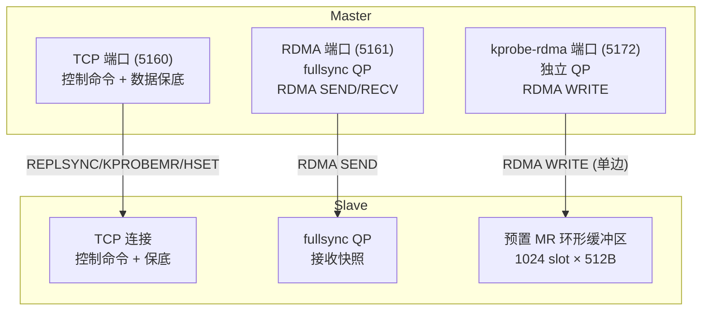
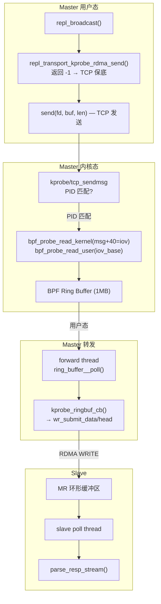
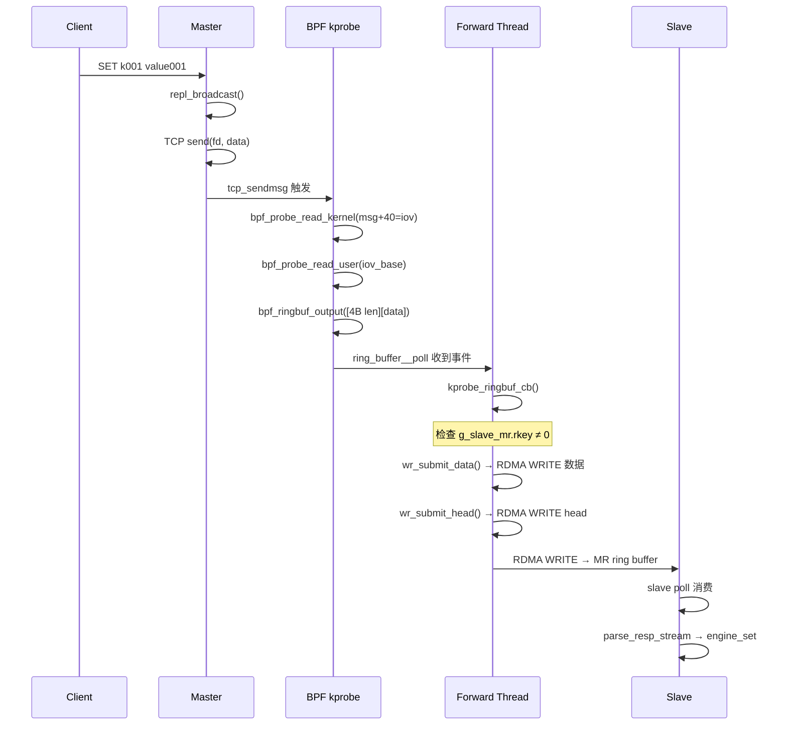
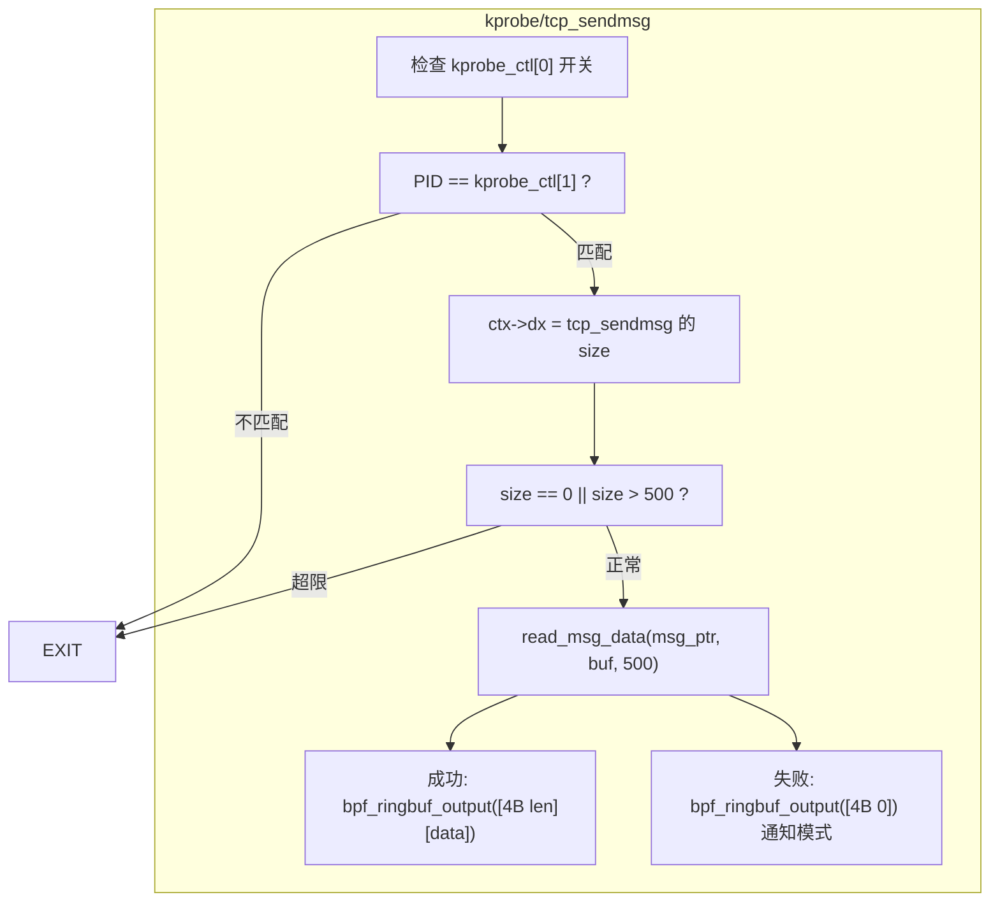
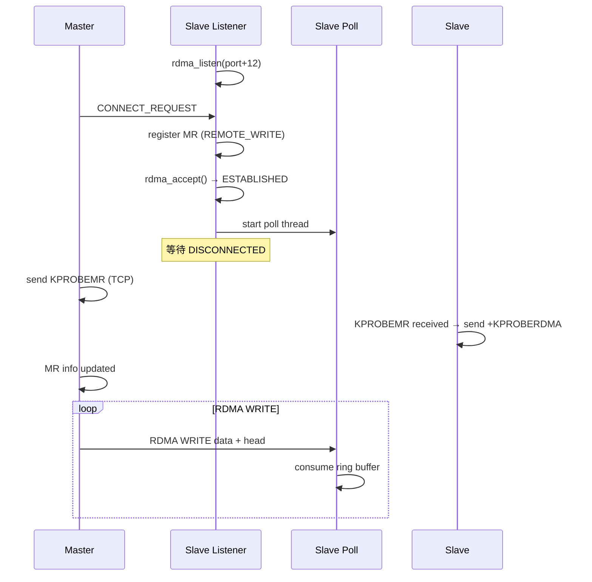
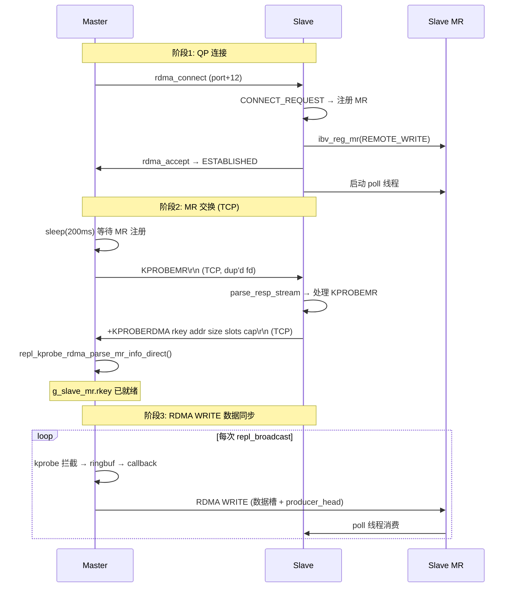

# kprobe + RDMA 增量同步实现详解

> 本文档从代码层面逐层剖析 kvstore 中 kprobe+RDMA 增量同步的完整实现。
> kprobe 透明拦截 TCP send 路径，通过 BPF ringbuf 传递到用户态转发模块，
> 再由 **RDMA WRITE（单边）** 直接写入 Slave 预置 MR 环形缓冲区。
> 格式与 `tech-roadmap.md` 一致。

---

## 目录

1. [整体架构概览](#1-整体架构概览)
2. [BPF kprobe 程序](#2-bpf-kprobe-程序)
3. [用户态转发模块](#3-用户态转发模块)
4. [RDMA WRITE 操作](#4-rdma-write-操作)
5. [Slave 侧处理](#5-slave-侧处理)
6. [建链与 MR 交换流程](#6-建链与-mr-交换流程)
7. [Transport 集成](#7-transport-集成)
8. [关键实现细节](#8-关键实现细节)
9. [关键代码位置索引](#9-关键代码位置索引)

---

## 1. 整体架构概览

### 1.1 通道架构

kprobe+RDMA 增量同步使用**独立的 RDMA WRITE QP**，与 TCP 保底链路和 fullsync QP 分离：



**关键点**：
- kprobe-rdma 使用**独立 QP**（`g_rdma_kprobe`），与 fullsync QP（`g_repl_rdma_ctx`）完全隔离
- 端口默认 `base_port + 12`（如 5160→5172）
- TCP 保底路径始终运行，Slave 通过 `repl_offset` 去重
- BPF 程序通过 PID 过滤，只捕获 kvstore 进程的 TCP 发送

### 1.2 数据路径全景



### 1.3 数据流时序



---

## 2. BPF kprobe 程序

### 2.1 文件位置

`src/replication/bpf/repl_kprobe.bpf.c`（约 240 行）

### 2.2 程序结构



### 2.3 核心函数：读取 iovec 数据

**关键发现**：通过 `bpftool btf dump id 1` 确认 kernel 5.15 的 `iov_iter` 布局：

```
iov_iter (40 bytes):
  offset  0: iter_type(1) + nofault(1) + data_source(1) + pad(5) = 8B
  offset  8: iov_offset    (size_t, 8B)   ← 当前迭代位置
  offset 16: count         (size_t, 8B)   ← 剩余字节数
  offset 24: iov           (union, 8B)    ← iovec 指针！不是 offset 8!
  offset 32: nr_segs       (union, 8B)    ← 段数
```

因此：**`iov` 在 `msg + 16 + 24 = msg + 40`**

```c
static __always_inline int read_msg_data(unsigned long msg_ptr,
    unsigned char *buf, int max_len)
{
    /* 1. 读 iov 指针 — bpf_probe_read_kernel(msg+40) */
    const struct { unsigned long b; unsigned long l; } *iov = 0;
    bpf_probe_read_kernel(&iov, sizeof(iov), (const void *)(msg_ptr + 40));
    if (!iov) return 0;

    /* 2. 读 nr_segs — bpf_probe_read_kernel(msg+48) */
    unsigned long nr_segs = 0;
    bpf_probe_read_kernel(&nr_segs, sizeof(nr_segs), (const void *)(msg_ptr + 48));
    if (nr_segs == 0) return 0;

    /* 3. 读第一个 iovec — bpf_probe_read_kernel(iov[0]) */
    /*    iov 是内核栈上的 iovec（send 系统调用创建） */
    struct { unsigned long b; unsigned long l; } vec;
    bpf_probe_read_kernel(&vec, sizeof(vec), &iov[0]);
    if (!vec.b || vec.l == 0) return 0;

    /* 4. 读用户空间数据 — bpf_probe_read_user(iov_base) */
    unsigned long long safe_len = vec.l;
    if (safe_len > (unsigned long long)max_len) safe_len = (unsigned long long)max_len;
    bpf_probe_read_user(buf, (__u32)safe_len, (const void *)(unsigned long)vec.b);
    return (int)safe_len;
}
```

### 2.4 BPF Maps

| Map | 类型 | 用途 | 大小 |
|-----|------|------|------|
| `kprobe_ctl` | `BPF_MAP_TYPE_ARRAY` | `[0]=enabled, [1]=pid` | 8 entries |
| `kprobe_stats` | `BPF_MAP_TYPE_ARRAY` | hit, skip_pid, rb_err 等 | 16 entries |
| `repl_ringbuf` | `BPF_MAP_TYPE_RINGBUF` | 内核→用户态数据通道 | 1MB |
| `kprobe_tmpbuf` | `BPF_MAP_TYPE_PERCPU_ARRAY` | 504B 临时缓冲区（绕过栈限制） | 1 entry/CPU |

```c
/* kprobe_ctl: 控制参数 */
struct { __uint(type, BPF_MAP_TYPE_ARRAY); ... } kprobe_ctl SEC(".maps");
/* kprobe_stats: 统计计数器 */
struct { __uint(type, BPF_MAP_TYPE_ARRAY); ... } kprobe_stats SEC(".maps");
/* repl_ringbuf: 数据通道 */
struct { __uint(type, BPF_MAP_TYPE_RINGBUF); ... } repl_ringbuf SEC(".maps");
/* kprobe_tmpbuf: 临时缓冲区（per-CPU，避免栈溢出） */
struct { __uint(type, BPF_MAP_TYPE_PERCPU_ARRAY); ... } kprobe_tmpbuf SEC(".maps");
```

### 2.5 `struct pt_regs` 定义

BPF target 下系统头文件不可用，需手动定义，且字段名必须与内核 BTF 匹配：

```c
struct pt_regs {
    unsigned long r15;    unsigned long r14;
    unsigned long r13;    unsigned long r12;
    unsigned long bp;     unsigned long bx;    // 注意: bp, bx (无 r 前缀)
    unsigned long r11;    unsigned long r10;
    unsigned long r9;     unsigned long r8;
    unsigned long ax;     unsigned long cx;    // 注意: ax, cx
    unsigned long dx;     unsigned long si;    // 第3参数: size, 第2参数: msg
    unsigned long di;     unsigned long orig_ax;// 第1参数: sk
    unsigned long ip;     unsigned long cs;
    unsigned long flags;  unsigned long sp;
    unsigned long ss;
};
```

---

## 3. 用户态转发模块

### 3.1 文件位置

`src/replication/kvs_repl_kprobe.c`（约 1040 行）

### 3.2 转发线程

```c
static void *kprobe_rdma_forward_thread(void *arg) {
    fprintf(stderr, "kprobe rdma: forward thread running, ringbuf=%p\n",
        (void*)g_kprobe_ringbuf);

    while (g_kprobe_running && g_rdma_kprobe.connected) {
        if (g_kprobe_ringbuf) {
            int err = ring_buffer__poll(g_kprobe_ringbuf, 5 /* ms */);
            if (err < 0) usleep(1000);
        } else {
            usleep(10000);
        }
    }
    return NULL;
}
```

### 3.3 Ringbuf 回调

```c
static int kprobe_ringbuf_cb(void *ctx, void *data, size_t size) {
    if (size < 4) return 0;

    uint32_t payload_len;
    memcpy(&payload_len, data, 4);
    if (payload_len == 0 || payload_len + 4 > size) return 0;

    g_total_events++;
    g_total_bytes += payload_len;

    /* ★ MR 未就绪时跳过 RDMA WRITE */
    if (g_slave_mr.rkey == 0 || !g_rdma_kprobe.connected) return 0;

    /* 获取 WRITE slot */
    int slot;
    if (wr_slot_acquire(5000, &slot) != 0) return -1;

    /* 构造 [4B len][payload] */
    uint32_t net_len = payload_len;
    memcpy(g_wr_slots[slot].buf, &net_len, 4);
    memcpy(g_wr_slots[slot].buf + 4, payload, payload_len);

    /* RDMA WRITE 数据 */
    if (wr_submit_data(slot, payload_len + 4) != 0) return -1;
    /* RDMA WRITE 更新 producer_head */
    if (wr_submit_head(slot) != 0) return -1;

    g_wr_in_flight++;
    g_wr_producer_seq++;
    g_rdma_writes++;
    return 0;
}
```

---

## 4. RDMA WRITE 操作

### 4.1 WRITE Slot 管理

```c
#define KVS_RDMA_WRITE_SLOTS        8      /* 并发 WRITE slot 数 */
#define KVS_RDMA_WRITE_SLOT_SIZE    512    /* 每 slot 容量 */

typedef struct rdma_write_slot_s {
    unsigned char buf[512] __attribute__((aligned(64)));
    struct ibv_mr *mr;
    volatile int in_flight;
} rdma_write_slot_t;

static rdma_write_slot_t g_wr_slots[8];
```

slot 获取 + CQ 回收：

```c
static int wr_slot_acquire(int timeout_ms, int *out) {
    /* 先找空闲 slot */
    for (int i = 0; i < 8; i++) {
        int idx = (g_wr_head + i) % 8;
        if (!g_wr_slots[idx].in_flight) {
            g_wr_head = (idx + 1) % 8;
            g_wr_slots[idx].in_flight = 1;
            *out = idx;
            return 0;
        }
    }
    /* 全部 in_flight → 轮询 CQ 回收 */
    pthread_mutex_lock(&g_kprobe_rdma_lock);
    while (ibv_poll_cq(g_rdma_kprobe.cq, 1, &wc) > 0) {
        if (wc.status == IBV_WC_SUCCESS) {
            int slot = (int)(wc.wr_id & 0xFFFF);
            if (slot < 8) { g_wr_slots[slot].in_flight = 0; g_wr_in_flight--; }
        }
    }
    pthread_mutex_unlock(&g_kprobe_rdma_lock);
    /* 超时或重试 */
}
```

### 4.2 RDMA WRITE 数据

```c
static int wr_submit_data(int slot, size_t len) {
    /* 计算槽位在 Slave MR 中的偏移 */
    uint64_t slot_idx = (uint64_t)(g_wr_producer_seq % g_slave_mr.slot_count);
    uint64_t remote_off = slot_idx * g_slave_mr.slot_capacity;

    /* 构造 WR */
    wr.wr_id = (uint64_t)slot;           /* 低16位 = slot 索引 */
    wr.opcode = IBV_WR_RDMA_WRITE;
    wr.send_flags = IBV_SEND_SIGNALED | IBV_SEND_FENCE;
    wr.wr.rdma.remote_addr = g_slave_mr.remote_data_base + remote_off;
    wr.wr.rdma.rkey = g_slave_mr.rkey;

    pthread_mutex_lock(&g_kprobe_rdma_lock);
    int rc = ibv_post_send(g_rdma_kprobe.id->qp, &wr, &bad);
    pthread_mutex_unlock(&g_kprobe_rdma_lock);
    return rc;
}
```

### 4.3 RDMA WRITE 更新 producer_head

```c
static int wr_submit_head(int slot) {
    uint64_t new_head = (uint64_t)(g_wr_producer_seq + 1);
    memcpy(g_wr_slots[slot].buf, &new_head, 8);  /* 复用 slot buf */

    wr.wr_id = (uint64_t)slot | 0x10000;         /* 高位标记 head */
    wr.opcode = IBV_WR_RDMA_WRITE;
    wr.send_flags = IBV_SEND_SIGNALED;
    wr.wr.rdma.remote_addr = g_slave_mr.remote_head_addr;
    wr.wr.rdma.rkey = g_slave_mr.rkey;

    return ibv_post_send(g_rdma_kprobe.id->qp, &wr, &bad);
}
```

**FENCE 的作用**：`wr_submit_data` 带 `IBV_SEND_FENCE`，保证数据 WRITE 完成后再
更新 head。没有 FENCE，head 可能先于数据到达 Slave，导致读到不完整数据。

---

## 5. Slave 侧处理

### 5.1 Slave Listener

**文件**: `src/replication/kvs_repl_kprobe.c` → `kprobe_rdma_slave_listener()`

监听 `base_port + 12`（如 5160+12=5172）：



### 5.2 Slave Poll 线程

```c
static void *kprobe_rdma_slave_poll(void *arg) {
    kprobe_rdma_ringbuf_t *rb = g_slave_ringbuf;
    unsigned char stream_buf[BUFFER_CAP];
    size_t stream_len = 0;

    while (g_kprobe_running) {
        __sync_synchronize();
        uint64_t head = rb->producer_head;   /* Master RDMA WRITE 更新 */
        uint64_t tail = rb->consumer_tail;   /* 本地更新 */

        if (tail == head) { usleep(100); continue; }

        while (tail != head) {
            size_t idx = tail % KPROBE_RDMA_SLOT_COUNT;
            size_t off = idx * KPROBE_RDMA_SLOT_CAPACITY;

            uint32_t slot_len;
            memcpy(&slot_len, rb->slots + off, 4);
            if (slot_len == 0 || slot_len > KPROBE_RDMA_SLOT_CAPACITY - 4) {
                tail++; continue;
            }

            /* 拼接 RESP 流 */
            if (stream_len + slot_len > sizeof(stream_buf))
                stream_len = 0;
            memcpy(stream_buf + stream_len, rb->slots + off + 4, slot_len);
            stream_len += slot_len;
            parse_resp_stream(NULL, stream_buf, &stream_len, 1);
            tail++;
        }
        rb->consumer_tail = tail;
        __sync_synchronize();
    }
    return NULL;
}
```

### 5.3 MR 环形缓冲区

```c
/* include/kvstore/replication/repl_kprobe.h */
#define KPROBE_RDMA_SLOT_COUNT      1024
#define KPROBE_RDMA_SLOT_CAPACITY   512
#define KPROBE_RDMA_RINGBUF_SIZE    (16 + 1024 * 512)  /* ≈512KB */

typedef struct __attribute__((packed)) kprobe_rdma_ringbuf_s {
    volatile uint64_t producer_head;   /* 偏移 0 — RDMA WRITE 更新 */
    volatile uint64_t consumer_tail;   /* 偏移 8 — Slave 本地更新 */
    unsigned char slots[1024 * 512];
} kprobe_rdma_ringbuf_t;

/* 每个 slot 格式:
 *   [4 bytes: payload_len (uint32_t)]
 *   [payload_len bytes: RESP 命令数据] */
```

---

## 6. 建链与 MR 交换流程

### 6.1 完整时序



### 6.2 MR 信息交换

**Master → Slave**（TCP 控制通道）：

```
KPROBEMR\r\n
```

**Slave → Master**（TCP 响应）：

```
+KPROBERDMA <rkey> <addr> <total_size> <slot_count> <slot_cap>\r\n
```

示例：
```
+KPROBERDMA 3655384576 139733514981392 524304 1024 512\r\n
```

### 6.3 Master 侧解析

```c
/* src/main/kvstore.c - handle_parsed_command */
if (!strcmp(cmd, "KPROBEMR")) {
    /* Slave 收到 KPROBEMR 请求：返回 MR 信息 */
    char resp[384];
    int rn = repl_kprobe_rdma_get_mr_text(resp, sizeof(resp));
    if (rn > 0) {
        if (c) {
            queue_bytes(c, (unsigned char *)resp, (size_t)rn);
        } else if (g_slave_fd >= 0) {
            send(g_slave_fd, resp, (size_t)rn, MSG_NOSIGNAL);
        }
    }
    return 0;
}
```

```c
/* src/replication/kvs_repl_kprobe.c - MR 信息解析 */
int repl_kprobe_rdma_parse_mr_info_direct(uint32_t rkey, uint64_t addr,
    size_t total_size, size_t slot_count, size_t slot_capacity)
{
    g_slave_mr.rkey = rkey;
    g_slave_mr.remote_data_base = addr + 16;  /* 跳过 head(8)+tail(8) */
    g_slave_mr.remote_head_addr = addr;       /* head 在偏移 0 */
    g_slave_mr.slot_count = slot_count;
    g_slave_mr.slot_capacity = slot_capacity;
    fprintf(stderr, "kprobe rdma: MR info updated - rkey=%u ...\n",
        rkey, (unsigned long)addr);
    return 0;
}
```

---

## 7. Transport 集成

### 7.1 transport ops

```c
/* src/replication/kvs_repl.c */
static const repl_transport_ops_t g_repl_transport_kprobe_rdma_ops = {
    .name = "kprobe-rdma",
    .supported = KVS_ENABLE_KPROBE_RDMA,
    .send = repl_transport_kprobe_rdma_send,
    .connect_slave = repl_transport_kprobe_rdma_connect_slave,
    .disconnect_slave = repl_transport_kprobe_rdma_disconnect_slave,
};
```

### 7.2 send 函数

```c
static int repl_transport_kprobe_rdma_send(conn_t *c,
    const unsigned char *buf, size_t len)
{
    if (!c || c->fd <= 2 || !KVS_ENABLE_KPROBE_RDMA) return 0;

    /* 首次调用：后台连接 Slave MR listener */
    static volatile int mr_connect_started = 0;
    if (!mr_connect_started) {
        getpeername(c->fd, &peer, &peer_len);
        mr_connect_started = 1;
        a->port = g_cfg.port;
        a->tcp_fd = dup(c->fd);
        pthread_create(&tid, NULL, kprobe_mr_connect_thread, a);
    }
    /* 始终返回 -1，触发 TCP 保底发送 */
    return -1;
}
```

**设计原因**：TCP 保底是必需的——kprobe 拦截的就是 TCP send 路径上的数据。
没有 TCP 发送就没有数据源，也就没有 RDMA WRITE。

### 7.3 配置方式

```bash
# 启动 Master
sudo ./kvstore --port 5160 --role master \
  --repl-fullsync-transport rdma \
  --repl-realtime-transport kprobe-rdma \
  --rdma-dev siw0 --kprobe-enabled

# 启动 Slave
sudo ./kvstore --port 5161 --role slave \
  --master-host 192.168.233.128 --master-port 5160 \
  --repl-fullsync-transport rdma \
  --repl-realtime-transport kprobe-rdma \
  --kprobe-enabled 2>&1 | tee /tmp/slave.log
```

---

## 8. 关键实现细节

### 8.1 为什么 iov 在 msg+40？

通过 `bpftool btf dump id 1` 检查 kernel 5.15 的 BTF，发现 `iov_iter` 布局与常识不同：

| 想当然的布局 | 实际布局 (kernel 5.15) |
|------------|----------------------|
| iter_type+pad = 8B | iter_type+nofault+data_source+pad = 8B |
| **iov** (8B) | **iov_offset** (8B) ← 不在这里！ |
| nr_segs (8B) | **count** (8B) ← 不在这里！ |
| iov_offset (8B) | **iov** (8B) ← 在这里！ |
| count (8B) | **nr_segs** (8B) ← 在这里！ |

`iov` 在 `msg + 16 + 24 = msg + 40`（msghdr 中 msg_iter 在 offset 16，
iov_iter 中 iov 在 offset 24）。

### 8.2 probe_read 策略

| 数据 | 位置 | 使用的 helper |
|------|------|-------------|
| `msg` 内核指针 | 内核栈 | `bpf_probe_read_kernel` |
| `msg+40` (iov) | 内核栈 | `bpf_probe_read_kernel` |
| `iov[0]` (iovec) | 内核栈 | `bpf_probe_read_kernel` |
| `iov_base` (数据) | 用户空间 | `bpf_probe_read_user` |

### 8.3 MR 未就绪保护

回调中检查 `g_slave_mr.rkey`，避免在 MR 信息交换完成前做 RDMA WRITE：

```
时间线:
  QP connected            ← kprobe-rdma QP 就绪
  forward thread start    ← 开始轮询 ringbuf
  ringbuf 收到 50000+ 事件  ← 全量同步产生的 TCP 数据
    回调检查 rkey: 0 → 跳过 WRITE   ← 关键保护！
  KPROBEMR sent           ← MR 请求发送
  +KPROBERDMA received    ← MR 信息到达
  g_slave_mr.rkey 已设置   ← 后续事件开始 RDMA WRITE
```

### 8.4 BPF 栈限制

BPF 程序的栈限制为 512 字节。`entry[504]`（4B header + 500B data）接近极限。
使用 `BPF_MAP_TYPE_PERCPU_ARRAY` 作为临时缓冲区绕过此限制。

### 8.5 QP 独立设计

| QP | 端口 | 用途 | 生命周期 |
|----|------|------|---------|
| `g_repl_rdma_ctx` | 5161 | 全量同步 RDMA SEND/RECV | fullsync 阶段 |
| `g_rdma_kprobe` | 5172 | 增量同步 RDMA WRITE | 整个复制期间 |

两个 QP 完全独立，互不影响。

---

## 9. 关键代码位置索引

### 9.1 源文件

| 文件 | 行号 | 内容 |
|------|------|------|
| `src/replication/bpf/repl_kprobe.bpf.c` | 1-240 | BPF kprobe 程序全文 |
| `src/replication/kvs_repl_kprobe.c` | 1-100 | 常量、全局变量定义 |
| `src/replication/kvs_repl_kprobe.c` | 100-110 | 函数声明 |
| `src/replication/kvs_repl_kprobe.c` | 120-195 | BPF 加载与 kprobe attach |
| `src/replication/kvs_repl_kprobe.c` | 207-240 | `wr_slot_acquire()` — slot 获取 + CQ 回收 |
| `src/replication/kvs_repl_kprobe.c` | 242-295 | `wr_submit_data()` / `wr_submit_head()` |
| `src/replication/kvs_repl_kprobe.c` | 314-345 | `kprobe_ringbuf_cb()` — ringbuf 回调 |
| `src/replication/kvs_repl_kprobe.c` | 357-395 | `kprobe_rdma_forward_thread()` |
| `src/replication/kvs_repl_kprobe.c` | 395-460 | `kprobe_rdma_slave_poll()` |
| `src/replication/kvs_repl_kprobe.c` | 460-530 | `kprobe_rdma_qp_connect()` |
| `src/replication/kvs_repl_kprobe.c` | 640-695 | `repl_kprobe_rdma_slave_accept()` |
| `src/replication/kvs_repl_kprobe.c` | 710-770 | `repl_kprobe_rdma_master_init()` |
| `src/replication/kvs_repl_kprobe.c` | 780-920 | `kprobe_rdma_slave_listener()` |
| `src/replication/kvs_repl_kprobe.c` | 960-980 | `repl_kprobe_rdma_parse_mr_info_direct()` |
| `src/replication/kvs_repl.c` | 1336-1395 | `repl_transport_kprobe_rdma_send()` |
| `src/replication/kvs_repl.c` | 1564-1585 | `repl_transport_ops_for_context()` |
| `src/replication/kvs_repl.c` | 1602-1610 | `repl_realtime_send()` |
| `src/main/kvstore.c` | 1035-1046 | +KPROBERDMA 命令处理 |

### 9.2 头文件

| 文件 | 内容 |
|------|------|
| `include/kvstore/replication/repl_kprobe.h` | MR 环形缓冲区定义、函数声明 |
| `include/kvstore/kvstore.h` | 配置项 `repl_kprobe_obj_path`, `kprobe_enabled` |

### 9.3 相关文档

| 文档 | 内容 |
|------|------|
| `docs/rdma-fullsync-implementation.md` | RDMA 全量同步实现 |
| `docs/kprobe-rdma-debug-diagnosis.md` | 问题排查手册（11 个问题） |
| `docs/tech-roadmap.md` | 技术路线总览 (§6.7) |
| `docs/iteration-summary.md` | 迭代过程 (§4.8) |
| `README.md` | 项目总览（kprobe+RDMA badge） |
