# kvstore 项目全面分析

> 本文档从功能、实现、设计决策三个维度，全面分析 kvstore 高性能键值存储系统。
> 涵盖存储引擎、网络模型、持久化、复制、TTL、内存管理、协议等核心模块。

---

## 目录

1. [项目概览](#1-项目概览)
2. [存储引擎层](#2-存储引擎层)
3. [网络模型层](#3-网络模型层)
4. [持久化层](#4-持久化层)
5. [复制层](#5-复制层)
6. [TTL 过期系统](#6-ttl-过期系统)
7. [内存管理层](#7-内存管理层)
8. [协议层](#8-协议层)
9. [配置与命令行系统](#9-配置与命令行系统)
10. [测试体系](#10-测试体系)

---

## 1. 项目概览

### 1.1 项目定位

kvstore 是一个用 **C 语言**实现的**类 Redis 键值存储系统**，面向学习和研究。

**核心特性**：

| 特性 | 说明 |
|------|------|
| 多存储引擎 | Array / Hash / RBTREE / Skiptable / Doc |
| 多网络模型 | Reactor(epoll) / Proactor(io_uring) / 协程(NtyCo) |
| 多内存后端 | libc / jemalloc / 自研 slab+mmap |
| 持久化 | 全量 Dump (KVSD 二进制) + 增量 AOF (RESP) |
| 主从复制 | TCP / RDMA / eBPF sockmap / kprobe+RDMA |
| 过期策略 | 哈希索引 + 最小堆 |
| 文档型 Value | 字段级别的哈希存储 |
| 哨兵 | 主节点故障检测与自动切换 |

### 1.2 整体架构

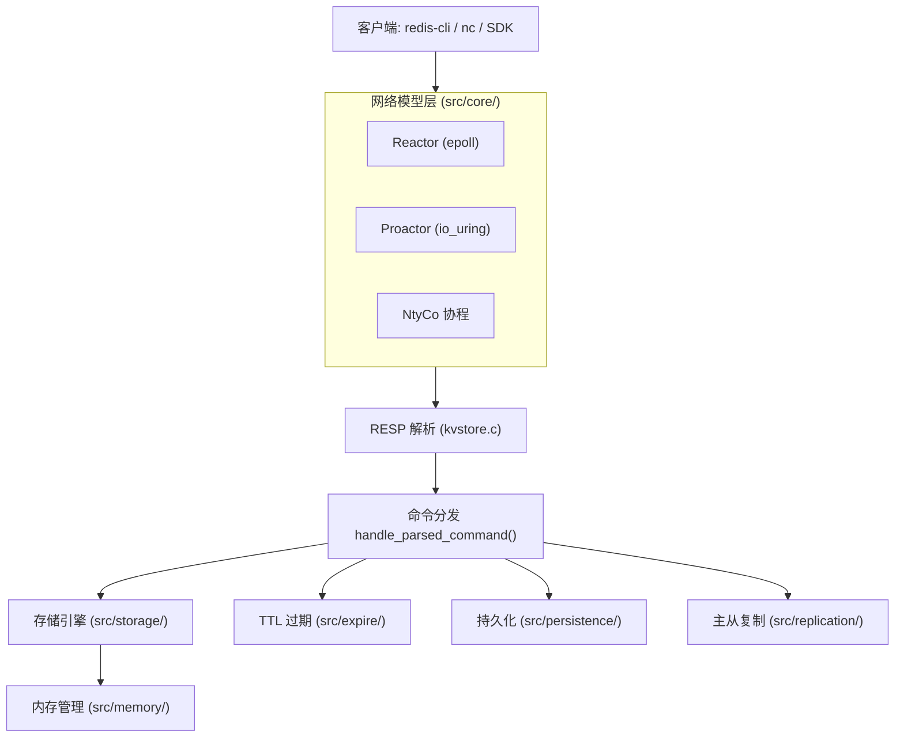

### 1.3 为什么这么设计？

| 设计选择 | 原因 |
|---------|------|
| 多种存储引擎 | 用同一套 RESP 协议适配不同数据结构，对比学习不同数据结构的性能特性 |
| 多种网络模型 | 同一业务逻辑用三种不同 I/O 模型实现，理解 epoll/io_uring/协程的本质差异 |
| 多种传输层 | TCP/RDMA/eBPF/kprobe 四种路径，覆盖从传统网络到内核旁路的技术演进 |
| RESP 协议 | 兼容 Redis 协议栈，可直接用 redis-cli 连接，生态复用 |

---

## 2. 存储引擎层

### 2.1 为什么需要五种存储引擎？

不同的数据结构在**不同的访问模式**下各有优劣：

| 引擎 | 数据结构 | 时间复杂度 | 适用场景 |
|------|----------|-----------|---------|
| **Array** | 动态数组 + 线性查找 | O(n) | 小数据量 (<1024)，学习用 |
| **Hash** | 链地址哈希表 (FNV-1a) | O(1) avg | 通用场景，大量 key |
| **RBTREE** | 红黑树 | O(log n) | 有序存储，范围查询 |
| **Skiptable** | 跳表 (概率平衡) | O(log n) avg | 有序存储，实现简单 |
| **Doc** | 哈希表 + 字段哈希 | O(1) | 文档型 value |

**同时实现红黑树和跳表的原因**：两者都是有序数据结构但实现思路完全不同。红黑树通过旋转保持平衡，跳表通过概率层数实现平衡。对比实现有助于理解数据结构的本质。

### 2.2 Hash 引擎

**实现**：链地址法解决冲突，FNV-1a 非加密哈希。

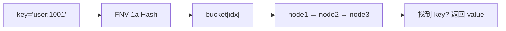

```c
// FNV-1a 哈希函数
static int _hash(char *key, int size) {
    unsigned int sum = 2166136261u;  // FNV offset basis
    for (int i = 0; key[i] != 0; ++i) {
        sum ^= (unsigned char)key[i];
        sum *= 16777619u;            // FNV prime
    }
    return (int)(sum % (unsigned int)size);
}

// SET 操作：头插法
int kvs_hash_set(kvs_hash_t *hash, char *key, char *value) {
    int idx = _hash(key, hash->max_slots);
    // 检查重复
    for (hashnode_t *n = hash->nodes[idx]; n; n = n->next)
        if (strcmp(n->key, key) == 0) return 1;
    // 头插
    hashnode_t *new = _create_node(key, value);
    new->next = hash->nodes[idx];
    hash->nodes[idx] = new;
    hash->count++;
    return 0;
}
```

### 2.3 Skiptable 引擎

**实现**：多层链表，每层是前一层的快车道。插入时随机决定层数。

```mermaid
flowchart TD
    subgraph Level3["Level 3"]
        H3["head"] --> T3["tail"]
    end
    subgraph Level2["Level 2"]
        H2["head"] --> N2["[30]"] --> T2["tail"]
    end
    subgraph Level1["Level 1"]
        H1["head"] --> N11["[10]"] --> N12["[30]"] --> N13["[50]"] --> T1["tail"]
    end
    subgraph Level0["Level 0"]
        H0["head"] --> M1["[5]"] --> M2["[10]"] --> M3["[20]"] --> M4["[30]"] --> M5["[40]"] --> M6["[50]"] --> T0["tail"]
    end
```

**搜索 key=40**：从 Level 3 开始，30→tail（超过），降级 Level 1，30→50（超过），降级 Level 0，30→40→找到。

```c
// 搜索 + 插入
int kvs_skiptable_set(kvs_skiptable_t *inst, char *key, char *value) {
    kvs_skipnode_t *update[KVS_SKIPLIST_MAX_LEVEL + 1];
    kvs_skipnode_t *cur = inst->header;

    // Step 1: 从最高层向下搜索，记录每层的前驱
    for (int i = inst->level; i >= 0; --i) {
        while (cur->forward[i] && strcmp(cur->forward[i]->key, key) < 0)
            cur = cur->forward[i];
        update[i] = cur;
    }
    cur = cur->forward[0];

    // Step 2: 随机层数
    int level = random_level();
    // Step 3: 创建节点，逐层插入
    kvs_skipnode_t *node = skipnode_create(level, key, value);
    for (int i = 0; i <= level; ++i) {
        node->forward[i] = update[i]->forward[i];
        update[i]->forward[i] = node;
    }
}
```

### 2.4 Doc 引擎

**为什么需要文档引擎？** 有些 value 有多个字段（如用户信息），如果都用 `SET user:id "{json}"`，每次修改某字段都要重写整个 JSON。Doc 引擎支持**字段级别的增删改查**。

```c
// 文档结构：key → 多个命名字段
typedef struct kvs_doc_field_s {
    char *name;
    char *value;
    struct kvs_doc_field_s *next;
} kvs_doc_field_t;

typedef struct kvs_doc_s {
    char *key;
    kvs_doc_field_t **fields;    // 字段哈希桶
    struct kvs_doc_s *next;
} kvs_doc_t;
```

**命令示例**：
```
DOCSET user:1001 name "Alice"
DOCSET user:1001 age "30"
DOCGET user:1001 name   → "Alice"
DOCGETALL user:1001     → name=Alice age=30
DOCDEL user:1001 age
```

---

## 3. 网络模型层

### 3.1 为什么实现三种网络模型？

| 模型 | 机制 | 并发模型 | 代码量 |
|------|------|----------|--------|
| **Reactor** | epoll 水平触发 | 单线程事件循环 | ~200 行 |
| **Proactor** | io_uring 异步 I/O | 单线程提交/完成 | ~300 行 |
| **NtyCo** | 协程 hook 阻塞调用 | 协程内同步编程 | ~100 行 |

**核心目的不是为了生产冗余，而是为了对比学习。** 同一套 kvstore 业务逻辑用三种 I/O 模型实现，可以直观地理解每种模型的编程范式和性能差异。

### 3.2 Reactor 模型

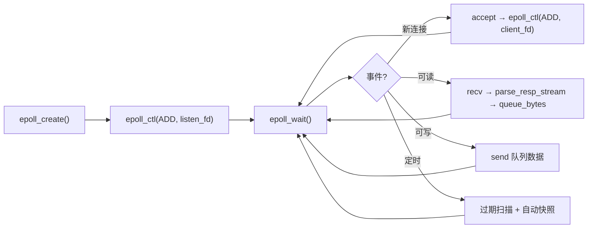

**为什么 Reactor 采用单线程？** 避免锁竞争，所有状态都在一个线程内访问。写操作通过 `queue_bytes()` 放入发送队列，然后 epoll 通知 EPOLLOUT 时发送。

```c
int queue_bytes(conn_t *c, const unsigned char *buf, size_t len) {
    out_node_t *n = kvs_malloc(sizeof(*n) + len);
    memcpy(n->data, buf, len);
    n->len = len; n->sent = 0; n->next = NULL;

    // 追加到链表尾部（线程安全：单线程事件循环）
    if (c->out_tail) c->out_tail->next = n;
    else c->out_head = n;
    c->out_tail = n;

    mod_events(c, EPOLLIN | EPOLLOUT);  // 注册可写事件
    return 0;
}
```

### 3.3 Proactor 模型 (io_uring)

**为什么需要 Proactor？** Reactor 的 `epoll_wait` 只是通知"可以读/写"，应用层仍需调用 `recv/send`——这是两步操作。io_uring 可以**一步到位**：提交 SQE (Submission Queue Entry) 后立即返回，完成时从 CQ (Completion Queue) 取结果。

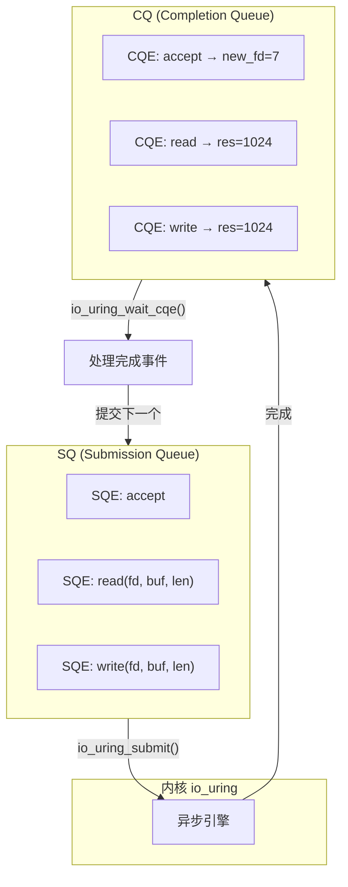

**为什么会选择 io_uring 做持久化而非网络？** 当前实现中 io_uring 主要用在 `persist_write_fd_uring()` 做 AOF 文件写入，而非网络 I/O。网络层默认使用 epoll Reactor。

```c
int persist_write_fd_uring(int fd, const unsigned char *buf,
                           size_t len, off_t *offset) {
    while (written < len) {
        struct io_uring_sqe *sqe = io_uring_get_sqe(&ring);
        io_uring_prep_write(sqe, fd, buf + written, chunk, *offset);
        io_uring_submit(&ring);
        io_uring_wait_cqe(&ring, &cqe);  // 等待磁盘写入完成
        written += cqe->res;
        io_uring_cqe_seen(&ring, cqe);
    }
}
```

### 3.4 NtyCo 协程模型

**为什么选 NtyCo？** NtyCo 是一个轻量级 C 协程库，通过修改 `errno` 和 hook socket 系统调用实现"同步写法、异步执行"。相比于 libtask、libmill，NtyCo 的设计更简洁，适合学习。

```c
// 协程内的代码是同步的，但底层不会阻塞
void ntyco_server(conn_t *c) {
    while (1) {
        // 看起来是阻塞 recv，但 NtyCo 自动 hook：
        // recv → epoll_ctl → yield → resume → 返回数据
        ssize_t n = recv(c->fd, c->inbuf + c->in_len, ...);
        if (n <= 0) break;
        c->in_len += (size_t)n;
        parse_resp_stream(c, c->inbuf, &c->in_len, 0);
        flush_output_blocking(c);
    }
}
```

**NtyCo hook 机制**：`recv` → `ntco_recv` → `epoll_ctl(fd, EPOLLIN)` → `nty_coroutine_yield()`（协程挂起）→ epoll_wait → 数据到达 → `nty_coroutine_resume()`（协程恢复）→ recv 返回。

---

## 4. 持久化层

### 4.1 总体设计

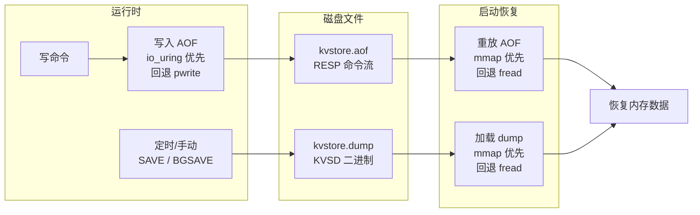

**为什么同时需要 dump 和 AOF？**

| 方式 | 格式 | 恢复速度 | 数据完整性 | 用途 |
|------|------|---------|-----------|------|
| **Dump (全量)** | 二进制长度前缀 | **快**（mmap 加载） | 恢复到上次快照点 | 全量同步、快速恢复 |
| **AOF (增量)** | RESP 命令流 | 慢（逐条重放） | 高（可每秒 fsync） | 增量持久化 |

**恢复顺序**：先恢复 dump（全量二进制），再重放 AOF（增量 RESP）。这样既快又完整。

### 4.2 Dump 格式 (KVSD)

**为什么用二进制长度前缀格式？** 这是最简单的序列化格式——`[4B key_len][key][4B value_len][value]`。解析快（memcpy 即可），不像 RESP 需要逐字符解析。

```
文件布局:
[4B klen][key (klen 字节)][4B vlen][value (vlen 字节)]
[4B klen][key (klen 字节)][4B vlen][value (vlen 字节)]
...
```

**mmap 恢复**：

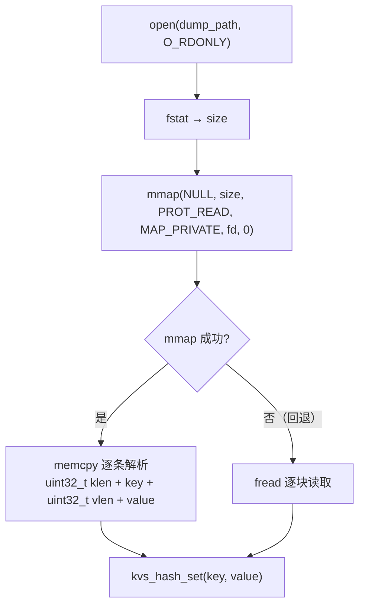

**为什么优先用 mmap？**
1. **避免双重拷贝**：文件内容直接映射到进程地址空间，不需要 `read()` → 用户缓冲区的拷贝
2. **惰性加载**：mmap 后内存页按需加载，非顺序访问更高效
3. **代码简洁**：直接指针操作 `mapped + pos`，不需要管理文件读写缓冲

```c
// mmap 恢复 dump 文件
mapped = mmap(NULL, st.st_size, PROT_READ | PROT_WRITE,
              MAP_PRIVATE, fd, 0);
while (pos + 4 <= size) {
    memcpy(&klen, mapped + pos, sizeof(klen));
    pos += sizeof(klen);
    memcpy(key, mapped + pos, klen); key[klen] = '\0';
    pos += klen + klen_pad;
    memcpy(&vlen, mapped + pos, sizeof(vlen));
    pos += sizeof(vlen);
    memcpy(value, mapped + pos, vlen); value[vlen] = '\0';
    pos += vlen + vlen_pad;
    kvs_hash_set(&global_hash, key, value);
}
munmap(mapped, size);
```

### 4.3 AOF 格式与写入

**AOF 格式**：与 RESP 协议完全相同，每条写命令直接追加到文件。

```
*3\r\n$3\r\nSET\r\n$3\r\nkey\r\n$5\r\nvalue\r\n
*2\r\n$3\r\nDEL\r\n$3\r\nkey\r\n
```

**为什么 AOF 直接用 RESP 协议？** 恢复时可以直接用同一个 `parse_resp_stream()` 函数解析，不需要单独的 AOF 解析器。

**fsync 策略**：

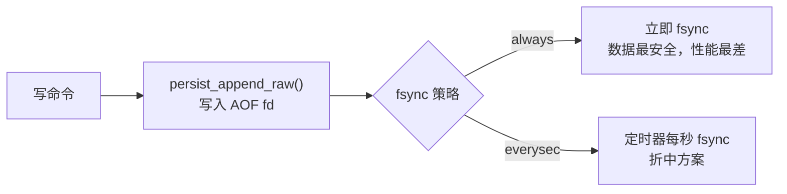

### 4.4 io_uring 写入 AOF

**为什么用 io_uring 做文件写入？** 传统的 `pwrite()` 是同步的——调用线程阻塞直到磁盘写入完成。io_uring 可以异步提交写请求，不阻塞调用线程：

```c
int persist_write_fd_uring(int fd, const unsigned char *buf,
                           size_t len, off_t *offset) {
    size_t written = 0;
    while (written < len) {
        struct io_uring_sqe *sqe = io_uring_get_sqe(&ring);
        io_uring_prep_write(sqe, fd, buf + written, chunk, *offset);
        io_uring_submit(&ring);          // 提交写请求，不阻塞
        io_uring_wait_cqe(&ring, &cqe);  // 等待完成
        written += cqe->res;
        io_uring_cqe_seen(&ring, cqe);
    }
    return (int)written;
}
```

在整个链路上，io_uring 对 fsync 同样异步：

```c
int persist_fsync_fd_best_effort(int fd) {
    if (g_proactor_ring.ring_fd >= 0) {
        // io_uring 异步 fsync
        struct io_uring_sqe *sqe = io_uring_get_sqe(&g_proactor_ring);
        io_uring_prep_fsync(sqe, fd, IORING_FSYNC_DATASYNC);
        io_uring_submit(&g_proactor_ring);
        io_uring_wait_cqe(&g_proactor_ring, &cqe);
        // ...
    } else {
        // fallback
        fdatasync(fd);
    }
}
```

### 4.5 BGSAVE 与 BGREWRITEAOF

**为什么用 fork 子进程？** 子进程通过 fork 继承父进程的完整内存快照，父进程继续处理请求，子进程将快照写入磁盘。

**AOF 重写动机**：AOF 文件随着时间不断增长，BGREWRITEAOF 将当前内存数据以 RESP 格式写入新的 AOF 文件，替换旧的大文件。

```c
void persist_bgsave(void) {
    pid_t pid = fork();
    if (pid == 0) {
        // 子进程：写临时文件
        persist_save_dump_to(tmp_path);
        rename(tmp_path, dump_path);
        _exit(0);
    }
    g_bgsave_pid = pid;  // 父进程记录 pid
}

void persist_bgrewriteaof(void) {
    pid_t pid = fork();
    if (pid == 0) {
        persist_write_aof_snapshot_to(tmp_path);
        _exit(0);
    }
    g_bgrewrite_pid = pid;
    // 父进程将重写期间的新命令追加到缓冲区 g_rewrite_buf
}
```

### 4.6 自动快照 (AutoSnapshot)

**配置格式**：`sec:changes,sec:changes,...`

```
# 60秒内10个变化 → 自动拍快照
autosnap=60:10,300:100,3600:10000
```

实现：

```c
void persist_autosnap_cron(void) {
    for (每个规则) {
        if (now - last_snap >= sec && dirty >= changes) {
            persist_bgsave();
        }
    }
}
```

### 4.7 大数据量 TTL 持久化

**问题**：当有上百万个不同 TTL 的 key 时，如何高效地管理和恢复？

**实现**：TTL 信息存储在 `kvs_expire_table_t` 中，BGREWRITEAOF 时将 TTL 信息一并写入：

```c
// persist.c — persist_write_aof_snapshot_to() 中
void persist_snapshot_expire_to_fd(int fd) {
    for (int i = 0; i < expire_table.size; i++) {
        for (kvs_expire_item_t *item = expire_table.buckets[i]; item; item = item->next) {
            // 计算剩余的 TTL
            long long remaining_ms = item->expire_at_ms - kvs_now_ms();
            if (remaining_ms > 0) {
                // 写入 EXPIRE 命令到 AOF
                char cmd[256];
                resp_build_cmd3(cmd, "EXPIRE", item->key, remaining_ms);
                write(fd, cmd, strlen(cmd));
            }
        }
    }
}
```

这样恢复时先加载数据，然后通过 RESP 命令重新设置 TTL。

---

## 5. 复制层

### 5.1 四种传输路径

kvstore 的复制层实现了**四种传输路径**，覆盖从传统网络到内核旁路的技术演进：

| 传输方式 | 类型 | 数据路径 | 延迟 | CPU 开销 |
|---------|------|---------|------|---------|
| **TCP** | 传统网络 | 用户态 send → 内核 TCP → 网卡 → Slave | 高 | 高 |
| **RDMA SEND/RECV** | 双边 RDMA | 用户态 ibv_post_send → RNIC → Slave RNIC → Slave CPU | 中 | 中 |
| **eBPF sockmap** | 内核态转发 | send → sk_msg hook → sockmap redirect → TCP | 中 | 低 |
| **kprobe+RDMA WRITE** | 单边 RDMA | kprobe拦截 → ringbuf → RDMA WRITE → Slave MR | 低 | 最低 |

### 5.2 复制协议

采用类似 Redis 的 RESP-based 协议：

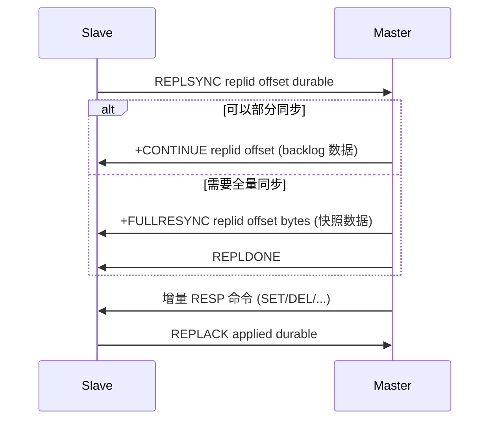

### 5.3 TCP 复制

**Master 侧 — repl_broadcast()**：每次写命令执行后，遍历 replica 链表，通过 TCP send 发送。

**Slave 侧 — slave_thread()**：后台线程，连接 Master → 发送 REPLSYNC → 循环 recv → parse_resp_stream。

**Backlog 机制**：1MB 环形缓冲区，保存最近的写命令。Slave 断线重连时，如果 offset 仍在 backlog 范围内，可以进行**部分同步（partial resync）**，避免全量同步。

```c
typedef struct repl_backlog_s {
    unsigned char *buf;       // 1MB 环形缓冲区
    size_t cap;               // 1024*1024
    size_t histlen;           // 已使用的历史长度
    size_t head;              // 写入位置
    unsigned long long start_offset;
    unsigned long long end_offset;
} repl_backlog_t;
```

### 5.4 RDMA 全量同步

**为什么用 RDMA 做全量同步？** 全量同步需要传输大量数据（可能 GB 级），RDMA 的零拷贝特性可以显著提升吞吐。

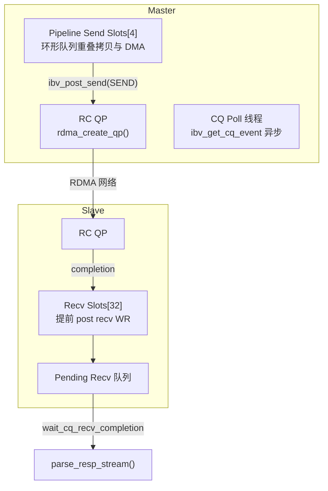

**Pipeline 发送模式**：4 个 send buffer 组成环形队列，每个 slot 独立注册 MR。`acquire_send_slot()` 获取空闲 slot，`ibv_post_send()` 非阻塞发送。后台 CQ 轮询线程通过 `ibv_get_cq_event()` 事件驱动回收 slot。

**为什么需要 Pipeline？** 单 send buffer 时，每次 post 后必须等待 CQ completion 才能准备下一块——这是流水线阻断点。Pipeline 让数据拷贝、WR 提交、DMA 传输三者重叠。

```c
// Pipeline 发送：非阻塞，立即返回
int slot = repl_rdma_acquire_send_slot(5000);
memcpy(send_slots[slot].buf, buf, len);
ibv_post_send(qp, &wr, &bad_wr);
send_slots[slot].in_flight = 1;  // 标记飞行中
return 0;  // ← 立即返回，CQ 线程后台回收
```

### 5.5 eBPF 实时同步

**为什么用 eBPF？** TCP 路径的数据经过用户态→内核态→用户态的两次拷贝。eBPF sockmap 在内核态完成数据转发，避免来回拷贝。

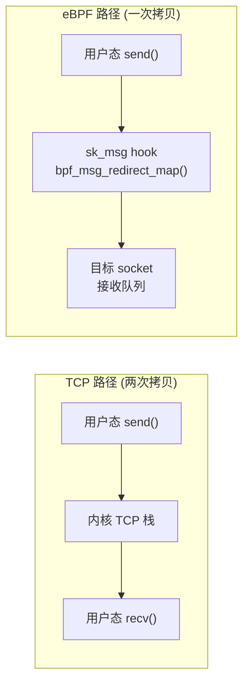

**BPF 程序**钩在 `sk_msg` 上（BPF_SK_MSG_VERDICT），当 socket 有数据要发送时触发：

```c
SEC("sk_msg")
int kvstore_repl_sk_msg(struct sk_msg_md *msg) {
    role = current_role(msg);
    if (role != KVS_EBPF_ROLE_MASTER_SIDE) return SK_PASS;

    redirect_key = control_value(KVS_EBPF_CTL_REDIRECT_KEY);
    bpf_msg_redirect_map(msg, &sock_map, redirect_key, 0);
    // 数据直接重定向到 slave 的 socket，不经过 TCP 协议栈
}
```

### 5.6 kprobe + RDMA WRITE 增量同步

**为什么需要 kprobe 方式？** 这是目前性能最优的增量同步路径：kprobe 在 `tcp_sendmsg` 入口透明拦截数据，通过 BPF ringbuf 传递到用户态，最终通过 RDMA WRITE（单边操作）直接写入 Slave 预置内存——Slave CPU 零参与接收。

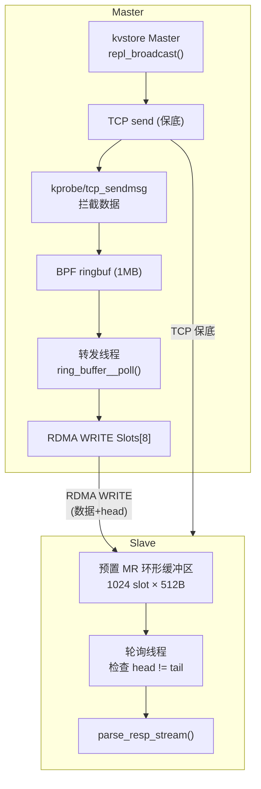

**三层数据读取**（BPF 程序 `repl_kprobe.bpf.c`）：

```c
// 1. 读iov指针（内核空间）
bpf_probe_read_kernel(&iov, sizeof(iov), msg_ptr + 40);
// 2. 读iovec结构体（内核空间）
bpf_probe_read_kernel(&vec, sizeof(vec), &iov[0]);
// 3. 读实际数据（用户空间）
bpf_probe_read_user(buf, safe_len, vec.b);
```

**为什么需要两次 RDMA WRITE？** 一次写数据到 slot，一次更新 producer_head——通知 Slave 有新数据。

---

## 6. TTL 过期系统

### 6.1 设计

**为什么用哈希表 + 最小堆？**

| 操作 | 单独用链表 | 哈希+最小堆 |
|------|-----------|------------|
| 设置 TTL (SET key → 设过期) | O(1) 插入末尾 | O(log n) 推入堆 |
| 查找 key 的 TTL | O(n) 扫描 | O(1) 哈希查找 |
| 取最快过期的 key | O(n) 扫描 | **O(1)** 堆顶 |
| 删除过期 key (从堆中) | O(n) 扫描 | O(log n) 堆调整 |

**核心**：哈希表提供 O(1) 查找，最小堆提供 O(1) 取最快要过期的 key。

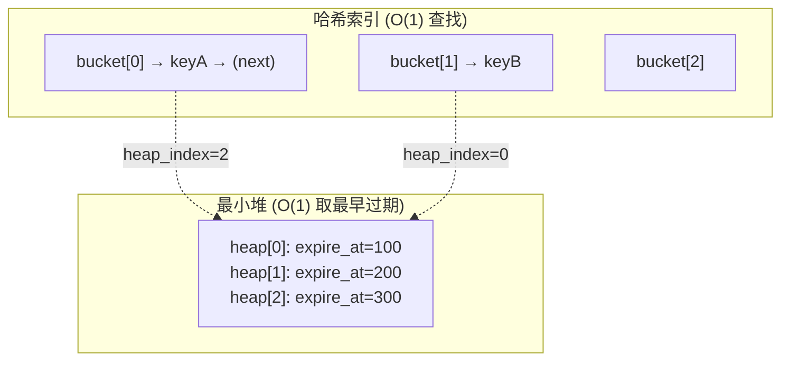

```c
typedef struct kvs_expire_item_s {
    char *key;
    int engine;                 // 所属存储引擎
    long long expire_at_ms;     // 到期时间戳
    size_t heap_index;          // 在堆中的位置（用于快速调整）
    struct kvs_expire_item_s *next;
} kvs_expire_item_t;

typedef struct kvs_expire_table_s {
    kvs_expire_item_t **buckets;    // 哈希桶 (8192 槽)
    kvs_expire_item_t **heap;       // 最小堆 (数组实现)
    size_t heap_size, heap_cap;
} kvs_expire_table_t;
```

### 6.2 过期扫描

在每次事件循环中调用 `kvs_active_expire_cycle()`：

```c
void kvs_active_expire_cycle(int budget) {
    long long now = kvs_now_ms();
    // 从堆顶取最快要过期的 key
    while (budget-- > 0 && global_expire.heap_size > 0) {
        kvs_expire_item_t *node = global_expire.heap[0];
        if (node->expire_at_ms > now) break;  // 堆顶未到期

        // 删除过期 key（从引擎 + 过期表中删除）
        engine_del(node->engine, node->key);
        expire_free_node(&global_expire, node);
    }
}
```

**为什么不用定时器？** 事件循环中每次调用 `kvs_active_expire_cycle(20)`（每次最多扫描 20 个 key），分散 CPU 开销，避免单次大量过期导致的延迟尖峰。

---

## 7. 内存管理层

### 7.1 三种内存后端

| 后端 | 实现 | 适用场景 |
|------|------|---------|
| **libc** | `malloc()` / `free()` | 开发调试，无额外依赖 |
| **jemalloc** | `LD_PRELOAD` 动态加载 | 生产级，碎片少，性能高 |
| **custom** | slab 分配器 + mmap 大块 | 研究学习，可观测 |

**为什么三种都提供？** libc/jemalloc 是现成的，custom 是自研的。通过编译选项 `--mem backend` 切换，可以对比不同分配器在相同负载下的表现。

### 7.2 Custom 分配器

**Slab 分类**：将 ≤1024 字节的请求分为 8 个类别：

| 类别 | 0 | 1 | 2 | 3 | 4 | 5 | 6 | 7 |
|------|---|---|---|---|---|---|---|---|
| 大小 | 32 | 64 | 128 | 256 | 384 | 512 | 768 | 1024 |

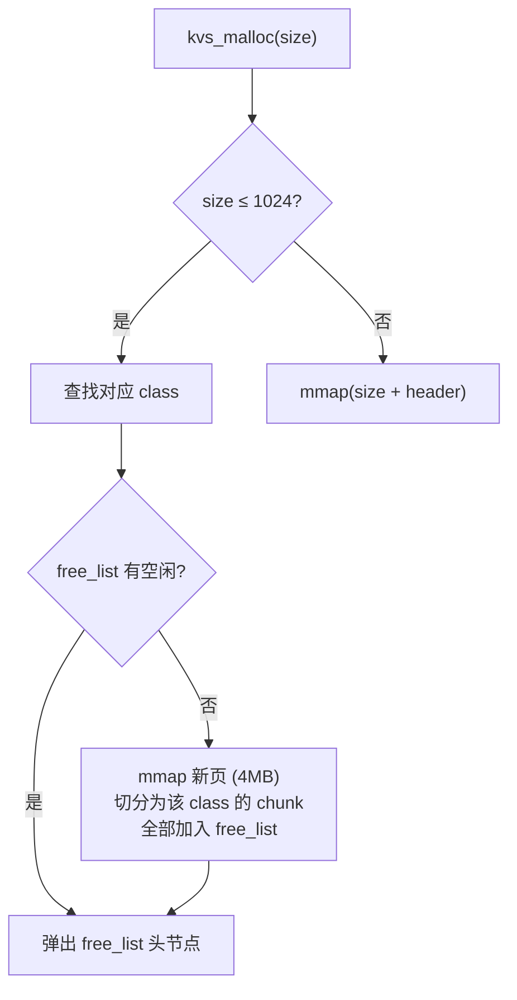

**为什么用 mmap 而非 sbrk？** mmap 分配的内存可以被 munmap 完全归还给系统，而 sbrk 分配的内存即使 free 了，堆空间也不会归还给操作系统。对于大块分配（>1024 字节），mmap 更合适。

**可观测性**：`INFO` 命令暴露详细统计：

```
mem_backend:custom
custom_small_alloc_calls:123456
custom_large_alloc_calls:789
custom_current_requested_bytes:1048576
custom_current_allocated_bytes:2097152
custom_peak_small_inuse:12345
custom_peak_large_inuse_bytes:1048576
```

---

## 8. 协议层

### 8.1 为什么选 RESP？

RESP（Redis Serialization Protocol）是 Redis 使用的协议。选择 RESP 意味着 **redis-cli 可以直接连接 kvstore**，生态完全兼容。

**协议格式**：

| 类型 | 格式 | 示例 |
|------|------|------|
| 简单字符串 | `+OK\r\n` | `+OK\r\n` |
| 错误 | `-ERR msg\r\n` | `-ERR unknown command\r\n` |
| 整数 | `:num\r\n` | `:42\r\n` |
| 批量字符串 | `$len\r\ncontent\r\n` | `$5\r\nhello\r\n` |
| 数组 | `*n\r\n$...\r\n...` | `*3\r\n$3\r\nSET\r\n$3\r\nkey\r\n...` |

### 8.2 解析器

`parse_resp_stream()` 是**有状态的流式解析器**——不完整的命令留在缓冲区，下次有数据继续解析：

```c
int parse_resp_stream(conn_t *c, unsigned char *buf, size_t *len,
                      int from_replication) {
    size_t pos = 0;
    while (pos < *len) {
        if (buf[pos] == '*') {
            // RESP 数组: *n\r\n
            int argc = atoi(nbuf);
            for (int i = 0; i < argc; ++i) {
                // $len\r\ncontent\r\n
                argv[i] = &buf[pos];
            }
            handle_parsed_command(c, argc, argv, ..., from_replication);
        }
        // ... 跳过已处理数据
    }
    // 保留未解析的剩余数据
    *len -= pos;
    memmove(buf, buf + pos, *len);
}
```

---

## 9. 配置与命令行系统

### 9.1 配置加载链


**为什么同时支持配置文件和命令行？** 配置文件适合持久化设置，命令行适合临时测试覆盖。

### 9.2 关键配置项

| 配置项 | 默认值 | 说明 |
|--------|--------|------|
| `--port` | 5160 | 监听端口 |
| `--net` | reactor | 网络模型 |
| `--mem` | libc | 内存后端 |
| `--role` | master | 主/从角色 |
| `--repl-fullsync-transport` | rdma | 全量同步传输 |
| `--repl-realtime-transport` | tcp | 实时同步传输 |
| `--appendfsync` | always | AOF fsync 策略 |
| `--autosnap` | (空) | 自动快照规则 |

---

## 10. 测试体系

### 10.1 测试架构

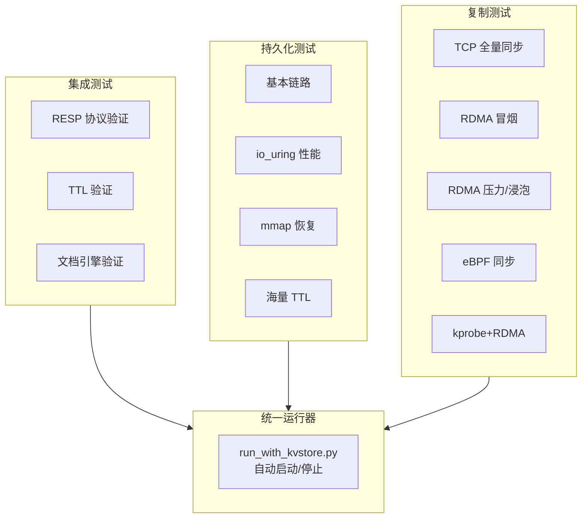

### 10.2 关键技术

**统一进程管理** (`tools/tests/run_with_kvstore.py`)：
```bash
# 自动启动 kvstore，运行测试，自动清理
python3 ./run_with_kvstore.py --bin ./kvstore \
    --host 127.0.0.1 --port 5160 -- \
    bash ./test_resp_nc_strict.sh {HOST} {PORT}
```

**eBPF 环境探测** (`tools/repl/run_repl_ebpf_env_probe.py`)：
在执行 eBPF 测试前检查内核版本、BPF 特性、clang/libbpf 是否可用，避免在不支持的环境上失败。

---

## 附录：文件索引

| 模块 | 核心文件 | 关键函数 |
|------|---------|---------|
| 入口与协议 | `src/main/kvstore.c` | `main()`, `handle_parsed_command()`, `parse_resp_stream()`, `repl_broadcast()` |
| Reactor | `src/core/reactor.c` | `reactor_start()`, `on_read()`, `on_write()`, `queue_bytes()` |
| Proactor | `src/core/proactor.c` | `proactor_start()`, `submit_accept()`, `submit_read()` |
| NtyCo | `src/core/ntyco.c` | `ntyco_start()`, `ntyco_server()` |
| Hash 引擎 | `src/storage/kvs_hash.c` | `kvs_hash_set/get/del`, FNV-1a |
| RBTREE 引擎 | `src/storage/kvs_rbtree.c` | `rbtree_insert_fixup`, `left_rotate` |
| Skiptable 引擎 | `src/storage/kvs_skiptable.c` | `kvs_skiptable_set/search`, 概率层数 |
| Doc 引擎 | `src/storage/kvs_doc.c` | `kvs_doc_set/get/del`, 字段哈希 |
| 内存管理 | `src/memory/kvs_mem.c` | `kvs_malloc/free/calloc`, slab+mmap |
| 持久化 | `src/persistence/kvs_persist.c` | `persist_recover()`, `persist_bgsave()`, `persist_bgrewriteaof()`, `persist_write_fd_uring()` |
| TTL | `src/expire/kvs_expire.c` | `kvs_expire_set()`, `kvs_active_expire_cycle()` |
| 复制核心 | `src/replication/kvs_repl.c` | `slave_thread()`, `repl_rdma_try_send()`, `repl_rdma_cq_poll_thread()`, `repl_backlog_feed()` |
| eBPF sockmap | `src/replication/kvs_repl_ebpf.c` | `repl_ebpf_init()`, `repl_ebpf_register_fd()` |
| BPF 程序 | `src/replication/bpf/repl_sockmap.bpf.c` | `kvstore_repl_sk_msg()` |
| kprobe+RDMA | `src/replication/kvs_repl_kprobe.c` | `kprobe_ringbuf_cb()`, `wr_submit_data()`, `wr_submit_head()`, `kprobe_rdma_slave_poll()` |
| BPF kprobe | `src/replication/bpf/repl_kprobe.bpf.c` | `kprobe_kvs_repl_tcp_sendmsg()`, `read_msg_data()` |
| 哨兵 | `src/replication/kvs_sentinel.c` | `sentinel_start()` |
| 头文件 | `include/kvstore/kvstore.h` | `conn_t`, `kv_config_t`, `repl_rdma_ctx_t` 等全部类型定义 |
