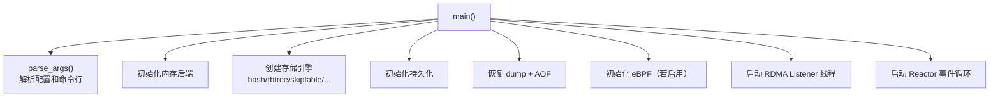
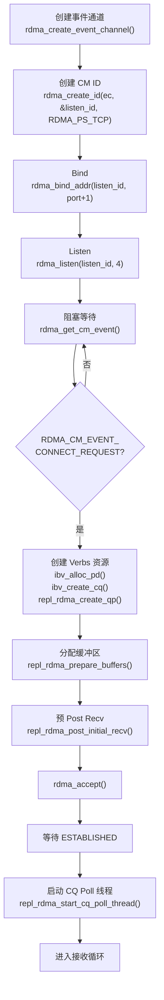
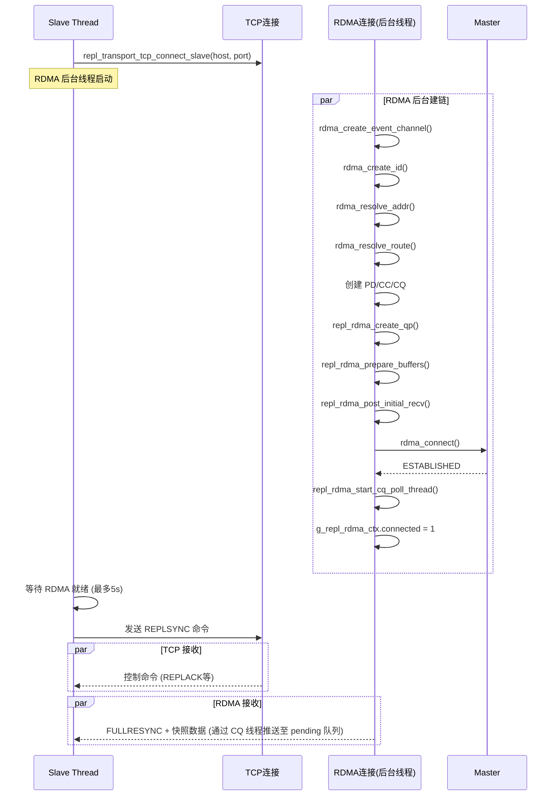
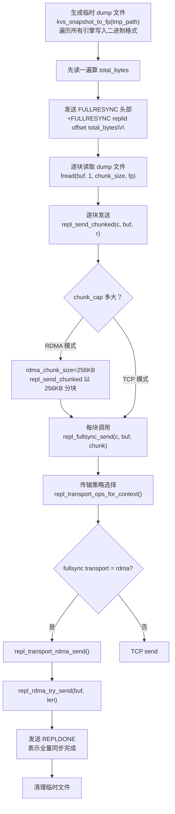
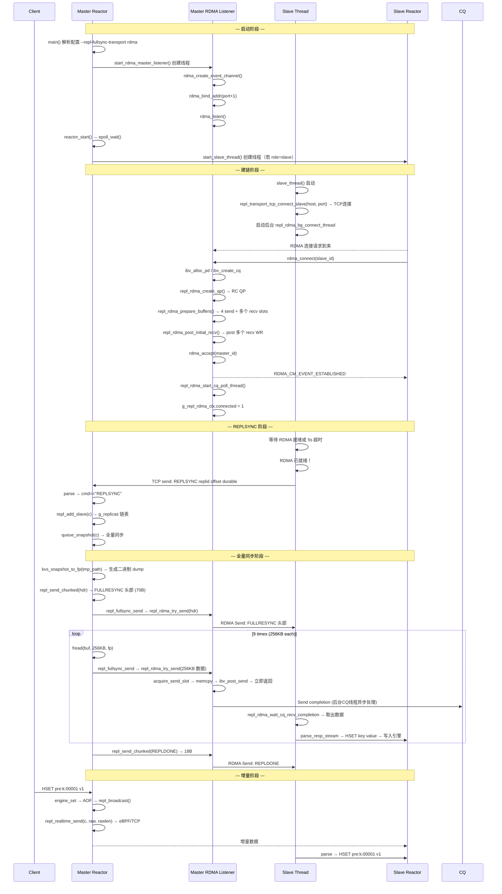

# kvstore RDMA 全量同步完整流程详解

> 本文档从 `main()` 入口开始，逐层追踪 RDMA 全量同步（fullsync）的完整调用链，涵盖 Master/Slave 双端建链、数据传输、Pipeline 发送、CQ 异步处理全路径。

---

## 目录

1. [启动入口：main()](#一启动入口main)
2. [Master 侧：RDMA Listener 线程](#二master-侧rdma-listener-线程)
3. [Slave 侧：slave_thread 建立 RDMA 连接](#三slave-侧slave_thread-建立-rdma-连接)
4. [Master 响应 REPLSYNC → 触发全量同步](#四master-响应-replsync--触发全量同步)
5. [RDMA 数据传输：Pipeline 非阻塞发送](#五rdma-数据传输pipeline-非阻塞发送)
6. [Slave 侧：接收 RDMA 数据并解析](#六slave-侧接收-rdma-数据并解析)
7. [完整时序图](#七完整时序图)
8. [关键配置与命令行](#八关键配置与命令行)
9. [数据流总结](#九数据流总结)

---

## 一、启动入口：main()



关键代码片段（`src/main/kvstore.c`）：

```c
int main(int argc, char **argv) {
    parse_args(argc, argv);                        // 步骤1: 解析配置
    kvs_mem_init(g_cfg.mem_backend);               // 步骤2: 内存后端
    kvs_hash_create(&global_hash);                 // 步骤3: 存储引擎
    persist_init();  persist_recover();            // 步骤4: 持久化恢复

    // 步骤5: 若配置了 RDMA fullsync，启动 Master Listener
    if (!strcasecmp(g_cfg.repl_fullsync_transport, "rdma") ||
        !strcasecmp(g_cfg.repl_transport_backend, "rdma")) {
        start_rdma_master_listener();              // ← 创建独立线程
    }

    return reactor_start();                         // 步骤6: 进入 epoll 事件循环
}
```

**要点**：`start_rdma_master_listener()` 创建了一个**独立线程**（`rdma_master_listener_thread`），与主 Reactor 事件循环并行运行。Master 同时跑着两个循环：

- **主线程**：Reactor epoll 事件循环（接受客户端连接、处理命令、广播复制数据）
- **后台线程**：RDMA Listener（等待 slave 的 RDMA 连接请求）

---

## 二、Master 侧：RDMA Listener 线程

```c
int start_rdma_master_listener(void) {
    // 只有 ROLE_MASTER 且配置了 rdma 才启动
    if (g_cfg.role != ROLE_MASTER) return 0;
    if (strcasecmp(repl_fullsync_transport_name(), "rdma") != 0) return 0;
    
    pthread_create(&tid, NULL, rdma_master_listener_thread, NULL);
    pthread_detach(tid);
}
```

### rdma_master_listener_thread() 完整建链流程



**各步骤代码细节**：

| 步骤 | 代码 | 说明 |
|------|------|------|
| 创建事件通道 | `rdma_create_event_channel()` | 用于接收 CM 事件（连接请求、断开等） |
| 创建 CM ID | `rdma_create_id(ec, &listen_id, NULL, RDMA_PS_TCP)` | `RDMA_PS_TCP` 表示使用 TCP 风格的连接管理 |
| Bind | `rdma_bind_addr(listen_id, &addr)` | 绑定到 `<IP>:<TCP_port+1>`（默认 5161） |
| Listen | `rdma_listen(listen_id, 4)` | 开始监听连接请求 |
| 等待连接 | `rdma_get_cm_event()` | **阻塞**等待 slave 的 CONNECT_REQUEST |
| 取到 event | `event->id` 即为 slave 的 CM ID | 后续所有操作基于这个 ID |
| 创建 PD | `ibv_alloc_pd(id->verbs)` | 保护域（Protection Domain），所有 MR/QP 共享 |
| 创建 CQ | `ibv_create_cq(verbs, qp_wr_depth, NULL, comp_chan, 0)` | 完成队列，容量 = qp_wr_depth |
| 创建 QP | `rdma_create_qp(id, pd, &attr)` | 可靠连接 QP（`IBV_QPT_RC`），send/recv WR 深度 = 64 |
| 分配 buffer | `repl_rdma_prepare_buffers()` | 分配 4 个 pipeline send slot + 多个 recv slot，每个 256KB，注册 MR |
| 预 post recv | `repl_rdma_post_initial_recv()` | 预 post 多个 recv WR，让 slave 可以立即发数据 |
| Accept | `rdma_accept(id, &param)` | 接受连接（`initiator_depth=1, responder_resources=1`） |
| 等待建链 | `repl_rdma_wait_event(ESTABLISHED, 5000)` | 等待 RDMA_CM_EVENT_ESTABLISHED |
| 启动 CQ 线程 | `repl_rdma_start_cq_poll_thread()` | 后台线程异步处理 send/recv completion |
| 接收循环 | 见下文 | hybrid 模式 sleep；非 hybrid 模式 poll recv |

---

## 三、Slave 侧：slave_thread 建立 RDMA 连接

Slave 的 `slave_thread` 在 `reactor_start()` → epoll 事件循环的间歇期通过 `start_slave_thread()` 被启动。

### Hybrid 模式建链流程（RDMA fullsync + eBPF/TCP realtime）



### Slave 侧建链代码路径

```
slave_thread()
  → 判断 use_rdma_fullsync = true
  → repl_transport_tcp_connect_slave(host, port)              // 先建 TCP
  → repl_rdma_bg_connect_thread(host, port)                   // 后台 RDMA 建链
      → repl_transport_rdma_connect_slave(host, port)
          → rdma_create_event_channel()
          → rdma_create_id(ec, &id, NULL, RDMA_PS_TCP)
          → rdma_resolve_addr(id, NULL, &dst, 1000)
          → repl_rdma_wait_event(ADDR_RESOLVED, 1500)
          → rdma_resolve_route(id, 1000)
          → repl_rdma_wait_event(ROUTE_RESOLVED, 1500)
          → ibv_create_comp_channel(id->verbs)
          → ibv_alloc_pd(id->verbs)
          → ibv_create_cq(id->verbs, qp_wr_depth, ...)
          → repl_rdma_create_qp()
          → repl_rdma_prepare_buffers()     // 分配 pipeline send slots + recv slots
          → repl_rdma_post_initial_recv()   // post 多个 recv WR
          → rdma_connect(id, &param)        // retry_count=7, rnr_retry_count=7
          → repl_rdma_wait_event(ESTABLISHED, 12000)
          → repl_rdma_start_cq_poll_thread()  // pipeline 模式
          → g_repl_rdma_ctx.connected = 1
  → 等待 RDMA connected 或 5s 超时
  → send(tcp_fd, "REPLSYNC ...", ...)       // 通过 TCP 发送复制同步请求
```

**关键点**：REPLSYNC 命令通过 TCP 发送，但 fullsync 数据通过 RDMA 接收。Slave 的 TCP 循环非阻塞接收控制命令，同时通过 `repl_rdma_wait_cq_recv_completion()` 从 CQ pending 队列取 RDMA 数据。

---

## 四、Master 响应 REPLSYNC → 触发全量同步

当 Master 的 Reactor 主线程收到 REPLSYNC 命令时：

```
reactor_start()
  → epoll_wait() → EPOLLIN → on_read()
    → recv() → parse_resp_stream(c, buf, &len, 0)
      → handle_parsed_command(c, argc, argv, raw, rawlen, 0)
        → cmd == "REPLSYNC"
          → repl_add_slave(c)                      // 加入复制链表
          → queue_snapshot(c)                      // ◄── 关键：全量同步
```

### queue_snapshot() 全量同步数据发送流程



### 传输策略选择（`repl_transport_ops_for_context`）

```c
static const repl_transport_ops_t *repl_transport_ops_for_context(int send_ctx) {
    if (send_ctx == KVS_REPL_SEND_FULLSYNC) {
        const char *t = repl_fullsync_transport_name();
        if (!strcasecmp(t, "rdma") && g_repl_transport_rdma_ops.supported
            && g_repl_transport_fallback_until_ms <= kvs_now_ms()) {
            transport_log("fullsync using RDMA");
            return &g_repl_transport_rdma_ops;   // ← 选 RDMA
        }
        transport_log("fullsync using TCP");
        return &g_repl_transport_tcp_ops;         // ← fallback TCP
    }
    // ... realtime 类似
}
```

### repl_fullsync_send() 的 fallback 机制

```c
int repl_fullsync_send(conn_t *c, const unsigned char *buf, size_t len) {
    const repl_transport_ops_t *ops = repl_transport_ops_for_context(KVS_REPL_SEND_FULLSYNC);
    int rc = ops->send(c, buf, len);
    if (rc == 0) return 0;
    
    // RDMA 发送失败 → 降级为 TCP（1h cooldown）
    transport_log("%s failed, fallback to TCP", ops->name);
    repl_transport_trigger_fallback("fullsync_send_fail", 3600000);
    return repl_transport_tcp_send(c, buf, len);
}
```

---

## 五、RDMA 数据传输：Pipeline 非阻塞发送

```c
static int repl_transport_rdma_send(conn_t *c, const unsigned char *buf, size_t len) {
    (void)c;
#if KVS_ENABLE_RDMA
    if (g_repl_rdma_ctx.connected)
        return repl_rdma_try_send(buf, len);
#endif
    return -1;
}
```

### Pipeline 模式 repl_rdma_try_send()

```c
static int repl_rdma_try_send(const unsigned char *buf, size_t len) {
    pthread_mutex_lock(&g_repl_rdma_send_lock);

    // 步骤1: 获取空闲 send slot（4 个之一）
    int slot = repl_rdma_acquire_send_slot(5000);
    if (slot < 0) { ... unlock; return -1; }

    // 步骤2: 拷贝数据到 slot buffer
    memcpy(g_repl_rdma_ctx.send_slots[slot].buf, buf, len);

    // 步骤3: 构造 SGE + WR
    struct ibv_sge sge = {
        .addr = (uintptr_t)g_repl_rdma_ctx.send_slots[slot].buf,
        .length = (uint32_t)len,
        .lkey = g_repl_rdma_ctx.send_slots[slot].mr->lkey,  // MR 的 local key
    };
    struct ibv_send_wr wr = {
        .wr_id = (uint64_t)slot | KVS_RDMA_PIPELINE_WR_ID_FLAG,  // 标记 pipeline 身份
        .sg_list = &sge,
        .num_sge = 1,
        .opcode = IBV_WR_SEND,              // 双边 Send 操作
        .send_flags = IBV_SEND_SIGNALED,     // 需要 CQ 通知
    };

    // 步骤4: 提交 WR 到 QP 的发送队列 → 立即返回
    ibv_post_send(g_repl_rdma_ctx.id->qp, &wr, &bad_wr);
    g_repl_rdma_ctx.send_slots[slot].in_flight = 1;
    g_repl_rdma_ctx.send_slots_in_flight++;

    pthread_mutex_unlock(&g_repl_rdma_send_lock);
    return 0;  // ← 不等待 CQ，立即返回
}
```

### 硬件层面数据流

```
ibv_post_send(QP, WR)
    → WR 进入 QP 的 Send Queue (SQ)
    → RNIC 硬件（或 siw 软件栈）从 MR 注册的内存读取数据
    → 封装为 RDMA Send 报文 → 通过网络发送
    → 对端 RNIC 收到 → 匹配接收队列的 recv WR
    → 数据写入对端 recv buffer
    → 两端各产生一个 CQE（Completion Queue Entry）
```

### 后台 CQ 轮询线程（异步回收 slot）

```c
static void *repl_rdma_cq_poll_thread(void *arg) {
    while (running && connected) {
        ibv_get_cq_event(comp_chan, &ev_cq, &ev_ctx);  // 阻塞等待
        ibv_ack_cq_events(cq, 1);

        // 批量 poll 所有已完成的 WR
        while ((n = ibv_poll_cq(cq, 8, wc)) > 0) {
            for (int i = 0; i < n; i++) {
                if (wc[i].opcode == IBV_WC_SEND) {
                    // Send 完成 → 释放 send slot
                    int slot = wc[i].wr_id & ~PIPELINE_WR_ID_FLAG;
                    g_repl_rdma_ctx.send_slots[slot].in_flight = 0;
                } else if (wc[i].opcode == IBV_WC_RECV) {
                    // Recv 完成 → 推入 pending 队列
                    int slot = (int)(wc[i].wr_id - 1);
                    repl_rdma_pending_recv_push(slot, wc[i].byte_len);
                }
            }
        }
        // re-arm → drain 标准模式
        ibv_req_notify_cq(cq, 0);
        ibv_poll_cq(cq, 8, wc);  // 确认无漏网 completion
    }
}
```

---

## 六、Slave 侧：接收 RDMA 数据并解析

Slave 的 hybrid 模式主循环同时做两件事：

```c
// 1. TCP 非阻塞接收（控制命令、REPLACK、FULLRESYNC 头部）
ssize_t r = recv(tcp_fd, buf + blen, sizeof(buf) - blen, MSG_DONTWAIT);
if (r > 0) {
    blen += r;
    parse_resp_stream(NULL, buf, &blen, 1);  // 解析 TCP 数据
}

// 2. RDMA 接收（全量同步数据体）
if (g_repl_rdma_ctx.connected) {
    int recv_slot = -1;
    size_t rdma_blen = 0;
    if (repl_rdma_wait_cq_recv_completion(100, &recv_slot, &rdma_blen) == 0) {
        // 从 pending 队列取出 recv slot
        unsigned char *payload = repl_rdma_dup_recv_payload(recv_slot, rdma_blen);
        memcpy(buf + blen, payload, rdma_blen);   // 合并到 stream buffer
        blen += rdma_blen;
        repl_rdma_repost_recv(recv_slot);           // 重新 post recv WR
    }
}

// 3. 统一解析 RESP 流
parse_resp_stream(NULL, buf, &blen, 1);
```

### Slave 侧解析 FULLRESYNC

当 slave 收到 `+FULLRESYNC replid offset bytes\r\n` 时：

```c
// parse_resp_stream() 中解析 + 行
if (argc >= 3 && !strcmp(argv[0], "FULLRESYNC")) {
    unsigned long long fullsync_target = strtoull(argv[3], NULL, 10);
    repl_slave_set_sync_state(
        argv[1],             // replid
        strtoull(argv[2]),   // offset
        strtoull(argv[2]),   // durable_offset
        1,                   // fullsync_loading = 1
        fullsync_target      // target_bytes
    );
}
```

后续每个 RESP 命令（`*3\r\n$3\r\nHSET\r\n...`）被 `handle_parsed_command` 处理：

```c
if (from_replication && is_write_cmd(cmd)) {
    engine_set(engine, key, value);           // 写入内存
    persist_append_raw(raw, rawlen);          // 写入本地 AOF
    repl_slave_note_applied(rawlen);          // 增加 applied offset
    // 当 loaded_bytes >= target_bytes → repl_slave_finish_fullsync()
}
```

### repl_slave_finish_fullsync()

```c
void repl_slave_finish_fullsync(void) {
    g_slave_loading_fullsync = 0;
    
    // 将当前完整内存数据 dump 到磁盘
    int dump_fd = open(g_cfg.dump_path, O_WRONLY | O_CREAT | O_TRUNC, 0644);
    if (dump_fd >= 0) {
        kvs_dump_to_fd(dump_fd);
        close(dump_fd);
    }
    
    repl_slave_state_save();   // 持久化复制位点
    repl_slave_send_ack();     // 通知 master 全量同步完成
}
```

---

## 七、完整时序图



---

## 八、关键配置与命令行

```bash
# Master 启动（RDMA fullsync + TCP realtime）
./kvstore --port 5160 --role master \
    --repl-fullsync-transport rdma \     # 全量同步走 RDMA
    --repl-realtime-transport tcp \      # 增量同步走 TCP
    --rdma-dev siw0 \                    # soft-iWARP 设备
    --rdma-recv-slots 64 \               # recv slot 数
    --rdma-chunk-size 262144             # 每次 RDMA send 256KB

# Slave 启动
./kvstore --port 5161 --role slave \
    --master-host 192.168.233.128 --master-port 5160 \
    --repl-fullsync-transport rdma \
    --repl-realtime-transport tcp

# Hybrid 模式（RDMA fullsync + eBPF realtime）
# 需要先启动 eBPF daemon（或在 ebpf_enabled=1 时自动加载）
./kvstore --port 5161 --role slave \
    --master-host 192.168.233.128 --master-port 5160 \
    --repl-fullsync-transport rdma \
    --repl-realtime-transport ebpf
```

RDMA 默认监听端口 = `TCP端口 + 1`（可通过 `--rdma-port` 覆盖）。

---

## 九、数据流总结

```
   Master                        RDMA RC QP (可靠连接)                Slave
   ──────                        ────────────────                    ─────
   queue_snapshot()
     ├─ FULLRESYNC header ──── RDMA Send(70B) ────────────────────→ parse: +FULLRESYNC
     ├─ snapshot chunk 0 ───── RDMA Send(256KB, pipeline slot 0) ─→ repost recv → parse RESP
     ├─ snapshot chunk 1 ───── RDMA Send(256KB, pipeline slot 1) ─→ repost recv → parse RESP
     ├─ snapshot chunk 2 ───── RDMA Send(256KB, pipeline slot 2) ─→ repost recv → parse RESP
     ├─ snapshot chunk 3 ───── RDMA Send(256KB, pipeline slot 3) ─→ repost recv → parse RESP
     ├─ ...（slot 0 已释放，重复使用）
     ├─ snapshot chunk 8 ───── RDMA Send(141KB) ──────────────────→ repost recv → parse RESP
     └─ REPLDONE ───────────── RDMA Send(18B) ────────────────────→ → repl_slave_finish_fullsync()
                                                                       → dump 到磁盘
                                                                       → 开始增量同步
```

### 核心数据路径总结

```
Master 硬盘文件 (dump)
  → fread() 到堆缓冲 (256KB)
  → memcpy 到 MR 注册的 pipeline send slot
  → ibv_post_send() 到 RC QP
  [RNIC/siw 硬件通过 DMA 读取 send buffer，封装为 RDMA 报文]
  → 网络传输
  [对端 RNIC/siw 接收，DMA 写入 recv buffer]
  → CQE 产生 → CQ 轮询线程推入 pending_recv 队列
  → memcpy 到 slave stream buffer
  → parse_resp_stream() 解析 RESP 命令
  → engine_set() 写入内存引擎
  → persist_append_raw() 写入本地 AOF
```

### 关键文件索引

| 函数/组件 | 文件 | 行号（近似） | 作用 |
|-----------|------|-------------|------|
| `main()` | `src/main/kvstore.c` | 1985 | 入口，启动 Listener |
| `start_rdma_master_listener()` | `src/replication/kvs_repl.c` | 2664 | 创建 Master Listener 线程 |
| `rdma_master_listener_thread()` | `src/replication/kvs_repl.c` | 2450 | Master 端 RDMA 事件循环 |
| `repl_transport_rdma_connect_slave()` | `src/replication/kvs_repl.c` | 1110 | Slave 端 RDMA 建链 |
| `repl_rdma_try_send()` | `src/replication/kvs_repl.c` | 830 | Pipeline 非阻塞发送 |
| `repl_rdma_acquire_send_slot()` | `src/replication/kvs_repl.c` | 250 | 获取空闲 send slot |
| `repl_rdma_cq_poll_thread()` | `src/replication/kvs_repl.c` | 1060 | 后台 CQ 轮询线程 |
| `repl_rdma_wait_cq_recv_completion()` | `src/replication/kvs_repl.c` | 700 | 从 pending 队列取 recv 数据 |
| `queue_snapshot()` | `src/main/kvstore.c` | 495 | 全量同步数据生成与发送 |
| `repl_fullsync_send()` | `src/replication/kvs_repl.c` | 1485 | fullsync 传输策略分发 |
| `handle_parsed_command()` | `src/main/kvstore.c` | ~1100 | 命令处理入口 |
| `slave_thread()` | `src/replication/kvs_repl.c` | 2070 | Slave 后台复制线程 |
| `repl_slave_finish_fullsync()` | `src/replication/kvs_repl.c` | 2245 | 全量同步完成收尾 |
| `repl_rdma_prepare_buffers()` | `src/replication/kvs_repl.c` | 530 | 分配并注册 pipeline send + recv 缓冲区 |
| `repl_rdma_create_qp()` | `src/replication/kvs_repl.c` | 475 | 创建 RC QP |
| `repl_rdma_post_initial_recv()` | `src/replication/kvs_repl.c` | 605 | 预 post 所有 recv WR |
| `repl_rdma_start_cq_poll_thread()` | `src/replication/kvs_repl.c` | 1150 | 启动后台 CQ 轮询线程 |
