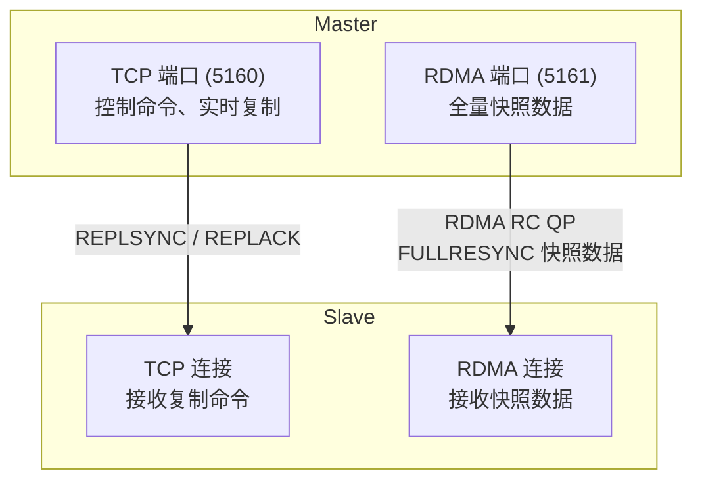
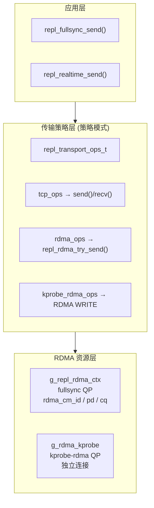
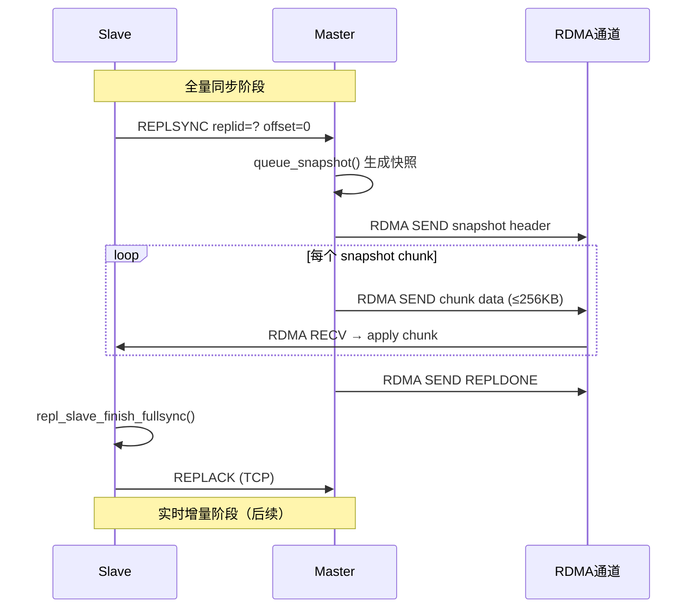
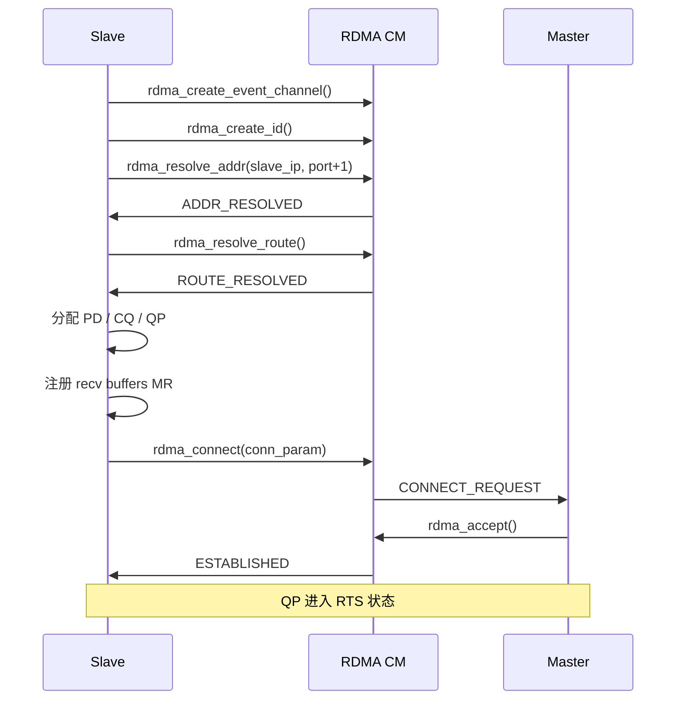
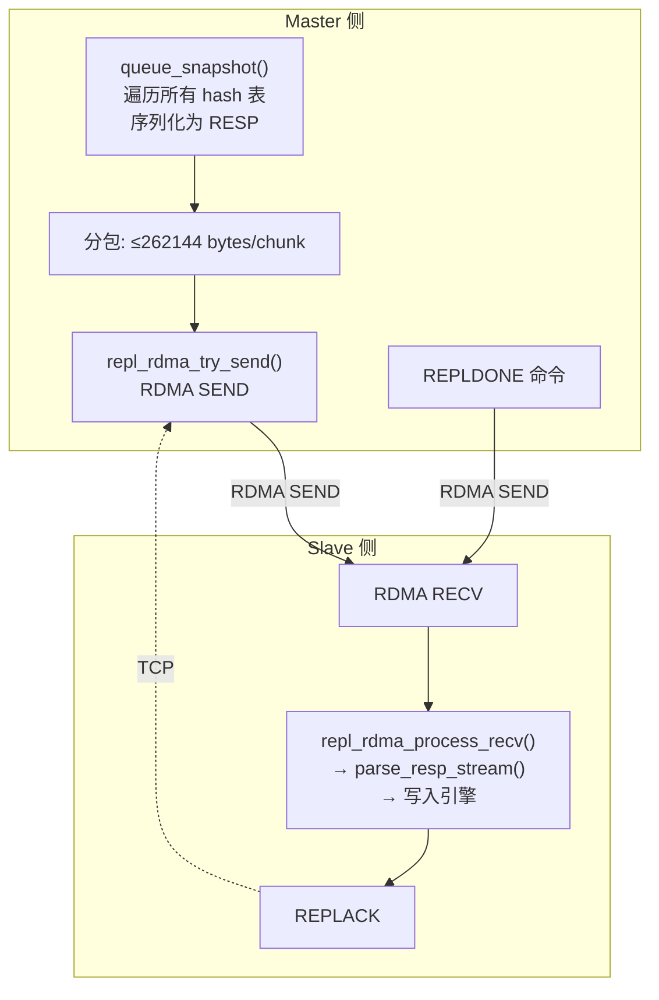
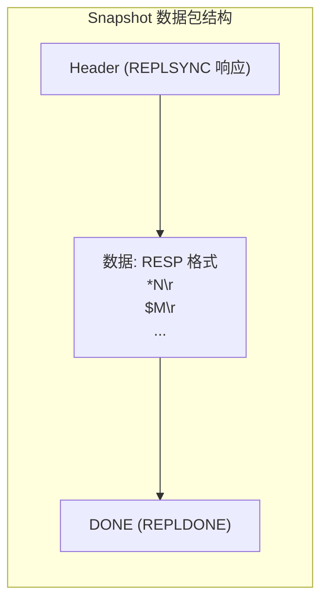
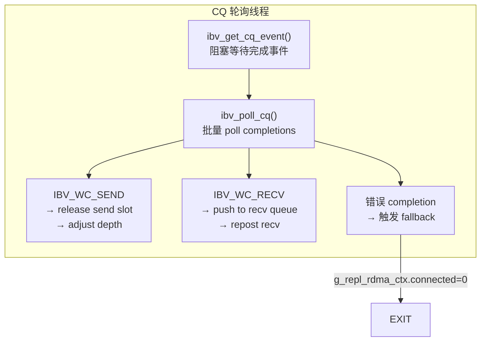
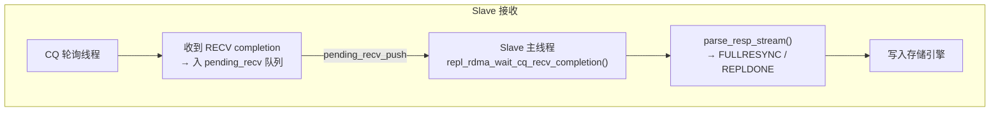
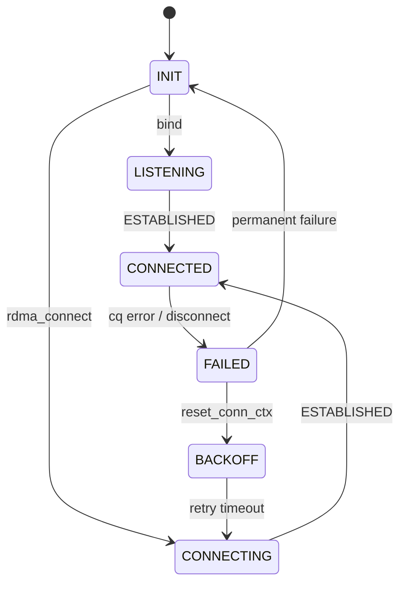
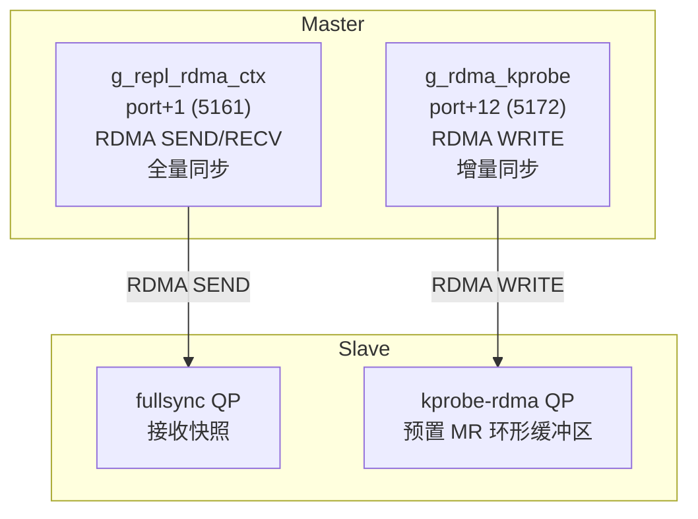

# kvstore RDMA 全量复制实现详解

> 本文档从代码层面逐层剖析 kvstore 中 RDMA 全量复制（fullsync）的完整实现，
> 覆盖建链、握手、数据传输、CQ 并发控制、异常处理全流程。格式与 `tech-roadmap.md` 一致。

---

## 目录

1. [整体架构概览](#1-整体架构概览)
2. [核心数据结构](#2-核心数据结构)
3. [RDMA 建链流程](#3-rdma-建链流程)
4. [全量数据传输流程](#4-全量数据传输流程)
5. [CQ 轮询与并发控制](#5-cq-轮询与并发控制)
6. [Slave 侧接收与解析](#6-slave-侧接收与解析)
7. [异常处理与回退机制](#7-异常处理与回退机制)
8. [混合传输模式](#8-混合传输模式)
9. [关键代码位置索引](#9-关键代码位置索引)

---

## 1. 整体架构概览

### 1.1 通道架构

RDMA 全量同步使用**独立的 RDMA 连接**进行数据传输，与 TCP 控制链路分离：



**关键点**：
- RDMA 默认使用 `TCP 端口 + 1` 作为 RDMA 监听端口（5160→5161）
- RDMA 连接**仅用于 fullsync**（全量快照传输），不承载控制命令
- 实时增量命令走 TCP（或 eBPF/kprobe-rdma over TCP）通道
- 全量完成后 slave 立即进入实时增量模式

### 1.2 传输分层



### 1.3 数据流全景



---

## 2. 核心数据结构

### 2.1 RDMA 上下文

**文件**: `src/replication/kvs_repl.c`（静态全局变量）

```c
/* RDMA 上下文 - 单例 */
static struct {
    struct rdma_event_channel *ec;     /* CM 事件通道 */
    struct rdma_cm_id *id;             /* CM ID（含 QP） */
    struct ibv_pd *pd;                 /* 保护域 */
    struct ibv_cq *cq;                 /* 完成队列 */
    struct ibv_comp_channel *comp_chan;/* 完成事件通道 */
    
    repl_rdma_state_t state;           /* 状态机 */
    volatile int connected;            /* 是否已连接 */
    
    int send_depth;                    /* 当前 pipeline 深度 */
    int max_send_depth;                /* 最大 pipeline 深度 */
    
    /* 发送缓冲区（Pipeline） */
    rdma_send_slot_t send_slots[32];   /* 发送槽位 */
    int active_send_slots;             /* 实际使用的槽位数 */
    
    /* 接收缓冲区（环形队列） */
    rdma_recv_slot_t recv_slots[32];   /* 接收槽位 */
    int active_recv_slots;
    
    /* 统计 */
    unsigned long long total_send_bytes;
    unsigned long long total_recv_bytes;
} g_repl_rdma_ctx;
```

### 2.2 发送/接收槽位

**文件**: `src/replication/kvs_repl.c`

```c
/* 发送槽 - 用于 pipeline 并发 */
typedef struct rdma_send_slot_s {
    unsigned char *buf;          /* 发送缓冲区 */
    struct ibv_mr *mr;           /* MR（注册在 g_repl_rdma_ctx.pd） */
    size_t cap;                  /* 容量 */
    volatile int posted;         /* 是否已提交 */
    uint64_t wr_id;              /* 对应的 WR ID（含 PIPELINE_WR_ID_FLAG） */
} rdma_send_slot_t;

/* 接收槽 - 环形队列 */
typedef struct rdma_recv_slot_s {
    unsigned char *buf;          /* 接收缓冲区 */
    struct ibv_mr *mr;
    size_t cap;
    volatile int posted;         /* 是否已 post_recv */
} rdma_recv_slot_t;
```

### 2.3 Pipeline 深度控制

```c
/* Pipeline 常量 */
#define KVS_RDMA_PIPELINE_WR_ID_FLAG 0x80000000UL  /* wr_id 高位标记 */
#define KVS_RDMA_CQ_BATCH           16              /* 批量 poll 数 */
```

**pipeline 机制**：通过 `send_depth` 动态调整 pipeline 深度。数据量大时增大 depth
（更多未确认的发送请求），网络抖动时减小 depth（减少丢包重传开销）。

### 2.4 状态机

```c
typedef enum {
    REPL_RDMA_STATE_INIT,       /* 初始状态 */
    REPL_RDMA_STATE_LISTENING,  /* 监听中 */
    REPL_RDMA_STATE_CONNECTING, /* 连接中 */
    REPL_RDMA_STATE_CONNECTED,  /* 已连接（RTS） */
    REPL_RDMA_STATE_FAILED,     /* 失败 */
    REPL_RDMA_STATE_BACKOFF,    /* 退避 */
} repl_rdma_state_t;
```

---

## 3. RDMA 建链流程

### 3.1 Slave 侧建链

**文件**: `src/replication/kvs_repl.c` → `repl_rdma_connect_slave()`



关键代码：

```c
static int repl_rdma_connect_slave(const char *host, int port) {
    /* 端口 = replication 端口 + 1 */
    int rdma_port = ... ? ... : (port + 1);
    addr.sin_port = htons(rdma_port);
    
    /* 1. 创建事件通道 */
    g_repl_rdma_ctx.ec = rdma_create_event_channel();
    
    /* 2. 创建 CM ID */
    rdma_create_id(g_repl_rdma_ctx.ec, &g_repl_rdma_ctx.id, NULL, RDMA_PS_TCP);
    
    /* 3. 地址解析 */
    rdma_resolve_addr(g_repl_rdma_ctx.id, NULL, (struct sockaddr*)&addr, 1000);
    /* 等待 ADDR_RESOLVED */
    rdma_get_cm_event(g_repl_rdma_ctx.ec, &event);
    
    /* 4. 路由解析 */
    rdma_resolve_route(g_repl_rdma_ctx.id, 1000);
    /* 等待 ROUTE_RESOLVED */
    rdma_get_cm_event(g_repl_rdma_ctx.ec, &event);
    
    /* 5. 分配资源 */
    g_repl_rdma_ctx.pd = ibv_alloc_pd(g_repl_rdma_ctx.id->verbs);
    g_repl_rdma_ctx.cq = ibv_create_cq(g_repl_rdma_ctx.id->verbs, ...);
    rdma_create_qp(g_repl_rdma_ctx.id, g_repl_rdma_ctx.pd, &attr);
    
    /* 6. 注册接收缓冲区 */
    for (int i = 0; i < recv_slots; i++)
        repl_rdma_post_recv_slot(i);
    
    /* 7. 连接 */
    param.responder_resources = 1;
    param.initiator_depth = 1;
    param.retry_count = 7;
    rdma_connect(g_repl_rdma_ctx.id, &param);
    
    /* 8. 等待 ESTABLISHED */
    rdma_get_cm_event(g_repl_rdma_ctx.ec, &event);
    g_repl_rdma_ctx.connected = 1;
}
```

### 3.2 Master 侧接受连接

**文件**: `src/replication/kvs_repl.c` → `repl_rdma_master_listener_thread()`

```c
static void *repl_rdma_master_listener_thread(void *arg) {
    /* 1. 创建 listener */
    rdma_create_id(ec, &listen_id, NULL, RDMA_PS_TCP);
    rdma_bind_addr(listen_id, ...);
    rdma_listen(listen_id, 1);
    
    while (running) {
        /* 2. 接受连接请求 */
        rdma_get_cm_event(ec, &event);  // CONNECT_REQUEST
        child_id = event->id;
        
        /* 3. 创建 QP 资源 */
        ibv_alloc_pd(child_id->verbs);
        ibv_create_cq(...);
        rdma_create_qp(child_id, pd, &attr);
        
        /* 4. 注册发送缓冲区 MR */
        for (int i = 0; i < slots; i++)
            reg_mr(send_slots[i].buf, ...);
        
        /* 5. Accept */
        rdma_accept(child_id, &param);
        
        /* 6. 等待 ESTABLISHED */
        rdma_get_cm_event(ec, &event);
        
        /* 7. 启动 CQ 轮询线程 */
        repl_rdma_start_cq_poll_thread();
        
        /* 8. 处理连接事件 */
        handle_established(child_id);
    }
}
```

---

## 4. 全量数据传输流程

### 4.1 快照生成与发送

**文件**: `src/replication/kvs_repl.c` → `repl_rdma_queue_snapshot()`



关键代码：

```c
/* 发送 snapshot chunk */
int repl_rdma_try_send(const unsigned char *buf, size_t len) {
    /* 获取 pipeline slot */
    int slot = repl_rdma_acquire_send_slot(timeout_ms);
    
    /* 拷贝数据到 slot buf */
    memcpy(g_repl_rdma_ctx.send_slots[slot].buf, buf, len);
    
    /* 构造 WR */
    wr.wr_id = (uint64_t)slot | KVS_RDMA_PIPELINE_WR_ID_FLAG;
    wr.opcode = IBV_WR_SEND;
    wr.send_flags = IBV_SEND_SIGNALED;
    
    /* 提交发送 */
    ibv_post_send(g_repl_rdma_ctx.id->qp, &wr, &bad_wr);
}
```

### 4.2 Snapshot 打包



**分包策略**：每个 chunk 大小受 `g_cfg.rdma_chunk_size` 控制（默认 256KB），
适配 RDMA SEND 的最大消息长度。

```c
static int repl_rdma_queue_snapshot(const char *replid,
    unsigned long long offset, size_t total_bytes)
{
    /* 1. 发送 snapshot header */
    char header[256];
    snprintf(header, ...,
        "+FULLRESYNC %s %llu %zu\r\n",
        replid, offset, total_bytes);
    repl_rdma_try_send(header, strlen(header));
    
    /* 2. 遍历 hash 表，发送数据 */
    for (int i = 0; i < global_hash.max_slots; i++) {
        for (hashnode_t *node = global_hash.nodes[i]; node; node = node->next) {
            /* 序列化 key-value 为 RESP */
            n = resp_build_cmd3(buf, ...);
            repl_rdma_try_send(buf, n);
        }
    }
    
    /* 3. 发送 REPLDONE */
    repl_rdma_try_send((unsigned char *)"REPLDONE\r\n", 10);
}
```

---

## 5. CQ 轮询与并发控制

### 5.1 CQ 轮询线程

**文件**: `src/replication/kvs_repl.c` → `repl_rdma_cq_poll_thread()`



```c
static void *repl_rdma_cq_poll_thread(void *arg) {
    while (g_repl_rdma_ctx.cq_poll_thread_running
           && g_repl_rdma_ctx.connected) {
        /* 1. 等待 CQ 事件 */
        ibv_get_cq_event(g_repl_rdma_ctx.comp_chan, &ev_cq, &ev_ctx);
        ibv_ack_cq_events(cq, 1);
        
        /* 2. 批量 poll */
        while ((n = ibv_poll_cq(cq, KVS_RDMA_CQ_BATCH, wc_batch)) > 0) {
            for (int i = 0; i < n; i++) {
                repl_rdma_cq_process_wc(&wc_batch[i], &adapt_counter);
            }
        }
        
        /* 3. Re-arm + drain */
        ibv_req_notify_cq(cq, 0);
        while ((n = ibv_poll_cq(cq, KVS_RDMA_CQ_BATCH, wc_batch)) > 0) {
            for (int i = 0; i < n; i++) {
                repl_rdma_cq_process_wc(&wc_batch[i], &adapt_counter);
            }
        }
    }
}
```

### 5.2 Completion 处理

```c
static void repl_rdma_cq_process_wc(struct ibv_wc *wc, int *adapt_counter) {
    if (wc->status != IBV_WC_SUCCESS) {
        /* 错误处理 */
        fprintf(stderr, "repl rdma: cq_poll error status=%d opcode=%d\n",
            wc->status, wc->opcode);
        g_repl_rdma_ctx.connected = 0;
        return;
    }
    
    if (wc->opcode == IBV_WC_SEND) {
        /* 释放 pipeline send slot */
        if (wc->wr_id & KVS_RDMA_PIPELINE_WR_ID_FLAG) {
            int slot = wc->wr_id & ~KVS_RDMA_PIPELINE_WR_ID_FLAG;
            repl_rdma_release_send_slot(slot);
        }
    } else if (wc->opcode == IBV_WC_RECV) {
        /* 将 recv slot 入队 */
        int slot = wc->wr_id - 1;
        repl_rdma_pending_recv_push(slot, wc->byte_len);
    }
}
```

### 5.3 Pipeline 深度自适应

```c
static void repl_rdma_adjust_pipeline_depth(void) {
    if (g_repl_rdma_ctx.send_depth < g_repl_rdma_ctx.max_send_depth) {
        g_repl_rdma_ctx.send_depth++;
    }
}
```

每完成 16 个 SEND completion 增加一次 depth，逐步达到最优并发度。

---

## 6. Slave 侧接收与解析

### 6.1 接收流程



```c
/* Slave 主线程轮询 RDMA 接收 */
int recv_slot = -1;
size_t rdma_blen = 0;
if (repl_rdma_wait_cq_recv_completion(100, &recv_slot, &rdma_blen) == 0
    && recv_slot >= 0 && rdma_blen > 0) {
    
    /* 复制 payload */
    payload = repl_rdma_dup_recv_payload(recv_slot, rdma_blen);
    
    /* 重新 post recv */
    repl_rdma_repost_recv(recv_slot);
    
    /* 解析 */
    parse_resp_stream(NULL, payload, &rdma_blen, 1);
    kvs_free(payload);
}
```

### 6.2 数据去重

由于 TCP 保底路径和 RDMA 路径可能同时携带数据，Slave 通过 `repl_offset` 去重：

```c
void repl_slave_note_applied(size_t rawlen) {
    g_slave_repl_applied_offset += (unsigned long long)rawlen;
    /* TCP 路径到达时比较 offset */
    if (current_offset <= last_applied_offset) {
        /* 已被 RDMA 路径消费，跳过 */
        return;
    }
}
```

---

## 7. 异常处理与回退机制

### 7.1 状态机与退避



### 7.2 Fallback 触发条件

```c
/* 触发 fallback 并设置 cooldown */
void repl_transport_trigger_fallback(const char *reason, int cooldown_ms) {
    strncpy(g_repl_transport_fallback_reason, reason, sizeof(g_repl_transport_fallback_reason));
    g_repl_transport_fallback_until_ms = kvs_now_ms() + cooldown_ms;
    g_repl_transport_fallback_count++;
}
```

| 触发条件 | Cooldown | 影响 |
|---------|----------|------|
| `rdma_send_failure` | 5 秒 | 全量回退 TCP |
| `rdma_recv_timeout` | 5 秒 | 全量回退 TCP |
| `fullsync_send_fail` | 1 小时 | 较长 cooldown |

### 7.3 Slave 重连

```c
/* slave 重试循环 */
while (!stopped) {
    /* TCP 连接 */
    int tcp_fd = repl_transport_tcp_connect_slave(host, port);
    
    /* 后台启动 RDMA fullsync QP */
    if (rdma_should_use) {
        pthread_create(&rdma_tid, NULL, repl_rdma_bg_connect_thread, arg);
    }
    
    /* 发送 REPLSYNC */
    send(tcp_fd, replsync_cmd, n, 0);
    
    /* 等待 fullsync 完成 */
    recv(tcp_fd, buf, sizeof(buf), 0);  // FULLRESYNC header via TCP
    repl_rdma_wait_cq_recv_completion(...);  // data via RDMA
    
    /* 进入实时增量模式 */
    while (connected) {
        recv(tcp_fd, ...);  // TCP 保底
        repl_rdma_wait_cq_recv_completion(...);  // RDMA 数据
        parse_resp_stream(NULL, buf, &blen, 1);
    }
    
    /* 重连前等待 */
    sleep(retry_interval);
}
```

---

## 8. 混合传输模式

### 8.1 RDMA + kprobe-rdma 双 QP 架构



### 8.2 配置方式

```bash
# RDMA 全量 + kprobe-rdma 增量
--repl-fullsync-transport rdma
--repl-realtime-transport kprobe-rdma

# RDMA 全量 + eBPF 增量
--repl-fullsync-transport rdma
--repl-realtime-transport ebpf

# 纯 TCP（默认）
--repl-fullsync-transport tcp
--repl-realtime-transport tcp
```

### 8.3 动态切换

kvstore 在运行中根据配置和传输健康度自动选择传输方式：

```c
static const repl_transport_ops_t *repl_transport_ops_for_context(int send_ctx) {
    if (send_ctx == KVS_REPL_SEND_FULLSYNC) {
        if (use_rdma && rdma_supported && !in_fallback)
            return &g_repl_transport_rdma_ops;
        return &g_repl_transport_tcp_ops;
    }
    /* KVS_REPL_SEND_REALTIME */
    if (use_kprobe_rdma && kprobe_supported && kprobe_enabled)
        return &g_repl_transport_kprobe_rdma_ops;
    if (use_ebpf && ebpf_supported)
        return &g_repl_transport_ebpf_ops;
    return &g_repl_transport_tcp_ops;
}
```

---

## 9. 关键代码位置索引

### 9.1 RDMA 全量同步

| 文件 | 行号 | 内容 |
|------|------|------|
| `src/replication/kvs_repl.c` | 1-120 | 常量、数据结构定义 |
| `src/replication/kvs_repl.c` | 267-287 | CQ 轮询线程声明/启动 |
| `src/replication/kvs_repl.c` | 700-735 | `repl_rdma_post_recv_slot()` — 注册接收缓冲区 |
| `src/replication/kvs_repl.c` | 886-965 | `repl_rdma_try_send()` — RDMA SEND 提交 |
| `src/replication/kvs_repl.c` | 1003-1033 | `repl_rdma_cq_process_wc()` — completion 分发 |
| `src/replication/kvs_repl.c` | 1035-1095 | `repl_rdma_cq_poll_thread()` — CQ 轮询线程 |
| `src/replication/kvs_repl.c` | 1098-1115 | `repl_rdma_start_cq_poll_thread()` |
| `src/replication/kvs_repl.c` | 1147-1160 | `repl_transport_rdma_send()` — transport ops 入口 |
| `src/replication/kvs_repl.c` | 1524-1540 | `repl_transport_send()` — 主发送分发 |
| `src/replication/kvs_repl.c` | 1564-1585 | `repl_transport_ops_for_context()` — 传输选择 |
| `src/replication/kvs_repl.c` | 1588-1610 | `repl_fullsync_send()` / `repl_realtime_send()` |
| `src/replication/kvs_repl.c` | 1887-1910 | `repl_slave_finish_fullsync()` — 全量完成处理 |
| `src/replication/kvs_repl.c` | 2083-2100 | `repl_backlog_write_range()` — backlog 写入 |
| `include/kvstore/kvstore.h` | 100-180 | 配置项、函数声明 |

### 9.2 相关文档

| 文档 | 内容 |
|------|------|
| `docs/tech-roadmap.md` | 技术路线总览（§6 复制层） |
| `docs/kprobe-rdma-incrsync-implementation.md` | kprobe+RDMA 增量同步实现 |
| `docs/kprobe-rdma-debug-diagnosis.md` | kprobe+RDMA 问题排查手册 |
| `docs/iteration-summary.md` | 迭代过程总览（§4.8 kprobe+RDMA） |

### 9.3 配置项

| 配置 | 说明 | 默认值 |
|------|------|--------|
| `--repl-fullsync-transport` | 全量传输方式 | `rdma` |
| `--repl-realtime-transport` | 实时传输方式 | `tcp` |
| `--rdma-dev` | RDMA 设备名 | `siw0` |
| `--rdma-ib-port` | IB 端口 | `1` |
| `--rdma-gid-idx` | GID 索引 | `1` |
| `--rdma-port` | RDMA 监听端口（0=自动） | `0` |
| `--rdma-chunk-size` | 单次发送大小 | `262144` |
| `--rdma-recv-slots` | 接收槽位数量 | `64` |
| `--rdma-qp-wr-depth` | QP WR 深度 | `64` |
