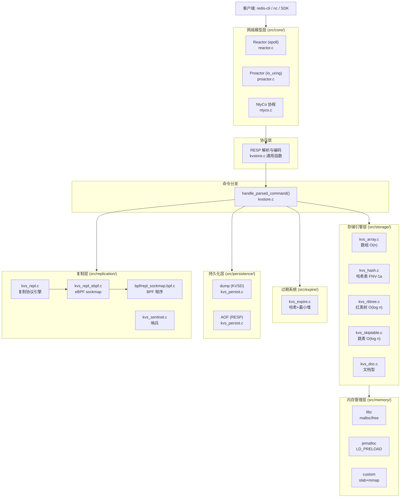
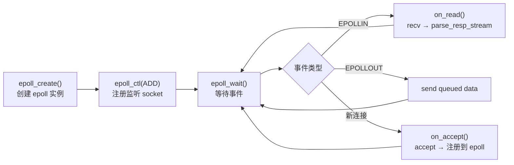
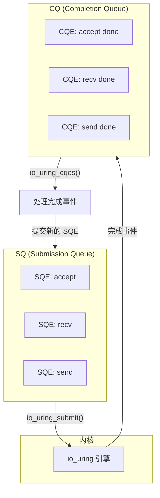
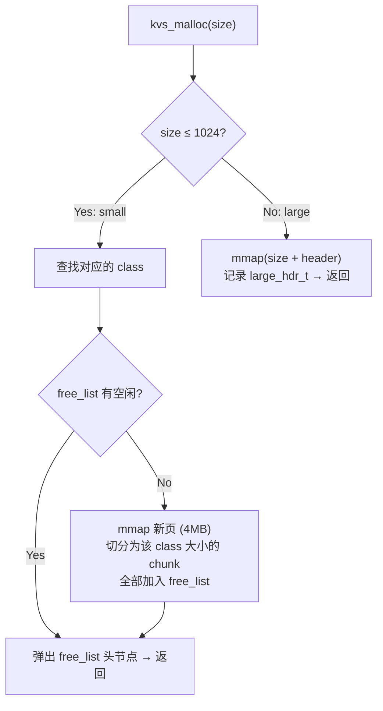
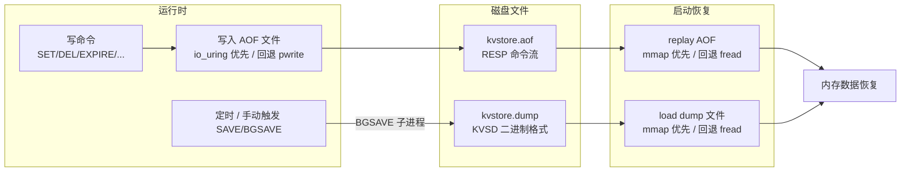
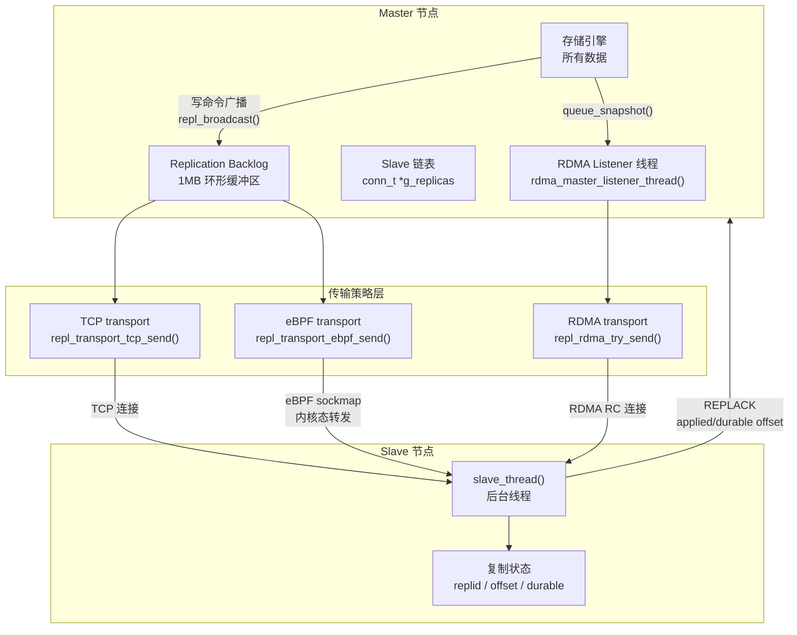
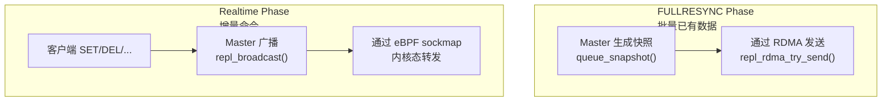
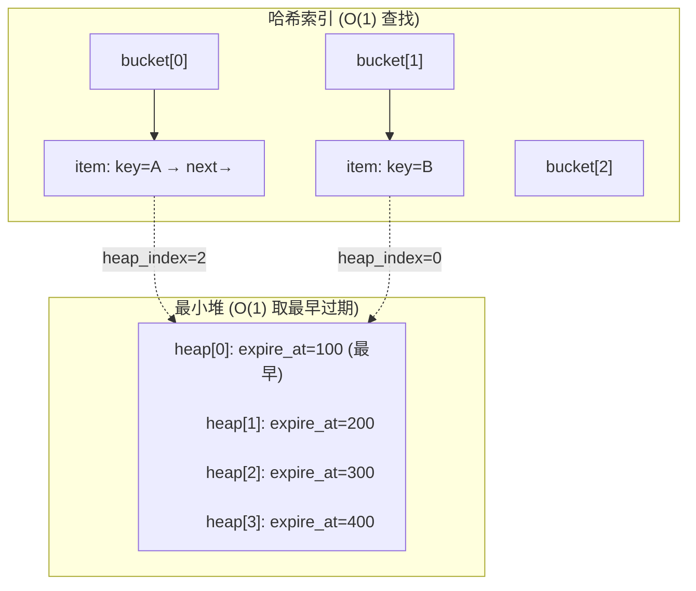
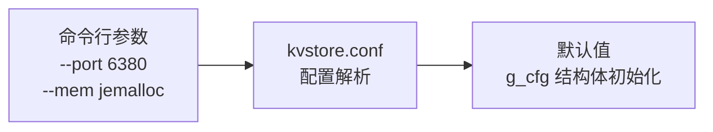
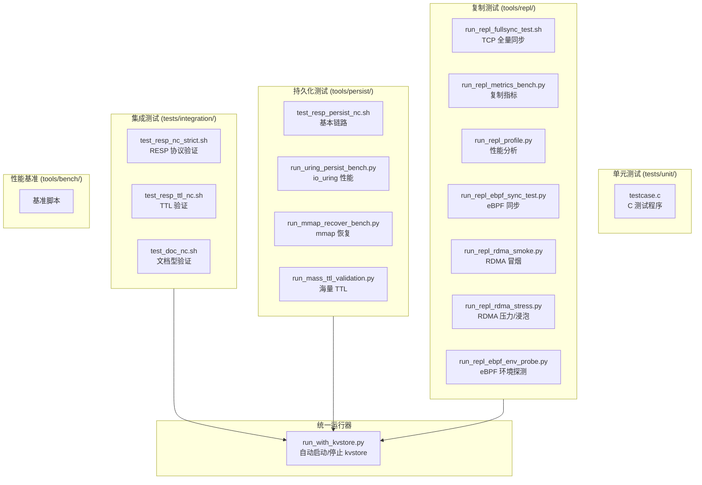

# kvstore 技术路线与实现详解

> **本文档目标**：从技术选型到代码实现，逐层拆解 kvstore 的每个核心模块，帮助开发者理解"为什么选这个技术"和"这个技术怎么用代码实现"。

---

## 目录

1. [总览：技术栈与架构](#1-总览技术栈与架构)
2. [网络模型层：三种 I/O 模型](#2-网络模型层三种-io-模型)
3. [存储引擎层：五种数据结构](#3-存储引擎层五种数据结构)
4. [内存管理层：三种分配器](#4-内存管理层三种分配器)
5. [持久化层：全量 + 增量](#5-持久化层全量--增量)
6. [复制层：TCP / RDMA / eBPF](#6-复制层tcp--rdma--ebpf)
7. [TTL 过期系统](#7-ttl-过期系统)
8. [配置与命令行系统](#8-配置与命令行系统)
9. [协议层：RESP 编解码](#9-协议层resp-编解码)
10. [测试体系](#10-测试体系)

---

## 1. 总览：技术栈与架构

### 1.1 技术栈一览

| 层次 | 技术选型 | 核心文件 |
|------|----------|----------|
| **语言** | C99 | 全项目 |
| **网络 I/O 模型** | epoll / io_uring / 协程 | `src/core/reactor.c` / `proactor.c` / `ntyco.c` |
| **传输协议** | TCP + RDMA RC + eBPF sockmap | `src/replication/kvs_repl.c` |
| **序列化协议** | RESP (Redis Serialization Protocol) | `src/main/kvstore.c` |
| **持久化** | KVSD 二进制 + AOF (RESP) | `src/persistence/kvs_persist.c` |
| **存储引擎** | 数组 / 哈希 / 红黑树 / 跳表 | `src/storage/` |
| **内存管理** | libc / jemalloc / 自研 slab+mmap | `src/memory/kvs_mem.c` |
| **协程库** | NtyCo (submodule) | `NtyCo/core/` |
| **异步 I/O** | liburing (submodule) | `liburing/` |
| **eBPF** | libbpf + clang-embedded BPF | `src/replication/bpf/repl_sockmap.bpf.c` |
| **RDMA** | librdmacm + libibverbs | `src/replication/kvs_repl.c` (条件编译) |
| **构建系统** | GNU Make | `Makefile` |
| **测试** | Python + bash + nc | `tools/` + `tests/` |

### 1.2 架构交互图



---

## 2. 网络模型层：三种 I/O 模型

### 2.1 技术选型分析

kvstore 实现了三种网络 I/O 模型，通过配置 `--net reactor|proactor|ntyco` 切换：

| 模型 | 底层机制 | 并发模型 | 适用场景 | 代码量 |
|------|----------|----------|----------|--------|
| **Reactor** | epoll (水平触发) | 单线程事件循环 + 非阻塞 I/O | 通用 I/O 密集型 | ~200 行 |
| **Proactor** | io_uring | 单线程异步提交 + 完成轮询 | 高并发、大量磁盘 I/O | ~300 行 |
| **NtyCo** | 协程 (hook 阻塞调用) | 协程内同步编程、底层 epoll | 海量连接、简化编程 | ~100 行 |

**为什么选三种？** 不是为了生产冗余，而是为了**对比学习**：同一套业务逻辑用三种不同的 I/O 模型实现，便于理解每种模型的本质差异。

### 2.2 Reactor 模型 (epoll)

**核心思想**：事件驱动，非阻塞 I/O。把所有 I/O 操作注册到 epoll 上，当 I/O 事件就绪时回调处理。

**实现流程**：



**核心代码** (`src/core/reactor.c`)：

```c
int reactor_start(void) {
    // Step 1: 创建监听 socket
    int lfd = create_listener(port);

    // Step 2: 创建 epoll 实例
    g_epfd = epoll_create(1024);

    // Step 3: 注册监听 socket
    struct epoll_event ev;
    ev.events = EPOLLIN;
    ev.data.fd = lfd;
    epoll_ctl(g_epfd, EPOLL_CTL_ADD, lfd, &ev);

    // Step 4: 事件循环
    struct epoll_event events[MAX_EVENTS];
    while (1) {
        int n = epoll_wait(g_epfd, events, MAX_EVENTS, 100);  // 100ms 超时

        for (int i = 0; i < n; ++i) {
            int fd = events[i].data.fd;
            conn_t *c = NULL;

            if (fd == lfd) {
                conn_t lc;
                lc.fd = lfd;
                on_accept(&lc);          // 新连接 → accept
            } else if (events[i].events & EPOLLIN) {
                c = fdmap[fd];
                if (c) on_read(c);       // 可读 → recv + 解析
            } else if (events[i].events & EPOLLOUT) {
                c = fdmap[fd];
                if (c) on_write(c);      // 可写 → send 队列数据
            }
        }

        // 周期性任务：过期检测、自动快照、后台持久化
        kvs_active_expire_cycle(expire_cycle_budget());
        persist_autosnap_cron();
        persist_bgsave_poll();
        persist_bgrewriteaof_poll();
    }
}
```

**数据输出 (queue_bytes)**：写操作将数据放入 `out_node_t` 链表，然后通过 `epoll_ctl` 注册 `EPOLLOUT` 事件。当 epoll 通知可写时，`on_write` 逐节点发送。

```c
int queue_bytes(conn_t *c, const unsigned char *buf, size_t len) {
    out_node_t *n = kvs_malloc(sizeof(*n));
    n->data = kvs_malloc(len);
    memcpy(n->data, buf, len);
    n->len = len;
    n->sent = 0;
    n->next = NULL;

    // 追加到链表尾部
    if (c->out_tail) c->out_tail->next = n;
    else c->out_head = n;
    c->out_tail = n;

    // 注册 EPOLLOUT 事件
    mod_events(c, EPOLLIN | EPOLLOUT);
    return 0;
}
```

### 2.3 Proactor 模型 (io_uring)

**核心思想**：异步 I/O，提交 SQE (Submission Queue Entry) 后立即返回，完成时从 CQ (Completion Queue) 取结果。避免了 epoll 的**就绪通知 → 应用层阻塞读写**的两步开销。

**实现流程**：



**核心代码** (`src/core/proactor.c`)：

```c
int proactor_start(unsigned short port) {
    // Step 1: 创建监听 socket
    int lfd = create_listener(port);

    // Step 2: 初始化 io_uring
    struct io_uring ring;
    io_uring_queue_init(KVS_URING_ENTRIES, &ring, 0);  // 1024 个 SQE

    // Step 3: 提交初始 accept SQE
    submit_accept(&ring, lfd);

    // Step 4: 异步事件循环
    while (1) {
        // 提交所有待处理的 SQE
        io_uring_submit(&ring);

        // 等待 CQE (完成事件)
        struct io_uring_cqe *cqe;
        int ret = io_uring_wait_cqe(&ring, &cqe);

        // 处理完成事件
        uring_req_t *req = (uring_req_t *)cqe->user_data;
        int res = cqe->res;  // 操作结果

        switch (req->event) {
        case KVS_EVENT_ACCEPT:          // accept 完成
            conn_t *c = create_conn(res);
            submit_read(&ring, c);       // 提交 recv SQE
            submit_accept(&ring, lfd);   // 再次提交 accept SQE
            break;
        case KVS_EVENT_READ:            // recv 完成
            req->conn->in_len += res;
            parse_resp_stream(req->conn, ...);
            if (有数据要发送) submit_write(&ring, c);
            else submit_read(&ring, c);  // 继续读取
            break;
        case KVS_EVENT_WRITE:           // send 完成
            // 更新已发送偏移量
            // 如果还有更多数据，继续提交 send SQE
            break;
        }

        io_uring_cqe_seen(&ring, cqe);  // 标记 CQE 已消费
    }
}
```

### 2.4 NtyCo 协程模型

**核心思想**：协程内用同步编程风格（`recv` 阻塞），底层 NtyCo 自动将阻塞操作 hook 为异步。使得代码逻辑是顺序的，但底层 I/O 是并发的。

**为什么选 NtyCo？** 它是一个轻量级 C 协程库，通过修改 `errno` 和 hook socket 系统调用实现"同步写法、异步执行"。相比于 libtask、libmill，NtyCo 的设计更简洁，适合学习。

**核心代码** (`src/core/ntyco.c`)：

```c
void ntyco_server(conn_t *c) {
    // 协程内的代码是同步的，但底层不会阻塞
    while (1) {
        // recv 在协程内看起来是阻塞的
        // 但 NtyCo 自动 hook 了 recv → epoll 注册 → 协程 yield
        // 当数据到达时 → 协程 resume → recv 返回
        ssize_t n = recv(c->fd, c->inbuf + c->in_len,
                         sizeof(c->inbuf) - c->in_len, 0);
        if (n <= 0) break;

        c->in_len += (size_t)n;

        // 解析并处理命令
        parse_resp_stream(c, c->inbuf, &c->in_len, 0);

        // 发送响应（同步 flush）
        flush_output_blocking(c);
    }
    close_conn_nty(c);
}
```

**NtyCo hook 机制**：`recv` → `ntco_recv` → `epoll_ctl(fd, EPOLLIN)` → `nty_coroutine_yield()` → 协程挂起 → epoll_wait → 数据到达 → `nty_coroutine_resume()` → 继续执行。

---

## 3. 存储引擎层：五种数据结构

### 3.1 技术选型分析

| 引擎 | 数据结构 | 时间复杂度 | 特性 | 命令前缀 |
|------|----------|------------|------|----------|
| **Array** | 动态数组 + 线性查找 | O(n) | 最简单，适合小数据量 (< 1024) | 无前缀 |
| **Hash** | 链地址哈希表 (FNV-1a) | O(1) avg | 通用场景，大量 key | `H` |
| **RBTREE** | 红黑树 | O(log n) | 有序存储，范围查询 | `R` |
| **Skiptable** | 跳表 (概率平衡) | O(log n) avg | 有序存储，实现简单 | `X` |
| **Doc** | 哈希表 + 字段哈希 | O(1) | 文档型 value (平铺字段) | `DOC*` |

**为什么同时实现红黑树和跳表？** 两者都是有序数据结构但实现思路不同。红黑树通过旋转保持平衡，跳表通过概率层数实现平衡。对比实现有助于理解数据结构的本质。

### 3.2 Hash 引擎 (`src/storage/kvs_hash.c`)

**核心数据结构**：

```c
typedef struct hashnode_s {
    char *key;            // key (动态分配)
    char *value;          // value (动态分配)
    struct hashnode_s *next;  // 链地址法解决冲突
} hashnode_t;

typedef struct hashtable_s {
    hashnode_t **nodes;   // 哈希桶数组 (长度 MAX_TABLE_SIZE=1024)
    int max_slots;
    int count;
} hashtable_t;
```

**哈希函数**：FNV-1a (Fowler–Noll–Vo) 非加密哈希，速度快、分布均匀。

```c
static int _hash(char *key, int size) {
    unsigned int sum = 2166136261u;  // FNV offset basis
    for (int i = 0; key[i] != 0; ++i) {
        sum ^= (unsigned char)key[i];
        sum *= 16777619u;            // FNV prime
    }
    return (int)(sum % (unsigned int)size);
}
```

**SET 操作**：哈希 → 查找冲突链表 → 头插法插入新节点。

```c
int kvs_hash_set(kvs_hash_t *hash, char *key, char *value) {
    int idx = _hash(key, hash->max_slots);

    // 检查是否已存在
    for (hashnode_t *node = hash->nodes[idx]; node; node = node->next) {
        if (strcmp(node->key, key) == 0) return 1;  // 已存在
    }

    // 创建新节点，头插法
    hashnode_t *new_node = _create_node(key, value);
    new_node->next = hash->nodes[idx];
    hash->nodes[idx] = new_node;
    hash->count++;
    return 0;
}
```

### 3.3 RBTREE 引擎 (`src/storage/kvs_rbtree.c`)

**核心数据结构**：

```c
typedef struct _rbtree_node {
    unsigned char color;    // RED=1 / BLACK=2
    struct _rbtree_node *right, *left, *parent;
    KEY_TYPE key;           // char* (ENABLE_KEY_CHAR=1)
    void *value;            // void* 泛型指针
} rbtree_node;
```

**插入与平衡**：标准的红黑树左旋/右旋 + 颜色翻转，哨兵 `nil` 节点简化边界处理。

```c
// 插入修正：检查父子节点颜色冲突，通过旋转+变色恢复红黑树性质
static void rbtree_insert_fixup(rbtree *T, rbtree_node *z) {
    while (z->parent->color == RED) {
        if (z->parent == z->parent->parent->left) {
            rbtree_node *y = z->parent->parent->right;  // 叔节点
            if (y->color == RED) {
                // Case 1: 叔节点为红色 → 父+叔变黑，爷变红
                z->parent->color = BLACK;
                y->color = BLACK;
                z->parent->parent->color = RED;
                z = z->parent->parent;  // 向上继续检查
            } else {
                if (z == z->parent->right) {
                    // Case 2: z 是右孩子 → 左旋父节点
                    z = z->parent;
                    left_rotate(T, z);
                }
                // Case 3: z 是左孩子 → 右旋爷节点
                z->parent->color = BLACK;
                z->parent->parent->color = RED;
                right_rotate(T, z->parent->parent);
            }
        } else {
            // 对称情况：父节点是右孩子
            // ... 同理，方向相反
        }
    }
    T->root->color = BLACK;  // 根节点必须为黑
}
```

### 3.4 Skiptable 引擎 (`src/storage/kvs_skiptable.c`)

**核心数据结构**：多层链表，每层是前一层的一个"快车道"。

```
Level 3:  head ──────────────────────────────→ tail
Level 2:  head ──────────→ [30] ─────────────→ tail
Level 1:  head ──→ [10] ──→ [30] ──→ [50] ──→ tail
Level 0:  head → [5] → [10] → [20] → [30] → [40] → [50] → tail
```

```c
#define KVS_SKIPLIST_MAX_LEVEL 12
#define KVS_SKIPLIST_P 0.5   // 层数递增概率

typedef struct kvs_skipnode_s {
    char *key;
    char *value;
    int level;                       // 该节点的层数
    struct kvs_skipnode_s **forward; // 各层的下一个节点指针
} kvs_skipnode_t;
```

**层数生成 (概率算法)**：每次插入时随机决定节点层数，期望层数 = 1/(1-P) = 2。

```c
static int random_level(void) {
    int level = 0;
    while ((((double)rand()) / (RAND_MAX + 1.0)) < KVS_SKIPLIST_P
           && level < KVS_SKIPLIST_MAX_LEVEL) {
        ++level;
    }
    return level;
}
```

**搜索 + 插入**：从最高层开始，每层向前直到 next->key >= 目标，然后降一层继续。记录每层的"前驱节点"。

```c
int kvs_skiptable_set(kvs_skiptable_t *inst, char *key, char *value) {
    kvs_skipnode_t *update[KVS_SKIPLIST_MAX_LEVEL + 1];
    kvs_skipnode_t *cur = inst->header;

    // Step 1: 从最高层向下搜索，记录每层的前驱
    for (int i = inst->level; i >= 0; --i) {
        while (cur->forward[i] && strcmp(cur->forward[i]->key, key) < 0)
            cur = cur->forward[i];
        update[i] = cur;
    }

    cur = cur->forward[0];
    if (cur && strcmp(cur->key, key) == 0) {
        // key 已存在 → 更新 value
        kvs_free(cur->value);
        cur->value = strdup(value);
        return 0;
    }

    // Step 2: 生成随机层数
    int level = random_level();
    if (level > inst->level) {
        for (int i = inst->level + 1; i <= level; ++i)
            update[i] = inst->header;
        inst->level = level;
    }

    // Step 3: 创建新节点，逐层插入
    kvs_skipnode_t *node = skipnode_create(level, key, value);
    for (int i = 0; i <= level; ++i) {
        node->forward[i] = update[i]->forward[i];
        update[i]->forward[i] = node;
    }
    inst->count++;
    return 0;
}
```

### 3.5 Doc 引擎 (`src/storage/kvs_doc.c`)

**设计意图**：不把文档型 value 做在单个 value 字段里，而是作为独立的一层存储，与 Key-Value 引擎**共存**。这样持久化、复制链路都可以独立对齐。

```c
typedef struct kvs_doc_field_s {
    char *name;                    // 字段名
    char *value;                   // 字段值
    struct kvs_doc_field_s *next;  // 链表（链地址法）
} kvs_doc_field_t;

typedef struct kvs_doc_s {
    char *key;                           // 文档 key
    kvs_doc_field_t **fields;            // 字段哈希桶
    int field_count;
    int bucket_count;                    // KVS_DOC_FIELD_BUCKETS=16
    struct kvs_doc_s *next;              // 文档哈希链表
} kvs_doc_t;

typedef struct kvs_doc_table_s {
    kvs_doc_t **buckets;   // 文档哈希桶 (KVS_DOC_BUCKETS=1024)
    int size;
    int count;
} kvs_doc_table_t;
```

**支持的命令**：`DOCSET key field value` / `DOCGET key field` / `DOCDEL key field` / `DOCDROP key` / `DOCEXIST key` / `DOCCOUNT key` / `DOCGETALL key`。

---

## 4. 内存管理层：三种分配器

### 4.1 技术选型分析

| 后端 | 实现方式 | 特性 | 适用场景 |
|------|----------|------|----------|
| **libc** | `malloc()` / `free()` | 通用，无额外依赖 | 开发调试 |
| **jemalloc** | `LD_PRELOAD` 动态加载 | 高性能，碎片少 | 生产级负载 |
| **custom** | slab 分配器 + mmap 大块 | 可观测，有统计信息 | 研究学习 |

### 4.2 Custom 分配器设计 (`src/memory/kvs_mem.c`)

**Slab 分类**：将 ≤1024 字节的请求分为 8 个类别：

```c
#define SMALL_CLASS_COUNT 8
#define SMALL_MAX_SIZE 1024

small_class_t classes[SMALL_CLASS_COUNT] = {
    {32, ...},  {64, ...},  {128, ...}, {256, ...},
    {384, ...}, {512, ...}, {768, ...}, {1024, ...},
};
```

**分配路径**：



**元数据头**：每个分配块前有一个头部记录大小和校验，用于统计和调试：

```c
typedef struct large_hdr_s {
    uint32_t magic;         // 0xC0DEC0DF - 用于校验
    uint32_t reserved;
    size_t request_size;    // 用户请求大小
    size_t mapping_size;    // 实际 mmap 大小
} large_hdr_t;
```

**可观测性**：通过 `INFO` 命令暴露统计信息：

```c
fprintf(info, "mem_backend:custom\n"
    "custom_small_alloc_calls:%llu\n"
    "custom_large_alloc_calls:%llu\n"
    "custom_current_requested_bytes:%llu\n"
    "custom_current_allocated_bytes:%llu\n"
    "custom_peak_small_inuse:%llu\n"
    "custom_peak_large_inuse_bytes:%llu\n"
    ...);
```

---

## 5. 持久化层：全量 + 增量

### 5.1 持久化策略



**恢复顺序**：先恢复 dump 文件（全量），再重放 AOF（增量）。

```c
// src/persistence/kvs_persist.c
int persist_recover(void) {
    // Step 1: 恢复 dump 文件 (key\\nvalue\\n 格式)
    replay_dump_file(g_cfg.dump_path);

    // Step 2: 重放 AOF 文件 (RESP 命令格式)
    replay_file(g_cfg.aof_path);
}
```

### 5.2 Dump 格式 (KVSD)

**格式**：最简单的 `key\nvalue\n` 逐行存储，每两行一对。

```
key1
value1
key2
value2
```

**mmap 恢复**：优先使用 mmap，减少用户态拷贝，失败回退到 fread。

```c
static int replay_dump_file(const char *path) {
    fd = open(path, O_RDONLY);
    fstat(fd, &st);

    // Step 1: mmap 文件到内存
    mapped = mmap(NULL, st.st_size, PROT_READ | PROT_WRITE,
                  MAP_PRIVATE, fd, 0);
    if (mapped == MAP_FAILED) { close(fd); return 0; }

    // Step 2: 逐行解析 key\\nvalue\\n
    size_t pos = 0;
    while (pos <= size) {
        // 读 key 行
        while (pos < size && mapped[pos] != '\\n') pos++;
        key = kvs_malloc(klen + 1);
        memcpy(key, mapped + line_start, klen);
        key[klen] = '\\0';
        pos++;  // 跳过 \\n

        // 读 value 行
        // ... 同理 ...

        // 恢复数据
        kvs_hash_set(&global_hash, key, value);
        kvs_free(key);
        kvs_free(value);
    }

    munmap(mapped, size);
    close(fd);
}
```

**SAVE / BGSAVE**：

```c
int persist_save_dump_to(const char *path) {
    // 遍历所有引擎 → 按行写入 key\\nvalue\\n
    fd = open(path, O_WRONLY | O_CREAT | O_TRUNC, 0644);
    kvs_dump_to_fd(fd);   // 遍历 hash / array / rbtree / skiptable / doc
    persist_fsync_fd(fd); // io_uring fsync 优先
    close(fd);
}

void persist_bgsave(void) {
    pid_t pid = fork();
    if (pid == 0) {
        // 子进程写临时文件
        persist_save_dump_to(tmp_path);
        rename(tmp_path, dump_path);
        _exit(0);
    }
    g_bgsave_pid = pid;  // 父进程记录 pid
}
```

### 5.3 AOF 格式与写入

**格式**：与 RESP 协议相同，每条写命令直接追加到文件。

```
*3\r\n$3\r\nSET\r\n$3\r\nkey\r\n$5\r\nvalue\r\n
*2\r\n$3\r\nDEL\r\n$3\r\nkey\r\n
```

**io_uring 写入**：

```c
int persist_write_fd_uring(int fd, const unsigned char *buf,
                           size_t len, off_t *offset) {
    while (written < len) {
        struct io_uring_sqe *sqe = io_uring_get_sqe(&ring);
        io_uring_prep_write(sqe, fd, buf + written, chunk, *offset);
        io_uring_submit(&ring);
        io_uring_wait_cqe(&ring, &cqe);  // 等待完成
        written += cqe->res;             // 实际写入字节数
        io_uring_cqe_seen(&ring, cqe);
    }
}
```

**fsync 策略**：

```c
// always: 每次写命令后 fsync
// everysec: 每秒 fsync
if (g_cfg.aof_fsync == KVS_AOF_FSYNC_ALWAYS) {
    persist_fsync_fd_best_effort(g_aof_fd);  // io_uring fsync 优先
}
```

**AOF 重写 (BGREWRITEAOF)**：后台子进程将当前内存快照写入临时 AOF，然后替换主 AOF 文件。重写期间的新命令通过缓冲区转发。

```c
void persist_bgrewriteaof(void) {
    pid_t pid = fork();
    if (pid == 0) {
        // 子进程：将内存快照写入临时 AOF
        persist_write_aof_snapshot_to(tmp_path);
        _exit(0);
    }
    g_bgrewrite_pid = pid;
    // 父进程将重写期间的新写命令追加到缓冲区 g_rewrite_buf
}
```

---

## 6. 复制层：TCP / RDMA / eBPF

### 6.1 总体架构



### 6.2 复制协议 (RESP-based)

采用类似 Redis 的复制协议：

| 命令 | 方向 | 说明 |
|------|------|------|
| `REPLSYNC <replid> <offset> <durable>` | Slave → Master | 请求同步 |
| `+FULLRESYNC <replid> <offset> <bytes>` | Master → Slave | 全量同步头 |
| `+CONTINUE <replid> <offset>` | Master → Slave | 部分同步头 |
| `REPLACK <applied> <durable>` | Slave → Master | 确认位点 |
| `REPLDONE` | Master → Slave | 全量同步完成 |

### 6.3 混合传输模式 (Hybrid Transport)



**配置方式**：

```conf
repl_fullsync_transport=rdma    # 全量同步走 RDMA
repl_realtime_transport=ebpf    # 实时同步走 eBPF
```

### 6.4 TCP 复制实现

**Master 侧命令广播** (`src/main/kvstore.c`)：

```c
void repl_broadcast(conn_t *skip, const unsigned char *raw, size_t rawlen) {
    pthread_mutex_lock(&g_repl_lock);

    for (conn_t **pp = &g_replicas; *pp; ) {
        conn_t *c = *pp;
        if (c == skip) { pp = &c->next_replica; continue; }

        // 优先尝试实时传输 (eBPF)
        if (repl_realtime_send(c, raw, rawlen) != 0) {
            if (repl_handle_replica_send_failure(c, pp)) continue;
        }
        // 更新统计
        c->repl_offset_sent = repl_master_offset();
        c->repl_last_send_ms = kvs_now_ms();
        pp = &c->next_replica;
    }

    // 同时写入 backlog（供 partial resync 使用）
    repl_backlog_append(raw, rawlen);
    pthread_mutex_unlock(&g_repl_lock);
}
```

**Backlog (环形缓冲区)**：

```c
typedef struct repl_backlog_s {
    unsigned char *buf;       // 1MB 环形缓冲区
    size_t cap;               // 1024*1024
    size_t histlen;           // 当前已使用的历史长度
    size_t head;              // 写入位置
    unsigned long long start_offset;
    unsigned long long end_offset;
} repl_backlog_t;
```

**Slave 线程** (`src/replication/kvs_repl.c`)：

```c
static void *slave_thread(void *arg) {
    for (;;) {
        // 建立 TCP 连接
        int fd = repl_transport_tcp_connect_slave(host, port);
        if (fd < 0) { sleep(1); continue; }

        // 发送 REPLSYNC
        snprintf(offbuf, "%llu", g_slave_repl_offset);
        snprintf(durablebuf, "%llu", g_slave_repl_durable_offset);
        resp_build_cmd4(cmd, "REPLSYNC", replid, offbuf, durablebuf);
        send(fd, cmd, n, 0);

        // 接收循环
        unsigned char buf[BUFFER_CAP];
        size_t blen = 0;
        for (;;) {
            ssize_t r = recv(fd, buf + blen, sizeof(buf) - blen, 0);
            if (r > 0) {
                blen += (size_t)r;
                parse_resp_stream(NULL, buf, &blen, 1);
                repl_slave_ack_heartbeat();
            } else break;
        }
    }
}
```

### 6.5 RDMA 全量同步

**详细实现**参见 `docs/rdma-fullsync-implementation.md`。这里给出核心要点：

**Master RDMA Listener 线程** (`src/replication/kvs_repl.c`)：

```c
static void *rdma_master_listener_thread(void *arg) {
    for (;;) {
        // 创建 RDMA CM 事件通道
        g_repl_rdma_ctx.ec = rdma_create_event_channel();
        rdma_create_id(ec, &listen_id, NULL, RDMA_PS_TCP);

        // Bind + Listen (端口 = TCP端口 + 1)
        addr.sin_port = htons(g_cfg.rdma_port ?: g_cfg.port + 1);
        rdma_bind_addr(listen_id, &addr);
        rdma_listen(listen_id, 4);

        // 等待连接请求
        rdma_get_cm_event(ec, &event);  // RDMA_CM_EVENT_CONNECT_REQUEST
        g_repl_rdma_ctx.id = event->id;

        // 创建 Verbs 资源
        ibv_alloc_pd(id->verbs);          // 保护域
        ibv_create_cq(id->verbs, ...);    // 完成队列
        repl_rdma_create_qp();             // 可靠连接 QP (IBV_QPT_RC)
        repl_rdma_prepare_buffers();       // 注册 MR
        repl_rdma_post_initial_recv();     // 预 post 32 个 recv WR

        // Accept
        rdma_accept(id, &param);
        repl_rdma_wait_event(ESTABLISHED, 5000);
        g_repl_rdma_ctx.connected = 1;

        // 接收循环
        for (;;) {
            if (!g_repl_rdma_ctx.connected) break;
            // 等待 recv completion → 解析 REPLSYNC 等
            repl_rdma_wait_cq_recv_completion(2000, &slot, &len);
            parse_resp_stream(&conn, stream_buf, &stream_len, 0);
        }
    }
}
```

**RDMA Send (master → slave 发送快照)**：

```c
static int repl_rdma_try_send(const unsigned char *buf, size_t len) {
    pthread_mutex_lock(&g_repl_rdma_send_lock);

    // 拷贝到预注册的 send_buf
    memcpy(g_repl_rdma_ctx.send_buf, buf, len);

    // 构建 SGE + WR
    struct ibv_sge sge = {
        .addr = (uintptr_t)g_repl_rdma_ctx.send_buf,
        .length = (uint32_t)len,
        .lkey = g_repl_rdma_ctx.send_mr->lkey,
    };
    struct ibv_send_wr wr = {
        .sg_list = &sge, .num_sge = 1,
        .opcode = IBV_WR_SEND,          // 双边 Send 语义
        .send_flags = IBV_SEND_SIGNALED, // 需要 CQ 通知
    };

    ibv_post_send(g_repl_rdma_ctx.id->qp, &wr, &bad_wr);

    // 同步等待 Send Completion
    repl_rdma_wait_cq_send_completion(1000);

    pthread_mutex_unlock(&g_repl_rdma_send_lock);
}
```

### 6.6 eBPF 实时同步

**目标**：在内核态完成数据转发，避免数据在"内核 → 用户态 → 内核"的来回拷贝。

**BPF 程序** (`src/replication/bpf/repl_sockmap.bpf.c`)：

```c
SEC("sk_msg")
int kvstore_repl_sk_msg(struct sk_msg_md *msg) {
    // 检查角色（master 侧才执行转发）
    role = current_role(msg);
    if (role != KVS_EBPF_ROLE_MASTER_SIDE) return SK_PASS;

    // 从 control_map 获取转发目标 key
    redirect_key = control_value(KVS_EBPF_CTL_REDIRECT_KEY);

    // 执行 sockmap 重定向
    if (control_value(KVS_EBPF_CTL_REDIRECT_INGRESS)) {
        // ingress 重定向：数据到目标 socket 的接收队列（本地优化）
        bpf_msg_redirect_map(msg, &sock_map, redirect_key, BPF_F_INGRESS);
    } else {
        // egress 重定向：通过 sockmap TCP 跨机转发
        bpf_msg_redirect_map(msg, &sock_map, redirect_key, 0);
    }
}
```

**用户态管理** (`src/replication/kvs_repl_ebpf.c`)：

```c
int repl_ebpf_init(void) {
    // 1. 加载 BPF 对象文件
    bpf_object__open_file("build/replication/bpf/repl_sockmap.bpf.o", NULL);
    bpf_object__load(obj);

    // 2. 查找 BPF maps
    g_repl_ebpf_sock_map_fd = bpf_object__find_map_fd_by_name(obj, "sock_map");
    g_repl_ebpf_stats_map_fd = bpf_object__find_map_fd_by_name(obj, "stats_map");
    g_repl_ebpf_control_map_fd = bpf_object__find_map_fd_by_name(obj, "control_map");

    // 3. 设置控制参数
    int zero = 0;
    int redirect_enabled = 1;
    bpf_map_update_elem(g_repl_ebpf_control_map_fd, &KVS_EBPF_CTL_REDIRECT_ENABLED,
                        &redirect_enabled, BPF_ANY);
    bpf_map_update_elem(g_repl_ebpf_control_map_fd, &KVS_EBPF_CTL_MASTER_PORT,
                        &g_cfg.port, BPF_ANY);

    // 4. 挂载 SK_MSG 程序到 sock_map
    bpf_prog_attach(prog_fd, g_repl_ebpf_sock_map_fd, BPF_SK_MSG_VERDICT);
}

int repl_ebpf_register_fd(int fd, int is_master_side) {
    // 将 socket fd 加入 sock_map
    int key = is_master_side ? KVS_EBPF_SOCK_KEY_MASTER_SIDE : slave_key;
    bpf_map_update_elem(g_repl_ebpf_sock_map_fd, &key, &fd, BPF_ANY);
}
```

**数据流**：

```
用户态 Set 命令
    │
    ▼
Master 线程: repl_broadcast()
    │  repl_realtime_send() → 最终 write(socket)
    │
    ▼
BPF 程序: sk_msg 钩子拦截消息
    │
    ├─ bpf_msg_redirect_map(sock_map, slave_key)
    │
    ▼
Slave socket 接收队列（ingress）或 TCP 发送（egress）
    │
    ▼
Slave 线程: recv() → parse_resp_stream()
```

---

## 7. TTL 过期系统

### 7.1 设计

**数据结构**：哈希表 (O(1) 查找) + 最小堆 (O(1) 取最快要过期的 key)。

```c
typedef struct kvs_expire_item_s {
    char *key;                          // key 名称
    int engine;                         // 所属引擎
    long long expire_at_ms;             // 到期时间戳 (ms)
    size_t heap_index;                  // 在堆中的位置
    struct kvs_expire_item_s *next;     // 哈希链地址
} kvs_expire_item_t;

typedef struct kvs_expire_table_s {
    kvs_expire_item_t **buckets;        // 哈希桶 (8192 槽)
    size_t size, count;
    kvs_expire_item_t **heap;           // 最小堆 (数组实现)
    size_t heap_size, heap_cap;         // 初始容量 1024
} kvs_expire_table_t;
```



### 7.2 核心操作

**设置 TTL** (`kvs_expire_set -> EXPIRE`)：

```c
int kvs_expire_set(kvs_expire_table_t *tab, int engine,
                   const char *key, long long ttl_ms) {
    // Step 1: 计算到期时间
    long long expire_at = kvs_now_ms() + ttl_ms;

    // Step 2: 查找是否已有该 key 的过期记录
    node = expire_find(tab, engine, key);

    if (node) {
        // 已有 → 更新时间
        node->expire_at_ms = expire_at;
        heap_update(tab, node);  // 堆中重新调整位置
    } else {
        // 新建
        node = kvs_calloc(1, sizeof(*node));
        node->key = strdup(key);
        node->engine = engine;
        node->expire_at_ms = expire_at;

        // 插入哈希桶
        idx = expire_hash(key, engine, tab->size);
        node->next = tab->buckets[idx];
        tab->buckets[idx] = node;

        // 插入最小堆
        heap_push(tab, node);
    }
}
```

**过期扫描** (`kvs_active_expire_cycle`)：在每次事件循环中调用的周期性函数。

```c
void kvs_active_expire_cycle(int budget) {
    long long now = kvs_now_ms();

    // 从堆顶取最快要过期的 key，最多 scan budget 个
    while (budget-- > 0 && global_expire.heap_size > 0) {
        kvs_expire_item_t *node = global_expire.heap[0];
        if (node->expire_at_ms > now) break;  // 堆顶还未到期

        // 删除过期 key（从所有引擎 + 过期表中删除）
        engine_del(node->engine, node->key);
        expire_free_node(&global_expire, node);
    }
}
```

---

## 8. 配置与命令行系统

### 8.1 默认配置

```c
kv_config_t g_cfg = {
    .role = ROLE_MASTER,
    .port = 5000,
    .master_host = "127.0.0.1",
    .master_port = 5000,
    .dump_path = "kvstore.dump",
    .aof_path = "kvstore.aof",
    .mem_backend = "libc",
    .net_backend = "reactor",
    .repl_transport_backend = "tcp",
    .repl_fullsync_transport = "rdma",
    .repl_realtime_transport = "ebpf",
    .rdma_dev = "rxe0",
    .rdma_recv_slots = 32,
    .rdma_chunk_size = BUFFER_CAP / 4,  // 16384
    .rdma_qp_wr_depth = 64,
    .aof_fsync = KVS_AOF_FSYNC_ALWAYS,
    .log_mode = "info",
    .sentinel_quorum = 1,
    // ...
};
```

### 8.2 配置加载链



1. 结构体初始化为默认值
2. `parse_config(path)` 逐行解析配置文件，覆盖默认值
3. `parse_args(argc, argv)` 解析命令行参数，覆盖配置文件

```c
// 配置解析：key=value 格式
static void parse_config(const char *path) {
    FILE *fp = fopen(path, "r");
    while (fgets(line, sizeof(line), fp)) {
        if (line[0] == '#' || line[0] == '\\n') continue;
        char *key = strtok(line, "=");
        char *value = strtok(NULL, "\\n");
        trim(key); trim(value);

        if (!strcmp(key, "port")) g_cfg.port = atoi(value);
        else if (!strcmp(key, "role")) snprintf(g_cfg.role_str, ...);
        else if (!strcmp(key, "mem_backend")) snprintf(g_cfg.mem_backend, ...);
        // ... 每个配置项逐一解析
    }
}
```

---

## 9. 协议层：RESP 编解码

### 9.1 编码函数

全部位于 `src/main/kvstore.c` 开头：

```c
// 简单字符串: +OK\\r\\n
int resp_simple_string(char *out, size_t cap, const char *s) {
    return snprintf(out, cap, "+%s\\r\\n", s);
}

// 错误: -ERR xxx\\r\\n
int resp_error(char *out, size_t cap, const char *s) {
    return snprintf(out, cap, "-ERR %s\\r\\n", s);
}

// 整数: :123\\r\\n
int resp_integer(char *out, size_t cap, long long v) {
    return snprintf(out, cap, ":%lld\\r\\n", v);
}

// 批量字符串: $5\\r\\nhello\\r\\n
int resp_bulk(char *out, size_t cap, const char *s, size_t len) {
    int n = snprintf(out, cap, "$%zu\\r\\n", len);
    memcpy(out + n, s, len);
    out[n + len] = '\\r'; out[n + len + 1] = '\\n';
    return n + (int)len + 2;
}
```

### 9.2 解析器 (`parse_resp_stream`)

```c
int parse_resp_stream(conn_t *c, unsigned char *buf, size_t *len,
                      int from_replication) {
    size_t pos = 0;
    while (pos < *len) {
        if (buf[pos] == '+') {
            // Simple String → 复制协议命令
            // +FULLRESYNC / +CONTINUE 等
            if (from_replication) {
                parse_line(buf + pos, line_len);
                // 处理 FULLRESYNC / CONTINUE
            }
        } else if (buf[pos] == '*') {
            // RESP 数组: *n\\r\\n$len\\r\\narg\\r\\n...
            int argc = atoi(nbuf);
            for (int i = 0; i < argc; ++i) {
                // 解析 $len\\r\\ncontent\\r\\n
                argv[i] = ...;  // 指向 buffer 中的位置
                argl[i] = len;
            }
            // 派发到命令处理
            handle_parsed_command(c, argc, argv, argl, ..., from_replication);
        }
        // ... 跳过已处理的数据
    }
    // 更新剩余未处理的数据长度
    *len -= pos;
    memmove(buf, buf + pos, *len);
}
```

### 9.3 命令分发 (`handle_parsed_command`)

收到解析后的命令数组，进行字符串匹配后分发给对应的处理逻辑：

```c
if (!strcmp(cmd, "SET")) {
    // 存储引擎 + 过期 + 持久化 + 复制广播
    engine_set(engine, key, value);
    kvs_expire_set(&global_expire, engine, key, ttl_ms);
    persist_aof_append(raw, rawlen);
    repl_broadcast(c, raw, rawlen);
    resp_simple_string(resp, cap, "OK");
    queue_bytes(c, resp, n);
}
else if (!strcmp(cmd, "GET")) {
    char *v = engine_get(engine, key);
    if (v) resp_bulk(resp, cap, v, strlen(v));
    else resp_null_bulk(resp, cap);
    queue_bytes(c, resp, n);
}
else if (!strcmp(cmd, "REPLSYNC")) {
    // 复制同步请求
    repl_add_slave(c);
    if (can_continue) repl_backlog_send_continue(c, req_offset);
    else queue_snapshot(c);
}
```

---

## 10. 测试体系

### 10.1 测试架构



### 10.2 关键技术

**统一进程管理** (`tools/tests/run_with_kvstore.py`)：自动启动 kvstore 进程作为测试前置条件，测试结束后自动清理。

```bash
# Makefile 中的典型测试目标
check-resp:
    python3 ./tools/tests/run_with_kvstore.py --bin ./kvstore \
        --host $(TEST_HOST) --port $(TEST_PORT) -- \
        bash ./tests/integration/test_resp_nc_strict.sh {HOST} {PORT}
```

**RDMA 测试脚本参数化** (`tools/repl/run_repl_rdma_stress.py`)：

```bash
make check-repl-rdma-stress \
    REPL_RDMA_STRESS_PRELOAD=128 \
    REPL_RDMA_STRESS_TAIL_WRITES=32 \
    REPL_RDMA_STRESS_RESTART_ROUNDS=2 \
    REPL_RDMA_STRESS_PRELOAD=256
```

**eBPF 环境探测** (`tools/repl/run_repl_ebpf_env_probe.py`)：在执行 eBPF 测试前检查内核版本、BPF 特性、clang/libbpf 是否可用，避免在不可用环境上失败。

---

## 附录

### A. 编译选项速查

| 环境变量 | 默认值 | 说明 |
|----------|--------|------|
| `ENABLE_RDMA` | 1 | 是否启用 RDMA 支持 |
| `ENABLE_EBPF` | 1 | 是否启用 eBPF 支持 |
| `CC` | gcc | C 编译器 |
| `CLANG` | clang | BPF 编译器 |
| `CFLAGS` | -Wall -Wextra -O2 | 编译标志 |

### B. 运行时配置速查

| 配置项 | 说明 | 默认值 |
|--------|------|--------|
| `--port` | 监听端口 | 5000 |
| `--net` | 网络模型: reactor/proactor/ntyco | reactor |
| `--mem` | 内存后端: libc/jemalloc/custom | libc |
| `--role` | 角色: master/slave | master |
| `--repl-fullsync-transport` | 全量同步传输: tcp/rdma | rdma |
| `--repl-realtime-transport` | 实时同步传输: tcp/ebpf | ebpf |
| `--rdma-dev` | RDMA 设备 | rxe0 |
| `--appendfsync` | AOF 同步: always/everysec | always |
| `--autosnap` | 自动快照规则 | 空(禁用) |

### C. 关键文件索引

| 模块 | 文件 | 函数/功能 |
|------|------|-----------|
| 入口 | `src/main/kvstore.c` | `main()`, `handle_parsed_command()`, `queue_snapshot()`, `repl_broadcast()`, `parse_resp_stream()` |
| Reactor | `src/core/reactor.c` | `reactor_start()`, `on_read()`, `on_write()`, `on_accept()`, `queue_bytes()`, `close_conn()` |
| Proactor | `src/core/proactor.c` | `proactor_start()`, `submit_accept()`, `submit_read()`, `submit_write()` |
| NtyCo | `src/core/ntyco.c` | `ntyco_start()`, `ntyco_server()`, `server_reader()` |
| Hash 引擎 | `src/storage/kvs_hash.c` | `kvs_hash_set/get/del` + FNV-1a hash |
| RBTREE 引擎 | `src/storage/kvs_rbtree.c` | `rbtree_insert_fixup`, `left_rotate`, `right_rotate` |
| Skiptable | `src/storage/kvs_skiptable.c` | `kvs_skiptable_set/search` + 概率层数 |
| Doc | `src/storage/kvs_doc.c` | `kvs_doc_set/get/del` + 字段哈希 |
| 内存管理 | `src/memory/kvs_mem.c` | `kvs_malloc/free/calloc` + slab+mmap |
| 持久化 | `src/persistence/kvs_persist.c` | `persist_recover()`, `persist_bgsave()`, `persist_bgrewriteaof()`, `persist_write_fd_uring()` |
| TTL | `src/expire/kvs_expire.c` | `kvs_expire_set()`, `kvs_active_expire_cycle()`, 堆操作 |
| 复制核心 | `src/replication/kvs_repl.c` | `repl_broadcast()`, `slave_thread()`, `rdma_master_listener_thread()`, `repl_rdma_try_send()`, `repl_rdma_post_initial_recv()` |
| eBPF | `src/replication/kvs_repl_ebpf.c` | `repl_ebpf_init()`, `repl_ebpf_register_fd()` |
| BPF 程序 | `src/replication/bpf/repl_sockmap.bpf.c` | `kvstore_repl_sk_msg()` |
| 哨兵 | `src/replication/kvs_sentinel.c` | `sentinel_start()` |
| 头文件 | `include/kvstore/kvstore.h` | `conn_t`, `kv_config_t`, `repl_rdma_ctx_t` 等全部类型定义 |
| 头文件 | `include/kvstore/server.h` | `conn` 结构体, `kvs_stream_t` |
